# Alerts for 2024-11-11

## 03:56

🔴 צבע אדום (11/11/2024):

05:55:
• שפלת יהודה: אביעזר, אדרת, בית שמש, גבעות עדן, זנוח, נווה מיכאל - רוגלית, נתיב הל''ה, אזור תעשייה ברוש (דקה וחצי)
• יהודה: תלם, אדורה, נגוהות (דקה וחצי, דקה)

05:56:
• שפלת יהודה: אזור תעשייה הר טוב - צרעה, ישעי, מחסיה, נחם, צרעה, רטורנו - גבעת שמש, תרום, מטע, כפר מנחם, בית גוברין, בית ניר, גלאון, גפן, זכריה, כפר זוהרים, לוזית, נחושה, עגור, צפרירים, שדות מיכה, שריגים - לי-און, תירוש, גבעת ישעיהו, צומת האלה (דקה וחצי, דקה, 45 שניות)
• לכיש: גת, שדה משה, נחלה (45 שניות)
• יהודה: אמציה, כרמי קטיף, אליאב, כפר עציון, כרמי צור, אדוריים, בית חג"י, קריית ארבע, בני דקלים, נטע, שקף, היישוב היהודי חברון (דקה, דקה וחצי)

צופר - צבע אדום

## 03:56

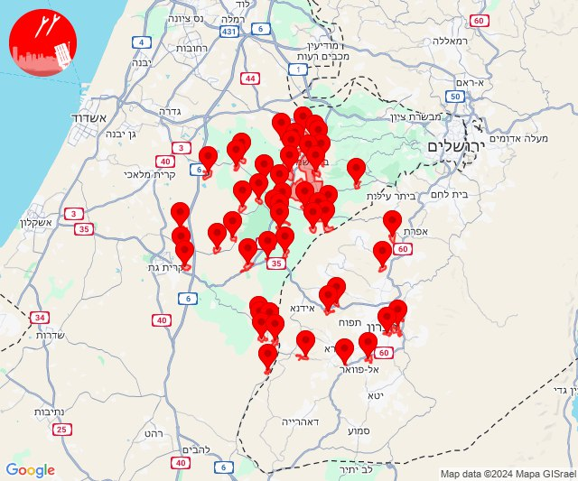

## 08:25

🔴 צבע אדום (11/11/2024):

10:25:
• קו העימות: אביבים (מיידי)

צופר - צבע אדום

## 08:25

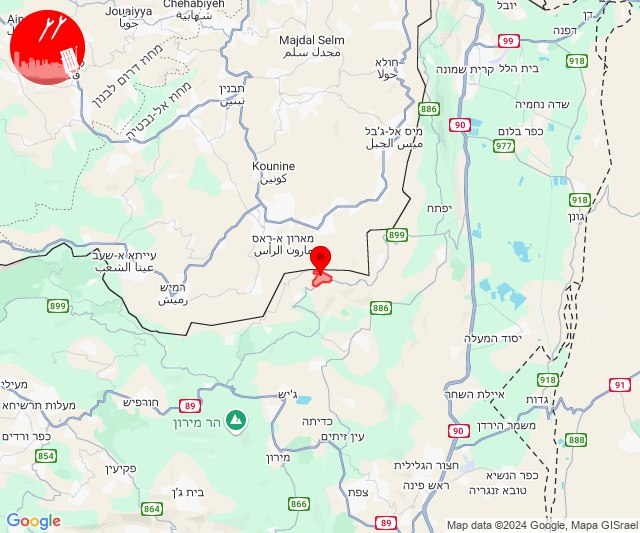

## 08:30

🔴 צבע אדום (11/11/2024):

10:29:
• קו העימות: נטועה, פסוטה, אבן מנחם, שומרה (מיידי)

10:30:
• קו העימות: אבירים (מיידי)

צופר - צבע אדום

## 08:30

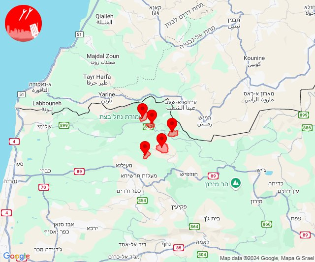

## 09:08

🔴 צבע אדום (11/11/2024):

11:08:
• קו העימות: מרגליות, קריית שמונה, מרגליות (מיידי)

צופר - צבע אדום

## 09:08

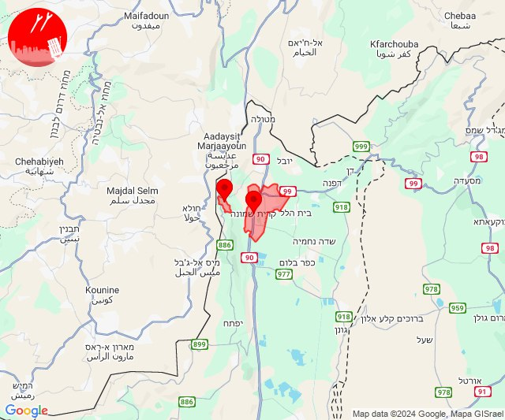

## 09:43

🔴 צבע אדום (11/11/2024):

11:43:
• קו העימות: יפתח (מיידי)

צופר - צבע אדום

## 09:43

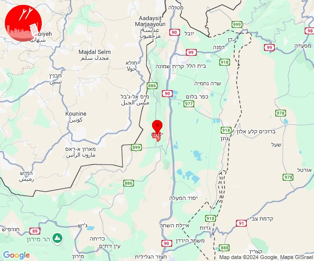

## 09:54

🔴 צבע אדום (11/11/2024):

11:54:
• קו העימות: מעלות תרשיחא, מעיליא, מעונה, אבן מנחם, גורנות הגליל, שומרה (מיידי)

צופר - צבע אדום

## 09:54

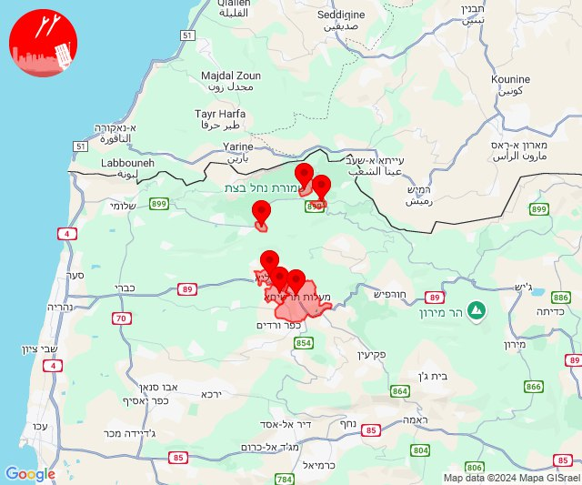

## 09:59

🔴 צבע אדום (11/11/2024):

11:58:
• קו העימות: מתת, סאסא, שתולה, חורפיש, אלקוש (מיידי)

11:59:
• קו העימות: מתת (מיידי)

צופר - צבע אדום

## 09:59

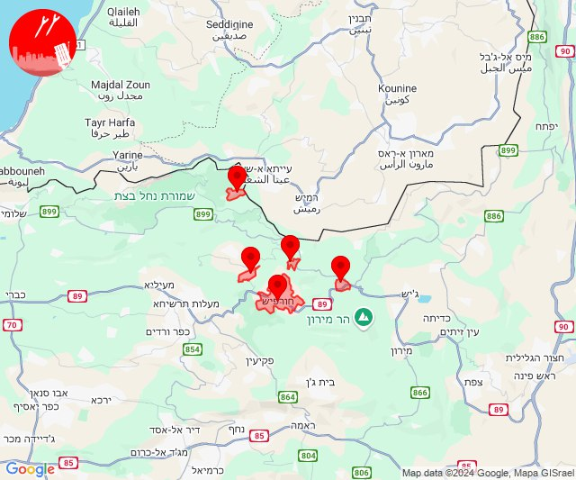

## 10:09

🔴 צבע אדום (11/11/2024):

12:07:
• גליל עליון: בענה, דיר אל-אסד, כרמיאל, מג'דל כרום, ינוח ג'ת, מגדל תפן, לבון, גיתה, לפידות, אזור תעשייה כרמיאל, נחף, כסרא סמיע, כישור, הר חלוץ, צורית גילון (30 שניות)
• קו העימות: חוסן, כפר ורדים, מעונה, מעיליא, מעלות תרשיחא, אבירים, צוריאל, אלקוש, פסוטה, פקיעין החדשה, הילה (15 שניות, מיידי)
• מרכז הגליל: שורשים, חוסנייה, אשבל, אשחר, יובלים, ערב אל נעים, אזור תעשייה תרדיון, סכנין (דקה, 30 שניות)

12:08:
• גליל עליון: ירכא, תובל, בענה, דיר אל-אסד, כרמיאל, מג'דל כרום, לבון, מגדל תפן, ינוח ג'ת, לפידות, חרשים, נחף, כסרא סמיע, גיתה, אזור תעשייה כרמיאל, הר חלוץ, בענה, כרמיאל (30 שניות)
• קו העימות: אבירים, אלקוש, אבן מנחם, חוסן, מעונה, מעיליא, כפר ורדים, מעלות תרשיחא, פקיעין החדשה, צוריאל, זרעית, שתולה, שומרה, פסוטה, פקיעין (מיידי, 15 שניות)
• מרכז הגליל: יעד, מרכז אזורי משגב, עצמון - שגב, רקפת, שעב (דקה)

12:09:
• גליל עליון: דיר אל-אסד, לבון, כסרא סמיע, מגדל תפן, אזור תעשייה כרמיאל, מג'דל כרום, נחף, כרמיאל, בענה, לפידות, הר חלוץ (30 שניות)
• קו העימות: כפר ורדים, פקיעין החדשה, חוסן (15 שניות)

צופר - צבע אדום

## 10:09

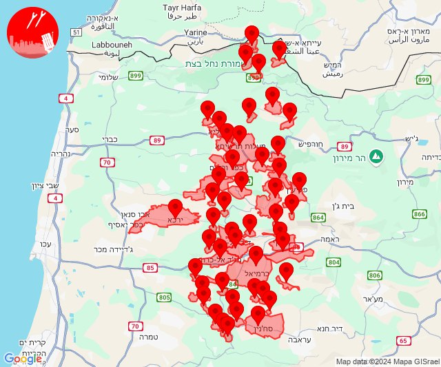

## 10:37

✈️ חדירת כלי טיס עוין (11/11/2024):

12:36:
• קו העימות: מלכיה 

12:37:
• קו העימות: מלכיה 

צופר - צבע אדום

## 10:38

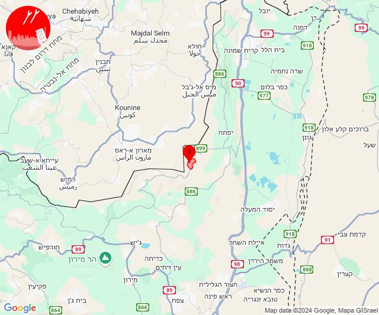

## 11:31

🔴 צבע אדום (11/11/2024):

13:31:
• קו העימות: מרגליות (מיידי)

צופר - צבע אדום

## 11:31

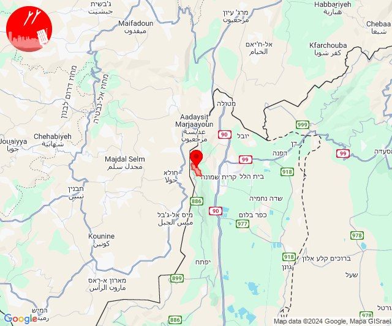

## 11:35

🔴 צבע אדום (11/11/2024):

13:35:
• קו העימות: זרעית, שומרה, שתולה, חורפיש, מעלות תרשיחא, מעונה, מעיליא, מתת, אבן מנחם, נטועה, פסוטה, אבירים, הילה (מיידי)

צופר - צבע אדום

## 11:35

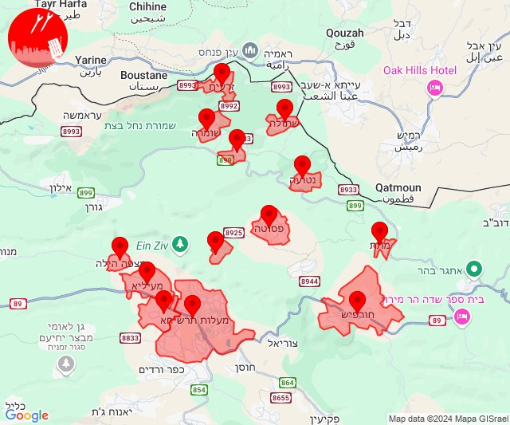

## 11:43

🔴 צבע אדום (11/11/2024):

13:43:
• גליל עליון: יסוד המעלה, חולתה (30 שניות)
• קו העימות: לב החולה, מרכז אזורי מבואות חרמון, רמות נפתלי (מיידי)

צופר - צבע אדום

## 11:43

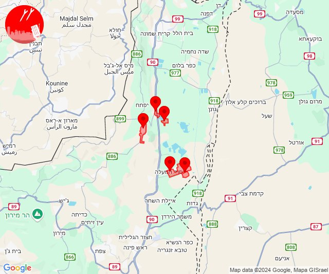

## 11:55

🔴 צבע אדום (11/11/2024):

13:55:
• קו העימות: שתולה, פסוטה (מיידי)

צופר - צבע אדום

## 11:55

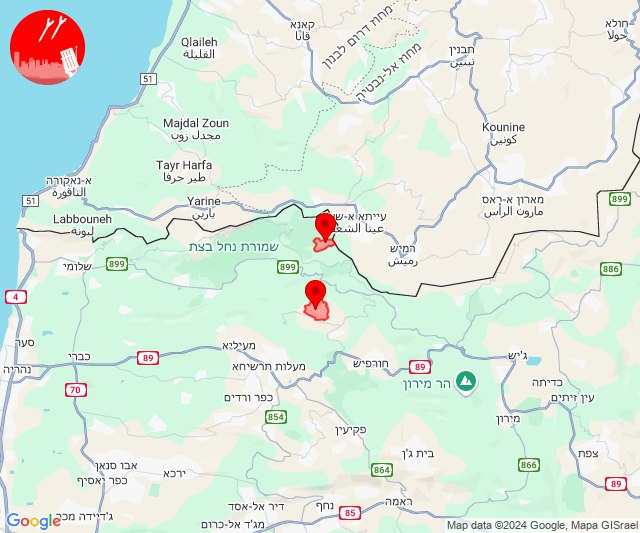

## 13:45

🔴 צבע אדום (11/11/2024):

15:40:
• קו העימות: נהריה, גשר הזיו, איזור תעשייה מילואות צפון, לימן, שלומי, בצת, ראש הנקרה, חוף בצת (15 שניות, מיידי)

15:41:
• קו העימות: סער (מיידי)

15:42:
• המפרץ: קריית אתא, אושה, כפר המכבי, רמת יוחנן, כפר ביאליק, קריית ביאליק, קריית מוצקין, חיפה - מפרץ, חיפה - קריית חיים ושמואל, קריית ים, אזור תעשייה קריית ביאליק (דקה)
• גליל עליון: ירכא, טל - אל, ג'וליס, אבו סנאן, ינוח ג'ת, כליל, עמקה, אפק, אזור תעשייה שער נעמן, כפר מסריק, עין המפרץ, עכו - אזור תעשייה (30 שניות, דקה)
• קו העימות: געתון, יחיעם, מנות (15 שניות, מיידי)
• מרכז הגליל: טמרה, אזור תעשייה טמרה, שפרעם (דקה)

15:43:
• גליל עליון: ג'דידה מכר, אבו סנאן, ג'וליס, טל - אל, ירכא, כפר יאסיף, בית העמק, אשרת, עכו, כפר מסריק, עכו - אזור תעשייה (30 שניות)
• המפרץ: חיפה - כרמל, הדר ועיר תחתית, חיפה - נווה שאנן ורמות כרמל (דקה)
• מרכז הגליל: כאבול, אעבלין (דקה)

15:44:
• המפרץ: קריית ביאליק (דקה)

15:45:
• גליל עליון: אזור תעשייה שער נעמן, אפק, כפר מסריק (דקה, 30 שניות)
• המפרץ: קריית מוצקין, אזור תעשייה קריית ביאליק (דקה)

צופר - צבע אדום

## 13:45

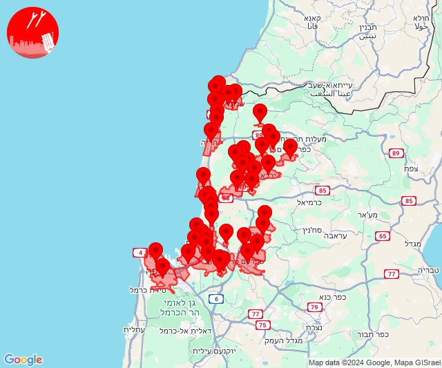

## 13:51

✈️ חדירת כלי טיס עוין (11/11/2024):

15:51:
• קו העימות: אזור תעשייה רמת דלתון, דלתון, כרם בן זמרה, עלמה, ריחאנייה 
• גליל עליון: שדה אליעזר 

צופר - צבע אדום

## 13:51

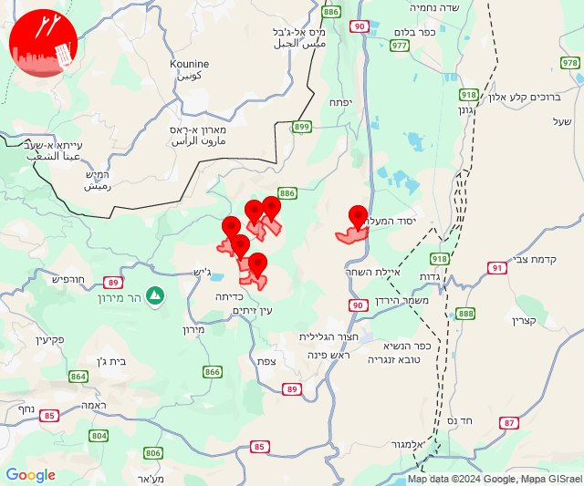

## 14:03

🔴 צבע אדום (11/11/2024):

16:02:
• גליל עליון: אזור תעשייה שער נעמן, יסעור, כפר מסריק, עין המפרץ, עכו - אזור תעשייה, אפק (דקה, 30 שניות)
• המפרץ: קריית ביאליק, קריית ים, קריית מוצקין, אזור תעשייה קריית ביאליק (דקה)

16:03:
• גליל עליון: ג'דידה מכר, כפר מסריק, עין המפרץ, עכו, עכו - אזור תעשייה, בית העלמין החדש עכו (30 שניות)

צופר - צבע אדום

## 14:03

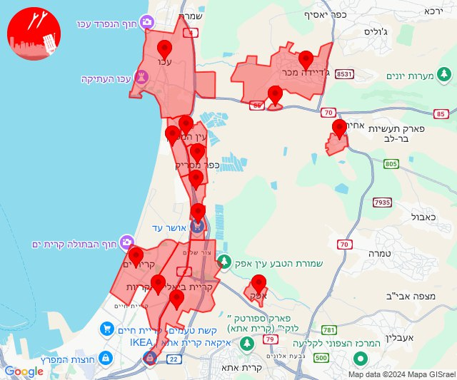

## 14:17

🔴 צבע אדום (11/11/2024):

16:17:
• עוטף עזה: נתיב העשרה (15 שניות)

צופר - צבע אדום

## 14:17

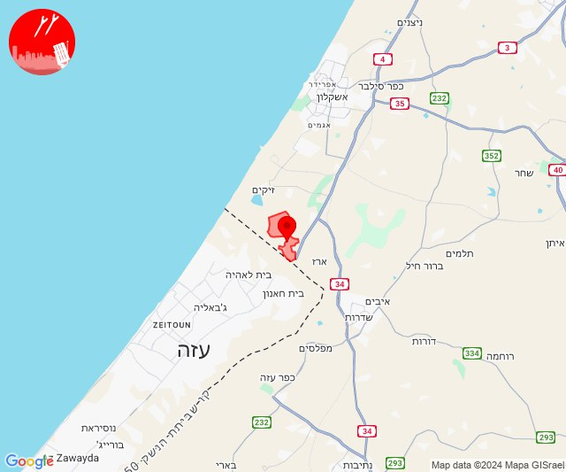

## 14:40

🔴 צבע אדום (11/11/2024):

16:39:
• גליל עליון: כחל, צפת - נוף כנרת, צפת - עיר (דקה, 30 שניות)

16:40:
• גליל עליון: צפת - עכברה, עמיעד, ביריה, חצור הגלילית, ראש פינה, עמוקה, כורזים ורד הגליל, צפת - נוף כנרת, אליפלט, צפת - עיר (30 שניות)

צופר - צבע אדום

## 14:40

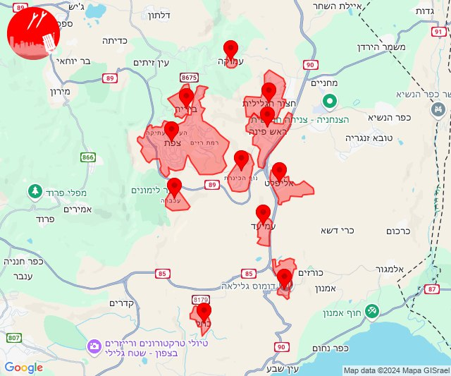

## 15:25

🔴 צבע אדום (11/11/2024):

17:25:
• גליל עליון: אזור תעשייה חצור הגלילית, אזור תעשייה צ.ח.ר, מחניים, מנחת מחניים, חצור הגלילית, עמוקה (30 שניות)

צופר - צבע אדום

## 15:25

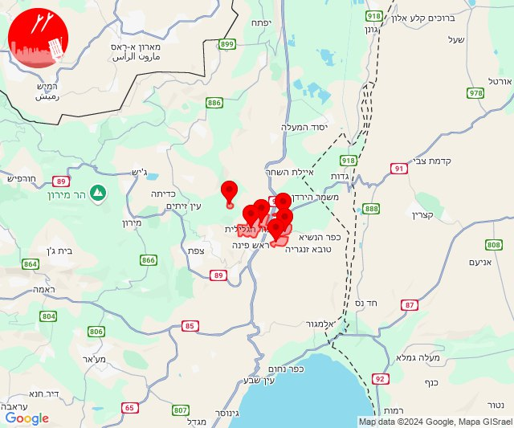

## 15:30

🔴 צבע אדום (11/11/2024):

17:30:
• גליל עליון: אזור תעשייה חצור הגלילית, חצור הגלילית, ראש פינה, עמוקה (30 שניות)

צופר - צבע אדום

## 15:30

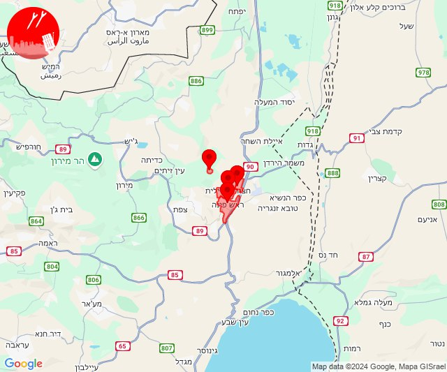

## 16:17

✈️ חדירת כלי טיס עוין (11/11/2024):

18:13:
• קו העימות: חניתה 

18:14:
• קו העימות: שלומי 

18:15:
• קו העימות: בצת, ראש הנקרה, שלומי, מצובה, לימן 

18:16:
• קו העימות: בצת, כברי, עבדון, נווה זיו, מצובה, שלומי 

18:17:
• קו העימות: בצת, חניתה 

צופר - צבע אדום

## 16:17

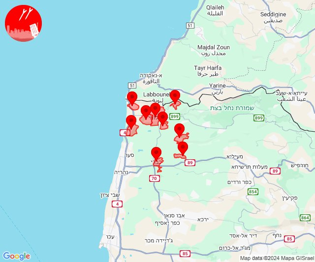

## 23:19

✈️ חדירת כלי טיס עוין (12/11/2024):

01:18:
• דרום הגולן: נוב, רמת מגשימים 

01:19:
• דרום הגולן: אבני איתן 

צופר - צבע אדום

## 23:19

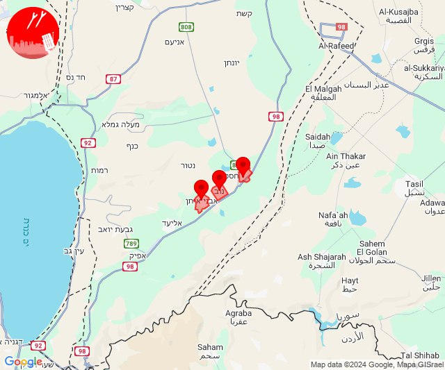

