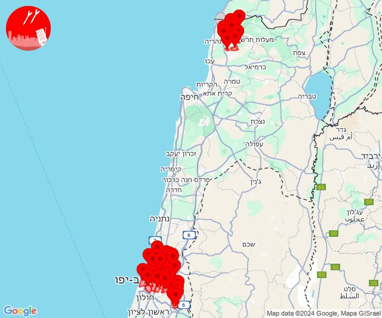
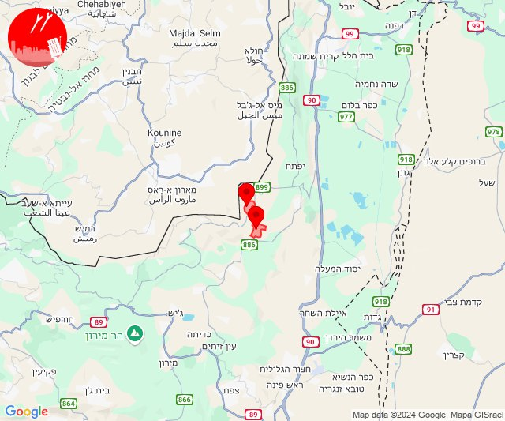
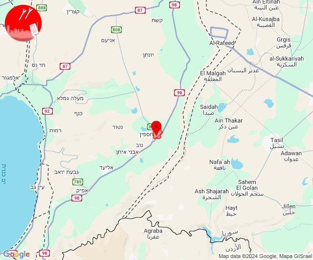

# Alerts for 2024-11-12

## 05:02

🔴 צבע אדום (12/11/2024):

07:02:
• קו העימות: כפר בלום, נאות מרדכי, עמיר, בית הלל, שדה נחמיה, מעיין ברוך, קריית שמונה, תל חי, הגושרים (מיידי, 15 שניות)

צופר - צבע אדום

## 05:02

## 07:34

✈️ חדירת כלי טיס עוין (12/11/2024):

09:20:
• קו העימות: איזור תעשייה מילואות צפון, לימן, בצת, חוף בצת, ראש הנקרה, שלומי 

09:21:
• קו העימות: גשר הזיו, נהריה, סער 

09:23:
• קו העימות: בן עמי, כברי 

09:24:
• קו העימות: עברון, בן עמי, נהריה, בית העלמין החדש נהריה 
• גליל עליון: נתיב השיירה 

09:25:
• קו העימות: עברון 
• גליל עליון: מזרעה, רגבה, לוחמי הגטאות 

09:26:
• גליל עליון: בית העמק, נתיב השיירה, אשרת, נס עמים 

09:28:
• גליל עליון: ג'דידה מכר, עכו 

09:29:
• גליל עליון: נס עמים, כפר מסריק, עין המפרץ, עכו - אזור תעשייה 

09:32:
• גליל עליון: עכו - אזור תעשייה, עכו 

09:34:
• המפרץ: חיפה - קריית חיים ושמואל, כפר ביאליק, קריית ביאליק, קריית מוצקין, קריית ים, חיפה - מפרץ, קריית אתא 

צופר - צבע אדום

## 07:34

## 10:18

🔴 צבע אדום (12/11/2024):

12:18:
• קו העימות: כפר גלעדי, כפר יובל, תל חי, מטולה (מיידי)

צופר - צבע אדום

## 10:18

## 10:55

🔴 צבע אדום (12/11/2024):

12:55:
• המפרץ: חיפה - כרמל, הדר ועיר תחתית, חיפה - מערב, טירת כרמל, כפר גלים (דקה)
• גליל עליון: עכו (30 שניות)

צופר - צבע אדום

## 10:55

## 11:13

🔴 צבע אדום (12/11/2024):

13:13:
• קו העימות: יראון, דישון (מיידי)

צופר - צבע אדום

## 11:13

## 11:54

✈️ חדירת כלי טיס עוין (12/11/2024):

13:52:
• קו העימות: חוף בצת, בצת, ראש הנקרה, שלומי, לימן, איזור תעשייה מילואות צפון 

13:53:
• קו העימות: גשר הזיו, נהריה 

13:54:
• קו העימות: גשר הזיו, נהריה, סער 

צופר - צבע אדום

## 11:54

## 12:24

✈️ חדירת כלי טיס עוין (12/11/2024):

14:18:
• קו העימות: חוף בצת, ראש הנקרה, איזור תעשייה מילואות צפון, לימן 

14:19:
• קו העימות: נהריה 

14:20:
• קו העימות: גשר הזיו, סער 
• גליל עליון: שייח' דנון 

14:22:
• קו העימות: בן עמי, עברון 

14:24:
• קו העימות: בית העלמין החדש נהריה, בן עמי, כברי 
• גליל עליון: נתיב השיירה, שייח' דנון 

צופר - צבע אדום

## 12:24

## 13:00

🔴 צבע אדום (12/11/2024):

15:00:
• קו העימות: מנות, אדמית, אילון, יערה, ערב אל עראמשה (מיידי)

צופר - צבע אדום

## 13:00

## 13:06

🔴 צבע אדום (12/11/2024):

15:06:
• קו העימות: זרעית, שומרה, שתולה, אבן מנחם, נטועה (מיידי)

צופר - צבע אדום

## 13:07

## 14:29

🔴 צבע אדום (12/11/2024):

16:29:
• קו העימות: נהריה, סער, בן עמי, גשר הזיו (15 שניות, מיידי)

צופר - צבע אדום

## 14:30

🔴 צבע אדום (12/11/2024):

16:29:
• קו העימות: נהריה, סער, בן עמי, גשר הזיו, איזור תעשייה מילואות צפון, בצת, לימן, שלומי (15 שניות, מיידי)

16:30:
• קו העימות: כברי, מצובה, בן עמי, נהריה, בית העלמין החדש נהריה, גשר הזיו, סער, איזור תעשייה מילואות צפון, לימן, כברי (מיידי, 15 שניות, 30 שניות)
• גליל עליון: נתיב השיירה (30 שניות)

צופר - צבע אדום

## 14:30

## 14:35

## 14:36

🔴 צבע אדום (12/11/2024):

16:34:
• גליל עליון: כליל, עמקה (30 שניות)

16:35:
• קו העימות: כברי, מנות, נווה זיו, עבדון, בית העלמין החדש נהריה, געתון, אילון, מנות, עבדון, נווה זיו (מיידי, 30 שניות, 15 שניות)
• דן: תל אביב - מזרח, תל אביב - מרכז העיר, תל אביב - עבר הירקון, בני ברק, גבעת השלושה, גבעת שמואל, גבעתיים, גת רימון, הרצליה - מרכז וגליל ים, מעש, סביון, פתח תקווה, קריית אונו, רמת גן - מזרח, רמת גן - מערב, רמת השרון, גני תקווה, בית עלמין מורשה, מתחם פי גלילות, סינמה סיטי גלילות, יהוד מונוסון (דקה וחצי)
• ירקון: בני עטרות, גבעת כ''ח, בית עריף, טירת יהודה, כפר טרומן, איירפורט סיטי (דקה וחצי)
• שרון: ירקונה, עדנים, הוד השרון, מרכז אזורי דרום השרון (דקה וחצי)
• השפלה: לוד, אחיעזר, זיתן, יגל (דקה וחצי)

16:36:
• שרון: גבעת חן, רעננה, גן חיים, כפר מל''ל, כפר סבא, צופית, רמות השבים, שדה ורבורג, בצרה (דקה וחצי)
• ירקון: בארות יצחק (דקה וחצי)
• דן: מגשימים (דקה וחצי)

צופר - צבע אדום

## 14:36

🔴 צבע אדום (12/11/2024):

16:34:
• גליל עליון: כליל, עמקה (30 שניות)

16:35:
• קו העימות: כברי, מנות, נווה זיו, עבדון, בית העלמין החדש נהריה, געתון, אילון, מנות, עבדון, נווה זיו (מיידי, 30 שניות, 15 שניות)
• דן: תל אביב - מזרח, תל אביב - מרכז העיר, תל אביב - עבר הירקון, בני ברק, גבעת השלושה, גבעת שמואל, גבעתיים, גת רימון, הרצליה - מרכז וגליל ים, מעש, סביון, פתח תקווה, קריית אונו, רמת גן - מזרח, רמת גן - מערב, רמת השרון, גני תקווה, בית עלמין מורשה, מתחם פי גלילות, סינמה סיטי גלילות, יהוד מונוסון (דקה וחצי)
• ירקון: בני עטרות, גבעת כ''ח, בית עריף, טירת יהודה, כפר טרומן, איירפורט סיטי (דקה וחצי)
• שרון: ירקונה, עדנים, הוד השרון, מרכז אזורי דרום השרון (דקה וחצי)
• השפלה: לוד, אחיעזר, זיתן, יגל (דקה וחצי)

16:36:
• שרון: גבעת חן, רעננה, גן חיים, כפר מל''ל, כפר סבא, צופית, רמות השבים, שדה ורבורג, בצרה (דקה וחצי)
• ירקון: בארות יצחק, מזור, נופך, נחלים, עינת, רינתיה (דקה וחצי)
• דן: מגשימים, כפר סירקין (דקה וחצי)

צופר - צבע אדום

## 14:36

## 15:11

✈️ חדירת כלי טיס עוין (12/11/2024):

17:11:
• קו העימות: דוב''ב, ברעם 

צופר - צבע אדום

## 15:11

## 15:32

🔴 צבע אדום (12/11/2024):

17:32:
• העמקים: ח'וואלד, סואעד חמירה (דקה)

צופר - צבע אדום

## 15:33

## 15:40

✈️ חדירת כלי טיס עוין (12/11/2024):

17:31:
• המפרץ: בית עלמין תל רגב 
• העמקים: חוואלד, נופית, ראס עלי 

17:32:
• העמקים: בסמת טבעון 

17:34:
• העמקים: קריית טבעון - בית זייד 

17:35:
• העמקים: אלונים 

17:36:
• העמקים: שדה יעקב 

17:37:
• העמקים: כפר יהושע, תחנת רכבת כפר יהושוע 

17:40:
• ואדי ערה: יקנעם המושבה והזורע, יקנעם עילית, אליקים 

צופר - צבע אדום

## 15:40

## 16:18

🔴 צבע אדום (12/11/2024):

18:18:
• קו העימות: מלכיה (מיידי)

צופר - צבע אדום

## 16:18

## 17:12

🔴 צבע אדום (12/11/2024):

19:12:
• קו העימות: מנרה (מיידי)

צופר - צבע אדום

## 17:12

## 18:39

🔴 צבע אדום (12/11/2024):

20:39:
• קו העימות: מטולה, מנרה (מיידי)

צופר - צבע אדום

## 18:39

## 18:58

✈️ חדירת כלי טיס עוין (12/11/2024):

20:58:
• דרום הנגב: מצפה רמון 

צופר - צבע אדום

## 18:58

## 19:00

🔴 צבע אדום (12/11/2024):

21:00:
• עוטף עזה: כפר עזה (15 שניות)

צופר - צבע אדום

## 19:00

## 20:21

✈️ חדירת כלי טיס עוין (12/11/2024):

22:20:
• קו העימות: דישון, מלכיה 

22:21:
• קו העימות: דישון 

צופר - צבע אדום

## 20:21

## 21:35

✈️ חדירת כלי טיס עוין (12/11/2024):

23:35:
• קו העימות: נהריה, סער 

צופר - צבע אדום

## 21:35

## 23:32

✈️ חדירת כלי טיס עוין (13/11/2024):

01:32:
• דרום הגולן: רמת מגשימים 

צופר - צבע אדום

## 23:32

