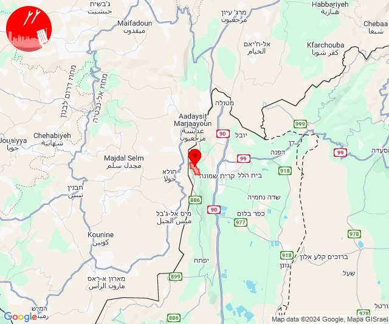

# Alerts for 2024-11-13

## 03:15

✈️ חדירת כלי טיס עוין (13/11/2024):

05:14:
• קו העימות: ראש הנקרה, שלומי 

05:15:
• קו העימות: חוף בצת, איזור תעשייה מילואות צפון, לימן, בצת, שלומי 

צופר - צבע אדום

## 03:15

## 04:20

🔴 צבע אדום (13/11/2024):

06:19:
• קו העימות: עלמה, ריחאנייה, כרם בן זמרה (מיידי)

06:20:
• קו העימות: אזור תעשייה רמת דלתון (מיידי)

צופר - צבע אדום

## 04:20

## 05:05

✈️ חדירת כלי טיס עוין (13/11/2024):

07:01:
• קו העימות: אביבים, יראון 

07:02:
• קו העימות: אביבים, דישון 

07:04:
• גליל עליון: שדה אליעזר 

07:05:
• גליל עליון: איילת השחר 

צופר - צבע אדום

## 05:05

## 08:35

🔴 צבע אדום (13/11/2024):

10:35:
• קו העימות: חוף בצת, ראש הנקרה (מיידי)

צופר - צבע אדום

## 08:36

## 08:36

✈️ חדירת כלי טיס עוין (13/11/2024):

10:36:
• קו העימות: איזור תעשייה מילואות צפון, בצת, לימן, שלומי 

צופר - צבע אדום

## 08:36

## 10:15

🔴 צבע אדום (13/11/2024):

12:13:
• קו העימות: מעיליא, כפר ורדים, מעונה, מעלות תרשיחא (מיידי, 15 שניות)

12:14:
• גליל עליון: ינוח ג'ת, מגדל תפן (30 שניות)
• קו העימות: אבירים, אבן מנחם, פסוטה, עין יעקב, חוסן, הילה, כפר ורדים, מעלות תרשיחא, מעיליא, מעונה, אבירים (מיידי, 15 שניות)

12:15:
• קו העימות: אבן מנחם, שומרה, שתולה, נטועה, פסוטה (מיידי)

צופר - צבע אדום

## 10:15

## 11:09

🔴 צבע אדום (13/11/2024):

13:08:
• קו העימות: בית העלמין החדש נהריה, כברי, מצובה, נווה זיו, עבדון (30 שניות, מיידי)
• גליל עליון: נתיב השיירה, שייח' דנון (30 שניות)

13:09:
• קו העימות: מנות (מיידי)

צופר - צבע אדום

## 11:09

## 11:15

🔴 צבע אדום (13/11/2024):

13:15:
• עוטף עזה: ארז (15 שניות)

צופר - צבע אדום

## 11:15

## 12:36

🔴 צבע אדום (13/11/2024):

14:36:
• גליל עליון: ביריה (30 שניות)

צופר - צבע אדום

## 12:36

## 13:02

✈️ חדירת כלי טיס עוין (13/11/2024):

14:48:
• קו העימות: גשר הזיו, נהריה, איזור תעשייה מילואות צפון, לימן, סער 

14:49:
• קו העימות: בצת, שלומי, בן עמי, כברי 

14:50:
• קו העימות: נהריה 

14:51:
• קו העימות: בן עמי, נהריה, עברון 
• גליל עליון: נתיב השיירה, שייח' דנון 

14:52:
• גליל עליון: שבי ציון, מזרעה, רגבה 

14:53:
• קו העימות: עברון 
• גליל עליון: לוחמי הגטאות, רגבה, שומרת, נס עמים 

14:54:
• גליל עליון: בוסתן הגליל, עכו 

14:55:
• גליל עליון: ג'דידה מכר, בית העלמין החדש עכו 

14:56:
• גליל עליון: ג'דידה מכר, עין המפרץ 

14:57:
• גליל עליון: כפר מסריק, אזור תעשייה שער נעמן 

14:58:
• המפרץ: אזור תעשייה קריית ביאליק, קריית ביאליק, קריית מוצקין 
• גליל עליון: כפר מסריק 

14:59:
• המפרץ: קריית ים 

15:01:
• קו העימות: איזור תעשייה מילואות צפון, לימן 

15:02:
• קו העימות: גשר הזיו, נהריה, סער 

צופר - צבע אדום

## 13:02

## 13:12

🔴 צבע אדום (13/11/2024):

15:12:
• גליל עליון: צפת - עכברה, ביריה, צפת - עיר (30 שניות)

צופר - צבע אדום

## 13:12

## 13:19

🔴 צבע אדום (13/11/2024):

15:17:
• קו העימות: מנרה, מרגליות, קריית שמונה (מיידי)

15:18:
• קו העימות: משגב עם (מיידי)

15:19:
• קו העימות: מרגליות, קריית שמונה, מנרה, כפר בלום (מיידי)

צופר - צבע אדום

## 13:19

## 13:30

🔴 צבע אדום (13/11/2024):

15:30:
• קו העימות: מרגליות (מיידי)

צופר - צבע אדום

## 13:30

## 14:05

🔴 צבע אדום (13/11/2024):

16:05:
• קו העימות: יפתח, כפר בלום, עמיר, שדה נחמיה, מנרה, בית הלל, מרגליות, קריית שמונה (מיידי, 15 שניות)

צופר - צבע אדום

## 14:05

## 15:21

✈️ חדירת כלי טיס עוין (13/11/2024):

17:19:
• קו העימות: ע'ג'ר 

17:20:
• קו העימות: מעיין ברוך, כפר יובל, הגושרים 

17:21:
• קו העימות: בית הלל, קריית שמונה 

צופר - צבע אדום

## 15:21

## 15:47

🔴 צבע אדום (13/11/2024):

17:44:
• שרון: אביחיל, נתניה - מזרח, נתניה - מערב, שושנת העמקים, אזור תעשייה עמק חפר, אליכין, אלישיב, בית הלוי, בית חזון, בית חרות, בית ינאי, בית יצחק - שער חפר, ביתן אהרן, בת חן, גאולי תימן, גבעת חיים איחוד, גבעת חיים מאוחד, גבעת שפירא, גנות הדר, הדר עם, המרכז האקדמי רופין, העוגן, חבצלת השרון וצוקי ים, חגלה, חופית, חיבת ציון, חרב לאת, כפר הרא''ה, כפר ויתקין, כפר חיים, כפר ידידיה, כפר מונש, מכמורת, מעברות, משמר השרון, נעורים, עין החורש, רעננה, בני ציון, בצרה, חרוצים, גבעת חן, בית ברל, גן חיים, הוד השרון, חרות, כפר מל''ל, כפר סבא, משמרת, צופית, רמות השבים, שדה ורבורג, אבן יהודה, אודים, ארסוף, בית יהושע, געש, יקום, מכון וינגייט, רשפון, שפיים, תל יצחק, מתחם "חנה וסע" שפיים, בית סוהר השרון (דקה וחצי)
• מנשה: חדרה - מזרח, חדרה - מערב, חדרה - מרכז, חדרה - נווה חיים, אביאל, אזור תעשייה קיסריה, אלוני יצחק, בנימינה, גבעת עדה, גן השומרון, גן שמואל, כפר גליקסון, כפר פינס, משמרות, עין עירון, עין שמר, פרדס חנה כרכור, מתחם שביל התפוזים, תלמי אלעזר, אזור תעשייה רגבים (דקה וחצי)
• הכרמל: דלית אל כרמל, אזור תעשייה ניר עציון, בת שלמה, גבע כרמל, הבונים, כפר הנוער ימין אורד, כרם מהר''ל, מרכז מיר''ב, נווה ים, ניר עציון, עופר, עין איילה, עין הוד, עין חוד, עין כרמל, עתלית, פוריידיס, צרופה, יערות הכרמל (דקה)
• דן: הרצליה - מרכז וגליל ים, הרצליה - מערב, כפר שמריהו (דקה וחצי)

17:46:
• שרון: בני דרור, עין ורד, צור משה, קדימה צורן, תל מונד, כפר נטר (דקה וחצי)

17:47:
• שרון: גאולים, טייבה, טירה, יעף, כפר הס, כפר יעבץ, כפר עבודה, ניר אליהו, עזריאל, עין שריד, פורת, פרדסיה, קלנסווה, רמת הכובש, אזור תעשייה טירה, אזור תעשייה כפר יונה, בארותיים, בורגתה, חניאל, ינוב, כפר יונה, נורדיה, תנובות (דקה וחצי)

צופר - צבע אדום

## 15:47

## 16:10

🔴 צבע אדום (13/11/2024):

18:10:
• עוטף עזה: מטווח ניר עם (15 שניות)

צופר - צבע אדום

## 16:10

## 16:45

🔴 צבע אדום (13/11/2024):

18:44:
• קו העימות: אביבים, יראון (מיידי)

18:45:
• קו העימות: ברעם (מיידי)

צופר - צבע אדום

## 16:45

## 17:35

ערב טוב

אנו שמחים לבשר על השקת ארכיון צופר.

באתר החדש תוכלו לצפות בכל נתוני ההתרעות והסטטיסטיקות, החל משנת 2022 ועד היום. 

הגרפים המוצגים בין היתר: שכיחות ישובים ואזורים, כמות התרעות לפי שעות היממה וסוגי האיומים.

צפייה במפה חמה המציגה את כמות ההתרעות בצורה גיאוגרפית.

תצוגת היסטוריית התרעות מלאה לצד אפשרויות סינון לפי אזור, טווח תאריכים, וסוגי איומים.

כניסה לארכיון: 
https://tzevaadom.co.il/historical/

בברכה,
מערכת צופר.

## 17:46

🔴 צבע אדום (13/11/2024):

19:46:
• קו העימות: אביבים (מיידי)

צופר - צבע אדום

## 17:46

## 19:46

✈️ חדירת כלי טיס עוין (13/11/2024):

21:46:
• אילת: אילת 

צופר - צבע אדום

## 19:46

## 21:32

✈️ חדירת כלי טיס עוין (13/11/2024):

23:32:
• קו העימות: דישון 

צופר - צבע אדום

## 21:32

## 22:58

🔴 צבע אדום (14/11/2024):

00:58:
• קו העימות: אבירים, מעלות תרשיחא (מיידי)

צופר - צבע אדום

## 22:58

