# Alerts for 2024-11-14

## 04:30

🔴 צבע אדום (14/11/2024):

06:30:
• גליל עליון: חולתה, יסוד המעלה (30 שניות)
• קו העימות: לב החולה, רמות נפתלי (מיידי)

צופר - צבע אדום

## 04:30

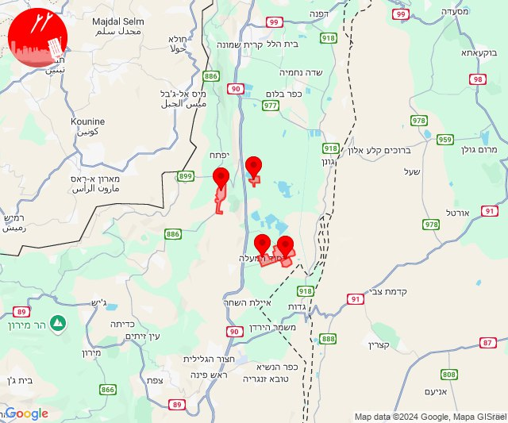

## 04:58

🔴 צבע אדום (14/11/2024):

06:58:
• קו העימות: צבעון, דוב''ב, סאסא, דוב''ב (מיידי)
• גליל עליון: אור הגנוז, בר יוחאי, מרכז אזורי מרום גליל, ספסופה - כפר חושן (30 שניות)

צופר - צבע אדום

## 04:58

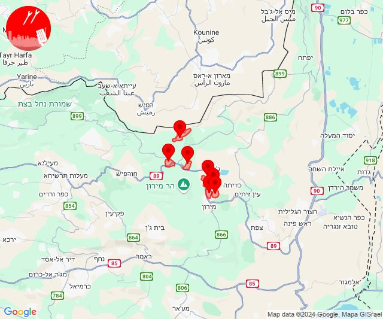

## 07:04

🔴 צבע אדום (14/11/2024):

09:04:
• קו העימות: דוב''ב (מיידי)

צופר - צבע אדום

## 07:04

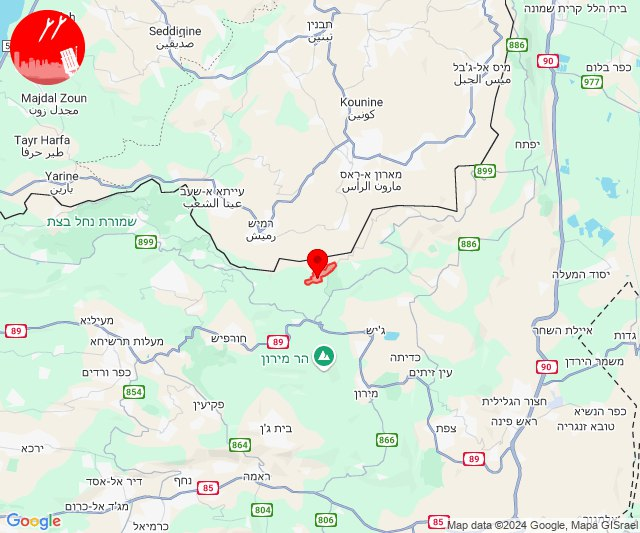

## 08:07

✈️ חדירת כלי טיס עוין (14/11/2024):

10:06:
• קו העימות: ראש הנקרה 

10:07:
• קו העימות: חוף בצת, איזור תעשייה מילואות צפון, ראש הנקרה 

צופר - צבע אדום

## 08:07

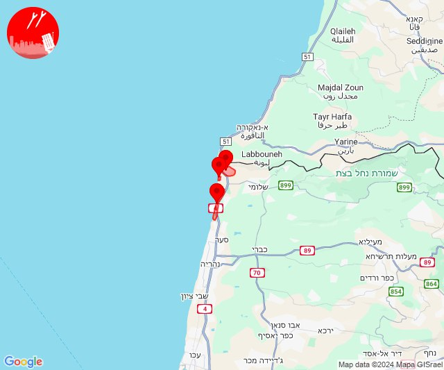

## 08:09

🔴 צבע אדום (14/11/2024):

10:09:
• קו העימות: מרגליות (מיידי)

צופר - צבע אדום

## 08:09

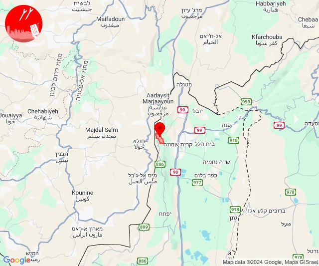

## 09:08

🔴 צבע אדום (14/11/2024):

11:08:
• קו העימות: אביבים, דישון, מלכיה (מיידי)

צופר - צבע אדום

## 09:09

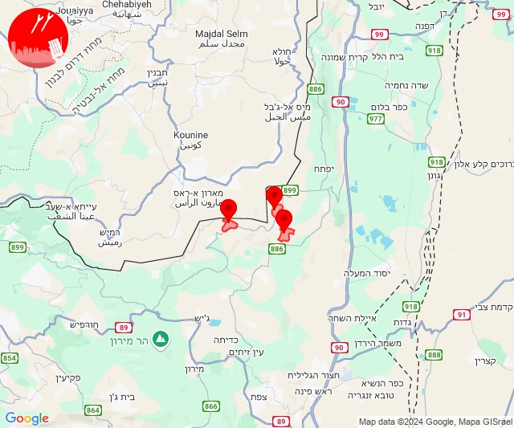

## 09:51

🔴 צבע אדום (14/11/2024):

11:51:
• קו העימות: מצובה (מיידי)

צופר - צבע אדום

## 09:51

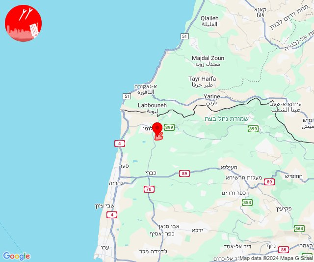

## 10:08

🔴 צבע אדום (14/11/2024):

12:08:
• קו העימות: ראש הנקרה, חוף בצת (מיידי)

צופר - צבע אדום

## 10:08

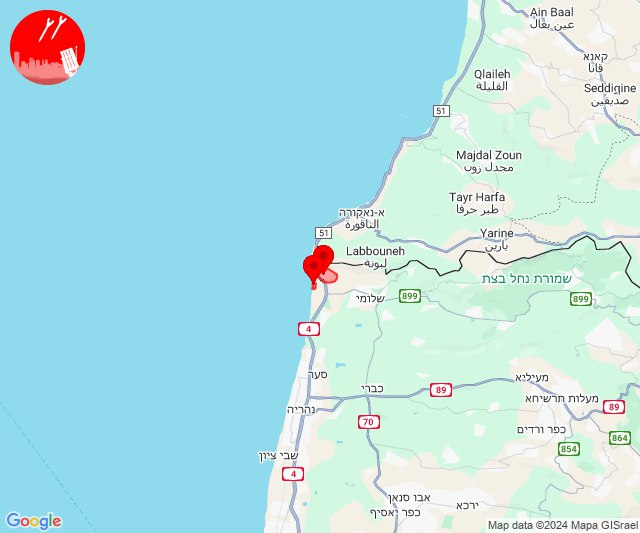

## 11:25

🔴 צבע אדום (14/11/2024):

13:25:
• קו העימות: משגב עם (מיידי)

צופר - צבע אדום

## 11:26

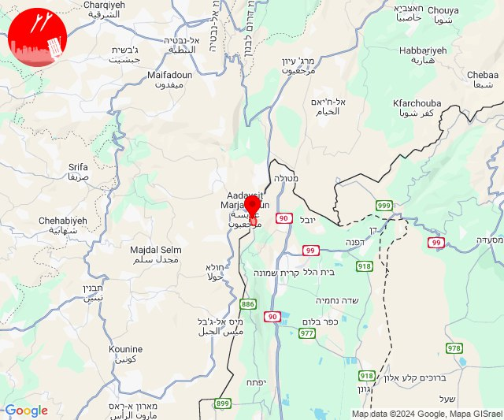

## 11:57

🔴 צבע אדום (14/11/2024):

13:57:
• קו העימות: ברעם (מיידי)

צופר - צבע אדום

## 11:57

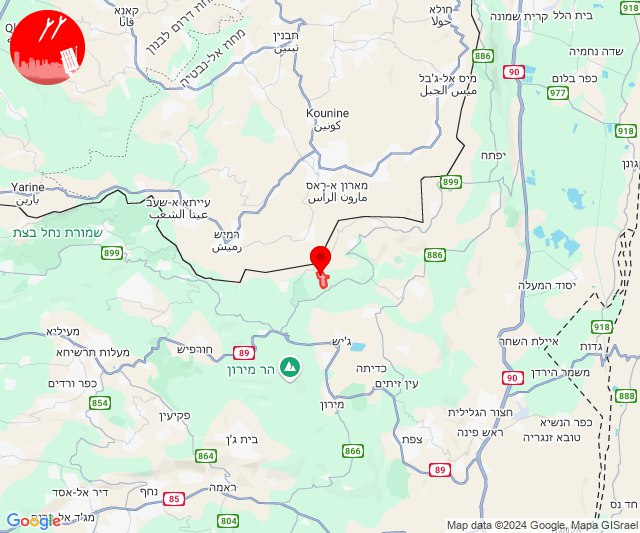

## 12:23

🔴 צבע אדום (14/11/2024):

14:23:
• קו העימות: ערב אל עראמשה, איזור תעשייה מילואות צפון, לימן, בצת, שלומי (מיידי)

צופר - צבע אדום

## 12:23

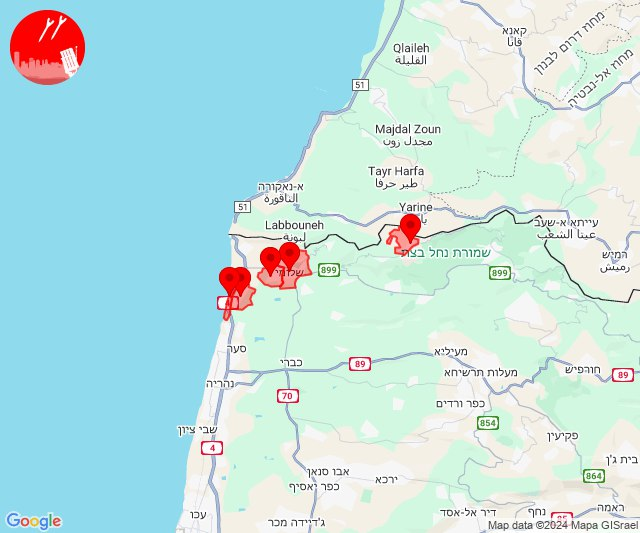

## 12:36

🔴 צבע אדום (14/11/2024):

14:36:
• קו העימות: הילה, מעיליא (מיידי)

צופר - צבע אדום

## 12:36

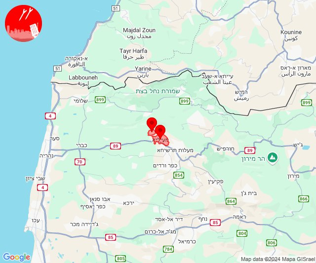

## 12:39

🔴 צבע אדום (14/11/2024):

14:39:
• קו העימות: דוב''ב (מיידי)

צופר - צבע אדום

## 12:39

## 12:45

🔴 צבע אדום (14/11/2024):

14:45:
• קו העימות: מטולה, משגב עם (מיידי)

צופר - צבע אדום

## 12:45

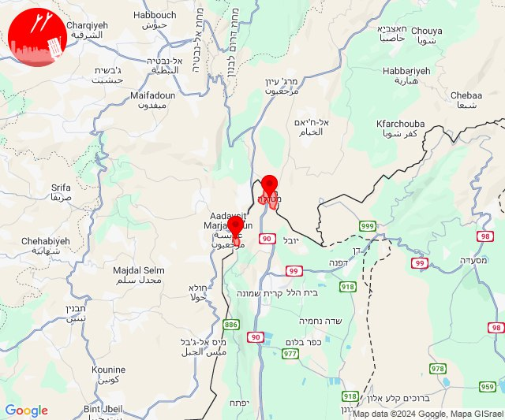

## 13:33

🔴 צבע אדום (14/11/2024):

15:33:
• קו העימות: מרגליות (מיידי)

צופר - צבע אדום

## 13:33

## 13:54

🔴 צבע אדום (14/11/2024):

15:53:
• המפרץ: חיפה - כרמל, הדר ועיר תחתית, חיפה - מפרץ, חיפה - נווה שאנן ורמות כרמל, נשר, חיפה - קריית חיים ושמואל, קריית ים (דקה)

15:54:
• המפרץ: קריית אתא, קריית ביאליק, כפר ביאליק, קריית מוצקין (דקה)

צופר - צבע אדום

## 13:54

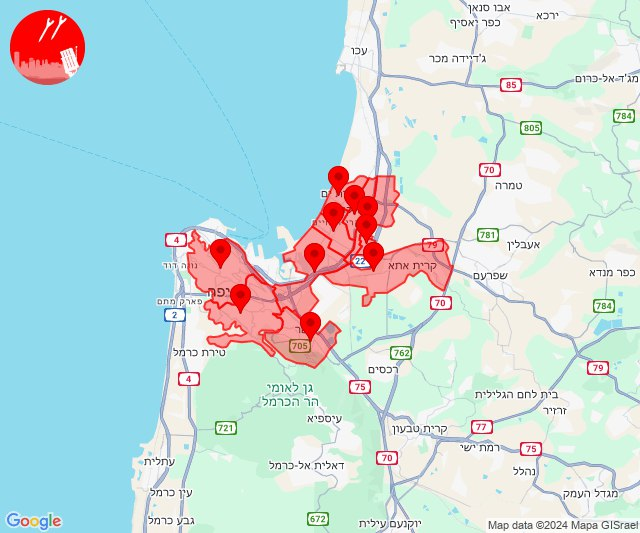

## 14:23

🔴 צבע אדום (14/11/2024):

16:22:
• קו העימות: חניתה (מיידי)

16:23:
• קו העימות: שלומי, מצובה (מיידי)

צופר - צבע אדום

## 14:23

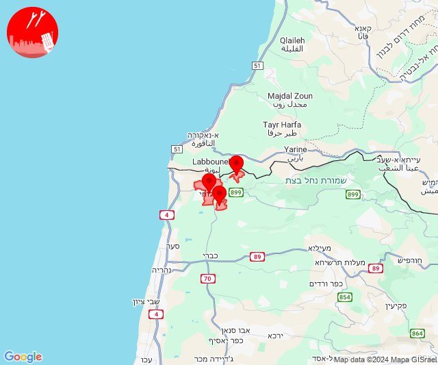

## 14:44

🔴 צבע אדום (14/11/2024):

16:44:
• קו העימות: בית הלל, כפר יובל, מעיין ברוך, קריית שמונה, תל חי (מיידי)

צופר - צבע אדום

## 14:44

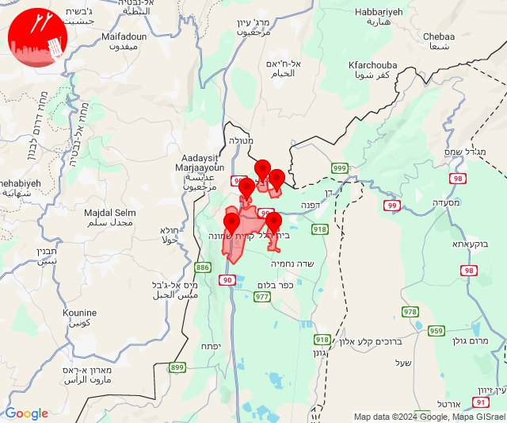

## 16:11

🔴 צבע אדום (14/11/2024):

18:11:
• קו העימות: כפר יובל (מיידי)

צופר - צבע אדום

## 16:11

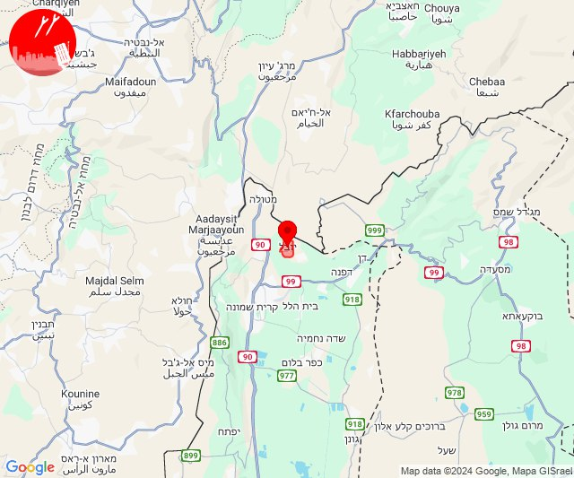

## 17:03

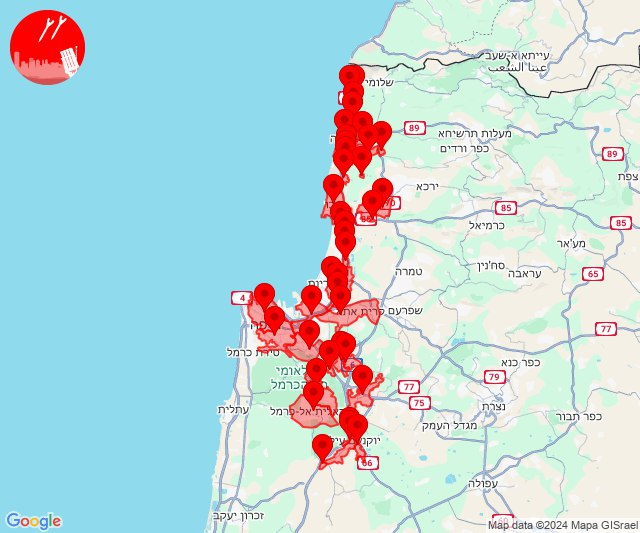

## 17:07

✈️ חדירת כלי טיס עוין (14/11/2024):

18:41:
• קו העימות: איזור תעשייה מילואות צפון, לימן, גשר הזיו 

18:42:
• קו העימות: נהריה, סער 

18:44:
• קו העימות: בן עמי, נהריה, עברון 
• גליל עליון: נתיב השיירה 

18:45:
• קו העימות: נהריה 
• גליל עליון: מזרעה, שייח' דנון, רגבה, נתיב השיירה 

18:46:
• גליל עליון: נס עמים, לוחמי הגטאות, רגבה 

18:47:
• גליל עליון: ג'דידה מכר 

18:48:
• גליל עליון: עכו, בית העלמין החדש עכו, ג'דידה מכר 

18:49:
• גליל עליון: עין המפרץ, עכו, כפר מסריק 

18:50:
• גליל עליון: אזור תעשייה שער נעמן, כפר מסריק 
• המפרץ: אזור תעשייה קריית ביאליק 

18:51:
• המפרץ: קריית ביאליק 

18:52:
• המפרץ: קריית מוצקין 

18:54:
• המפרץ: כפר ביאליק, קריית אתא 

18:55:
• המפרץ: חיפה - נווה שאנן ורמות כרמל, חיפה - כרמל, הדר ועיר תחתית, נשר, חיפה - מפרץ 

18:56:
• המפרץ: קריית אתא 

18:58:
• המפרץ: יגור, כפר חסידים, רכסים 

19:00:
• הכרמל: עספיא 

19:01:
• הכרמל: דלית אל כרמל 
• העמקים: קריית טבעון - בית זייד 

19:03:
• ואדי ערה: אזור תעשייה יקנעם עילית, יקנעם המושבה והזורע, יקנעם עילית, אליקים 
• העמקים: אורנים, אלונים, בסמת טבעון, כפר תקווה, שדה יעקב, שער העמקים, קריית טבעון - בית זייד 

19:05:
• ואדי ערה: אזור תעשייה יקנעם עילית, עין העמק, יקנעם עילית, אליקים 

19:06:
• ואדי ערה: אזור תעשייה מבוא כרמל 

19:07:
• ואדי ערה: גבעת ניל''י 
• מנשה: עמיקם, זכרון יעקב 

צופר - צבע אדום

## 17:07

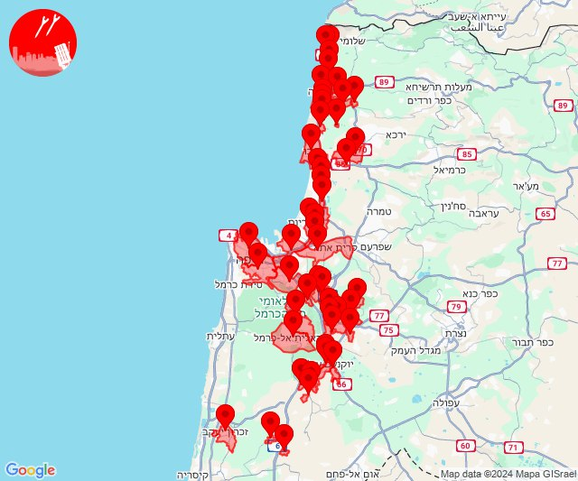

## 17:15

✈️ חדירת כלי טיס עוין (14/11/2024):

19:15:
• מנשה: אור עקיבא, קיסריה, שדות ים 

צופר - צבע אדום

## 17:15

## 17:57

🔴 צבע אדום (14/11/2024):

19:57:
• קו העימות: אביבים (מיידי)

צופר - צבע אדום

## 17:57

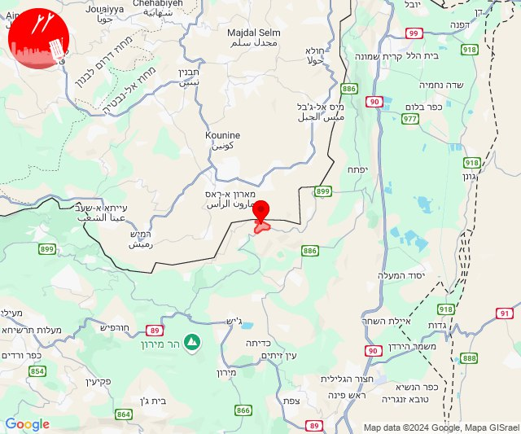

## 20:02

🔴 צבע אדום (14/11/2024):

22:02:
• קו העימות: בית הלל, כפר גלעדי, כפר יובל, מנרה, מעיין ברוך, מרגליות, משגב עם, קריית שמונה, תל חי, כפר בלום, נאות מרדכי, עמיר, שדה נחמיה, הגושרים (מיידי, 15 שניות)

צופר - צבע אדום

## 20:02

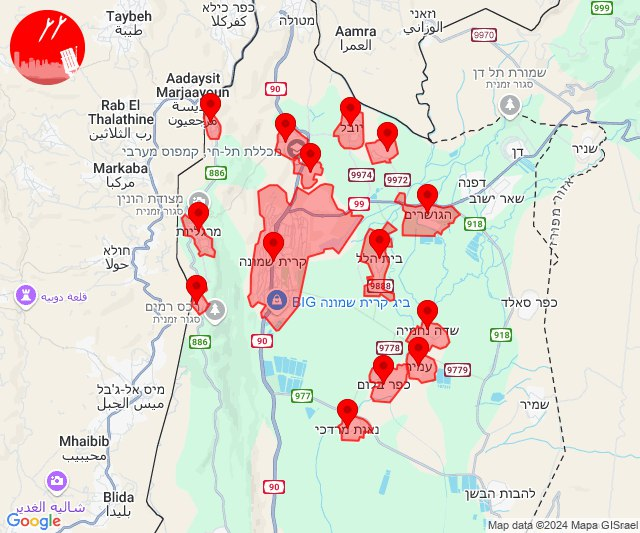

## 21:18

🔴 צבע אדום (14/11/2024):

23:18:
• קו העימות: קריית שמונה, כפר גלעדי, כפר יובל, מטולה (מיידי)

צופר - צבע אדום

## 21:18

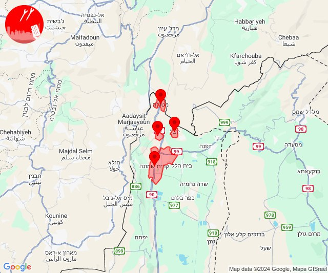

## 22:18

🔴 צבע אדום (15/11/2024):

00:17:
• קו העימות: בן עמי (מיידי)

00:18:
• קו העימות: בית העלמין החדש נהריה, כברי, סער, נווה זיו, בית העלמין החדש נהריה, בן עמי, נהריה, כברי, געתון, יחיעם (30 שניות, מיידי, 15 שניות)
• גליל עליון: נתיב השיירה, נתיב השיירה, שייח' דנון, כליל (30 שניות)

צופר - צבע אדום

## 22:18

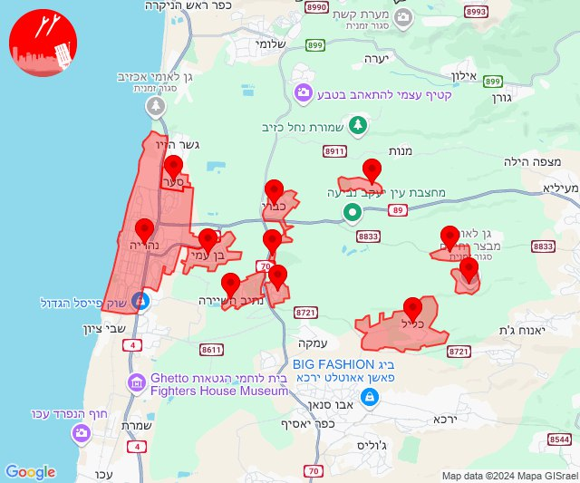

