# Alerts for 2024-11-16

## 03:59

🔴 צבע אדום (16/11/2024):

05:59:
• אילת: אילות, אילת, אזור תעשייה שחורת (30 שניות)

צופר - צבע אדום

## 03:59

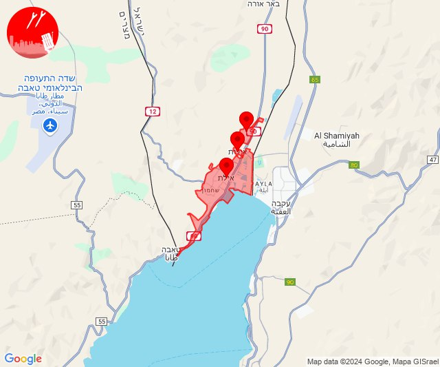

## 05:06

✈️ חדירת כלי טיס עוין (16/11/2024):

07:05:
• קו העימות: איזור תעשייה מילואות צפון, נהריה, לימן, גשר הזיו, סער, חוף בצת, ראש הנקרה 

07:06:
• קו העימות: בצת, לימן, איזור תעשייה מילואות צפון 

צופר - צבע אדום

## 05:06

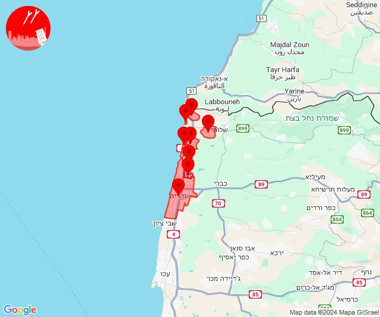

## 06:18

🔴 צבע אדום (16/11/2024):

08:17:
• קו העימות: ראש הנקרה (מיידי)

08:18:
• קו העימות: ראש הנקרה (מיידי)

צופר - צבע אדום

## 06:19

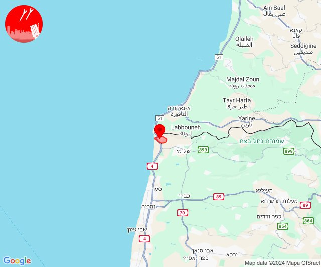

## 06:21

✈️ חדירת כלי טיס עוין (16/11/2024):

08:17:
• קו העימות: חוף בצת, איזור תעשייה מילואות צפון 

08:18:
• קו העימות: לימן, גשר הזיו, נהריה, חוף בצת, איזור תעשייה מילואות צפון 

08:19:
• קו העימות: לימן, גשר הזיו, נהריה, סער 

08:20:
• קו העימות: נהריה 

08:21:
• קו העימות: גשר הזיו, איזור תעשייה מילואות צפון 

צופר - צבע אדום

## 06:21

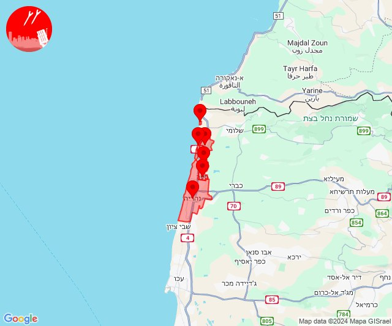

## 08:00

🔴 צבע אדום (16/11/2024):

09:58:
• קו העימות: יערה, חניתה, מצובה, עבדון (מיידי)

09:59:
• קו העימות: ערב אל עראמשה, אדמית, אילון, גורן, חניתה, יערה (מיידי)

10:00:
• קו העימות: בן עמי, נהריה, סער, גשר הזיו, איזור תעשייה מילואות צפון, לימן (מיידי, 15 שניות)

צופר - צבע אדום

## 08:00

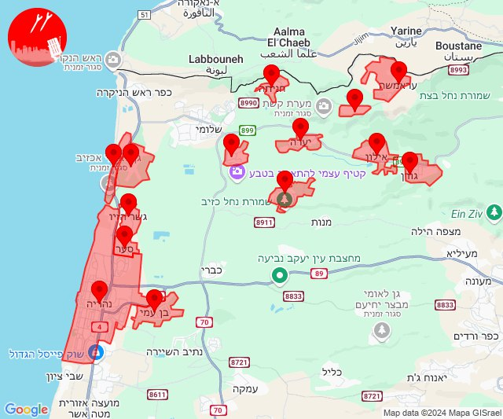

## 08:48

🔴 צבע אדום (16/11/2024):

10:46:
• המפרץ: קריית ביאליק, אזור תעשייה קריית ביאליק, קריית מוצקין (דקה)
• גליל עליון: אפק, כליל (דקה, 30 שניות)
• מרכז הגליל: אזור תעשייה טמרה, טמרה (דקה)
• קו העימות: נווה זיו (מיידי)

10:47:
• מרכז הגליל: שפרעם (דקה)
• גליל עליון: כפר מסריק, עכו - אזור תעשייה (30 שניות)

10:48:
• גליל עליון: שייח' דנון, כליל, עמקה (30 שניות)

צופר - צבע אדום

## 08:48

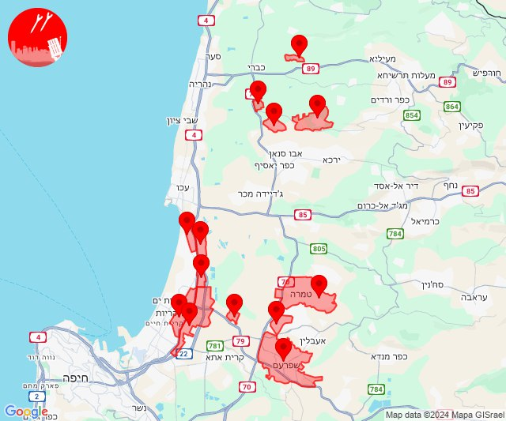

## 09:49

🔴 צבע אדום (16/11/2024):

11:49:
• קו העימות: אביבים, יראון, כרם בן זמרה, אביבים, יראון (מיידי)

צופר - צבע אדום

## 09:49

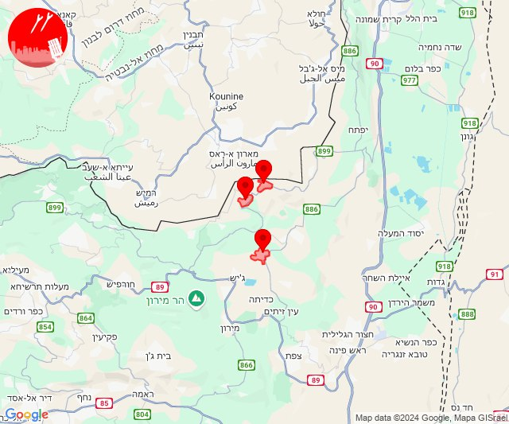

## 10:16

🔴 צבע אדום (16/11/2024):

12:16:
• קו העימות: מנרה (מיידי)

צופר - צבע אדום

## 10:16

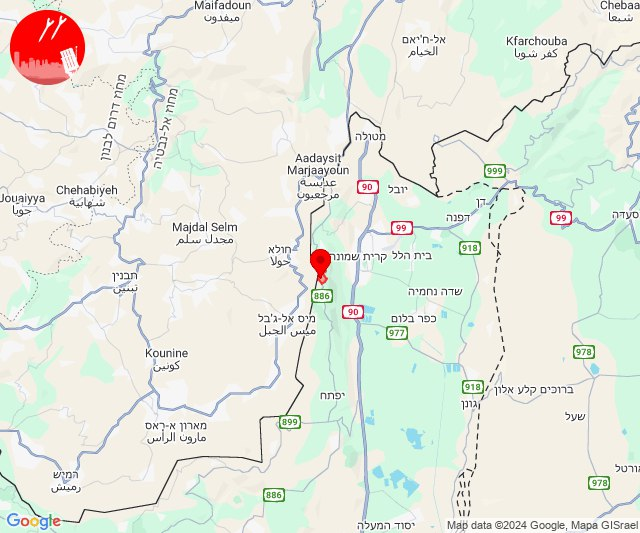

## 10:47

🔴 צבע אדום (16/11/2024):

12:47:
• קו העימות: מנרה, מרגליות, משגב עם, קריית שמונה (מיידי)

צופר - צבע אדום

## 10:47

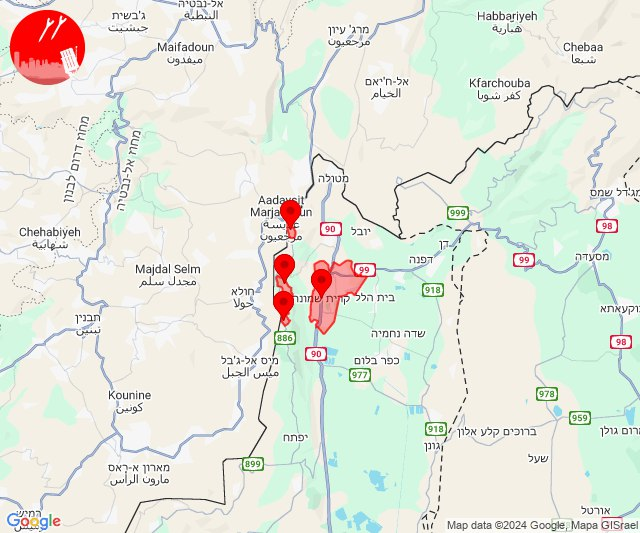

## 12:10

🔴 צבע אדום (16/11/2024):

14:10:
• גליל עליון: צפת - עיר (30 שניות)

צופר - צבע אדום

## 12:10

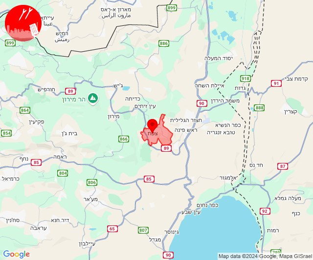

## 12:45

🔴 צבע אדום (16/11/2024):

14:44:
• גליל עליון: אזור תעשייה שער נעמן, עכו, נתיב השיירה, בוסתן הגליל, שומרת, לוחמי הגטאות, מזרעה, רגבה (דקה, 30 שניות)
• המפרץ: אזור תעשייה קריית ביאליק, קריית ביאליק, קריית ים, קריית מוצקין, חיפה - מפרץ, חיפה - קריית חיים ושמואל (דקה)
• קו העימות: יערה, בית העלמין החדש נהריה, כברי (מיידי, 30 שניות)

14:45:
• גליל עליון: נס עמים, שבי ציון, כפר מסריק, עכו - אזור תעשייה, עין המפרץ, ג'דידה מכר, בית העלמין החדש עכו (30 שניות)
• קו העימות: אדמית (מיידי)

צופר - צבע אדום

## 12:45

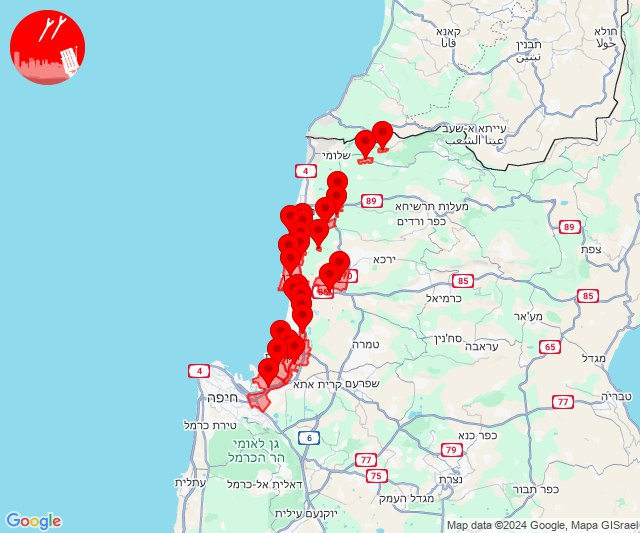

## 12:51

🔴 צבע אדום (16/11/2024):

14:51:
• קו העימות: מטולה (מיידי)

צופר - צבע אדום

## 12:51

## 13:23

🔴 צבע אדום (16/11/2024):

15:23:
• קו העימות: יראון, אביבים (מיידי)

צופר - צבע אדום

## 13:23

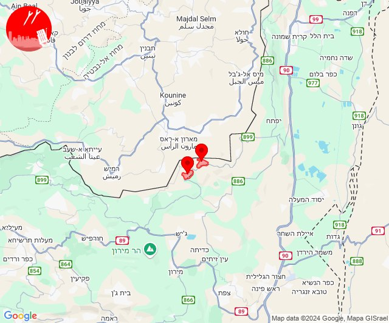

## 14:40

🔴 צבע אדום (16/11/2024):

16:40:
• קו העימות: ג'ש - גוש חלב, כרם בן זמרה (מיידי)

צופר - צבע אדום

## 14:41

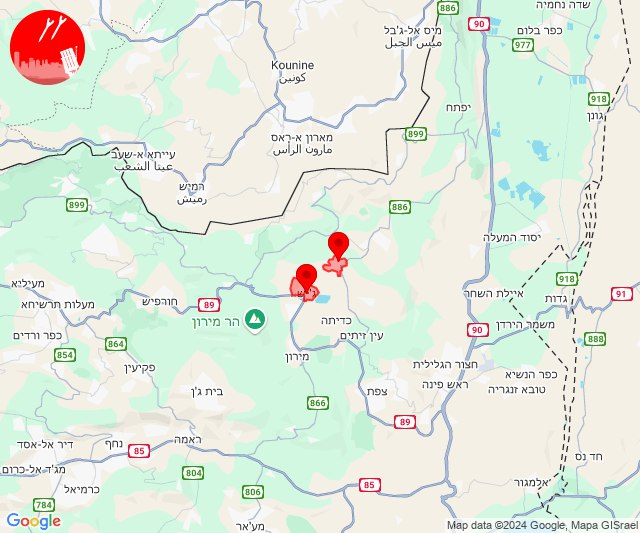

## 15:02

🔴 צבע אדום (16/11/2024):

17:02:
• עוטף עזה: שדרות, איבים, ניר עם, מפלסים (15 שניות)

צופר - צבע אדום

## 15:02

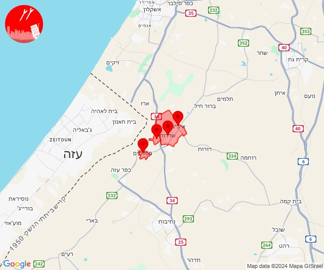

## 15:59

🔴 צבע אדום (16/11/2024):

17:59:
• קו העימות: קריית שמונה (מיידי)

צופר - צבע אדום

## 15:59

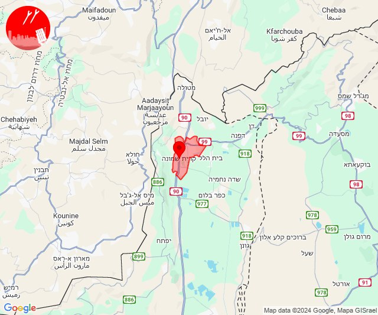

## 17:45

🔴 צבע אדום (16/11/2024):

19:44:
• המפרץ: חיפה - כרמל, הדר ועיר תחתית, חיפה - מערב, חיפה - נווה שאנן ורמות כרמל, טירת כרמל, כפר גלים, חיפה - מפרץ, נשר (דקה)

19:45:
• המפרץ: חיפה - קריית חיים ושמואל, כפר ביאליק, קריית ביאליק, קריית ים, קריית מוצקין (דקה)

צופר - צבע אדום

## 17:45

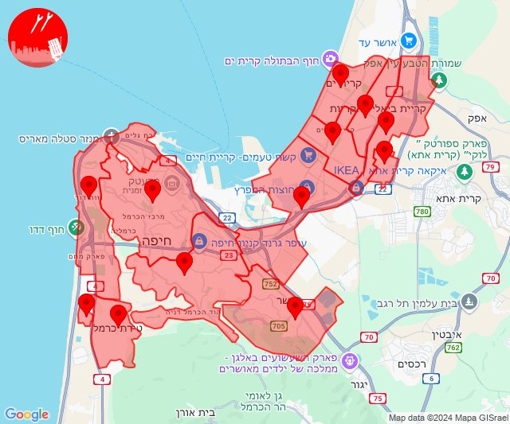

## 18:20

🔴 צבע אדום (16/11/2024):

20:20:
• קו העימות: מנרה, מרגליות, קריית שמונה, משגב עם (מיידי)

צופר - צבע אדום

## 18:20

## 18:45

🔴 צבע אדום (16/11/2024):

20:45:
• קו העימות: מעיין ברוך, כפר יובל, מטולה, כפר גלעדי, משגב עם, תל חי, הגושרים (מיידי)

צופר - צבע אדום

## 18:45

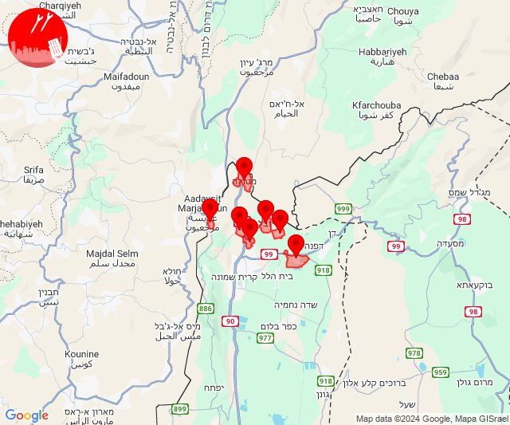

## 19:58

🔴 צבע אדום (16/11/2024):

21:58:
• קו העימות: משגב עם (מיידי)

צופר - צבע אדום

## 19:58

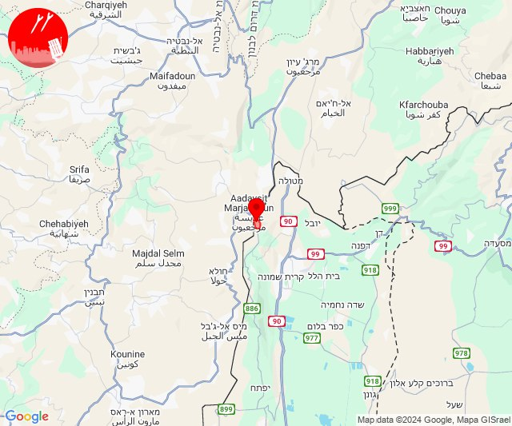

## 20:04

🔴 צבע אדום (16/11/2024):

22:04:
• קו העימות: מרגליות (מיידי)

צופר - צבע אדום

## 20:04

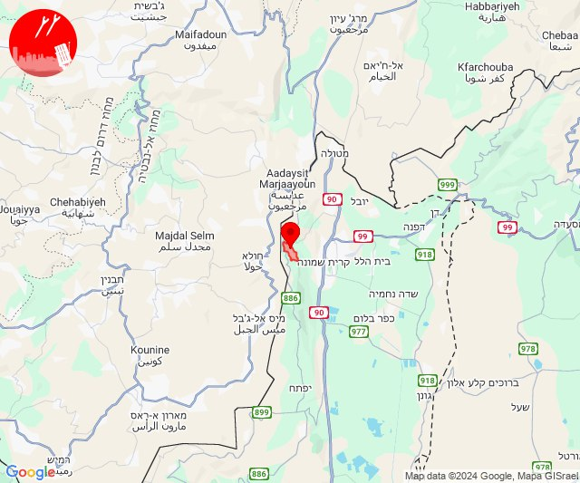

