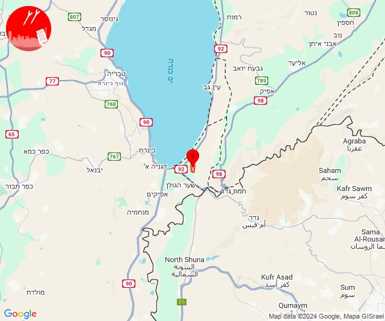
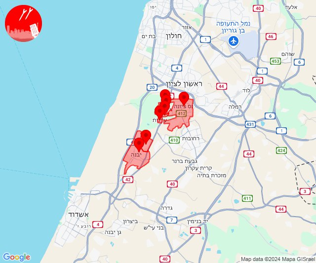

# Alerts for 2024-11-17

## 02:24

✈️ חדירת כלי טיס עוין (17/11/2024):

04:24:
• דרום הגולן: תל קציר 

צופר - צבע אדום

## 02:24

## 07:23

✈️ חדירת כלי טיס עוין (17/11/2024):

09:20:
• לכיש: יבנה, כפר הנגיד 

09:23:
• השפלה: אירוס, בית חנן, בית עובד, נס ציונה, עיינות 

צופר - צבע אדום

## 07:23

## 08:03

🔴 צבע אדום (17/11/2024):

10:03:
• עוטף עזה: נחל עוז (15 שניות)

צופר - צבע אדום

## 08:03

## 08:12

🔴 צבע אדום (17/11/2024):

10:11:
• גליל עליון: אזור תעשייה שער נעמן, כפר מסריק, עכו - אזור תעשייה, עין המפרץ (דקה, 30 שניות)
• המפרץ: קריית ביאליק, אזור תעשייה קריית ביאליק (דקה)

10:12:
• גליל עליון: עכו, ג'דידה מכר, בית העלמין החדש עכו, כפר מסריק, עין המפרץ, עכו - אזור תעשייה, בוסתן הגליל, שומרת, עכו (30 שניות)

צופר - צבע אדום

## 08:12

## 10:09

🔴 צבע אדום (17/11/2024):

12:09:
• קו העימות: חורפיש (מיידי)

צופר - צבע אדום

## 10:09

## 12:03

✈️ חדירת כלי טיס עוין (17/11/2024):

14:03:
• קו העימות: ע'ג'ר 

צופר - צבע אדום

## 12:03

## 12:57

🔴 צבע אדום (17/11/2024):

14:57:
• קו העימות: מרגליות (מיידי)

צופר - צבע אדום

## 12:57

## 14:23

🔴 צבע אדום (17/11/2024):

16:21:
• קו העימות: חורפיש, אלקוש (מיידי)

16:22:
• קו העימות: נטועה, פסוטה, מתת, אלקוש, חורפיש, פסוטה (מיידי)
• גליל עליון: כסרא סמיע (30 שניות)

16:23:
• קו העימות: אלקוש, נטועה, חורפיש, מתת (מיידי)

צופר - צבע אדום

## 14:23

## 16:43

🔴 צבע אדום (17/11/2024):

18:42:
• קו העימות: חוף בצת, ראש הנקרה (מיידי)

18:43:
• קו העימות: חוף בצת, ראש הנקרה (מיידי)

צופר - צבע אדום

## 16:43

## 16:47

🔴 צבע אדום (17/11/2024):

18:47:
• קו העימות: חוף בצת, ראש הנקרה (מיידי)

צופר - צבע אדום

## 16:47

## 21:07

🔴 צבע אדום (17/11/2024):

23:07:
• קו העימות: יפתח, לב החולה, מרכז אזורי מבואות חרמון, רמות נפתלי (מיידי)

צופר - צבע אדום

## 21:07

## 22:03

✈️ חדירת כלי טיס עוין (18/11/2024):

00:03:
• אילת: אילת 

צופר - צבע אדום

## 22:03

## 22:31

🔴 צבע אדום (18/11/2024):

00:31:
• קו העימות: קריית שמונה, מרגליות, מנרה (מיידי)

צופר - צבע אדום

## 22:31

