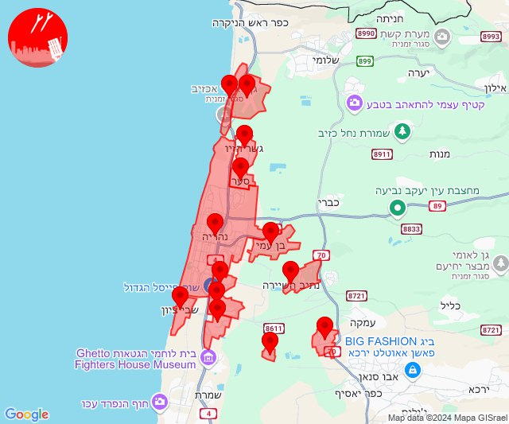

# Alerts for 2024-11-18

## 06:35

🔴 צבע אדום (18/11/2024):

08:35:
• קו העימות: זרעית (מיידי)

צופר - צבע אדום

## 06:35

## 07:49

🔴 צבע אדום (18/11/2024):

09:49:
• קו העימות: חוות אירוח גורן, אילון, גורן, גורנות הגליל, ערב אל עראמשה (מיידי)

צופר - צבע אדום

## 07:49

## 08:23

🔴 צבע אדום (18/11/2024):

10:23:
• קו העימות: מנרה, מרגליות, קריית שמונה (מיידי)

צופר - צבע אדום

## 08:23

## 08:26

🔴 צבע אדום (18/11/2024):

10:26:
• קו העימות: קריית שמונה (מיידי)

צופר - צבע אדום

## 08:26

## 09:06

🔴 צבע אדום (18/11/2024):

11:04:
• קו העימות: נהריה, בן עמי, גשר הזיו, סער, עברון (15 שניות, מיידי)
• גליל עליון: שבי ציון, מזרעה (30 שניות)

11:05:
• קו העימות: נהריה, בן עמי, סער, גשר הזיו, איזור תעשייה מילואות צפון, לימן, עברון (15 שניות, מיידי)
• גליל עליון: שבי ציון, בית העמק, נס עמים, נתיב השיירה, רגבה (30 שניות)

11:06:
• קו העימות: נהריה (15 שניות)
• גליל עליון: שבי ציון, מזרעה, רגבה (30 שניות)

צופר - צבע אדום

## 09:06

## 09:48

🔴 צבע אדום (18/11/2024):

11:48:
• קו העימות: מעלות תרשיחא, אבן מנחם, נטועה, פסוטה, זרעית, שומרה, גורנות הגליל, גורן, אבירים (מיידי)

צופר - צבע אדום

## 09:48

## 10:05

🔴 צבע אדום (18/11/2024):

12:05:
• קו העימות: ערב אל עראמשה (מיידי)

צופר - צבע אדום

## 10:05

## 11:18

🔴 צבע אדום (18/11/2024):

13:18:
• קו העימות: חורפיש, פקיעין החדשה, פקיעין, צוריאל, אלקוש (מיידי, 15 שניות)

צופר - צבע אדום

## 11:18

## 11:27

🔴 צבע אדום (18/11/2024):

13:27:
• קו העימות: מרגליות, משגב עם (מיידי)

צופר - צבע אדום

## 11:27

## 11:29

🔴 צבע אדום (18/11/2024):

13:29:
• קו העימות: קריית שמונה, מרגליות (מיידי)

צופר - צבע אדום

## 11:29

## 12:55

🔴 צבע אדום (18/11/2024):

14:55:
• קו העימות: זרעית (מיידי)

צופר - צבע אדום

## 12:55

## 13:11

🔴 צבע אדום (18/11/2024):

15:09:
• קו העימות: אבן מנחם, שומרה (מיידי)

15:10:
• קו העימות: אבן מנחם, אבירים, יראון, כרם בן זמרה (מיידי)

15:11:
• קו העימות: אזור תעשייה רמת דלתון, יראון (מיידי)

צופר - צבע אדום

## 13:11

## 13:43

🔴 צבע אדום (18/11/2024):

15:43:
• קו העימות: אביבים (מיידי)

צופר - צבע אדום

## 13:43

## 14:09

🔴 צבע אדום (18/11/2024):

16:09:
• קו העימות: אביבים (מיידי)

צופר - צבע אדום

## 14:09

## 15:02

✈️ חדירת כלי טיס עוין (18/11/2024):

16:55:
• קו העימות: לימן, גשר הזיו 

16:56:
• קו העימות: נהריה, איזור תעשייה מילואות צפון, סער 

17:00:
• קו העימות: חוף בצת, ראש הנקרה 

17:01:
• קו העימות: איזור תעשייה מילואות צפון, בצת, לימן 

17:02:
• קו העימות: לימן, בצת, שלומי 

צופר - צבע אדום

## 15:02

## 15:29

🔴 צבע אדום (18/11/2024):

17:28:
• קו העימות: מטולה (מיידי)

17:29:
• קו העימות: מטולה (מיידי)

צופר - צבע אדום

## 15:29

## 16:28

🔴 צבע אדום (18/11/2024):

18:27:
• מרכז הגליל: טמרה, אזור תעשייה טמרה, אעבלין, שפרעם (דקה)

18:28:
• גליל עליון: אחיהוד (דקה)
• מרכז הגליל: כאבול (דקה)

צופר - צבע אדום

## 16:28

## 17:10

🔴 צבע אדום (18/11/2024):

19:10:
• גליל עליון: עמקה, אבו סנאן, אשרת, כליל, נתיב השיירה, שייח' דנון (30 שניות)
• קו העימות: בית העלמין החדש נהריה, כברי, בן עמי, נווה זיו (30 שניות, מיידי)

צופר - צבע אדום

## 17:10

## 18:46

🔴 צבע אדום (18/11/2024):

20:45:
• דן: תל אביב - דרום העיר ויפו, תל אביב - מזרח, תל אביב - מרכז העיר, תל אביב - עבר הירקון, אור יהודה, אזור, בני ברק, בת ים, גבעת שמואל, גבעתיים, חולון, מקווה ישראל, פתח תקווה, קריית אונו, רמת גן - מזרח, רמת גן - מערב (דקה וחצי)
• השפלה: חמד, משמר השבעה, גנות (דקה וחצי)

20:46:
• דן: גבעת השלושה, גת רימון, הרצליה - מערב, הרצליה - מרכז וגליל ים, כפר סירקין, כפר שמריהו, מעש, סביון, רמת השרון, גני תקווה, בית עלמין מורשה, סינמה סיטי גלילות, מתחם פי גלילות (דקה וחצי)
• שרון: גבעת חן, נתניה - מזרח, נתניה - מערב, רעננה, אורנית, אייל, אלישמע, בית ברל, בני דרור, ג'לג'וליה, גאולים, גן חיים, גני עם, הוד השרון, חגור, חורשים, חרות, טייבה, טירה, יעף, ירחיב, ירקונה, כוכב יאיר - צור יגאל, כפר ברא, כפר הס, כפר יעבץ, כפר מל''ל, כפר סבא, כפר עבודה, כפר קאסם, משמרת, מתן, נווה ימין, נווה ירק, ניר אליהו, נירית, עדנים, עזריאל, עין ורד, עין שריד, פורת, פרדסיה, צופית, צור יצחק, צור משה, צור נתן, קדימה צורן, קלנסווה, רמות השבים, רמת הכובש, שדה ורבורג, שדי חמד, תחנת רכבת ראש העין, תל מונד, אבן יהודה, אודים, אלפי מנשה, ארסוף, בית יהושע, בני ציון, בצרה, געש, חרוצים, יקום, כפר נטר, מכון וינגייט, צופים, רשפון, שפיים, תל יצחק, אזור תעשייה טירה, אזור תעשייה כפר יונה, גנות הדר, ינוב, כפר יונה, מתחם "חנה וסע" שפיים, נורדיה, בית סוהר השרון, מרכז אזורי דרום השרון (דקה וחצי)
• ירקון: נחלים, עינת, ראש העין, אזור תעשייה אפק ולב הארץ (דקה וחצי)

צופר - צבע אדום

## 18:46

## 18:56

🔴 צבע אדום (18/11/2024):

20:56:
• המפרץ: נשר (דקה)

צופר - צבע אדום

## 18:56

## 18:56

✈️ חדירת כלי טיס עוין (18/11/2024):

20:56:
• המפרץ: כפר חסידים, יגור 

צופר - צבע אדום

## 18:56

## 19:20

✈️ חדירת כלי טיס עוין (18/11/2024):

21:20:
• אילת: אילת 

צופר - צבע אדום

## 19:20

## 19:46

🔴 צבע אדום (18/11/2024):

21:46:
• קו העימות: משגב עם, קריית שמונה, מרגליות, מנרה (מיידי)

צופר - צבע אדום

## 19:46

## 22:13

🔴 צבע אדום (19/11/2024):

00:13:
• קו העימות: מרגליות, קריית שמונה, מנרה (מיידי)

צופר - צבע אדום

## 22:13

