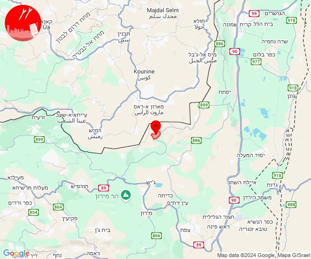
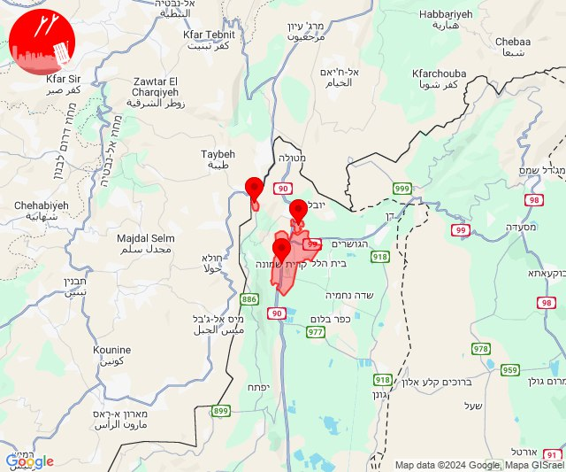

# Alerts for 2024-11-19

## 05:01

🔴 צבע אדום (19/11/2024):

07:00:
• קו העימות: ערב אל עראמשה, גורנות הגליל (מיידי)

07:01:
• קו העימות: ערב אל עראמשה (מיידי)

צופר - צבע אדום

## 05:01

## 06:54

🔴 צבע אדום (19/11/2024):

08:52:
• שרון: תל מונד, בני דרור, משמרת, עין ורד, קדימה צורן, חרות, פרדסיה, צור משה, אבן יהודה, כפר יונה, אזור תעשייה כפר יונה, בית הלוי, המרכז האקדמי רופין, חניאל, כפר מונש, כפר הס, עין שריד, נורדיה (דקה וחצי)

08:53:
• שרון: גבעת חן, רעננה, כפר סבא, בני ציון, בצרה, העוגן, חרוצים, גאולים, ינוב, בורגתה, עין החורש, בית חזון, גבעת חיים מאוחד, חגלה, אליכין, גבעת חיים איחוד (דקה וחצי)
• דן: הרצליה - מרכז וגליל ים (דקה וחצי)
• מנשה: חדרה - מזרח, חדרה - מרכז, תלמי אלעזר (דקה וחצי)

08:54:
• שרון: בארותיים, חרב לאת, בית יהושע, תל יצחק, נתניה - מזרח, כפר נטר (דקה וחצי)
• מנשה: גן שמואל (דקה וחצי)

צופר - צבע אדום

## 06:54

## 07:03

🔴 צבע אדום (19/11/2024):

09:02:
• קו העימות: בית ספר שדה מירון, סאסא (מיידי)

09:03:
• קו העימות: צבעון, סאסא (מיידי)

צופר - צבע אדום

## 07:03

## 07:51

🔴 צבע אדום (19/11/2024):

09:50:
• קו העימות: שתולה, נטועה, אבן מנחם, חוסן, כפר ורדים, מעלות תרשיחא, אלקוש, חורפיש, פקיעין החדשה, צוריאל, פקיעין, אבירים, פסוטה, מעונה, מעיליא (מיידי, 15 שניות)
• מרכז הגליל: יובלים, ערב אל נעים, אזור תעשייה תרדיון, אשחר, סכנין, יודפת, מרכז אזורי משגב, קורנית, רקפת, שורשים, כפר מנדא (דקה, 30 שניות)
• גליל עליון: בענה, כרמיאל, כסרא סמיע, ינוח ג'ת, מגדל תפן, אזור תעשייה כרמיאל, דיר אל-אסד, לבון, נחף, הר חלוץ, מג'דל כרום (30 שניות)

09:51:
• מרכז הגליל: חוסנייה, סלמה (דקה)
• גליל עליון: סאג'ור, מכמנים, בענה, כרמיאל, כסרא סמיע, דיר אל-אסד, נחף (30 שניות)

צופר - צבע אדום

## 07:51

## 08:08

🔴 צבע אדום (19/11/2024):

10:08:
• קו העימות: מנרה (מיידי)

צופר - צבע אדום

## 08:08

## 08:38

🔴 צבע אדום (19/11/2024):

10:38:
• קו העימות: יראון (מיידי)

צופר - צבע אדום

## 08:38

## 08:46

🔴 צבע אדום (19/11/2024):

10:46:
• קו העימות: כפר בלום, עמיר (מיידי, 15 שניות)

צופר - צבע אדום

## 08:46

## 08:58

✈️ חדירת כלי טיס עוין (19/11/2024):

10:49:
• קו העימות: מטולה 

10:52:
• קו העימות: מטולה 

10:53:
• קו העימות: קריית שמונה 

10:54:
• קו העימות: כפר גלעדי 

10:55:
• קו העימות: קריית שמונה 

10:58:
• גליל עליון: ביריה, חצור הגלילית, צפת - עיר, ראש פינה, אור הגנוז, בר יוחאי, מרכז אזורי מרום גליל, ספסופה - כפר חושן, עמוקה, קדיתא, שדה אליעזר, צפת - נוף כנרת, מירון 
• קו העימות: אביבים, אזור תעשייה רמת דלתון, ברעם, ג'ש - גוש חלב, דוב''ב, דישון, דלתון, יפתח, יראון, כרם בן זמרה, מלכיה, סאסא, עלמה, צבעון, ריחאנייה, רמות נפתלי, לב החולה, מרכז אזורי מבואות חרמון 

צופר - צבע אדום

## 08:58

## 09:12

🔴 צבע אדום (19/11/2024):

11:12:
• קו העימות: ע'ג'ר (מיידי)

צופר - צבע אדום

## 09:12

## 09:24

🔴 צבע אדום (19/11/2024):

11:24:
• קו העימות: אבן מנחם, שתולה (מיידי)

צופר - צבע אדום

## 09:24

## 09:58

🔴 צבע אדום (19/11/2024):

11:58:
• קו העימות: מנרה (מיידי)

צופר - צבע אדום

## 09:58

## 11:30

🔴 צבע אדום (19/11/2024):

13:29:
• קו העימות: מרגליות (מיידי)

צופר - צבע אדום

## 11:30

## 12:12

🔴 צבע אדום (19/11/2024):

14:12:
• קו העימות: מלכיה (מיידי)

צופר - צבע אדום

## 12:12

## 12:22

🔴 צבע אדום (19/11/2024):

14:22:
• קו העימות: מטולה (מיידי)

צופר - צבע אדום

## 12:22

## 12:24

🔴 צבע אדום (19/11/2024):

14:23:
• גליל עליון: ינוח ג'ת, מגדל תפן (30 שניות)
• קו העימות: כפר ורדים, מעלות תרשיחא, אבירים, מעיליא, מעונה (15 שניות, מיידי)

14:24:
• קו העימות: הילה (מיידי)

צופר - צבע אדום

## 12:24

## 13:23

🔴 צבע אדום (19/11/2024):

15:23:
• קו העימות: גורן, גורנות הגליל (מיידי)

צופר - צבע אדום

## 13:23

## 14:54

🔴 צבע אדום (19/11/2024):

16:53:
• קו העימות: בית ספר שדה מירון, סאסא (מיידי)

16:54:
• קו העימות: ג'ש - גוש חלב (מיידי)
• גליל עליון: ספסופה - כפר חושן (30 שניות)

צופר - צבע אדום

## 14:54

## 14:58

🔴 צבע אדום (19/11/2024):

16:58:
• קו העימות: שתולה (מיידי)

צופר - צבע אדום

## 14:58

## 15:09

✈️ חדירת כלי טיס עוין (19/11/2024):

16:52:
• קו העימות: מטולה 

16:53:
• קו העימות: כפר גלעדי, קריית שמונה, תל חי 

16:54:
• קו העימות: קריית שמונה 

16:58:
• קו העימות: מרכז אזורי מבואות חרמון 

16:59:
• קו העימות: לב החולה 

17:02:
• גליל עליון: שדה אליעזר, מלון אחוזת ירדן 

17:03:
• גליל עליון: איילת השחר 

17:04:
• גליל עליון: אזור תעשייה חצור הגלילית, חצור הגלילית, טובא זנגריה, כפר הנשיא, מחניים, איילת השחר, מנחת מחניים, אזור תעשייה צ.ח.ר, ראש פינה 

17:07:
• גליל עליון: אליפלט 

17:08:
• גליל עליון: עמיעד 

17:09:
• גליל עליון: כורזים ורד הגליל 

צופר - צבע אדום

## 15:09

## 19:14

🔴 צבע אדום (19/11/2024):

21:14:
• קו העימות: מטולה (מיידי)

צופר - צבע אדום

## 19:14

## 21:34

🔴 צבע אדום (19/11/2024):

23:34:
• קו העימות: אביבים, אביבים (מיידי)

צופר - צבע אדום

## 21:34

## 22:37

🔴 צבע אדום (20/11/2024):

00:37:
• קו העימות: קריית שמונה, משגב עם, תל חי (מיידי)

צופר - צבע אדום

## 22:37

