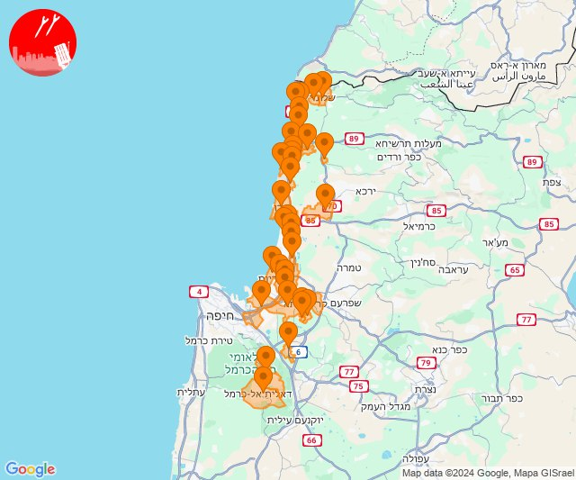
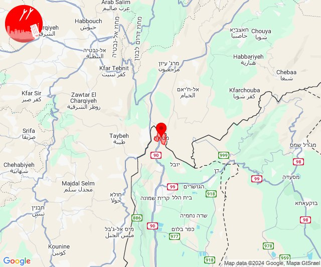

# Alerts for 2024-11-20

## 04:37

🔴 צבע אדום (20/11/2024):

06:37:
• גליל עליון: נס עמים (30 שניות)

צופר - צבע אדום

## 04:37

## 04:46

✈️ חדירת כלי טיס עוין (20/11/2024):

06:26:
• קו העימות: שלומי, בצת 

06:27:
• קו העימות: בצת, לימן 

06:28:
• קו העימות: גשר הזיו, איזור תעשייה מילואות צפון, לימן, נהריה 

06:29:
• קו העימות: גשר הזיו, סער, נהריה 

06:30:
• גליל עליון: שייח' דנון 
• קו העימות: לימן, בן עמי, גשר הזיו, נהריה 

06:31:
• קו העימות: בצת, שלומי 

06:32:
• קו העימות: לימן, בן עמי 

06:33:
• קו העימות: עברון 
• גליל עליון: שבי ציון, שייח' דנון, מזרעה 

06:34:
• גליל עליון: לוחמי הגטאות, רגבה, ג'דידה מכר, עכו 

06:36:
• גליל עליון: עין המפרץ 

06:37:
• גליל עליון: אזור תעשייה שער נעמן, כפר מסריק, עכו - אזור תעשייה 

06:38:
• המפרץ: אזור תעשייה קריית ביאליק, קריית ביאליק 

06:39:
• המפרץ: קריית ים, קריית מוצקין 

06:40:
• גליל עליון: עכו 
• המפרץ: קריית אתא 

06:41:
• המפרץ: אושה, כפר ביאליק, כפר המכבי, רמת יוחנן 

06:43:
• המפרץ: חיפה - מפרץ, כפר חסידים 

06:45:
• הכרמל: עספיא 

06:46:
• הכרמל: דלית אל כרמל 

צופר - צבע אדום

## 04:46

## 07:21

🔴 צבע אדום (20/11/2024):

09:21:
• קו העימות: מרגליות, קריית שמונה, מנרה (מיידי)

צופר - צבע אדום

## 07:21

## 08:40

🔴 צבע אדום (20/11/2024):

10:40:
• קו העימות: מנרה, מרגליות, קריית שמונה (מיידי)

צופר - צבע אדום

## 08:40

## 11:38

🔴 צבע אדום (20/11/2024):

13:38:
• קו העימות: מרגליות (מיידי)

צופר - צבע אדום

## 11:38

## 12:05

🔴 צבע אדום (20/11/2024):

14:04:
• קו העימות: מטולה (מיידי)

14:05:
• קו העימות: מטולה (מיידי)

צופר - צבע אדום

## 12:05

## 12:26

🔴 צבע אדום (20/11/2024):

14:26:
• קו העימות: ברעם (מיידי)

צופר - צבע אדום

## 12:26

## 12:45

🔴 צבע אדום (20/11/2024):

14:45:
• קו העימות: כפר גלעדי (מיידי)

צופר - צבע אדום

## 12:45

## 13:35

🔴 צבע אדום (20/11/2024):

15:34:
• קו העימות: כפר גלעדי, מטולה, כפר יובל (מיידי)

15:35:
• קו העימות: תל חי (מיידי)

צופר - צבע אדום

## 13:35

## 13:42

✈️ חדירת כלי טיס עוין (20/11/2024):

15:42:
• קו העימות: ראש הנקרה 

צופר - צבע אדום

## 13:42

## 14:19

## 14:19

🔴 צבע אדום (20/11/2024):

16:19:
• קו העימות: עבדון, בצת, שלומי, חניתה, מצובה, יערה, בן עמי, נהריה, עברון (מיידי, 15 שניות)
• גליל עליון: בוסתן הגליל, עכו, שומרת, לוחמי הגטאות, נס עמים, נתיב השיירה, שבי ציון, מזרעה, רגבה (30 שניות)

צופר - צבע אדום

## 14:19

## 14:43

🔴 צבע אדום (20/11/2024):

16:43:
• קו העימות: נהריה, בן עמי, גשר הזיו, סער, איזור תעשייה מילואות צפון, כברי, לימן (15 שניות, מיידי)

צופר - צבע אדום

## 14:43

## 14:50

🔴 צבע אדום (20/11/2024):

16:50:
• קו העימות: נהריה, גשר הזיו, סער, איזור תעשייה מילואות צפון, בצת, לימן, שלומי (15 שניות, מיידי)

צופר - צבע אדום

## 14:50

## 15:19

🔴 צבע אדום (20/11/2024):

17:19:
• קו העימות: מטולה (מיידי)

צופר - צבע אדום

## 15:19

## 17:30

✈️ חדירת כלי טיס עוין (20/11/2024):

19:30:
• קו העימות: מרגליות 

צופר - צבע אדום

## 17:30

