# Alerts for 2024-11-21

## 04:36

✈️ חדירת כלי טיס עוין (21/11/2024):

06:25:
• קו העימות: חוף בצת, ראש הנקרה 

06:26:
• קו העימות: ראש הנקרה, חוף בצת, איזור תעשייה מילואות צפון, לימן 

06:27:
• קו העימות: איזור תעשייה מילואות צפון 

06:28:
• קו העימות: גשר הזיו, לימן, נהריה, איזור תעשייה מילואות צפון, סער 

06:31:
• קו העימות: בן עמי, נהריה, סער, כברי, גשר הזיו, לימן, בצת, מצובה, שלומי, ראש הנקרה 

06:36:
• קו העימות: גשר הזיו, נהריה, איזור תעשייה מילואות צפון 

צופר - צבע אדום

## 04:36

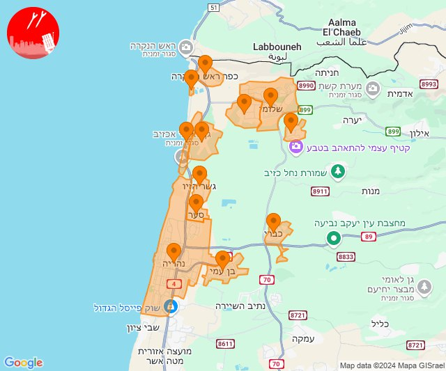

## 06:29

🔴 צבע אדום (21/11/2024):

08:29:
• עוטף עזה: כרם שלום (15 שניות)

צופר - צבע אדום

## 06:29

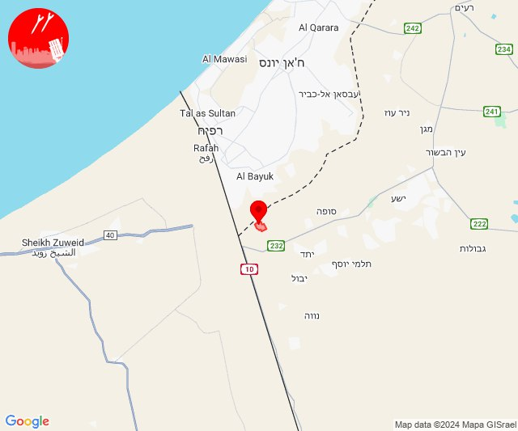

## 06:39

🔴 צבע אדום (21/11/2024):

08:38:
• קו העימות: מטולה, ע'ג'ר (מיידי)

08:39:
• קו העימות: כפר גלעדי, כפר יובל, מעיין ברוך, קריית שמונה, תל חי, מנרה (מיידי)

צופר - צבע אדום

## 06:39

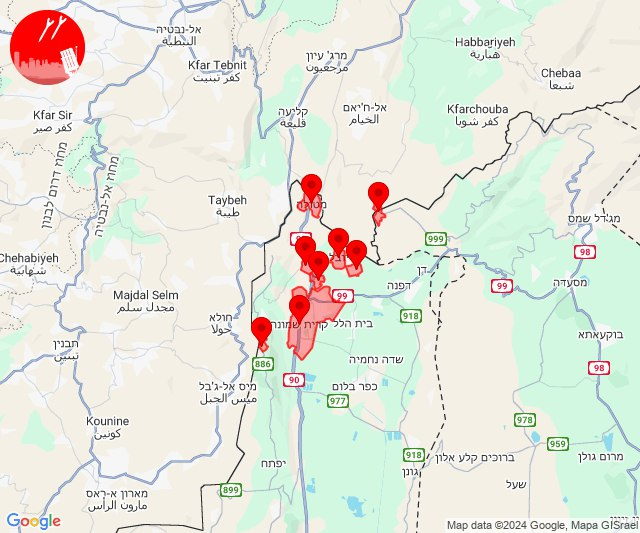

## 09:47

🔴 צבע אדום (21/11/2024):

11:46:
• קו העימות: גשר הזיו, נהריה, סער, איזור תעשייה מילואות צפון (מיידי, 15 שניות)

11:47:
• קו העימות: לימן, גשר הזיו, נהריה, סער (מיידי, 15 שניות)

צופר - צבע אדום

## 09:47

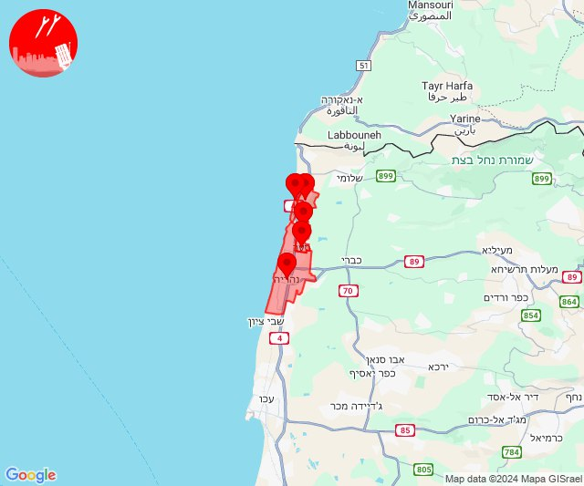

## 10:48

🔴 צבע אדום (21/11/2024):

12:48:
• קו העימות: קריית שמונה, בית הלל, תל חי, כפר יובל, מעיין ברוך (מיידי)

צופר - צבע אדום

## 10:48

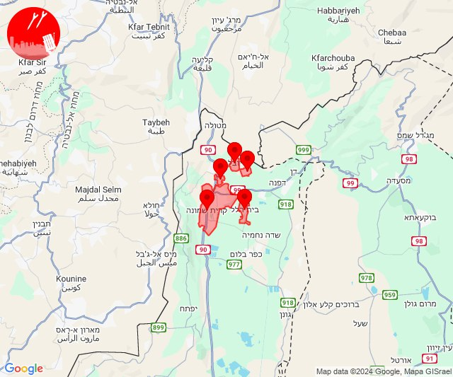

## 11:49

🔴 צבע אדום (21/11/2024):

13:48:
• קו העימות: נהריה, סער, גשר הזיו (15 שניות, מיידי)

13:49:
• קו העימות: איזור תעשייה מילואות צפון, נהריה, גשר הזיו, סער (מיידי, 15 שניות)

צופר - צבע אדום

## 11:49

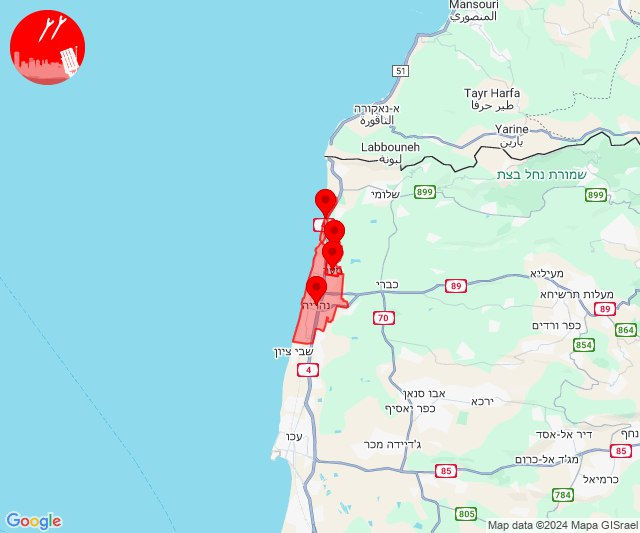

## 12:21

✈️ חדירת כלי טיס עוין (21/11/2024):

14:21:
• קו העימות: מרגליות 

צופר - צבע אדום

## 12:21

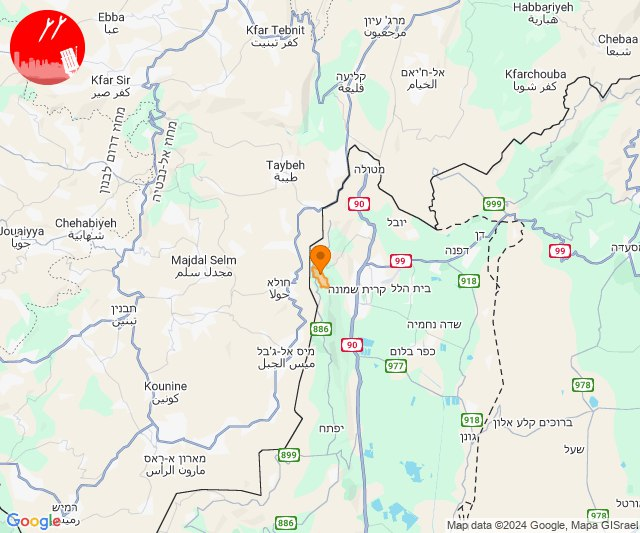

## 12:47

🔴 צבע אדום (21/11/2024):

14:46:
• קו העימות: לב החולה (מיידי)

14:47:
• קו העימות: מטולה (מיידי)

צופר - צבע אדום

## 12:47

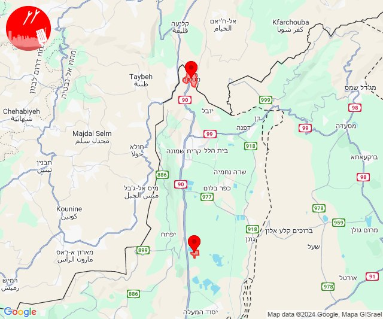

## 12:52

🔴 צבע אדום (21/11/2024):

14:51:
• גליל עליון: קדיתא (30 שניות)

14:52:
• קו העימות: דלתון (מיידי)
• גליל עליון: אור הגנוז, ביריה, קדיתא, ספסופה - כפר חושן (30 שניות)

צופר - צבע אדום

## 12:52

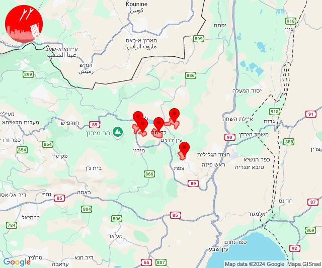

## 15:26

🔴 צבע אדום (21/11/2024):

17:26:
• קו העימות: מרגליות, קריית שמונה (מיידי)

צופר - צבע אדום

## 15:26

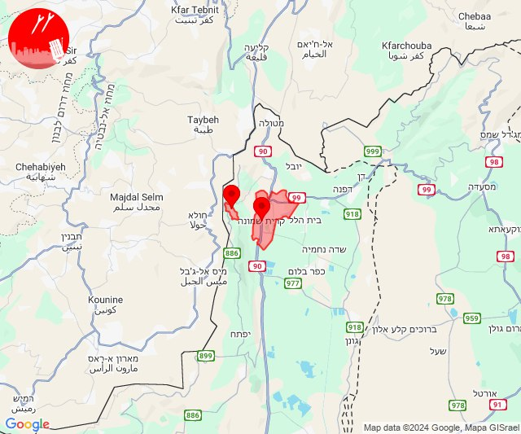

## 19:01

🔴 צבע אדום (21/11/2024):

21:01:
• יהודה: כפר אלדד, מיצד, מעלה עמוס, מעלה רחבעם, נוקדים, פני קדם, שדה בר, תקוע (דקה וחצי)
• ים המלח: עין גדי, מצוקי דרגות, מצפה שלם, מרחצאות עין גדי (דקה וחצי)

צופר - צבע אדום

## 19:01

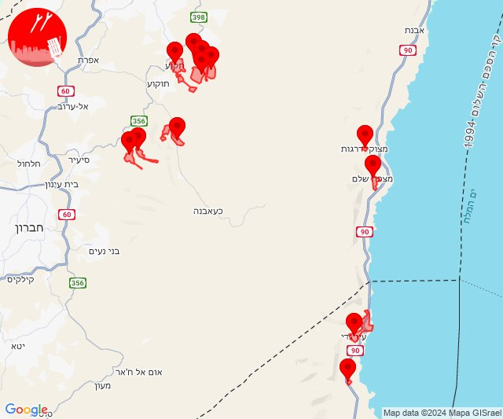

## 21:00

✈️ חדירת כלי טיס עוין (21/11/2024):

23:00:
• דרום הנגב: הר הנגב 

צופר - צבע אדום

## 21:01

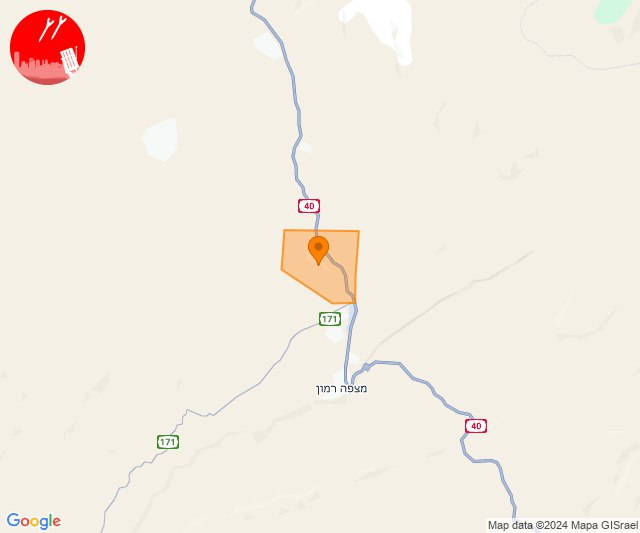

