# Alerts for 2024-11-22

## 00:09

🔴 צבע אדום (22/11/2024):

02:09:
• המפרץ: חיפה - מפרץ, חיפה - קריית חיים ושמואל, כפר ביאליק, קריית אתא, קריית ביאליק, קריית ים, קריית מוצקין, חיפה - נווה שאנן ורמות כרמל, נשר, כפר חסידים, חיפה - כרמל, הדר ועיר תחתית, אזור תעשייה קריית ביאליק (דקה)

צופר - צבע אדום

## 00:09

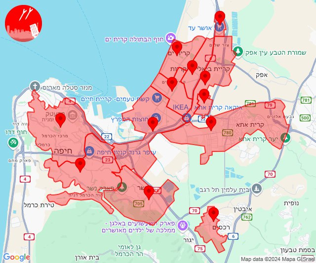

## 07:59

🔴 צבע אדום (22/11/2024):

09:59:
• קו העימות: מטולה (מיידי)

צופר - צבע אדום

## 07:59

## 10:40

✈️ חדירת כלי טיס עוין (22/11/2024):

12:40:
• קו העימות: מרגליות 

צופר - צבע אדום

## 10:40

🔴 צבע אדום (22/11/2024):

12:40:
• קו העימות: מטולה (מיידי)

צופר - צבע אדום

## 10:40

## 10:40

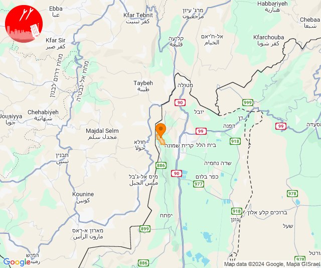

## 10:45

🔴 צבע אדום (22/11/2024):

12:45:
• קו העימות: שתולה (מיידי)

צופר - צבע אדום

## 10:45

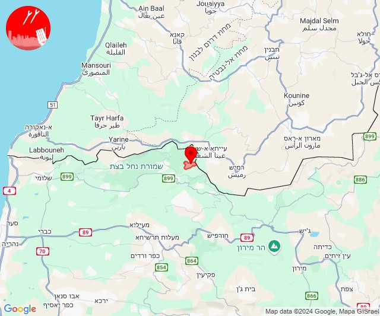

## 11:36

🔴 צבע אדום (22/11/2024):

13:36:
• קו העימות: זרעית, שומרה (מיידי)

צופר - צבע אדום

## 11:36

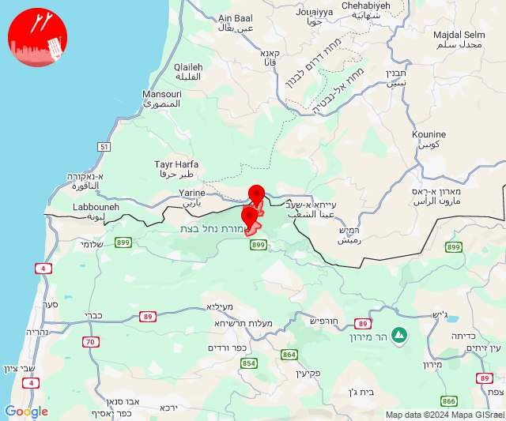

## 11:55

🔴 צבע אדום (22/11/2024):

13:55:
• קו העימות: מטולה (מיידי)

צופר - צבע אדום

## 11:55

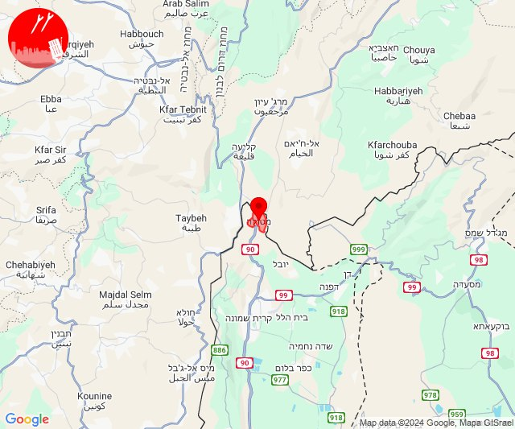

## 12:05

🔴 צבע אדום (22/11/2024):

14:05:
• גליל עליון: צפת - עיר, ביריה, קדיתא (30 שניות)
• קו העימות: אזור תעשייה רמת דלתון, דלתון (מיידי)

צופר - צבע אדום

## 12:05

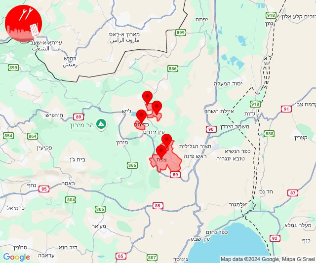

## 12:24

✈️ חדירת כלי טיס עוין (22/11/2024):

14:24:
• קו העימות: שניר 

צופר - צבע אדום

## 12:24

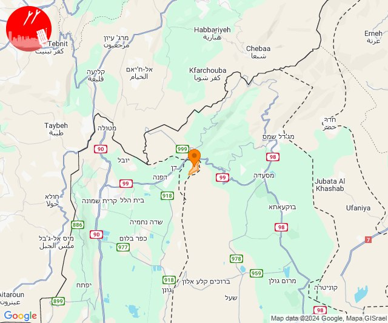

## 12:33

🔴 צבע אדום (22/11/2024):

14:32:
• קו העימות: קריית שמונה, תל חי, כפר גלעדי, כפר יובל, מטולה, בית הלל, מעיין ברוך (מיידי)

14:33:
• קו העימות: קריית שמונה, תל חי (מיידי)

צופר - צבע אדום

## 12:33

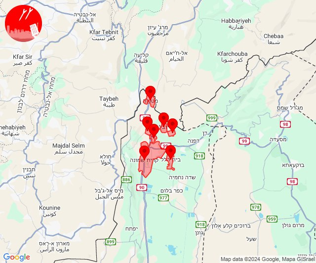

## 12:54

🔴 צבע אדום (22/11/2024):

14:54:
• קו העימות: יפתח, לב החולה, מרכז אזורי מבואות חרמון (מיידי)

צופר - צבע אדום

## 12:54

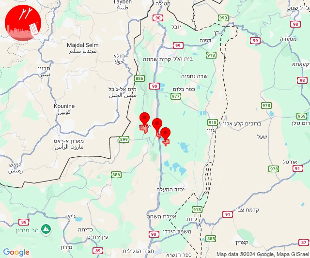

## 13:24

🔴 צבע אדום (22/11/2024):

15:24:
• גליל עליון: צפת - עיר, ביריה, קדיתא (30 שניות)
• קו העימות: דלתון (מיידי)

צופר - צבע אדום

## 13:24

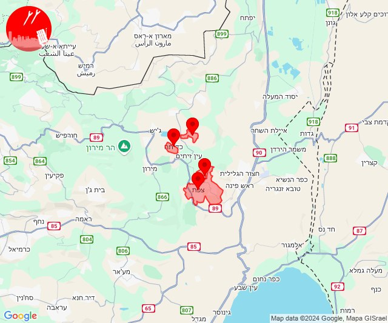

## 13:35

🔴 צבע אדום (22/11/2024):

15:35:
• מרכז הגליל: שפרעם, אעבלין, אזור תעשייה טמרה, טמרה (דקה)
• גליל עליון: אפק (דקה)
• המפרץ: קריית ביאליק (דקה)

צופר - צבע אדום

## 13:35

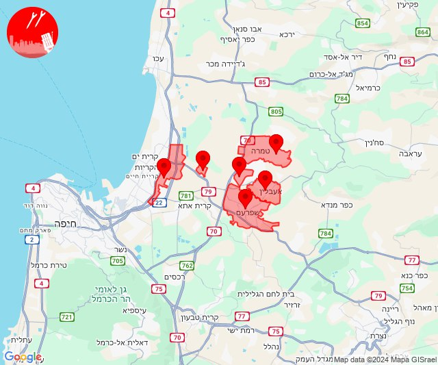

## 13:45

🔴 צבע אדום (22/11/2024):

15:45:
• קו העימות: אבן מנחם, זרעית, שומרה (מיידי)

צופר - צבע אדום

## 13:45

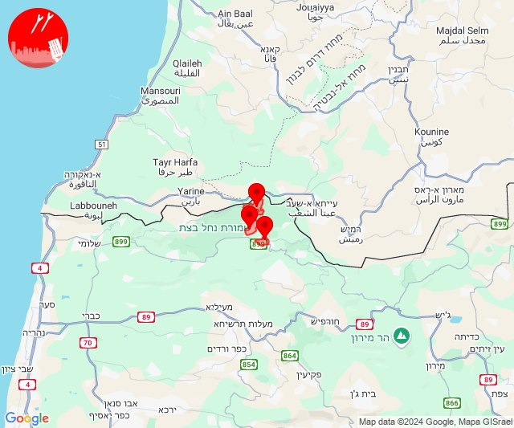

## 14:31

🔴 צבע אדום (22/11/2024):

16:30:
• קו העימות: נהריה, בן עמי, גשר הזיו, סער, איזור תעשייה מילואות צפון, לימן (15 שניות, מיידי)

16:31:
• קו העימות: עברון, נהריה (15 שניות)

צופר - צבע אדום

## 14:31

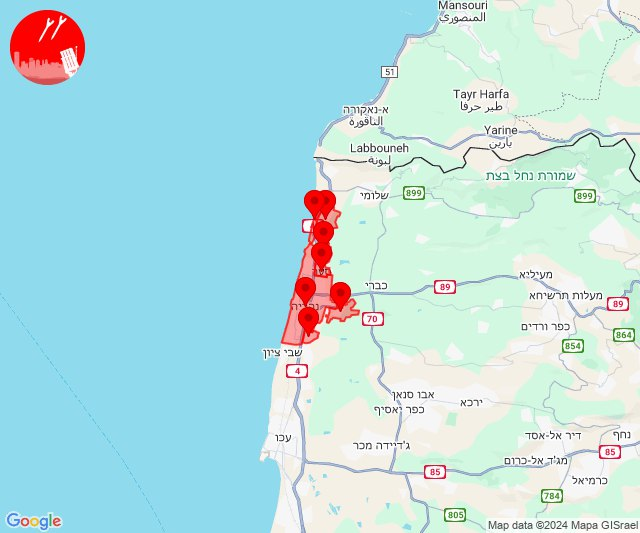

## 14:37

🔴 צבע אדום (22/11/2024):

16:34:
• המפרץ: חיפה - כרמל, הדר ועיר תחתית, חיפה - מערב, חיפה - נווה שאנן ורמות כרמל, החותרים, טירת כרמל, כפר גלים (דקה)

16:35:
• קו העימות: מעונה, מעיליא, מעלות תרשיחא, זרעית, אבירים (מיידי)

16:36:
• קו העימות: הילה, מעיליא, מעונה, גורן, גורנות הגליל (מיידי)

16:37:
• קו העימות: הילה, מעיליא (מיידי)

צופר - צבע אדום

## 14:37

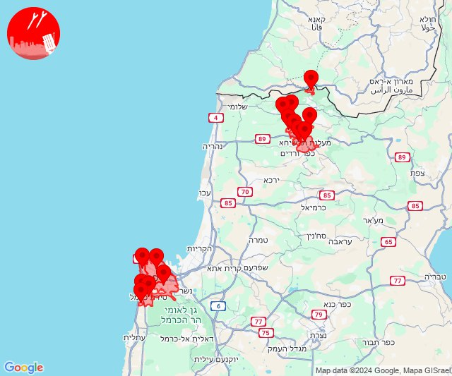

## 14:43

🔴 צבע אדום (22/11/2024):

16:43:
• קו העימות: מעונה, מעיליא, הילה, גורן, גורנות הגליל (מיידי)

צופר - צבע אדום

## 14:43

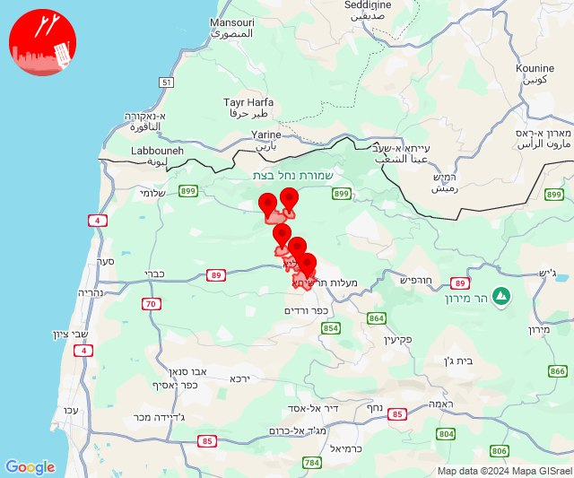

## 14:47

🔴 צבע אדום (22/11/2024):

16:46:
• גליל עליון: כליל, עמקה (30 שניות)

16:47:
• גליל עליון: שייח' דנון, אשרת, אבו סנאן, בית העמק, כליל, עמקה (30 שניות)
• קו העימות: נווה זיו (מיידי)

צופר - צבע אדום

## 14:47

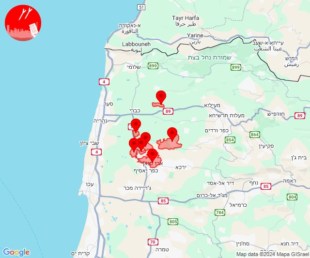

## 19:11

🔴 צבע אדום (22/11/2024):

21:10:
• קו העימות: בן עמי (מיידי)
• גליל עליון: בית העמק, אבו סנאן, אשרת, כפר יאסיף (30 שניות)

21:11:
• קו העימות: איזור תעשייה מילואות צפון, לימן (מיידי)

צופר - צבע אדום

## 19:11

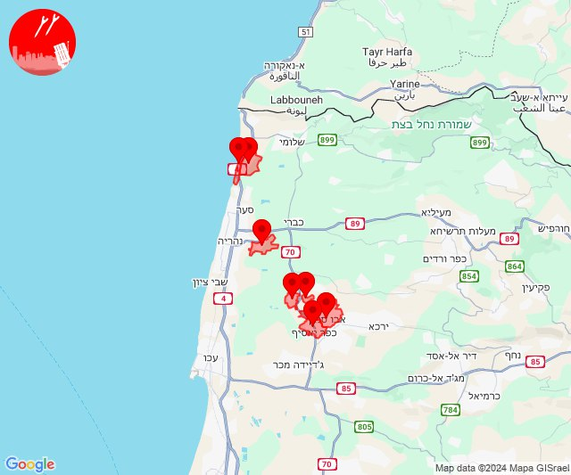

## 19:24

✈️ חדירת כלי טיס עוין (22/11/2024):

21:01:
• קו העימות: חניתה, שלומי 

21:02:
• קו העימות: יערה, מצובה 

21:03:
• קו העימות: עבדון, חניתה, שלומי 

21:04:
• קו העימות: בצת, שלומי, לימן, ראש הנקרה, איזור תעשייה מילואות צפון 

21:05:
• קו העימות: חוף בצת, מצובה, בצת, גשר הזיו, לימן, איזור תעשייה מילואות צפון 

21:06:
• קו העימות: נהריה, סער 

21:07:
• קו העימות: גשר הזיו, נהריה, סער, בן עמי 

21:08:
• קו העימות: נהריה, בית העלמין החדש נהריה, כברי, בן עמי 
• גליל עליון: נתיב השיירה, שייח' דנון, בית העמק, אשרת, עמקה 

21:09:
• קו העימות: עברון, נהריה 
• גליל עליון: מזרעה, רגבה, שבי ציון 

21:11:
• גליל עליון: שבי ציון, רגבה, לוחמי הגטאות, מזרעה, בוסתן הגליל, שומרת, עכו 

21:12:
• גליל עליון: לוחמי הגטאות, רגבה 

21:13:
• גליל עליון: לוחמי הגטאות 

21:18:
• המפרץ: קריית ביאליק, קריית מוצקין 

21:19:
• המפרץ: כפר ביאליק, קריית אתא 

21:22:
• המפרץ: כפר חסידים, רכסים 

21:23:
• המפרץ: יגור 

21:24:
• הכרמל: בית סוהר קישון 

צופר - צבע אדום

## 19:24

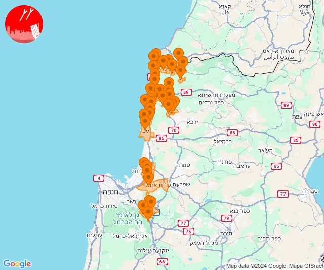

## 19:34

✈️ חדירת כלי טיס עוין (22/11/2024):

21:33:
• קו העימות: איזור תעשייה מילואות צפון, לימן 

21:34:
• קו העימות: גשר הזיו, נהריה, איזור תעשייה מילואות צפון 

צופר - צבע אדום

## 19:35

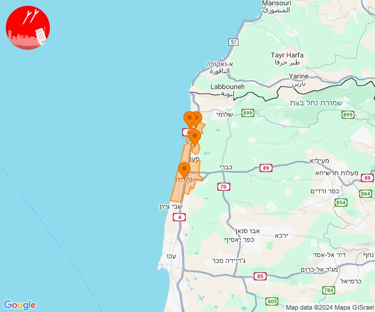

## 20:40

🔴 צבע אדום (22/11/2024):

22:40:
• קו העימות: חוף בצת, ראש הנקרה (מיידי)

צופר - צבע אדום

## 20:40

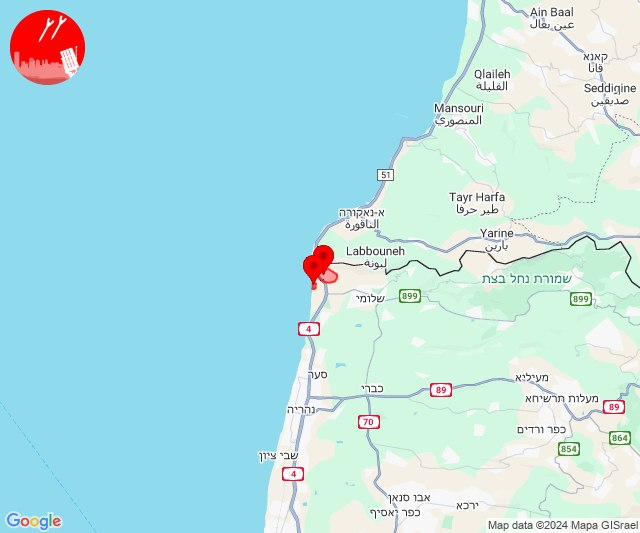

## 20:51

🔴 צבע אדום (22/11/2024):

22:51:
• עוטף עזה: נתיב העשרה (15 שניות)

צופר - צבע אדום

## 20:51

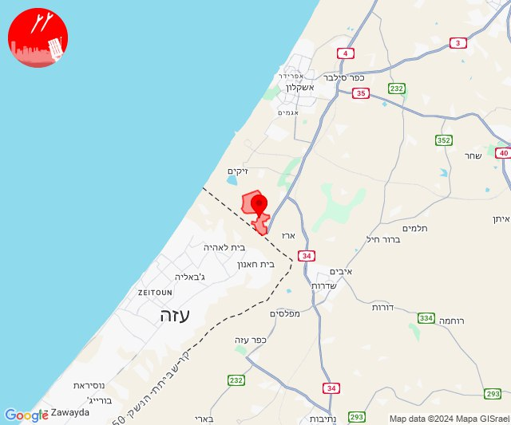

## 22:06

🔴 צבע אדום (23/11/2024):

00:06:
• קו העימות: קריית שמונה, מרגליות, כפר גלעדי, משגב עם, תל חי, מטולה (מיידי)

צופר - צבע אדום

## 22:06

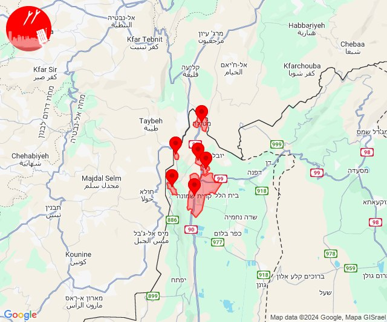

