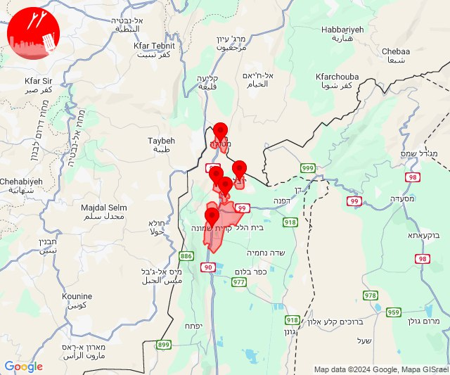
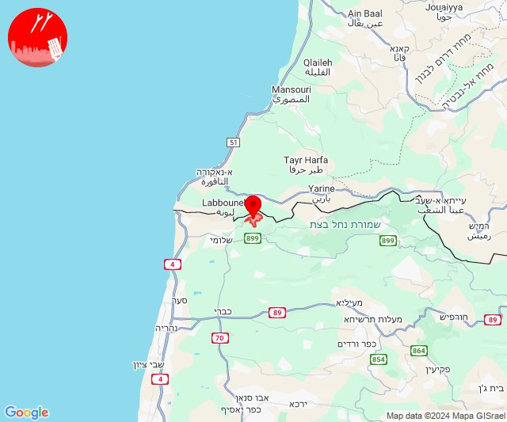

# Alerts for 2024-11-23

## 02:19

🔴 צבע אדום (23/11/2024):

04:18:
• המפרץ: חיפה - מפרץ, קריית אתא, חיפה - קריית חיים ושמואל, קריית ביאליק (דקה)

04:19:
• המפרץ: נשר, כפר ביאליק, קריית מוצקין, אושה, כפר המכבי, כפר חסידים, רכסים, רמת יוחנן, יגור, קריית ים, אזור תעשייה קריית ביאליק (דקה)
• הכרמל: עספיא (דקה)

צופר - צבע אדום

## 02:19

## 08:18

🔴 צבע אדום (23/11/2024):

10:18:
• קו העימות: מטולה (מיידי)

צופר - צבע אדום

## 08:20

## 09:07

🔴 צבע אדום (23/11/2024):

11:06:
• קו העימות: חניתה, שלומי, ערב אל עראמשה, אדמית, יערה (מיידי)

11:07:
• קו העימות: חניתה (מיידי)

צופר - צבע אדום

## 09:08

## 09:11

🔴 צבע אדום (23/11/2024):

11:09:
• קו העימות: מטולה, ע'ג'ר (מיידי)

צופר - צבע אדום

## 09:11

## 10:21

🔴 צבע אדום (23/11/2024):

12:21:
• גליל עליון: אזור תעשייה חצור הגלילית, חצור הגלילית (30 שניות)

צופר - צבע אדום

## 10:21

## 11:55

🔴 צבע אדום (23/11/2024):

13:55:
• קו העימות: קריית שמונה, מנרה, מרגליות (מיידי)

צופר - צבע אדום

## 11:55

## 11:58

🔴 צבע אדום (23/11/2024):

13:58:
• עוטף עזה: כיסופים, עין השלושה (15 שניות)

צופר - צבע אדום

## 11:58

## 13:07

🔴 צבע אדום (23/11/2024):

15:07:
• קו העימות: מלכיה (מיידי)

צופר - צבע אדום

## 13:07

## 13:31

🔴 צבע אדום (23/11/2024):

15:31:
• גליל עליון: ביריה, צפת - עיר, חצור הגלילית, ראש פינה, קדיתא (30 שניות)
• קו העימות: אזור תעשייה רמת דלתון, דלתון (מיידי)

צופר - צבע אדום

## 13:31

## 14:18

🔴 צבע אדום (23/11/2024):

16:18:
• קו העימות: תל חי, כפר גלעדי, מטולה, קריית שמונה, כפר יובל (מיידי)

צופר - צבע אדום

## 14:18

## 14:36

✈️ חדירת כלי טיס עוין (23/11/2024):

16:36:
• קו העימות: מרגליות 

צופר - צבע אדום

## 14:36

## 15:09

🔴 צבע אדום (23/11/2024):

17:09:
• קו העימות: חניתה (מיידי)

צופר - צבע אדום

## 15:09

## 15:10

✈️ חדירת כלי טיס עוין (23/11/2024):

17:08:
• קו העימות: יערה, מצובה, שלומי 

17:09:
• קו העימות: יערה, עבדון 

17:10:
• קו העימות: מצובה, שלומי, בצת, חניתה, יערה 

צופר - צבע אדום

## 15:10

## 15:31

🔴 צבע אדום (23/11/2024):

17:31:
• קו העימות: מנרה (מיידי)

צופר - צבע אדום

## 15:31

## 16:40

✈️ חדירת כלי טיס עוין (23/11/2024):

18:40:
• קו העימות: גשר הזיו, נהריה, סער 

צופר - צבע אדום

## 16:40

## 19:53

🔴 צבע אדום (23/11/2024):

21:53:
• גליל עליון: יסוד המעלה, מלון אחוזת ירדן (30 שניות)

צופר - צבע אדום

## 19:53

## 21:36

🔴 צבע אדום (23/11/2024):

23:36:
• קו העימות: מטולה (מיידי)

צופר - צבע אדום

## 21:36

## 22:10

🔴 צבע אדום (24/11/2024):

00:10:
• קו העימות: כפר בלום, עמיר, בית הלל, שדה נחמיה, כפר גלעדי, כפר יובל, מעיין ברוך, קריית שמונה, תל חי, הגושרים (מיידי, 15 שניות)

צופר - צבע אדום

## 22:10

