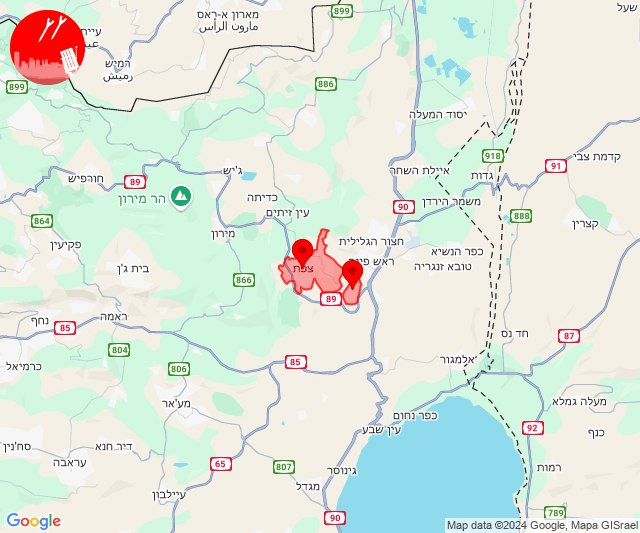
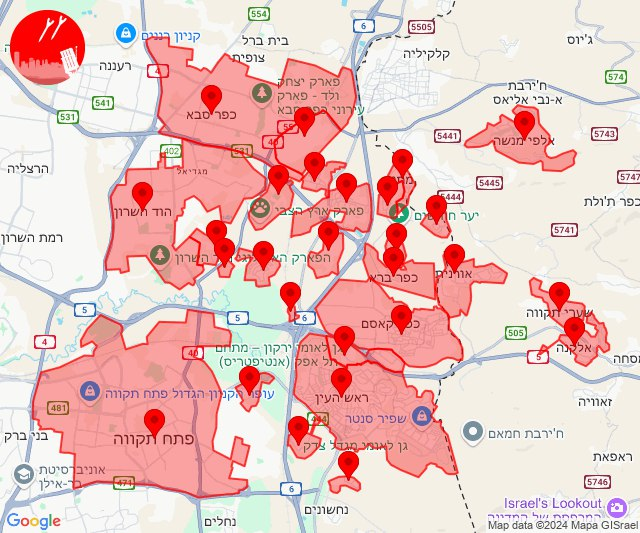

# Alerts for 2024-11-24

## 04:17

🔴 צבע אדום (24/11/2024):

06:17:
• גליל עליון: כליל (30 שניות)

צופר - צבע אדום

## 04:17

## 04:19

🔴 צבע אדום (24/11/2024):

06:19:
• קו העימות: ערב אל עראמשה (מיידי)

צופר - צבע אדום

## 04:19

## 04:29

✈️ חדירת כלי טיס עוין (24/11/2024):

06:15:
• קו העימות: ערב אל עראמשה 

06:16:
• קו העימות: ערב אל עראמשה 

06:17:
• קו העימות: ראש הנקרה, ערב אל עראמשה, חוף בצת 

06:18:
• קו העימות: איזור תעשייה מילואות צפון, לימן 

06:19:
• קו העימות: גשר הזיו, גורן 

06:20:
• קו העימות: גורנות הגליל, ערב אל עראמשה 

06:22:
• קו העימות: זרעית, שומרה 

06:23:
• גליל עליון: ינוח ג'ת 

06:25:
• קו העימות: הילה, מעיליא, גורן, אבן מנחם, גורנות הגליל, שומרה 
• גליל עליון: ינוח ג'ת, ירכא 

06:26:
• קו העימות: עין יעקב, כפר ורדים 
• גליל עליון: פלך 

06:27:
• קו העימות: כפר ורדים 
• גליל עליון: ינוח ג'ת, מג'דל כרום 

06:28:
• גליל עליון: צורית גילון 

06:29:
• גליל עליון: גיתה, צורית גילון, לפידות 
• מרכז הגליל: שעב 

צופר - צבע אדום

## 04:29

## 04:47

🔴 צבע אדום (24/11/2024):

06:47:
• קו העימות: חורפיש, אלקוש, חורפיש (מיידי)

צופר - צבע אדום

## 04:48

## 04:55

🔴 צבע אדום (24/11/2024):

06:55:
• קו העימות: גורן, גורנות הגליל (מיידי)

צופר - צבע אדום

## 04:55

## 04:56

✈️ חדירת כלי טיס עוין (24/11/2024):

06:52:
• קו העימות: ערב אל עראמשה 

06:54:
• קו העימות: גשר הזיו 

06:56:
• קו העימות: גורן, גורנות הגליל 

צופר - צבע אדום

## 04:56

## 05:16

🔴 צבע אדום (24/11/2024):

07:16:
• קו העימות: אדמית, ערב אל עראמשה (מיידי)

צופר - צבע אדום

## 05:16

## 05:28

🔴 צבע אדום (24/11/2024):

07:27:
• מנשה: חדרה - מזרח, חדרה - מרכז, אזור תעשייה קיסריה, גן שמואל, פרדס חנה כרכור, מתחם שביל התפוזים (דקה וחצי)
• שרון: נתניה - מזרח, נתניה - מערב, אבן יהודה, אודים, בית יהושע, געש, יקום, כפר נטר, מכון וינגייט, תל יצחק, רעננה, בני ציון, חרוצים, רשפון, מתחם "חנה וסע" שפיים, בני דרור, קדימה צורן, צור משה, פרדסיה, כפר יונה, ארסוף, שפיים (דקה וחצי)
• דן: הרצליה - מערב, הרצליה - מרכז וגליל ים, כפר שמריהו (דקה וחצי)

07:28:
• מנשה: אביאל, גבעת עדה, עמיקם, אלוני יצחק, אזור תעשייה רגבים, משמרות (דקה וחצי)
• שרון: אביחיל, כפר ידידיה, כפר מונש, בית יצחק - שער חפר, נורדיה, הדר עם, אזור תעשייה כפר יונה, גנות הדר, המרכז האקדמי רופין, כפר חיים, בית הלוי, המעפיל, העוגן, חניאל, עין החורש, גבעת חיים מאוחד, חגלה, בורגתה (דקה וחצי)

צופר - צבע אדום

## 05:28

## 06:04

🔴 צבע אדום (24/11/2024):

08:04:
• קו העימות: קריית שמונה, מרגליות (מיידי)

צופר - צבע אדום

## 06:04

## 06:08

🔴 צבע אדום (24/11/2024):

08:07:
• קו העימות: קריית שמונה (מיידי)

08:08:
• קו העימות: בית הלל, תל חי (מיידי)

צופר - צבע אדום

## 06:08

## 06:12

🔴 צבע אדום (24/11/2024):

08:12:
• גליל עליון: צפת - נוף כנרת, צפת - עיר (30 שניות)

צופר - צבע אדום

## 06:12

## 06:45

🔴 צבע אדום (24/11/2024):

08:43:
• קו העימות: מעונה, מעלות תרשיחא, מעיליא, אבן מנחם, שומרה (מיידי)

08:44:
• קו העימות: כפר ורדים, אבירים, זרעית, שתולה, חוסן, גורנות הגליל, הילה, פסוטה, שומרה, אבן מנחם, מעונה, מעלות תרשיחא, מעיליא, כפר ורדים, אבירים (15 שניות, מיידי)
• גליל עליון: ינוח ג'ת, מגדל תפן (30 שניות)

08:45:
• קו העימות: מעלות תרשיחא (מיידי)

צופר - צבע אדום

## 06:45

## 06:57

🔴 צבע אדום (24/11/2024):

08:57:
• קו העימות: מטולה (מיידי)

צופר - צבע אדום

## 06:57

## 07:34

🔴 צבע אדום (24/11/2024):

09:34:
• קו העימות: מטולה (מיידי)

צופר - צבע אדום

## 07:34

## 07:59

🔴 צבע אדום (24/11/2024):

09:59:
• קו העימות: קריית שמונה, נאות מרדכי, מרגליות, כפר בלום, נאות מרדכי, קריית שמונה (מיידי)

צופר - צבע אדום

## 07:59

## 08:06

🔴 צבע אדום (24/11/2024):

10:06:
• קו העימות: צבעון, דוב''ב (מיידי)
• גליל עליון: מירון (30 שניות)

צופר - צבע אדום

## 08:06

## 08:11

🔴 צבע אדום (24/11/2024):

10:09:
• קו העימות: מטולה, מטולה (מיידי)

10:11:
• קו העימות: מטולה (מיידי)

צופר - צבע אדום

## 08:11

## 08:15

🔴 צבע אדום (24/11/2024):

10:14:
• קו העימות: מטולה (מיידי)

10:15:
• קו העימות: מטולה (מיידי)

צופר - צבע אדום

## 08:15

## 08:49

🔴 צבע אדום (24/11/2024):

10:49:
• קו העימות: ראש הנקרה, חוף בצת, איזור תעשייה מילואות צפון, בצת, לימן, שלומי (מיידי)

צופר - צבע אדום

## 08:49

## 08:52

🔴 צבע אדום (24/11/2024):

10:52:
• קו העימות: נאות מרדכי (מיידי)

צופר - צבע אדום

## 08:52

## 09:18

🔴 צבע אדום (24/11/2024):

11:18:
• קו העימות: ערב אל עראמשה, אדמית (מיידי)

צופר - צבע אדום

## 09:18

## 09:31

🔴 צבע אדום (24/11/2024):

11:30:
• קו העימות: מנרה (מיידי)

11:31:
• קו העימות: קריית שמונה (מיידי)

צופר - צבע אדום

## 09:32

## 09:46

🔴 צבע אדום (24/11/2024):

11:46:
• גליל עליון: ספסופה - כפר חושן, אור הגנוז (30 שניות)
• קו העימות: ג'ש - גוש חלב, צבעון, ברעם, דוב''ב (מיידי)

צופר - צבע אדום

## 09:46

## 10:11

🔴 צבע אדום (24/11/2024):

12:11:
• קו העימות: עלמה, אזור תעשייה רמת דלתון, דלתון, כרם בן זמרה, ריחאנייה, דישון, מלכיה (מיידי)
• גליל עליון: ביריה, צפת - עיר, צפת - נוף כנרת, ראש פינה, חצור הגלילית, עמוקה, אליפלט, עמיעד (30 שניות)

צופר - צבע אדום

## 10:11

## 10:50

🔴 צבע אדום (24/11/2024):

12:50:
• קו העימות: יראון (מיידי)

צופר - צבע אדום

## 10:50

## 10:54

🔴 צבע אדום (24/11/2024):

12:52:
• דן: גבעת השלושה, כפר סירקין, פתח תקווה, גת רימון, מגשימים, מעש, יהוד מונוסון, סביון, גני תקווה, תל אביב - עבר הירקון, בני ברק, גבעת שמואל, קריית אונו, רמת גן - מערב, בית עלמין מורשה (דקה וחצי)
• שרון: נווה ירק, תחנת רכבת ראש העין, הוד השרון, ירקונה (דקה וחצי)
• ירקון: ראש העין, בארות יצחק, נחלים, בני עטרות, גבעת כ''ח, מזור, נופך, רינתיה, טירת יהודה, אלעד (דקה וחצי)

12:53:
• שרון: ירחיב, מתן, נווה ימין, צופית, חגור, ג'לג'וליה, אלישמע, כפר סבא, שדי חמד, גני עם, כפר ברא, כפר קאסם, עדנים, מרכז אזורי דרום השרון, גבעת חן, כפר מל''ל, רמות השבים (דקה וחצי)
• ירקון: אזור תעשייה אפק ולב הארץ (דקה וחצי)
• דן: הרצליה - מרכז וגליל ים, רמת השרון (דקה וחצי)

12:54:
• שרון: רעננה (דקה וחצי)

צופר - צבע אדום

## 10:54

## 11:01

🔴 צבע אדום (24/11/2024):

13:00:
• קו העימות: גשר הזיו, נהריה, סער, איזור תעשייה מילואות צפון, בצת, לימן, מצובה, ראש הנקרה, שלומי, חוף בצת, בן עמי, עברון (מיידי, 15 שניות)
• גליל עליון: מזרעה, רגבה (30 שניות)

13:01:
• קו העימות: גשר הזיו, נהריה (מיידי, 15 שניות)
• גליל עליון: שומרת, לוחמי הגטאות (30 שניות)

צופר - צבע אדום

## 11:01

## 11:04

🔴 צבע אדום (24/11/2024):

13:03:
• קו העימות: סער, גשר הזיו, נהריה, איזור תעשייה מילואות צפון, בצת, חוף בצת, לימן, מצובה, ראש הנקרה, שלומי, בן עמי (מיידי, 15 שניות)
• המפרץ: חיפה - כרמל, הדר ועיר תחתית, חיפה - נווה שאנן ורמות כרמל, חיפה - מערב (דקה)

13:04:
• גליל עליון: אבו סנאן, כליל, עמקה, אשרת, ירכא, כפר יאסיף (30 שניות)
• קו העימות: געתון, יחיעם, עין יעקב, נהריה, כברי, סער, גשר הזיו, נווה זיו, לימן, מצובה, שלומי, בית העלמין החדש נהריה (15 שניות, מיידי, 30 שניות)
• הכרמל: מגדים (דקה)
• המפרץ: החותרים, טירת כרמל, חיפה - מפרץ, חיפה - קריית חיים ושמואל, נשר (דקה)

צופר - צבע אדום

## 11:04

## 11:08

🔴 צבע אדום (24/11/2024):

13:08:
• קו העימות: אביבים (מיידי)

צופר - צבע אדום

## 11:08

## 11:10

🔴 צבע אדום (24/11/2024):

13:10:
• קו העימות: יראון (מיידי)

צופר - צבע אדום

## 11:10

## 11:14

🔴 צבע אדום (24/11/2024):

13:14:
• קו העימות: מנרה (מיידי)

צופר - צבע אדום

## 11:14

## 11:27

🔴 צבע אדום (24/11/2024):

13:27:
• קו העימות: ע'ג'ר (מיידי)

צופר - צבע אדום

## 11:27

## 11:37

🔴 צבע אדום (24/11/2024):

13:37:
• קו העימות: דישון (מיידי)

צופר - צבע אדום

## 11:37

## 11:46

🔴 צבע אדום (24/11/2024):

13:44:
• קו העימות: כפר בלום, נאות מרדכי (מיידי)

13:45:
• קו העימות: עמיר, שדה נחמיה, קריית שמונה, כפר בלום, נאות מרדכי, עמיר, קריית שמונה, להבות הבשן, שדה נחמיה (15 שניות, מיידי)

13:46:
• צפון הגולן: מג'דל שמס (מיידי)

צופר - צבע אדום

## 11:46

## 12:12

🔴 צבע אדום (24/11/2024):

14:12:
• קו העימות: ברעם (מיידי)

צופר - צבע אדום

## 12:12

## 12:24

🔴 צבע אדום (24/11/2024):

14:23:
• גליל עליון: מירון (30 שניות)

14:24:
• גליל עליון: כפר שמאי, ספסופה - כפר חושן, שפר, אמירים, אור הגנוז, מרכז אזורי מרום גליל, בר יוחאי, קדיתא, מירון, כפר שמאי (30 שניות)
• קו העימות: ברעם, ג'ש - גוש חלב, דוב''ב, כרם בן זמרה, צבעון (מיידי)

צופר - צבע אדום

## 12:24

## 12:33

🔴 צבע אדום (24/11/2024):

14:32:
• גליל תחתון: מגדל, כפר זיתים, ארבל, ואדי אל חמאם (דקה)

14:33:
• גליל תחתון: גינוסר, רביד, לבנים (דקה)

צופר - צבע אדום

## 12:33

## 12:37

🔴 צבע אדום (24/11/2024):

14:37:
• קו העימות: מעיליא, כפר ורדים, מעלות תרשיחא, מעונה, אבן מנחם, שתולה, פסוטה, שומרה, נטועה, אבירים, אלקוש (מיידי, 15 שניות)
• גליל עליון: ינוח ג'ת (30 שניות)

צופר - צבע אדום

## 12:37

## 12:55

🔴 צבע אדום (24/11/2024):

14:54:
• קו העימות: פסוטה, שתולה (מיידי)

14:55:
• קו העימות: נטועה, אבן מנחם (מיידי)

צופר - צבע אדום

## 12:55

## 12:58

🔴 צבע אדום (24/11/2024):

14:58:
• קו העימות: צבעון, סאסא, דוב''ב, בית ספר שדה מירון (מיידי)

צופר - צבע אדום

## 12:58

## 13:32

🔴 צבע אדום (24/11/2024):

15:31:
• המפרץ: קריית ים, קריית ביאליק, קריית מוצקין, אזור תעשייה קריית ביאליק (דקה)
• גליל עליון: אזור תעשייה שער נעמן (דקה)

15:32:
• קו העימות: כברי (מיידי)
• גליל עליון: בית העלמין החדש עכו, כפר מסריק, עכו - אזור תעשייה, ג'דידה מכר, עין המפרץ, עכו (30 שניות)

צופר - צבע אדום

## 13:32

## 13:35

🔴 צבע אדום (24/11/2024):

15:34:
• קו העימות: הגושרים, שאר ישוב, דפנה, קיבוץ דן (מיידי)

15:35:
• גליל עליון: צפת - עכברה, ביריה, צפת - עיר, אור הגנוז, בר יוחאי, ספסופה - כפר חושן, קדיתא (30 שניות)
• קו העימות: אזור תעשייה רמת דלתון, ג'ש - גוש חלב, דלתון, כרם בן זמרה (מיידי)

צופר - צבע אדום

## 13:35

## 13:44

🔴 צבע אדום (24/11/2024):

15:44:
• קו העימות: אבן מנחם, זרעית, שתולה, שומרה (מיידי)

צופר - צבע אדום

## 13:44

## 14:29

🔴 צבע אדום (24/11/2024):

16:27:
• קו העימות: נהריה (15 שניות)

16:28:
• גליל עליון: אזור תעשייה שער נעמן, עכו - אזור תעשייה, כפר מסריק, עין המפרץ, עכו (דקה, 30 שניות)
• קו העימות: גשר הזיו, סער, איזור תעשייה מילואות צפון (מיידי)

16:29:
• קו העימות: עלמה (מיידי)

צופר - צבע אדום

## 14:29

## 14:32

🔴 צבע אדום (24/11/2024):

16:32:
• קו העימות: גשר הזיו, נהריה, סער, איזור תעשייה מילואות צפון, לימן, בצת, שלומי (מיידי, 15 שניות)

צופר - צבע אדום

## 14:32

## 14:45

🔴 צבע אדום (24/11/2024):

16:45:
• קו העימות: דלתון, ריחאנייה (מיידי)

צופר - צבע אדום

## 14:45

## 14:47

🔴 צבע אדום (24/11/2024):

16:47:
• גליל עליון: יסוד המעלה, חולתה (30 שניות)

צופר - צבע אדום

## 14:47

## 16:12

🔴 צבע אדום (24/11/2024):

18:09:
• מרכז הגליל: אזור תעשייה טמרה, אעבלין, טמרה, כאבול, מצפה אבי''ב, שפרעם, ביר אלמכסור, דמיידה, יעד, כאוכב אבו אלהיג'א, כפר מנדא, מורשת, מנוף, מרכז אזורי משגב, עצמון - שגב, קורנית, רקפת, שכניה (דקה)
• העמקים: עדי (דקה)
• המפרץ: קריית אתא (דקה)
• קו העימות: שומרה, זרעית, אבן מנחם (מיידי)

18:10:
• שרון: טייבה, קלנסווה, שער אפרים, בארותיים, בחן, בת חפר, גן יאשיה, זמר, יד חנה, ניצני עוז, עולש, תנובות (דקה וחצי)
• שומרון: אבני חפץ (דקה וחצי)

18:11:
• מנשה: תלמי אלעזר (דקה וחצי)
• המפרץ: נשר (דקה)
• הכרמל: בית אורן, גבעת וולפסון, דלית אל כרמל, עספיא, כלא דמון (דקה)

18:12:
• המפרץ: אושה, חיפה - קריית חיים ושמואל, כפר ביאליק, קריית אתא, קריית ביאליק, קריית ים, קריית מוצקין, רמת יוחנן, אזור תעשייה קריית ביאליק (דקה)
• גליל עליון: אזור תעשייה שער נעמן, אפק, יסעור, כפר מסריק, עכו - אזור תעשייה, עין המפרץ, בית העלמין החדש עכו (דקה, 30 שניות)
• מרכז הגליל: אזור תעשייה טמרה, אעבלין, טמרה, שפרעם (דקה)

צופר - צבע אדום

## 16:12

## 16:31

🔴 צבע אדום (24/11/2024):

18:31:
• דן: גבעת השלושה, פתח תקווה (דקה וחצי)
• שרון: אורנית, אלישמע, ג'לג'וליה, הוד השרון, חגור, חורשים, ירחיב, כפר ברא, כפר סבא, כפר קאסם, מתן, נווה ימין, נווה ירק, נירית, עדנים, שדי חמד, תחנת רכבת ראש העין, אלפי מנשה, אלקנה, שערי תקווה, מרכז אזורי דרום השרון (דקה וחצי)
• ירקון: עינת, ראש העין, תעשיון חצב, אזור תעשייה אפק ולב הארץ (דקה וחצי)

צופר - צבע אדום

## 16:31

## 16:41

🔴 צבע אדום (24/11/2024):

18:41:
• קו העימות: משגב עם (מיידי)

צופר - צבע אדום

## 16:41

## 16:47

🔴 צבע אדום (24/11/2024):

18:47:
• שרון: גאולים, קלנסווה, אזור תעשייה כפר יונה, אחיטוב, אליכין, אלישיב, אמץ, בארותיים, בורגתה, בחן, בית הלוי, בית חזון, בית יצחק - שער חפר, בת חפר, גאולי תימן, גבעת חיים איחוד, גבעת חיים מאוחד, גן יאשיה, גנות הדר, הדר עם, המעפיל, המרכז האקדמי רופין, העוגן, חגלה, חיבת ציון, חניאל, חרב לאת, יד חנה, ינוב, כפר הרא''ה, כפר חיים, כפר ידידיה, כפר יונה, כפר מונש, מעברות, משמר השרון, עולש, עין החורש, תנובות (דקה וחצי)
• מנשה: חדרה - מזרח, להבות חביבה, שדה יצחק (דקה וחצי)

צופר - צבע אדום

## 16:47

## 18:03

🔴 צבע אדום (24/11/2024):

20:03:
• קו העימות: אביבים (מיידי)

צופר - צבע אדום

## 18:03

## 18:11

🔴 צבע אדום (24/11/2024):

20:11:
• קו העימות: יראון (מיידי)

צופר - צבע אדום

## 18:11

