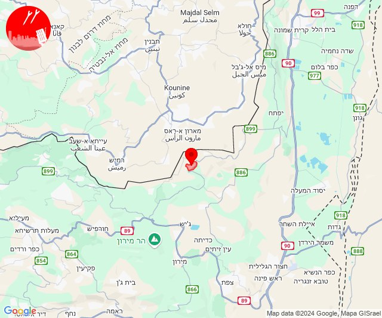

# Alerts for 2024-11-25

## 06:35

🔴 צבע אדום (25/11/2024):

08:35:
• קו העימות: נהריה, עברון, בן עמי, גשר הזיו, סער, בצת, יערה, לימן, מצובה, עבדון, שלומי, איזור תעשייה מילואות צפון, כברי, נווה זיו, גשר הזיו, נהריה, סער (15 שניות, מיידי)
• גליל עליון: מזרעה, רגבה, שבי ציון, נס עמים, נתיב השיירה (30 שניות)

צופר - צבע אדום

## 06:35

## 07:08

🔴 צבע אדום (25/11/2024):

09:08:
• קו העימות: מנרה, קריית שמונה (מיידי)

צופר - צבע אדום

## 07:08

## 07:13

🔴 צבע אדום (25/11/2024):

09:13:
• קו העימות: אביבים, יראון (מיידי)

צופר - צבע אדום

## 07:13

## 08:09

✈️ חדירת כלי טיס עוין (25/11/2024):

10:07:
• קו העימות: שלומי, בצת, ראש הנקרה, גשר הזיו 

10:09:
• קו העימות: גשר הזיו, נהריה 

צופר - צבע אדום

## 08:09

## 08:09

🔴 צבע אדום (25/11/2024):

10:07:
• קו העימות: איזור תעשייה מילואות צפון, חוף בצת, לימן (מיידי)

10:08:
• קו העימות: איזור תעשייה מילואות צפון, בצת, חוף בצת, לימן, ראש הנקרה, שלומי (מיידי)

10:09:
• קו העימות: איזור תעשייה מילואות צפון, לימן (מיידי)

צופר - צבע אדום

## 08:09

## 09:26

🔴 צבע אדום (25/11/2024):

11:23:
• קו העימות: מטולה, כפר יובל (מיידי)

11:24:
• קו העימות: מטולה (מיידי)

11:25:
• קו העימות: מטולה (מיידי)

11:26:
• קו העימות: מטולה (מיידי)

צופר - צבע אדום

## 09:26

## 09:31

🔴 צבע אדום (25/11/2024):

11:31:
• עוטף עזה: כפר עזה (15 שניות)

צופר - צבע אדום

## 09:31

## 09:52

🔴 צבע אדום (25/11/2024):

11:52:
• קו העימות: יראון (מיידי)

צופר - צבע אדום

## 09:52

## 10:03

🔴 צבע אדום (25/11/2024):

12:03:
• קו העימות: מטולה, משגב עם, כפר גלעדי (מיידי)

צופר - צבע אדום

## 10:03

## 10:38

🔴 צבע אדום (25/11/2024):

12:38:
• קו העימות: ג'ש - גוש חלב, צבעון, ברעם, דוב''ב, סאסא (מיידי)

צופר - צבע אדום

## 10:39

## 11:39

🔴 צבע אדום (25/11/2024):

13:39:
• קו העימות: יפתח (מיידי)

צופר - צבע אדום

## 11:39

## 12:44

🔴 צבע אדום (25/11/2024):

14:44:
• קו העימות: מטולה, ע'ג'ר (מיידי)

צופר - צבע אדום

## 12:44

## 12:49

🔴 צבע אדום (25/11/2024):

14:49:
• קו העימות: דישון, מלכיה (מיידי)

צופר - צבע אדום

## 12:49

## 14:19

🔴 צבע אדום (25/11/2024):

16:19:
• קו העימות: נטועה, שתולה, זרעית, שומרה (מיידי)

צופר - צבע אדום

## 14:19

## 14:21

✈️ חדירת כלי טיס עוין (25/11/2024):

16:19:
• צפון הגולן: עין זיוון 
• דרום הגולן: אלוני הבשן 

16:21:
• צפון הגולן: אורטל, עין זיוון 

צופר - צבע אדום

## 14:21

## 14:41

🔴 צבע אדום (25/11/2024):

16:40:
• צפון הגולן: מרום גולן, אודם, אל רום, בוקעתא (מיידי)

16:41:
• צפון הגולן: אורטל (מיידי)

צופר - צבע אדום

## 14:41

## 21:30

🔴 צבע אדום (25/11/2024):

23:29:
• קו העימות: נהריה, סער, חניתה, יערה, מנות, מצובה, עבדון, שלומי, גשר הזיו, איזור תעשייה מילואות צפון, בן עמי, לימן, כברי, נווה זיו (15 שניות, מיידי)

23:30:
• קו העימות: בצת, בית העלמין החדש נהריה, עברון (מיידי, 30 שניות, 15 שניות)
• גליל עליון: נתיב השיירה, שייח' דנון (30 שניות)

צופר - צבע אדום

## 21:30

