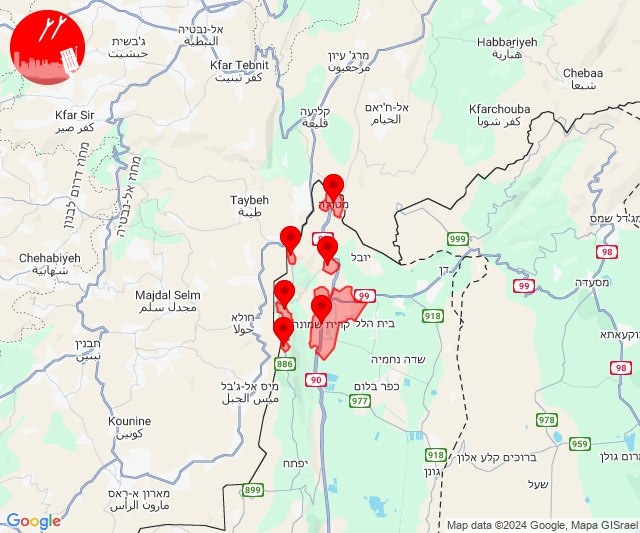

# Alerts for 2024-11-26

## 00:31

✈️ חדירת כלי טיס עוין (26/11/2024):

02:29:
• צפון הגולן: מרום גולן 

02:31:
• צפון הגולן: מרום גולן 

צופר - צבע אדום

## 00:31

## 07:25

🔴 צבע אדום (26/11/2024):

09:25:
• קו העימות: יראון, אביבים (מיידי)

צופר - צבע אדום

## 07:25

## 08:21

🔴 צבע אדום (26/11/2024):

10:20:
• קו העימות: קריית שמונה, מרגליות (מיידי)

10:21:
• קו העימות: מנרה (מיידי)

צופר - צבע אדום

## 08:21

## 09:36

🔴 צבע אדום (26/11/2024):

11:36:
• קו העימות: מנרה (מיידי)

צופר - צבע אדום

## 09:36

## 11:56

✈️ חדירת כלי טיס עוין (26/11/2024):

13:54:
• קו העימות: יערה, חוות אירוח גורן 

13:55:
• קו העימות: גשר הזיו, עין יעקב 

13:56:
• קו העימות: געתון 

צופר - צבע אדום

## 11:56

## 12:36

🔴 צבע אדום (26/11/2024):

14:36:
• דרום הגולן: קצרין, קדמת צבי (30 שניות, 15 שניות)
• צפון הגולן: מלון פרא (15 שניות)

צופר - צבע אדום

## 12:36

## 12:58

🔴 צבע אדום (26/11/2024):

14:58:
• קו העימות: נטועה, פסוטה (מיידי)

צופר - צבע אדום

## 12:58

## 13:54

🔴 צבע אדום (26/11/2024):

15:54:
• קו העימות: אבן מנחם, זרעית, שומרה (מיידי)

צופר - צבע אדום

## 13:54

## 14:29

🔴 צבע אדום (26/11/2024):

16:28:
• קו העימות: מעונה, מעיליא (מיידי)

16:29:
• קו העימות: מעלות תרשיחא, גורן, גורנות הגליל (מיידי)

צופר - צבע אדום

## 14:29

## 14:41

🔴 צבע אדום (26/11/2024):

16:41:
• קו העימות: מנרה (מיידי)

צופר - צבע אדום

## 14:41

## 14:45

🔴 צבע אדום (26/11/2024):

16:44:
• המפרץ: חיפה - כרמל, הדר ועיר תחתית, חיפה - נווה שאנן ורמות כרמל, חיפה - מפרץ, קריית אתא, נשר (דקה)

16:45:
• המפרץ: חיפה - קריית חיים ושמואל, קריית ים, כפר ביאליק, קריית ביאליק, קריית מוצקין (דקה)

צופר - צבע אדום

## 14:45

## 15:11

🔴 צבע אדום (26/11/2024):

17:11:
• קו העימות: נווה זיו (מיידי)

צופר - צבע אדום

## 15:11

## 15:25

✈️ חדירת כלי טיס עוין (26/11/2024):

17:21:
• קו העימות: מטולה 

17:22:
• קו העימות: כפר יובל, מעיין ברוך 

17:23:
• קו העימות: הגושרים, קריית שמונה, בית הלל, מעיין ברוך 

17:24:
• קו העימות: הגושרים, בית הלל 

17:25:
• קו העימות: כפר בלום, נאות מרדכי 

צופר - צבע אדום

## 15:25

## 15:26

🔴 צבע אדום (26/11/2024):

17:26:
• קו העימות: בן עמי, נהריה, עברון, גשר הזיו, סער, כברי, בן עמי, נהריה, עברון, בית העלמין החדש נהריה (מיידי, 15 שניות, 30 שניות)
• גליל עליון: מזרעה (30 שניות)

צופר - צבע אדום

## 15:26

## 15:32

🔴 צבע אדום (26/11/2024):

17:30:
• קו העימות: בן עמי, גשר הזיו, נהריה, סער (מיידי, 15 שניות)

17:31:
• קו העימות: נהריה, סער, גשר הזיו, כברי, לימן, איזור תעשייה מילואות צפון (15 שניות, מיידי)
• גליל עליון: מזרעה, נס עמים, רגבה (30 שניות)

17:32:
• קו העימות: נהריה, סער (15 שניות, מיידי)

צופר - צבע אדום

## 15:32

## 15:35

🔴 צבע אדום (26/11/2024):

17:34:
• קו העימות: נהריה, סער, גשר הזיו, איזור תעשייה מילואות צפון, לימן (15 שניות, מיידי)

17:35:
• קו העימות: בצת, נהריה (מיידי, 15 שניות)

צופר - צבע אדום

## 15:35

## 16:28

🔴 צבע אדום (26/11/2024):

18:26:
• קו העימות: נהריה (15 שניות)

18:27:
• קו העימות: סער, גשר הזיו, איזור תעשייה מילואות צפון, לימן, נהריה, בצת, מצובה, שלומי, סער (מיידי, 15 שניות)

18:28:
• קו העימות: גשר הזיו, איזור תעשייה מילואות צפון, בצת, חוף בצת, לימן, מצובה, ראש הנקרה, שלומי (מיידי)

צופר - צבע אדום

## 16:28

## 16:48

🔴 צבע אדום (26/11/2024):

18:48:
• גליל עליון: בוסתן הגליל, עכו (30 שניות)

צופר - צבע אדום

## 16:48

## 17:02

🔴 צבע אדום (26/11/2024):

19:02:
• קו העימות: חורפיש, פקיעין החדשה, פקיעין, צוריאל (מיידי, 15 שניות)
• גליל עליון: כסרא סמיע, חרשים (30 שניות)

צופר - צבע אדום

## 17:02

## 17:10

✈️ חדירת כלי טיס עוין (26/11/2024):

18:45:
• קו העימות: לימן, איזור תעשייה מילואות צפון, גשר הזיו, נהריה 

18:46:
• קו העימות: סער, גשר הזיו, נהריה 

18:47:
• קו העימות: בן עמי, נהריה 

18:48:
• קו העימות: נהריה, בן עמי, כברי 
• גליל עליון: נתיב השיירה 

18:50:
• גליל עליון: מזרעה, רגבה, נס עמים, בית העמק, שבי ציון, לוחמי הגטאות, בוסתן הגליל, שומרת 
• קו העימות: נהריה, עברון 

18:51:
• גליל עליון: נס עמים, מזרעה, רגבה 

18:52:
• קו העימות: עברון, נהריה, איזור תעשייה מילואות צפון, לימן 
• גליל עליון: שבי ציון, לוחמי הגטאות 

18:53:
• גליל עליון: מזרעה, שבי ציון, רגבה, ג'דידה מכר, לוחמי הגטאות 
• קו העימות: נהריה, עברון, שלומי, גשר הזיו, בצת, לימן 

18:54:
• קו העימות: שלומי, בצת, גשר הזיו, סער, נהריה, לימן, איזור תעשייה מילואות צפון 
• גליל עליון: ג'דידה מכר, שייח' דנון 

18:55:
• גליל עליון: בית העלמין החדש עכו, ג'דידה מכר 

18:58:
• קו העימות: בן עמי, נהריה, עברון 
• גליל עליון: נתיב השיירה, שייח' דנון, מזרעה, שבי ציון, רגבה, נס עמים 

18:59:
• גליל עליון: לוחמי הגטאות, שומרת, עכו, בוסתן הגליל, עכו - אזור תעשייה, עין המפרץ 

19:00:
• גליל עליון: שומרת, עכו, בוסתן הגליל, כפר מסריק, עכו - אזור תעשייה, עין המפרץ 
• מרכז הגליל: שפרעם 
• המפרץ: קריית אתא 

19:01:
• גליל עליון: אזור תעשייה שער נעמן, כפר מסריק, עכו - אזור תעשייה, עכו, עין המפרץ 

19:02:
• המפרץ: אזור תעשייה קריית ביאליק 
• גליל עליון: עין המפרץ, עכו - אזור תעשייה 

19:03:
• גליל עליון: ג'דידה מכר, בית העלמין החדש עכו, עכו, אזור תעשייה שער נעמן, כפר מסריק 

19:04:
• המפרץ: אזור תעשייה קריית ביאליק, קריית ביאליק, קריית ים, קריית מוצקין 

19:05:
• המפרץ: חיפה - קריית חיים ושמואל 

19:06:
• המפרץ: חיפה - מפרץ, קריית ים 

19:08:
• המפרץ: חיפה - מפרץ, חיפה - כרמל, הדר ועיר תחתית, חיפה - נווה שאנן ורמות כרמל 

19:09:
• המפרץ: נשר 

19:10:
• המפרץ: חיפה - מפרץ 

צופר - צבע אדום

## 17:10

## 17:32

🔴 צבע אדום (26/11/2024):

19:32:
• קו העימות: מטולה (מיידי)

צופר - צבע אדום

## 17:32

## 17:45

🔴 צבע אדום (26/11/2024):

19:44:
• גליל עליון: כליל, אבו סנאן, עמקה, נתיב השיירה, שייח' דנון, אשרת, כפר יאסיף (30 שניות)
• קו העימות: בית העלמין החדש נהריה, בן עמי, נהריה, כברי, מנות, נווה זיו, עבדון (30 שניות, מיידי, 15 שניות)

19:45:
• גליל עליון: ג'דידה מכר, בית העלמין החדש עכו, בית העמק, אבו סנאן, כליל, עמקה (30 שניות)
• קו העימות: בן עמי, נהריה (מיידי, 15 שניות)

צופר - צבע אדום

## 17:45

## 19:58

🔴 צבע אדום (26/11/2024):

21:57:
• גליל עליון: אחיהוד, יסעור, אפק (דקה)
• מרכז הגליל: טמרה (דקה)

21:58:
• גליל עליון: בית העלמין החדש עכו (30 שניות)

צופר - צבע אדום

## 19:58

## 20:01

🔴 צבע אדום (26/11/2024):

22:01:
• קו העימות: גשר הזיו, נהריה, סער, לימן (מיידי, 15 שניות)

צופר - צבע אדום

## 20:01

## 20:08

🔴 צבע אדום (26/11/2024):

22:08:
• קו העימות: שתולה (מיידי)

צופר - צבע אדום

## 20:08

## 20:16

🔴 צבע אדום (26/11/2024):

22:14:
• מנשה: גן השומרון, פרדס חנה כרכור, תלמי אלעזר, חדרה - מזרח, חדרה - מרכז, גן שמואל, ברקאי, מענית, משמרות (דקה וחצי)
• ואדי ערה: אום אל קוטוף, חריש, כפר קרע, ערערה (דקה וחצי)
• קו העימות: געתון, עבדון, מנות, נווה זיו, חוות אירוח גורן, אילון, יערה, גורן, ערב אל עראמשה, אדמית, גורנות הגליל (15 שניות, מיידי)

22:15:
• ואדי ערה: באקה אל גרבייה, ג'ת (דקה וחצי)
• מנשה: מאור, שדה יצחק, שער מנשה, כפר פינס, אביאל, אלוני יצחק, גבעת עדה, כפר גליקסון, בנימינה (דקה וחצי)
• קו העימות: בצת, מצובה, שלומי, אילון, גורן (מיידי)

22:16:
• הכרמל: דלית אל כרמל, בת שלמה, גבעת וולפסון, עספיא, אזור תעשייה ניר עציון, בית סוהר קישון, גבע כרמל, דור, הבונים, כפר הנוער ימין אורד, כרם מהר''ל, מאיר שפיה, מרכז מיר''ב, נווה ים, נחשולים, ניר עציון, עופר, עין איילה, עין הוד, עין חוד, עין כרמל, עתלית, פוריידיס, צרופה, יערות הכרמל (דקה)
• העמקים: כפר יהושע, היוגב, כפר ברוך, תחנת רכבת כפר יהושוע, אורנים, כפר תקווה, נהלל, קריית טבעון - בית זייד, רמת ישי, שדה יעקב, שער העמקים (דקה)
• ואדי ערה: אזור תעשייה יקנעם עילית, אזור תעשייה מבוא כרמל, אליקים, גבעת ניל''י, גלעד, דליה, יקנעם המושבה והזורע, יקנעם עילית, מדרך עוז, משמר העמק, עין העמק, עין השופט, קיבוץ מגידו, רגבים, רמות מנשה, רמת השופט, אום אל פחם, גבעת עוז, מועאוויה, מעלה עירון, בית סוהר מגידו, אל עריאן, ברטעה, מי עמי, מצפה אילן, עין אל סהלה, קציר (דקה וחצי)
• מנשה: עמיקם, אור עקיבא, אזור תעשייה קיסריה, בית חנניה, ג'סר א-זרקא, זכרון יעקב, מעגן מיכאל, מעיין צבי, עין עירון, עין שמר, צומת בנימינה, אזור תעשייה רגבים, בית ספר אורט בנימינה, רמת הנדיב (דקה וחצי)

צופר - צבע אדום

## 20:16

## 20:28

🔴 צבע אדום (26/11/2024):

22:28:
• קו העימות: משגב עם, מנרה, מרגליות, קריית שמונה, כפר גלעדי, מטולה (מיידי)

צופר - צבע אדום

## 20:28

## 20:31

🔴 צבע אדום (26/11/2024):

22:30:
• קו העימות: כפר גלעדי, משגב עם (מיידי)

22:31:
• קו העימות: קריית שמונה, משגב עם (מיידי)

צופר - צבע אדום

## 20:31

## 21:23

✈️ חדירת כלי טיס עוין (26/11/2024):

23:22:
• צפון הגולן: עין זיוון 

23:23:
• צפון הגולן: אורטל 

צופר - צבע אדום

## 21:23

