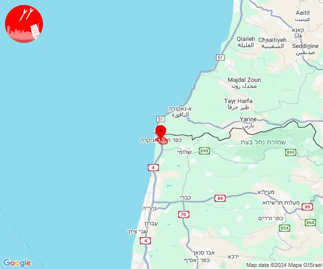

# Alerts for 2024-10-01

## 01:28

🔴 צבע אדום (01/10/2024):

04:28:
• קו העימות: מטולה (מיידי)

צופר - צבע אדום

## 01:28

## 03:10

🔴 צבע אדום (01/10/2024):

06:08:
• גליל עליון: קדיתא, צפת - עיר (30 שניות)

06:09:
• גליל עליון: צפת - עכברה, ביריה (30 שניות)

06:10:
• קו העימות: ברעם, דוב''ב (מיידי)

צופר - צבע אדום

## 03:10

## 04:36

🔴 צבע אדום (01/10/2024):

07:36:
• קו העימות: מטולה (מיידי)

צופר - צבע אדום

## 04:36

## 04:46

🔴 צבע אדום (01/10/2024):

07:46:
• קו העימות: אביבים (מיידי)

צופר - צבע אדום

## 04:46

## 05:01

🔴 צבע אדום (01/10/2024):

08:01:
• קו העימות: מטולה (מיידי)

צופר - צבע אדום

## 05:01

## 06:50

🔴 צבע אדום (01/10/2024):

09:50:
• קו העימות: צבעון (מיידי)

צופר - צבע אדום

## 06:50

## 07:24

🔴 צבע אדום (01/10/2024):

10:24:
• גליל עליון: צפת - נוף כנרת, צפת - עיר, ראש פינה, אזור תעשייה חצור הגלילית, אזור תעשייה צ.ח.ר, חצור הגלילית, עמוקה, אליפלט, מנחת מחניים, ביריה (30 שניות)
• קו העימות: דלתון (מיידי)

צופר - צבע אדום

## 07:24

## 07:29

🔴 צבע אדום (01/10/2024):

10:29:
• קו העימות: מטולה (מיידי)

צופר - צבע אדום

## 07:29

## 08:04

## 08:04

🔴 צבע אדום (01/10/2024):

11:03:
• דן: תל אביב - עבר הירקון, הרצליה - מרכז וגליל ים, רמת השרון, גבעת השלושה, פתח תקווה (דקה וחצי)
• שרון: גבעת חן, רעננה, אלישמע, הוד השרון, כפר סבא, נווה ימין, אורנית, ג'לג'וליה, גני עם, חגור, חורשים, ירחיב, ירקונה, כפר ברא, כפר קאסם, מתן, נווה ירק, נירית, עדנים, שדי חמד, תחנת רכבת ראש העין, אלפי מנשה, מרכז אזורי דרום השרון, בית ברל, צופית, שערי תקווה (דקה וחצי)
• ירקון: עינת, ראש העין, אזור תעשייה אפק ולב הארץ (דקה וחצי)

11:04:
• דן: בני ברק, הרצליה - מערב, כפר שמריהו, רמת גן - מערב, בית עלמין מורשה, סינמה סיטי גלילות, מתחם פי גלילות (דקה וחצי)
• שרון: כפר מל''ל, רמות השבים, רשפון, ניר אליהו, גן חיים, שדה ורבורג, בצרה, רמת הכובש, ארסוף, מתחם "חנה וסע" שפיים (דקה וחצי)

צופר - צבע אדום

## 08:04

## 09:02

🔴 צבע אדום (01/10/2024):

12:02:
• קו העימות: מטולה (מיידי)

צופר - צבע אדום

## 09:02

## 09:05

🔴 צבע אדום (01/10/2024):

12:05:
• קו העימות: לב החולה, דישון, יפתח, מלכיה, מרכז אזורי מבואות חרמון, רמות נפתלי (מיידי)

צופר - צבע אדום

## 09:05

## 09:08

🔴 צבע אדום (01/10/2024):

12:08:
• קו העימות: מטולה (מיידי)

צופר - צבע אדום

## 09:08

## 09:12

🔴 צבע אדום (01/10/2024):

12:12:
• קו העימות: אבן מנחם, שומרה, שתולה, זרעית (מיידי)

צופר - צבע אדום

## 09:12

## 09:32

🔴 צבע אדום (01/10/2024):

12:32:
• קו העימות: מטולה, משגב עם (מיידי)

צופר - צבע אדום

## 09:32

## 10:01

🔴 צבע אדום (01/10/2024):

13:01:
• קו העימות: מטולה (מיידי)

צופר - צבע אדום

## 10:01

## 10:05

🔴 צבע אדום (01/10/2024):

13:05:
• קו העימות: כפר גלעדי, משגב עם, כפר יובל (מיידי)

צופר - צבע אדום

## 10:05

## 11:22

🔴 צבע אדום (01/10/2024):

14:22:
• קו העימות: מטולה (מיידי)

צופר - צבע אדום

## 11:22

## 12:09

🔴 צבע אדום (01/10/2024):

15:09:
• קו העימות: לב החולה, דישון, יפתח, מלכיה, מרכז אזורי מבואות חרמון, רמות נפתלי (מיידי)

צופר - צבע אדום

## 12:09

## 12:49

🔴 צבע אדום (01/10/2024):

15:49:
• קו העימות: שלומי, בצת (מיידי)

צופר - צבע אדום

## 12:49

## 12:55

🔴 צבע אדום (01/10/2024):

15:55:
• קו העימות: שלומי, בצת (מיידי)

צופר - צבע אדום

## 12:55

## 13:04

🔴 צבע אדום (01/10/2024):

16:04:
• קו העימות: ראש הנקרה (מיידי)

צופר - צבע אדום

## 13:04

## 13:11

🔴 צבע אדום (01/10/2024):

16:10:
• גליל עליון: אזור תעשייה שער נעמן, אפק (דקה)
• המפרץ: חיפה - קריית חיים ושמואל, כפר ביאליק, קריית אתא, קריית ביאליק, קריית ים, קריית מוצקין, אזור תעשייה קריית ביאליק (דקה)
• מרכז הגליל: אזור תעשייה טמרה, אעבלין, טמרה, שפרעם (דקה)

16:11:
• גליל עליון: אזור תעשייה בר-לב, אחיהוד, יסעור, עכו - אזור תעשייה, בוסתן הגליל, ג'דידה מכר, כפר מסריק, נס עמים, עין המפרץ, עכו, שבי ציון, שומרת, בית העלמין החדש עכו, ג'וליס, טל - אל, לוחמי הגטאות, מזרעה, רגבה, ירכא, כפר יאסיף, אזור תעשייה כרמיאל, בית העמק, בענה, דיר אל-אסד, הר חלוץ, חרשים, לבון, מג'דל כרום, נחף, נתיב השיירה, צורית גילון, שייח' דנון, אבו סנאן, אשרת, גיתה, ינוח ג'ת, כישור, כליל, כסרא סמיע, לפידות, מגדל תפן, עמקה, פלך, תובל (דקה, 30 שניות)
• מרכז הגליל: כאבול, מצפה אבי''ב (דקה)
• קו העימות: נהריה, עברון, אבירים, אבן מנחם, אדמית, איזור תעשייה מילואות צפון, אילון, אלקוש, בצת, גורן, גורנות הגליל, זרעית, חוף בצת, חניתה, יערה, לימן, מצובה, מתת, נטועה, ערב אל עראמשה, פסוטה, ראש הנקרה, שומרה, שלומי, שתולה, בית העלמין החדש נהריה, בן עמי, גשר הזיו, הילה, חוות אירוח גורן, חוסן, כפר ורדים, מעונה, מעיליא, מעלות תרשיחא, סער, געתון, חורפיש, יחיעם, כברי, מנות, נווה זיו, עבדון, עין יעקב, פקיעין החדשה, פקיעין, צוריאל (15 שניות, מיידי, 30 שניות)

צופר - צבע אדום

## 13:11

## 14:42

🔴 צבע אדום (01/10/2024):

17:41:
• גליל תחתון: גבעת אבני (דקה)

17:42:
• גליל תחתון: כפר נהר הירדן, שדה אילן, אתר ההנצחה גולני, הודיות, לביא (דקה)
• מרכז הגליל: מצפה נטופה (דקה)
• העמקים: אילניה (דקה)

צופר - צבע אדום

## 14:42

## 15:38

🔴 צבע אדום (01/10/2024):

18:37:
• מנשה: תלמי אלעזר (דקה וחצי)
• דן: גבעת השלושה (דקה וחצי)
• שרון: אורנית, אייל, אלישמע, בית ברל, ג'לג'וליה, הוד השרון, חגור, חורשים, טייבה, טירה, יעף, ירחיב, כוכב יאיר - צור יגאל, כפר ברא, כפר הס, כפר סבא, כפר עבודה, כפר קאסם, משמרת, מתן, נווה ימין, נווה ירק, ניר אליהו, נירית, עזריאל, צופית, צור יצחק, רמת הכובש, שדה ורבורג, שדי חמד, תחנת רכבת ראש העין, אלפי מנשה, אלקנה, עץ אפרים, צופים, שערי תקווה, אזור תעשייה טירה, מרכז אזורי דרום השרון (דקה וחצי)
• ירקון: אלעד, נחשונים, עינת, ראש העין, תעשיון חצב, אזור תעשייה אפק ולב הארץ (דקה וחצי)

18:38:
• שרון: גאולים, כפר יעבץ, עין ורד, עין שריד, פורת, צור נתן, קדימה צורן, קלנסווה, שער אפרים, אמץ, בארותיים, בורגתה, בחן, בת חפר, גן יאשיה, זמר, יד חנה, ינוב, כפר יונה, ניצני עוז, סלעית, עולש, תנובות (דקה וחצי)
• שומרון: חוות יאיר, יקיר, נופים, עמנואל, קריית נטפים, קרני שומרון, רבבה, אבני חפץ, אזור תעשייה בראון, חוות גלעד, יצהר, ענב, קדומים, שבי שומרון (דקה וחצי)

צופר - צבע אדום

## 15:38

## 15:54

🔴 צבע אדום (01/10/2024):

18:54:
• קו העימות: איזור תעשייה מילואות צפון, חוף בצת, ראש הנקרה (מיידי)

צופר - צבע אדום

## 15:54

## 16:31

🔴 צבע אדום (01/10/2024):

19:31:
• מרכז הנגב: אזור תעשייה עידן הנגב, בית קמה, גבעות בר, גבעות גורל, דביר, להב, להבים, משמר הנגב, רהט, שובל, תארבין, צומת דבירה, אתר דודאים, באר שבע - דרום, באר שבע - מזרח, באר שבע - מערב, באר שבע - צפון, אשכולות, חצרים, לקיה, עומר, אל סייד, חורה, כרמים, כרמית, מיתר, נבטים, סנסנה, שגב שלום, תל שבע, אום בטין, מתחם צומת שוקת (45 שניות, דקה, דקה וחצי)
• מערב הנגב: אשל הנשיא, תפרח (45 שניות)
• יהודה: אמציה, בני דקלים, כרמי קטיף, נטע, שומריה, שקף, אליאב, תלם, אדורה, אדוריים, אזור תעשייה מיתרים, בית חג"י, בית יתיר, הר עמשא, טנא עומרים, כרמל, מעון, מעלה חבר, נגוהות, סוסיא, עשהאל, עתניאל, קריית ארבע, שמעה, שני ליבנה, היישוב היהודי חברון (דקה, דקה וחצי)
• דרום הנגב: אשלים, ביר הדאג', טללים, משאבי שדה, רביבים, רתמים, ואדי אל נעם דרום, אבו קרינאת, אורון תעשייה ומסחר, אזור תעשייה דימונה, אזור תעשייה רותם, אל פורעה, דימונה, ירוחם, כסייפה, מרעית, ערד, ערערה בנגב, קסר א-סר, תל ערד, חירן, כפר הנוקדים, ממשית, מרחב עם, סעווה, אבו תלול (דקה וחצי)
• ים המלח: בתי מלון ים המלח, מלונות ים המלח מרכז, מצדה, נווה זוהר, עין בוקק (דקה וחצי)

צופר - צבע אדום

## 16:31

## 16:35

🔴 צבע אדום (01/10/2024):

19:32:
• לכיש: אשדוד - אזור תעשייה צפוני ונמל, בני דרום, ניר גלים, בית אלעזרי, בית חלקיה, גדרה, גני טל, חפץ חיים, יבנה, יד בנימין, כפר הנגיד, קדרון, אזור תעשייה כנות, אזור תעשייה רבדים, ביצרון, בית גמליאל, בן זכאי, בני עי''ש, בניה, גבעת וושינגטון, גן הדרום, חצב, כנות, כפר אביב, כפר מרדכי, כרם ביבנה, מישר, מפעל אגריגדה, משגב דב, מתחם בני דרום, נווה מבטח, עשרת, קבוצת יבנה, שדמה, אזור תעשייה גדרה, מעון צופיה, פלמחים, גבעת ברנר (45 שניות, דקה, דקה וחצי)
• השפלה: גאליה, גיבתון, גן שלמה, נצר סרני, פארק תעשיות פלמחים, ראשון לציון - מזרח, ראשון לציון - מערב, רחובות, אזור תעשייה נשר - רמלה, אזור תעשייה רגמ, אחיסמך, אירוס, באר יעקב, בית חנן, בית עובד, בן שמן, גינתון, גן שורק, ישרש, כפר נוער בן שמן, לוד, מצליח, נטעים, ניר צבי, נס ציונה, עיינות, רמלה, תעשיון צריפין, אחיעזר, בית דגן, בית חשמונאי, בית עוזיאל, גזר, גני הדר, גני יוחנן, זיתן, חולדה, חמד, חניון הנתיב מהיר, יגל, יד רמב''ם, יסודות, יציץ, כפר ביל''ו, כפר בן נון, כפר חב''ד, כפר שמואל, כרמי יוסף, מזכרת בתיה, משמר איילון, משמר דוד, משמר השבעה, נען, נצר חזני, סתריה, עזריה, פדיה, פתחיה, צפריה, קריית עקרון, רמות מאיר, גנות (דקה, דקה וחצי)
• דן: תל אביב - דרום העיר ויפו, תל אביב - מזרח, תל אביב - מרכז העיר, תל אביב - עבר הירקון, אור יהודה, אזור, בני ברק, בת ים, גבעת השלושה, גבעת שמואל, גבעתיים, גת רימון, הרצליה - מערב, הרצליה - מרכז וגליל ים, חולון, יהוד מונוסון, כפר סירקין, כפר שמריהו, מעש, מקווה ישראל, סביון, פתח תקווה, קריית אונו, רמת גן - מזרח, רמת גן - מערב, רמת השרון, גני תקווה, מגשימים, בית עלמין מורשה, סינמה סיטי גלילות, מתחם פי גלילות (דקה וחצי)
• שרון: אביחיל, גבעת חן, נתניה - מזרח, נתניה - מערב, רעננה, שושנת העמקים, אורנית, אייל, אלישמע, בית ברל, בני דרור, ג'לג'וליה, גאולים, גן חיים, גני עם, הוד השרון, חגור, חורשים, חרות, טייבה, טירה, יעף, ירחיב, ירקונה, כוכב יאיר - צור יגאל, כפר ברא, כפר הס, כפר יעבץ, כפר מל''ל, כפר סבא, כפר עבודה, כפר קאסם, משמרת, מתן, נווה ימין, נווה ירק, ניר אליהו, נירית, עדנים, עזריאל, עין ורד, עין שריד, פורת, פרדסיה, צופית, צור יצחק, צור משה, צור נתן, קדימה צורן, קלנסווה, רמות השבים, רמת הכובש, שדה ורבורג, שדי חמד, שער אפרים, תחנת רכבת ראש העין, תל מונד, אבן יהודה, אודים, אלפי מנשה, אלקנה, ארסוף, בית יהושע, בני ציון, בצרה, געש, חרוצים, יקום, כפר נטר, מכון וינגייט, עץ אפרים, צופים, רשפון, שערי תקווה, שפיים, תל יצחק, אזור תעשייה טירה, אזור תעשייה כפר יונה, אזור תעשייה עמק חפר, אחיטוב, אליכין, אלישיב, אמץ, בארותיים, בורגתה, בחן, בית הלוי, בית חזון, בית חרות, בית ינאי, בית יצחק - שער חפר, ביתן אהרן, בת חן, בת חפר, גאולי תימן, גבעת חיים איחוד, גבעת חיים מאוחד, גבעת שפירא, גן יאשיה, גנות הדר, הדר עם, המעפיל, המרכז האקדמי רופין, העוגן, זמר, חבצלת השרון וצוקי ים, חגלה, חופית, חיבת ציון, חניאל, חרב לאת, יד חנה, ינוב, כפר הרא''ה, כפר ויתקין, כפר חיים, כפר ידידיה, כפר יונה, כפר מונש, מכמורת, מעברות, משמר השרון, מתחם "חנה וסע" שפיים, נורדיה, ניצני עוז, נעורים, סלעית, עולש, עין החורש, תנובות, בית סוהר השרון, מרכז אזורי דרום השרון (דקה וחצי)
• ירקון: גמזו, חשמונאים, כפר דניאל, כפר רות, לפיד, מבוא חורון, מבוא מודיעים, מודיעין - ליגד סנטר, מודיעין מכבים רעות, מודיעין עילית, מתתיהו, נוף איילון, שילת, שעלבים, אלעד, בארות יצחק, בני עטרות, גבעת כ''ח, מזור, נופך, נחלים, נחשונים, עינת, ראש העין, רינתיה, תעשיון חצב, אזור תעשייה חבל מודיעין, בית נחמיה, בית עריף, ברקת, חדיד, טירת יהודה, כפר טרומן, נאות קדומים, שוהם, אזור תעשייה אפק ולב הארץ, איירפורט סיטי, כפר האורנים, מודיעין - ישפרו סנטר (דקה וחצי)
• מנשה: חדרה - מזרח, חדרה - מערב, חדרה - מרכז, חדרה - נווה חיים, אור עקיבא, אזור תעשייה קיסריה, גן השומרון, גן שמואל, להבות חביבה, עין שמר, פרדס חנה כרכור, קיסריה, שדות ים, מאור, מתחם שביל התפוזים, שדה יצחק, שער מנשה, תלמי אלעזר, מרכז ימי קיסריה (דקה וחצי)
• ואדי ערה: באקה אל גרבייה, ג'ת, מגל (דקה וחצי)
• שפלת יהודה: בקוע, גיזו, הראל, טל שחר, לטרון, מיני ישראל - נחשון, נווה שלום, נחשון, צלפון (דקה וחצי)
• שומרון: ברקן, חוות יאיר, יקיר, נופים, עמנואל, קריית נטפים, קרני שומרון, רבבה, אבני חפץ, אזור תעשייה אריאל, אזור תעשייה בראון, אזור תעשייה ברקן, בית אריה, ברוכין, חוות גלעד, חלמיש, נחליאל, נילי, נעלה, עלי זהב, ענב, פדואל, קדומים, אריאל, נריה, עופרים (דקה וחצי)

19:33:

## 16:35

• עוטף עזה: אור הנר, יד מרדכי, כרמיה, גברעם (15 שניות)
• מערב לכיש: אזור תעשייה צפוני אשקלון, אשקלון - דרום, אשקלון - צפון, באר גנים, אזור תעשייה הדרומי אשקלון, בית שקמה, ברכיה, בת הדר, גיאה, הודיה, חלץ, כוכב מיכאל, כפר סילבר, מבקיעים, משען, ניר ישראל, תלמי יפה, חוף ניצנים, ניצן, ניצנים (30 שניות, 45 שניות)
• מערב הנגב: ברור חיל, רוחמה (30 שניות)
• לכיש: זוהר, יד נתן, נגבה, נהורה, נוגה, ניר ח''ן, עוצם, שדה דוד, שדה יואב, שחר, תלמים, אביגדור, אורות, אזור תעשייה באר טוביה, אחווה, אל עזי, באר טוביה, בני ראם, ינון, כפר אחים, כפר הרי''ף וצומת ראם, כפר ורבורג, ערוגות, קריית מלאכי, רבדים, תימורים, תלמי יחיאל, גן יבנה, חצור, תחנת רכבת קריית מלאכי - יואב, לכיש, אזור תעשייה תימורים, פארק תעשייה ראם, אזור תעשייה עד הלום, אשדוד - א,ב,ד,ה, אשדוד - ג,ו,ז, אשדוד - ח,ט,י,יג,יד,טז, אשדוד - יא,יב,טו,יז,מרינה,סיטי, אבן שמואל, אזור תעשייה קריית גת, אחוזם, איתן, גת, נועם, עוזה, קריית גת, כרמי גת, שדה משה, שלווה, אלומה, אמונים, בית עזרא, גבעתי, ורדון, זבדיאל, זרחיה, מנוחה, מרכז שפירא, משואות יצחק, נחלה, ניר בנים, סגולה, עזר, עזריקם, עין צורים, קדמה, קוממיות, רווחה, שדה עוזיהו, שפיר, שתולים (30 שניות, 45 שניות, דקה)
• שפלת יהודה: כפר מנחם, גפן, זכריה, כפר זוהרים, לוזית, נחושה, עגור, צפרירים, שדות מיכה, שריגים - לי-און, תירוש, בית גוברין, בית ניר, גלאון, גבעת ישעיהו, צומת האלה, בית נקופה, הר אדר, מעלה החמישה, צובה, קריית ענבים, אביעזר, אדרת, אזור תעשייה הר טוב - צרעה, אשתאול, בית שמש, גבעות עדן, זנוח, ישעי, כפר אוריה, מחסיה, מסילת ציון, נווה מיכאל - רוגלית, נחם, נתיב הל''ה, צרעה, רטורנו - גבעת שמש, שער הגיא, תעוז, תרום, אבו גוש, בית מאיר, בר גיורא, גבעת יערים, יד השמונה, כסלון, כפר הנוער קריית יערים, מבוא ביתר, מטע, נווה אילן, נטף, נס הרים, עין נקובא, עין ראפה, צור הדסה, קריית יערים, רמת רזיאל, שואבה, שורש, אזור תעשייה ברוש (דקה, 45 שניות, דקה וחצי)
• ירושלים: ירושלים - דרום, ירושלים - מערב, ירושלים - צפון, בית זית, מבשרת ציון, מוצא עילית, פנימיית עין כרם, גבעון החדשה, גבעת זאב, נבי סמואל, אבן ספיר, אורה, עמינדב (דקה וחצי)
• יהודה: אלון שבות, אלעזר, ביתר עילית, בת עין, הר גילה, כפר עציון, כרמי צור, נווה דניאל, ראש צורים, גבעות (דקה וחצי)
• שומרון: בית חורון, דולב, טלמון, חרשה, כרם רעים (דקה וחצי)

19:34:
• מערב הנגב: אזור תעשייה נ.ע.מ, בית הגדי, נתיבות, אורים, אשבול, ברור חיל, ברוש, גבולות, דורות, זרועה, חוות שיקמים, מבועים, מעגלים, גבעולים, מלילות, ניר משה, ניר עקיבא, פטיש, פעמי תש''ז, צאלים, קלחים, רוחמה, שבי דרום, שדה צבי, שיבולים, שרשרת, תאשור, תדהר, תלמי ביל''ו, אופקים, מסלול, פדויים, רנן, אשל הנשיא, בטחה, גילת, דניאל, תפרח, קריית חינוך מרחבים, יושיביה (30 שניות, 15 שניות, 45 שניות)
• עוטף עזה: גברעם, גבים, מכללת ספיר, ניר עם, שדרות, איבים, אבשלום, אור הנר, ארז, בארי, בני נצרים, דקל, זמרת, שובה, חוות יזרעם, חולית, יבול, יד מרדכי, יכיני, יתד, כיסופים, כפר מימון ותושיה, כפר עזה, מבטחים, עמיעוז, ישע, מגן, מפלסים, נווה, נחל עוז, ניר יצחק, ניר עוז, נירים, נתיב העשרה, סופה, סעד, עין הבשור, עין השלושה, עלומים, פרי גן, צוחר, אוהד, רעים, שדה ניצן, שדי אברהם, שוקדה, שלומית, תלמי אליהו, תלמי יוסף, תקומה, מטווח ניר עם (15 שניות, 30 שניות)
• לכיש: זוהר, שדה דוד, תלמים (30 שניות)
• מערב לכיש: חלץ (30 שניות)
• מרכז הנגב: אזור תעשייה עידן הנגב, בית קמה, גבעות בר, גבעות גורל, דביר, להב, להבים, משמר הנגב, רהט, שובל, תארבין, צומת דבירה, אתר דודאים, אל סייד, חורה, כרמים, כרמית, מיתר, נבטים, סנסנה, שגב שלום, תל שבע, אום בטין, מתחם צומת שוקת, באר שבע - דרום, באר שבע - מזרח, באר שבע - מערב, באר שבע - צפון, אשכולות, חצרים, לקיה, עומר (45 שניות, דקה וחצי, דקה)
• דרום הנגב: אבו קרינאת, ירוחם, ערערה בנגב, קסר א-סר, חירן, סעווה, אבו תלול, אשלים, ביר הדאג', טללים, משאבי שדה, רביבים, רתמים, ואדי אל נעם דרום (דקה וחצי)
• יהודה: טנא עומרים, נטע, שומריה (דקה וחצי, דקה)

19:35:
• דרום הנגב: אל פורעה, כסייפה, ערד, תל ערד (דקה וחצי)

צופר - צבע אדום

## 16:35

## 16:39

## 16:44

🔴 צבע אדום (01/10/2024):

19:37:
• דרום הנגב: מרעית, כפר הנוקדים, אבו קרינאת, אזור תעשייה רותם, דימונה, ערערה בנגב, קסר א-סר, חירן, ממשית, סעווה, אבו תלול, אזור תעשייה דימונה (דקה וחצי)
• יהודה: הר עמשא, כפר אלדד, כרמי צור, מגדל עוז, מיצד, מעלה עמוס, מעלה רחבעם, נוקדים, פארק תעשיות מגדל עוז, פני קדם, שדה בר, תלם, תקוע, אדורה, אדוריים, אזור תעשייה מיתרים, בית חג"י, בית יתיר, טנא עומרים, כרמל, מעון, מעלה חבר, נגוהות, סוסיא, עשהאל, עתניאל, צומת הגוש, קריית ארבע, שמעה, שני ליבנה, היישוב היהודי חברון, אלון שבות, אלעזר, ביתר עילית, בת עין, כפר עציון, נווה דניאל, ראש צורים, גבעות (דקה וחצי, דקה)
• מרכז הנגב: אל סייד, חורה, כרמים, כרמית, מיתר, סנסנה, מתחם צומת שוקת, נבטים, שגב שלום, תל שבע, אום בטין (דקה וחצי, דקה)
• ים המלח: בתי מלון ים המלח, מלונות ים המלח מרכז, מצדה, מצוקי דרגות, מצפה שלם, נווה זוהר, עין בוקק, עין גדי, מרחצאות עין גדי, נאות הכיכר, עין תמר, אבנת (דקה וחצי)
• שפלת יהודה: אביעזר, אדרת, אזור תעשייה הר טוב - צרעה, בית שמש, גבעות עדן, זנוח, ישעי, כפר אוריה, מחסיה, נווה מיכאל - רוגלית, נחם, נתיב הל''ה, צרעה, רטורנו - גבעת שמש, תרום, בר גיורא, מבוא ביתר, מטע, נס הרים, צור הדסה, אזור תעשייה ברוש (דקה וחצי)

19:38:
• יהודה: אפרת, הר גילה, נטע, אמציה, בני דקלים, כרמי קטיף, שומריה, שקף, אליאב, אבו נוור, קידר, אזור תעשייה מישור אדומים, מעלה אדומים, מצפה יריחו, כפר אדומים, נופי פרת (דקה וחצי, דקה)
• דרום הנגב: אורון תעשייה ומסחר, ירוחם, מדרשת בן גוריון, מרחב עם, שאנטי במדבר, שדה בוקר, עבדת, ואדי אל נעם דרום, אשלים, ביר הדאג', טללים, משאבי שדה, רביבים, רתמים, אל פורעה, כסייפה, תל ערד, ערד (דקה וחצי)
• ירושלים: אבן ספיר, אורה, עמינדב, ירושלים - דרום, ירושלים - מזרח (דקה וחצי)
• ערבה: אל עמארני, אל מסק, עידן, עין חצבה, עיר אובות, חצבה (דקה וחצי)
• מרכז הנגב: אשכולות, באר שבע - דרום, באר שבע - מזרח, באר שבע - מערב, באר שבע - צפון, אזור תעשייה עידן הנגב, בית קמה, גבעות בר, גבעות גורל, דביר, להב, להבים, משמר הנגב, רהט, שובל, תארבין, חצרים, לקיה, עומר, צומת דבירה, אתר דודאים (דקה, 45 שניות)
• לכיש: אזור תעשייה עד הלום, אביגדור, אבן שמואל, אורות, אזור תעשייה באר טוביה, אזור תעשייה קריית גת, אחווה, אחוזם, איתן, אל עזי, באר טוביה, בית חלקיה, בני ראם, גני טל, גת, חפץ חיים, יד בנימין, ינון, כפר אחים, כפר הרי''ף וצומת ראם, כפר ורבורג, נועם, עוזה, ערוגות, קריית גת, כרמי גת, קריית מלאכי, רבדים, שדה משה, שלווה, תימורים, תלמי יחיאל, אזור תעשייה רבדים, בני עי''ש, חצב, חצור, תחנת רכבת קריית מלאכי - יואב, אזור תעשייה גדרה, אלומה, אמונים, בית עזרא, גבעתי, ורדון, זבדיאל, זוהר, זרחיה, יד נתן, לכיש, מנוחה, מרכז שפירא, משואות יצחק, נגבה, נהורה, נוגה, נחלה, ניר בנים, ניר ח''ן, סגולה, עוצם, עזר, עזריקם, עין צורים, קדמה, קוממיות, רווחה, שדה דוד, שדה יואב, שדה עוזיהו, שחר, שפיר, תלמים, אזור תעשייה תימורים, פארק תעשייה ראם (45 שניות, 30 שניות, דקה)
• מערב לכיש: אזור תעשייה צפוני אשקלון, אשקלון - דרום, אשקלון - צפון, באר גנים, אזור תעשייה הדרומי אשקלון, בית שקמה, ברכיה, בת הדר, גיאה, הודיה, חוף ניצנים, חלץ, כוכב מיכאל, כפר סילבר, מבקיעים, משען, ניצן, ניצנים, ניר ישראל, תלמי יפה (30 שניות, 45 שניות)
• שפלת יהודה: כפר מנחם, בית גוברין, בית ניר, גלאון, גפן, זכריה, כפר זוהרים, לוזית, נחושה, עגור, צפרירים, שדות מיכה, שריגים - לי-און, תירוש, גבעת ישעיהו, צומת האלה (דקה, 45 שניות)
• מערב הנגב: אופקים, אזור תעשייה נ.ע.מ, בית הגדי, מסלול, נתיבות, פדויים, רנן, אורים, אשבול, אשל הנשיא, בטחה, ברור חיל, ברוש, גילת, דורות, דניאל, זרועה, חוות שיקמים, יושיביה, מבועים, מעגלים, גבעולים, מלילות, ניר משה, ניר עקיבא, פטיש, פעמי תש''ז, קלחים, רוחמה, שבי דרום, שדה צבי, שיבולים, שרשרת, תאשור, תדהר, תלמי ביל''ו, תפרח, קריית חינוך מרחבים, צאלים (45 שניות, 30 שניות, 15 שניות)
• עוטף עזה: גבים, מכללת ספיר, חוף זיקים, ניר עם, שדרות, איבים, אור הנר, ארז, בארי, גברעם, זיקים, זמרת, שובה, חוות יזרעם, יד מרדכי, יכיני, כפר מימון ותושיה, כפר עזה, כרמיה, מפלסים, נחל עוז, נתיב העשרה, סעד, עלומים, רעים, שוקדה, תקומה, מטווח ניר עם (15 שניות, 30 שניות)
• ים המלח: קליה, חוף קליה, אלמוג, בית הערבה, מרכז אזורי מגילות, ורד יריחו (דקה וחצי)

19:39:
• יהודה: אלון, עלמון (דקה וחצי)

## 16:46

🔴 צבע אדום (01/10/2024):

19:37:
• דרום הנגב: מרעית, כפר הנוקדים, אבו קרינאת, אזור תעשייה רותם, דימונה, ערערה בנגב, קסר א-סר, חירן, ממשית, סעווה, אבו תלול, אזור תעשייה דימונה (דקה וחצי)
• יהודה: הר עמשא, כפר אלדד, כרמי צור, מגדל עוז, מיצד, מעלה עמוס, מעלה רחבעם, נוקדים, פארק תעשיות מגדל עוז, פני קדם, שדה בר, תלם, תקוע, אדורה, אדוריים, אזור תעשייה מיתרים, בית חג"י, בית יתיר, טנא עומרים, כרמל, מעון, מעלה חבר, נגוהות, סוסיא, עשהאל, עתניאל, צומת הגוש, קריית ארבע, שמעה, שני ליבנה, היישוב היהודי חברון, אלון שבות, אלעזר, ביתר עילית, בת עין, כפר עציון, נווה דניאל, ראש צורים, גבעות (דקה וחצי, דקה)
• מרכז הנגב: אל סייד, חורה, כרמים, כרמית, מיתר, סנסנה, מתחם צומת שוקת, נבטים, שגב שלום, תל שבע, אום בטין (דקה וחצי, דקה)
• ים המלח: בתי מלון ים המלח, מלונות ים המלח מרכז, מצדה, מצוקי דרגות, מצפה שלם, נווה זוהר, עין בוקק, עין גדי, מרחצאות עין גדי, נאות הכיכר, עין תמר, אבנת (דקה וחצי)
• שפלת יהודה: אביעזר, אדרת, אזור תעשייה הר טוב - צרעה, בית שמש, גבעות עדן, זנוח, ישעי, כפר אוריה, מחסיה, נווה מיכאל - רוגלית, נחם, נתיב הל''ה, צרעה, רטורנו - גבעת שמש, תרום, בר גיורא, מבוא ביתר, מטע, נס הרים, צור הדסה, אזור תעשייה ברוש (דקה וחצי)

19:38:
• יהודה: אפרת, הר גילה, נטע, אמציה, בני דקלים, כרמי קטיף, שומריה, שקף, אליאב, אבו נוור, קידר, אזור תעשייה מישור אדומים, מעלה אדומים, מצפה יריחו, כפר אדומים, נופי פרת (דקה וחצי, דקה)
• דרום הנגב: אורון תעשייה ומסחר, ירוחם, מדרשת בן גוריון, מרחב עם, שאנטי במדבר, שדה בוקר, עבדת, ואדי אל נעם דרום, אשלים, ביר הדאג', טללים, משאבי שדה, רביבים, רתמים, אל פורעה, כסייפה, תל ערד, ערד (דקה וחצי)
• ירושלים: אבן ספיר, אורה, עמינדב, ירושלים - דרום, ירושלים - מזרח (דקה וחצי)
• ערבה: אל עמארני, אל מסק, עידן, עין חצבה, עיר אובות, חצבה (דקה וחצי)
• מרכז הנגב: אשכולות, באר שבע - דרום, באר שבע - מזרח, באר שבע - מערב, באר שבע - צפון, אזור תעשייה עידן הנגב, בית קמה, גבעות בר, גבעות גורל, דביר, להב, להבים, משמר הנגב, רהט, שובל, תארבין, חצרים, לקיה, עומר, צומת דבירה, אתר דודאים (דקה, 45 שניות)
• לכיש: אזור תעשייה עד הלום, אביגדור, אבן שמואל, אורות, אזור תעשייה באר טוביה, אזור תעשייה קריית גת, אחווה, אחוזם, איתן, אל עזי, באר טוביה, בית חלקיה, בני ראם, גני טל, גת, חפץ חיים, יד בנימין, ינון, כפר אחים, כפר הרי''ף וצומת ראם, כפר ורבורג, נועם, עוזה, ערוגות, קריית גת, כרמי גת, קריית מלאכי, רבדים, שדה משה, שלווה, תימורים, תלמי יחיאל, אזור תעשייה רבדים, בני עי''ש, חצב, חצור, תחנת רכבת קריית מלאכי - יואב, אזור תעשייה גדרה, אלומה, אמונים, בית עזרא, גבעתי, ורדון, זבדיאל, זוהר, זרחיה, יד נתן, לכיש, מנוחה, מרכז שפירא, משואות יצחק, נגבה, נהורה, נוגה, נחלה, ניר בנים, ניר ח''ן, סגולה, עוצם, עזר, עזריקם, עין צורים, קדמה, קוממיות, רווחה, שדה דוד, שדה יואב, שדה עוזיהו, שחר, שפיר, תלמים, אזור תעשייה תימורים, פארק תעשייה ראם (45 שניות, 30 שניות, דקה)
• מערב לכיש: אזור תעשייה צפוני אשקלון, אשקלון - דרום, אשקלון - צפון, באר גנים, אזור תעשייה הדרומי אשקלון, בית שקמה, ברכיה, בת הדר, גיאה, הודיה, חוף ניצנים, חלץ, כוכב מיכאל, כפר סילבר, מבקיעים, משען, ניצן, ניצנים, ניר ישראל, תלמי יפה (30 שניות, 45 שניות)
• שפלת יהודה: כפר מנחם, בית גוברין, בית ניר, גלאון, גפן, זכריה, כפר זוהרים, לוזית, נחושה, עגור, צפרירים, שדות מיכה, שריגים - לי-און, תירוש, גבעת ישעיהו, צומת האלה (דקה, 45 שניות)
• מערב הנגב: אופקים, אזור תעשייה נ.ע.מ, בית הגדי, מסלול, נתיבות, פדויים, רנן, אורים, אשבול, אשל הנשיא, בטחה, ברור חיל, ברוש, גילת, דורות, דניאל, זרועה, חוות שיקמים, יושיביה, מבועים, מעגלים, גבעולים, מלילות, ניר משה, ניר עקיבא, פטיש, פעמי תש''ז, קלחים, רוחמה, שבי דרום, שדה צבי, שיבולים, שרשרת, תאשור, תדהר, תלמי ביל''ו, תפרח, קריית חינוך מרחבים, צאלים (45 שניות, 30 שניות, 15 שניות)
• עוטף עזה: גבים, מכללת ספיר, חוף זיקים, ניר עם, שדרות, איבים, אור הנר, ארז, בארי, גברעם, זיקים, זמרת, שובה, חוות יזרעם, יד מרדכי, יכיני, כפר מימון ותושיה, כפר עזה, כרמיה, מפלסים, נחל עוז, נתיב העשרה, סעד, עלומים, רעים, שוקדה, תקומה, מטווח ניר עם (15 שניות, 30 שניות)
• ים המלח: קליה, חוף קליה, אלמוג, בית הערבה, מרכז אזורי מגילות, ורד יריחו (דקה וחצי)

19:39:
• יהודה: אלון, עלמון (דקה וחצי)

## 16:46

• בקעה: ארגמן, גלגל, ייט''ב, יפית, מבואות יריחו, מעלה אפרים, משואה, נעמה, נערן, נתיב הגדוד, פצאל, תומר, בקעות, גיתית, חמרה, מכורה, חמדת, מחולה, משכיות, רועי, רותם, שדמות מחולה (דקה וחצי)
• שומרון: כוכב השחר, מעלה מכמש, רימונים, גבע בנימין, אזור תעשייה שער בנימין, מגרון, גבעת אסף, כוכב יעקב, תל ציון, ברקן, אזור תעשייה אריאל, אזור תעשייה ברקן, בית אל, בית אריה, בית חורון, ברוכין, גבעת הראל וגבעת הרואה, דולב, חלמיש, טלמון, מעלה לבונה, נחליאל, נילי, נעלה, עדי עד, עטרת, עלי זהב, עלי, עמיחי, עפרה, פדואל, פסגות, קידה, שבות רחל, שילה, אריאל, חרשה, כרם רעים, נופי נחמיה, נריה, עופרים, שבי שומרון, חוות יאיר, יקיר, נופים, עמנואל, קריית נטפים, קרני שומרון, רבבה, אבני חפץ, אזור תעשייה בראון, חוות גלעד, ענב, קדומים, חרמש, מבוא דותן, איתמר, אלון מורה, הר ברכה, יצהר, כפר תפוח, מגדלים, רחלים, אחיה (דקה וחצי)
• ירושלים: ירושלים - מערב, ירושלים - מרכז, בית זית, מוצא עילית, פנימיית עין כרם, ירושלים - צפון, מבשרת ציון, גבעון החדשה, נבי סמואל, ירושלים - אזור תעשייה עטרות, ירושלים - כפר עקב, גבעת זאב (דקה וחצי)
• שפלת יהודה: בית נקופה, הר אדר, מעלה החמישה, צובה, קריית ענבים, אשתאול, אבו גוש, בית מאיר, גבעת יערים, יד השמונה, כסלון, כפר הנוער קריית יערים, נווה אילן, עין נקובא, עין ראפה, קריית יערים, רמת רזיאל, שואבה, שורש, גיזו, בקוע, הראל, טל שחר, לטרון, מיני ישראל - נחשון, מסילת ציון, נווה שלום, נחשון, צלפון, שער הגיא, תעוז, נטף (דקה וחצי)
• דרום הנגב: הר הנגב, מצפה רמון, בית סוהר נפחא (דקה וחצי)
• ערבה: ספיר, עין יהב, פארן, צופר, צוקים (דקה וחצי)
• השפלה: גיבתון, גן שלמה, נצר סרני, רחובות, אזור תעשייה נשר - רמלה, אזור תעשייה רגמ, אחיסמך, אירוס, באר יעקב, בית חנן, בית עובד, בן שמן, גינתון, ישרש, כפר נוער בן שמן, לוד, מצליח, ניר צבי, נס ציונה, עיינות, רמלה, תעשיון צריפין, אחיעזר, בית דגן, בית חשמונאי, בית עוזיאל, גזר, גני הדר, גני יוחנן, זיתן, חולדה, חניון הנתיב מהיר, יגל, יד רמב''ם, יסודות, יציץ, כפר ביל''ו, כפר בן נון, כפר חב''ד, כפר שמואל, כרמי יוסף, מזכרת בתיה, משמר איילון, משמר דוד, נען, נצר חזני, סתריה, עזריה, פדיה, פתחיה, צפריה, קריית עקרון, רמות מאיר, פארק תעשיות פלמחים, גן שורק, נטעים, ראשון לציון - מזרח, ראשון לציון - מערב, חמד, משמר השבעה, גנות (דקה וחצי)
• ירקון: גמזו, חשמונאים, כפר דניאל, כפר רות, לפיד, מבוא חורון, מבוא מודיעים, מודיעין - ליגד סנטר, מודיעין מכבים רעות, מודיעין עילית, מתתיהו, נוף איילון, שילת, שעלבים, אלעד, בארות יצחק, בני עטרות, גבעת כ''ח, מזור, נופך, נחשונים, רינתיה, תעשיון חצב, אזור תעשייה חבל מודיעין, בית נחמיה, בית עריף, ברקת, חדיד, טירת יהודה, כפר טרומן, נאות קדומים, שוהם, איירפורט סיטי, כפר האורנים, מודיעין - ישפרו סנטר, נחלים, עינת, ראש העין, אזור תעשייה אפק ולב הארץ (דקה וחצי)
• דן: יהוד מונוסון, מגשימים, תל אביב - דרום העיר ויפו, תל אביב - מזרח, תל אביב - מרכז העיר, תל אביב - עבר הירקון, אור יהודה, אזור, בני ברק, בת ים, גבעת השלושה, גבעת שמואל, גבעתיים, גת רימון, הרצליה - מערב, הרצליה - מרכז וגליל ים, חולון, כפר סירקין, כפר שמריהו, מעש, מקווה ישראל, סביון, פתח תקווה, קריית אונו, רמת גן - מזרח, רמת גן - מערב, רמת השרון, גני תקווה, בית עלמין מורשה, סינמה סיטי גלילות, מתחם פי גלילות (דקה וחצי)
• לכיש: גבעת ברנר, פלמחים (דקה וחצי)
• מנשה: חדרה - מזרח, חדרה - מערב, חדרה - מרכז, חדרה - נווה חיים, להבות חביבה, שדה יצחק, גן שמואל, מאור, מתחם שביל התפוזים, תלמי אלעזר, גן השומרון, עין שמר, שדות ים, גבעת חביבה, מענית, שער מנשה, אזור תעשייה קיסריה, מרכז ימי קיסריה, כפר פינס, משמרות, עין עירון, פרדס חנה כרכור, ברקאי (דקה וחצי)
• ואדי ערה: ג'ת, מגל, באקה אל גרבייה, מייסר, מצר, אום אל קוטוף, ברטעה, חריש, מצפה אילן (דקה וחצי)

## 16:46

• שרון: אביחיל, גבעת חן, נתניה - מזרח, נתניה - מערב, רעננה, שושנת העמקים, אורנית, אייל, אלישמע, בית ברל, בני דרור, ג'לג'וליה, גאולים, גן חיים, גני עם, הוד השרון, חגור, חורשים, חרות, טייבה, טירה, יעף, ירחיב, ירקונה, כוכב יאיר - צור יגאל, כפר ברא, כפר הס, כפר יעבץ, כפר מל''ל, כפר סבא, כפר עבודה, כפר קאסם, משמרת, מתן, נווה ימין, נווה ירק, ניר אליהו, נירית, עדנים, עזריאל, עין ורד, עין שריד, פורת, פרדסיה, צופית, צור יצחק, צור משה, צור נתן, קדימה צורן, קלנסווה, רמות השבים, רמת הכובש, שדה ורבורג, שדי חמד, שער אפרים, תחנת רכבת ראש העין, תל מונד, אבן יהודה, אודים, אלפי מנשה, אלקנה, ארסוף, בית יהושע, בני ציון, בצרה, געש, חרוצים, יקום, כפר נטר, מכון וינגייט, עץ אפרים, צופים, רשפון, שערי תקווה, שפיים, תל יצחק, אזור תעשייה טירה, אזור תעשייה כפר יונה, אזור תעשייה עמק חפר, אחיטוב, אליכין, אלישיב, אמץ, בארותיים, בורגתה, בחן, בית הלוי, בית חזון, בית חרות, בית ינאי, בית יצחק - שער חפר, ביתן אהרן, בת חן, בת חפר, גאולי תימן, גבעת חיים איחוד, גבעת חיים מאוחד, גבעת שפירא, גן יאשיה, גנות הדר, הדר עם, המעפיל, המרכז האקדמי רופין, העוגן, זמר, חבצלת השרון וצוקי ים, חגלה, חופית, חיבת ציון, חניאל, חרב לאת, יד חנה, ינוב, כפר הרא''ה, כפר ויתקין, כפר חיים, כפר ידידיה, כפר יונה, כפר מונש, מכמורת, מעברות, משמר השרון, מתחם "חנה וסע" שפיים, נורדיה, ניצני עוז, נעורים, סלעית, עולש, עין החורש, תנובות, בית סוהר השרון, מרכז אזורי דרום השרון (דקה וחצי)

19:40:
• מנשה: אור עקיבא, כפר גליקסון, קיסריה, צומת בנימינה, בית חנניה, אביאל, אלוני יצחק, בנימינה, ג'סר א-זרקא, גבעת עדה, זכרון יעקב, מעגן מיכאל, מעיין צבי, עמיקם, אזור תעשייה רגבים, בית ספר אורט בנימינה, רמת הנדיב (דקה וחצי)
• ואדי ערה: גבעת ניל''י, גלעד, דליה, רגבים, רמות מנשה, אום אל פחם, אל עריאן, כפר קרע, מועאוויה, מי עמי, עין אל סהלה, ערערה, קציר (דקה וחצי)
• שומרון: אזור תעשייה שחק, חיננית, ריחן, שקד, טל מנשה (דקה וחצי)
• לכיש: בית אלעזרי, גדרה, כפר הנגיד, קדרון, אזור תעשייה כנות, ביצרון, בית גמליאל, בן זכאי, בניה, גבעת וושינגטון, כנות, כפר אביב, כפר מרדכי, כרם ביבנה, מישר, מפעל אגריגדה, משגב דב, נווה מבטח, עשרת, קבוצת יבנה, שדמה, מעון צופיה, אשדוד - א,ב,ד,ה, אשדוד - אזור תעשייה צפוני ונמל, אשדוד - ג,ו,ז, אשדוד - ח,ט,י,יג,יד,טז, אשדוד - יא,יב,טו,יז,מרינה,סיטי, בני דרום, ניר גלים, יבנה, גן הדרום, גן יבנה, מתחם בני דרום, שתולים (דקה, 45 שניות)
• השפלה: גאליה (דקה)
• דרום הנגב: מרעית, כפר הנוקדים, אבו קרינאת, אזור תעשייה רותם, דימונה, אבו תלול, ערערה בנגב, קסר א-סר, חירן, ממשית, סעווה (דקה וחצי)
• יהודה: הר עמשא, כרמל, נגוהות, עתניאל, קריית ארבע, היישוב היהודי חברון, תלם, אזור תעשייה מיתרים, בית חג"י, טנא עומרים, מעון, מעלה חבר, אדוריים, עשהאל, בית יתיר, כפר אלדד, מיצד, מעלה עמוס, מעלה רחבעם, נוקדים, פני קדם, שדה בר, תקוע, סוסיא, שמעה, שני ליבנה, כרמי צור, מגדל עוז, פארק תעשיות מגדל עוז, אדורה, צומת הגוש (דקה וחצי, דקה)
• בקעת בית שאן: כפר גמילה מלכישוע, בית אלפא וחפציבה, בית שאן, חוות עדן, חמדיה, טירת צבי, כפר רופין, מירב, מסילות, מעוז חיים, מעלה גלבוע, נוה איתן, ניר דוד, עין הנצי''ב, רחוב, רשפים, שדה אליהו, שדה נחום, שדי תרומות, שלוחות, תל תאומים, גני חוגה, שלפים, רוויה (דקה)
• הכרמל: בת שלמה, דור, מאיר שפיה, נחשולים, פוריידיס (דקה)
• מרכז הנגב: מיתר, מתחם צומת שוקת, אל סייד, חורה, כרמים, כרמית, סנסנה, נבטים, שגב שלום, תל שבע, אום בטין (דקה וחצי, דקה)
• ים המלח: מצדה, עין בוקק, בתי מלון ים המלח, מצוקי דרגות, מצפה שלם, מלונות ים המלח מרכז, נווה זוהר, עין גדי, מרחצאות עין גדי, נאות הכיכר, עין תמר (דקה וחצי)

19:41:
• מערב הנגב: גבולות, אשל הנשיא, גילת, תפרח (30 שניות, 45 שניות)
• עוטף עזה: כיסופים, מבטחים, עמיעוז, ישע, מגן, ניר יצחק, ניר עוז, נירים, עין הבשור, עין השלושה, צוחר, אוהד, שדה ניצן, תלמי אליהו, תלמי יוסף (15 שניות)
• דרום הנגב: אזור תעשייה דימונה, אורון תעשייה ומסחר, ירוחם, מרחב עם, שדה בוקר, מדרשת בן גוריון, שאנטי במדבר, עבדת, ואדי אל נעם דרום (דקה וחצי)
• מרכז הנגב: אשכולות, באר שבע - דרום, באר שבע - מזרח, באר שבע - מערב, באר שבע - צפון, אזור תעשייה עידן הנגב, גבעות בר, גבעות גורל, דביר, להב, להבים, משמר הנגב, רהט, תארבין, חצרים, לקיה, עומר, צומת דבירה, אתר דודאים (דקה, 45 שניות)
• יהודה: נטע, שומריה, אמציה, בני דקלים, כרמי קטיף, שקף, אליאב (דקה)
• ערבה: אל עמארני, אל מסק, עין חצבה, עיר אובות, עידן, חצבה (דקה וחצי)

## 16:46

• הכרמל: הבונים, עופר, עין איילה, מרכז מיר''ב, צרופה (דקה)
• ואדי ערה: עין השופט, אזור תעשייה מבוא כרמל, מדרך עוז, משמר העמק, קיבוץ מגידו, רמת השופט, גבעת עוז, מעלה עירון, בית סוהר מגידו, אליקים, עין העמק (דקה וחצי)
• שפלת יהודה: כפר אוריה (דקה וחצי)
• ים המלח: אבנת (דקה וחצי)
• לכיש: בית חלקיה, גני טל, חפץ חיים, יד בנימין, אזור תעשייה רבדים, בני עי''ש, חצור, אזור תעשייה גדרה, פארק תעשייה ראם (דקה, 45 שניות)

19:42:
• לכיש: חצב (דקה)
• דרום הנגב: ערד, אשלים, ביר הדאג', טללים, משאבי שדה, רביבים, רתמים (דקה וחצי)
• מרכז הנגב: בית קמה, שובל (45 שניות)
• ירושלים: ירושלים - דרום, ירושלים - מזרח, ירושלים - מערב, ירושלים - מרכז, בית זית, מבשרת ציון, מוצא עילית, פנימיית עין כרם, גבעון החדשה, נבי סמואל, אבן ספיר, אורה, עמינדב (דקה וחצי)
• שפלת יהודה: בית נקופה, הר אדר, מעלה החמישה, צובה, קריית ענבים, אשתאול, אבו גוש, בית מאיר, בר גיורא, גבעת יערים, יד השמונה, כסלון, כפר הנוער קריית יערים, מבוא ביתר, מטע, נווה אילן, נס הרים, עין נקובא, עין ראפה, צור הדסה, קריית יערים, רמת רזיאל, שואבה, שורש, מיני ישראל - נחשון (דקה וחצי)
• יהודה: אבו נוור, אזור תעשייה מישור אדומים, אלון שבות, אלעזר, אפרת, ביתר עילית, בת עין, הר גילה, כפר עציון, מעלה אדומים, נווה דניאל, קידר, ראש צורים, כפר אדומים, מצפה יריחו, עלמון, גבעות, נופי פרת (דקה וחצי)
• ים המלח: חוף קליה, אלמוג, בית הערבה, ורד יריחו, מרכז אזורי מגילות, קליה (דקה וחצי)
• שומרון: גבע בנימין, ברקן, חוות יאיר, יקיר, נופים, עמנואל, קריית נטפים, קרני שומרון, רבבה, אבני חפץ, אזור תעשייה אריאל, אזור תעשייה בראון, אזור תעשייה ברקן, בית אל, בית אריה, בית חורון, ברוכין, גבעת הראל וגבעת הרואה, דולב, חוות גלעד, חלמיש, טלמון, מעלה לבונה, נחליאל, נילי, נעלה, עדי עד, עטרת, עלי זהב, עלי, עמיחי, ענב, עפרה, פדואל, פסגות, קדומים, קידה, שבות רחל, שילה, אריאל, חרשה, כרם רעים, נופי נחמיה, נריה, עופרים (דקה וחצי)
• העמקים: גדעונה, גן נר, היוגב, יזרעאל, ישובי אומן, ישובי יעל, מגן שאול, מוקיבלה, מרכז חבר, מתחם סקי גלבוע, נורית, סנדלה, רם און, אזור תעשייה מבואות הגלבוע (דקה)
• מנשה: חדרה - מזרח, חדרה - מערב, חדרה - מרכז, חדרה - נווה חיים, אזור תעשייה קיסריה, גן השומרון, להבות חביבה, עין שמר, שדות ים, גבעת חביבה, מענית, שדה יצחק, שער מנשה, מרכז ימי קיסריה (דקה וחצי)
• ואדי ערה: באקה אל גרבייה, ג'ת, מגל, מייסר, מצר (דקה וחצי)
• דן: תל אביב - דרום העיר ויפו, תל אביב - מזרח, תל אביב - מרכז העיר, תל אביב - עבר הירקון, אור יהודה, אזור, בני ברק, בת ים, גבעת השלושה, גבעת שמואל, גבעתיים, גת רימון, הרצליה - מערב, הרצליה - מרכז וגליל ים, חולון, יהוד מונוסון, כפר סירקין, כפר שמריהו, מעש, מקווה ישראל, סביון, פתח תקווה, קריית אונו, רמת גן - מזרח, רמת גן - מערב, רמת השרון, גני תקווה, מגשימים, בית עלמין מורשה, סינמה סיטי גלילות, מתחם פי גלילות (דקה וחצי)
• שרון: אביחיל, גבעת חן, נתניה - מזרח, נתניה - מערב, רעננה, שושנת העמקים, אורנית, אייל, אלישמע, בית ברל, בני דרור, ג'לג'וליה, גאולים, גן חיים, גני עם, הוד השרון, חגור, חורשים, חרות, טייבה, טירה, יעף, ירחיב, ירקונה, כוכב יאיר - צור יגאל, כפר ברא, כפר הס, כפר יעבץ, כפר מל''ל, כפר סבא, כפר עבודה, כפר קאסם, משמרת, מתן, נווה ימין, נווה ירק, ניר אליהו, נירית, עדנים, עזריאל, עין ורד, עין שריד, פורת, פרדסיה, צופית, צור יצחק, צור משה, צור נתן, קדימה צורן, קלנסווה, רמות השבים, רמת הכובש, שדה ורבורג, שדי חמד, שער אפרים, תחנת רכבת ראש העין, תל מונד, אבן יהודה, אודים, אלפי מנשה, אלקנה, ארסוף, בית יהושע, בני ציון, בצרה, געש, חרוצים, יקום, כפר נטר, מכון וינגייט, עץ אפרים, צופים, רשפון, שערי תקווה, שפיים, תל יצחק, אזור תעשייה טירה, אזור תעשייה כפר יונה, אזור תעשייה עמק חפר, אחיטוב, אליכין, אלישיב, אמץ, בארותיים, בורגתה, בחן, בית הלוי, בית חזון, בית חרות, בית ינאי, בית יצחק - שער חפר, ביתן אהרן, בת חן, בת חפר, גאולי תימן, גבעת חיים איחוד, גבעת חיים מאוחד, גבעת שפירא, גן יאשיה, גנות הדר, הדר עם, המעפיל, המרכז האקדמי רופין, העוגן, זמר, חבצלת השרון וצוקי ים, חגלה, חופית, חיבת ציון, חניאל, חרב לאת, יד חנה, ינוב, כפר הרא''ה, כפר ויתקין, כפר חיים, כפר ידידיה, כפר יונה, כפר מונש, מכמורת, מעברות, משמר השרון, מתחם "חנה וסע" שפיים, נורדיה, ניצני עוז, נעורים, סלעית, עולש, עין החורש, תנובות, בית סוהר השרון, מרכז אזורי דרום השרון (דקה וחצי)

## 16:46

• השפלה: גיבתון, נצר סרני, פארק תעשיות פלמחים, ראשון לציון - מזרח, ראשון לציון - מערב, אזור תעשייה נשר - רמלה, אזור תעשייה רגמ, אחיסמך, אירוס, באר יעקב, בית חנן, בית עובד, בן שמן, גינתון, גן שורק, ישרש, כפר נוער בן שמן, לוד, מצליח, נטעים, ניר צבי, נס ציונה, עיינות, רמלה, תעשיון צריפין, אחיעזר, בית דגן, בית חשמונאי, בית עוזיאל, גזר, גני הדר, זיתן, חמד, חניון הנתיב מהיר, יגל, יד רמב''ם, כפר בן נון, כפר חב''ד, כפר שמואל, משמר איילון, משמר השבעה, נען, סתריה, עזריה, פדיה, פתחיה, צפריה, רמות מאיר, גנות (דקה וחצי)
• ירקון: גמזו, חשמונאים, כפר דניאל, כפר רות, לפיד, מבוא חורון, מבוא מודיעים, מודיעין - ליגד סנטר, מודיעין מכבים רעות, מודיעין עילית, מתתיהו, נוף איילון, שילת, שעלבים, אלעד, בארות יצחק, בני עטרות, גבעת כ''ח, מזור, נופך, נחלים, נחשונים, עינת, ראש העין, רינתיה, תעשיון חצב, אזור תעשייה חבל מודיעין, בית נחמיה, בית עריף, ברקת, חדיד, טירת יהודה, כפר טרומן, נאות קדומים, שוהם, אזור תעשייה אפק ולב הארץ, איירפורט סיטי, כפר האורנים, מודיעין - ישפרו סנטר (דקה וחצי)

19:43:
• מנשה: אביאל, אלוני יצחק, גבעת עדה, כפר גליקסון, צומת בנימינה, אזור תעשייה רגבים (דקה וחצי)
• ואדי ערה: רגבים, אל עריאן, כפר קרע, מועאוויה, מי עמי, עין אל סהלה, ערערה, קציר (דקה וחצי)
• שומרון: אזור תעשייה שחק, חיננית, חרמש, מבוא דותן, ריחן, שקד, טל מנשה (דקה וחצי)

19:44:
• שומרון: כוכב השחר, רימונים, מגרון (דקה וחצי)
• בקעה: מעלה אפרים, פצאל, רועי (דקה וחצי)
• דרום הנגב: אל פורעה, כסייפה, מרעית, תל ערד, כפר הנוקדים (דקה וחצי)
• יהודה: תלם, אדורה, אזור תעשייה מיתרים, בית חג"י, הר עמשא, טנא עומרים, כרמל, מעון, מעלה חבר, נגוהות, עתניאל, קריית ארבע, היישוב היהודי חברון, כרמי צור, אמציה, בני דקלים, כרמי קטיף, שקף, אליאב, מגדל עוז, פארק תעשיות מגדל עוז, צומת הגוש (דקה וחצי, דקה)
• מרכז הנגב: מיתר, מתחם צומת שוקת (דקה וחצי)
• ים המלח: מצדה (דקה וחצי)
• מערב הנגב: אופקים, בטחה, פעמי תש''ז, שדה צבי, תאשור, מסלול, פדויים, רנן, אשבול, ברוש, דניאל, קלחים, תדהר, קריית חינוך מרחבים, רוחמה (45 שניות, 30 שניות)
• לכיש: לכיש (45 שניות)

19:45:
• דרום הנגב: ערד (דקה וחצי)

19:46:
• דרום הנגב: אזור תעשייה רותם, דימונה, ערערה בנגב, חירן, סעווה (דקה וחצי)
• יהודה: כפר אלדד, מיצד, מעלה עמוס, מעלה רחבעם, נוקדים, פני קדם, תקוע, אדוריים, בית יתיר, סוסיא, עשהאל, שמעה, שני ליבנה (דקה וחצי)
• ים המלח: בתי מלון ים המלח, מלונות ים המלח מרכז, מצוקי דרגות, מצפה שלם, נווה זוהר, עין בוקק, עין גדי, מרחצאות עין גדי (דקה וחצי)
• מרכז הנגב: חורה, כרמים (דקה וחצי)

צופר - צבע אדום

## 16:52

• לכיש: גבעת ברנר, פלמחים, אחווה, אל עזי, בית אלעזרי, בית חלקיה, בני ראם, גדרה, גני טל, חפץ חיים, יבנה, יד בנימין, ינון, כפר הנגיד, כפר הרי''ף וצומת ראם, קדרון, רבדים, אזור תעשייה כנות, אזור תעשייה רבדים, בית גמליאל, בן זכאי, בני עי''ש, בניה, חצב, כנות, כפר מרדכי, מישר, מפעל אגריגדה, משגב דב, נווה מבטח, עשרת, שדמה, תחנת רכבת קריית מלאכי - יואב, אזור תעשייה גדרה, מעון צופיה, בני דרום, ניר גלים, גבעת וושינגטון, כפר אביב, כרם ביבנה, מתחם בני דרום, קבוצת יבנה, אזור תעשייה עד הלום, אשדוד - א,ב,ד,ה, אשדוד - אזור תעשייה צפוני ונמל, אשדוד - ג,ו,ז, אשדוד - ח,ט,י,יג,יד,טז, אשדוד - יא,יב,טו,יז,מרינה,סיטי, אורות, אזור תעשייה באר טוביה, כפר אחים, ערוגות, קריית מלאכי, תימורים, תלמי יחיאל, אביגדור, אבן שמואל, אזור תעשייה קריית גת, אחוזם, איתן, באר טוביה, גת, כפר ורבורג, נועם, עוזה, קריית גת, כרמי גת, שדה משה, שלווה, ביצרון, גן הדרום, חצור, גן יבנה, ורדון, קדמה, אלומה, אמונים, בית עזרא, גבעתי, זבדיאל, זוהר, זרחיה, יד נתן, מנוחה, מרכז שפירא, משואות יצחק, נגבה, נהורה, נוגה, נחלה, ניר בנים, ניר ח''ן, סגולה, עוצם, עזר, עזריקם, עין צורים, קוממיות, רווחה, שדה דוד, שדה יואב, שדה עוזיהו, שחר, שפיר, שתולים, תלמים, אזור תעשייה תימורים, פארק תעשייה ראם (דקה וחצי, 45 שניות, דקה, 30 שניות)
• בקעת בית שאן: אזור תעשייה צבאים, בית אלפא וחפציבה, בית השיטה, בית יוסף, בית שאן, גשר, חוות עדן, חמדיה, טייבה בגלבוע, טירת צבי, ירדנה, כפר גמילה מלכישוע, כפר רופין, מולדת, מירב, מסילות, מעוז חיים, מעלה גלבוע, נוה איתן, נווה אור, ניר דוד, עין הנצי''ב, רחוב, רשפים, שדה אליהו, שדה נחום, שדי תרומות, שלוחות, תל תאומים, גני חוגה, מנחמיה, שלפים, רוויה (דקה)
• דרום הגולן: חמת גדר, אשדות יעקב, מסדה, שער הגולן, תל קציר (15 שניות, דקה, 30 שניות)
• גליל תחתון: אפיקים, בית זרע (דקה)
• העמקים: תל יוסף, בית סוהר שיטה וגלבוע, גדעונה, גן נר, יזרעאל, ישובי אומן, ישובי יעל, מגן שאול, מוקיבלה, מרכז חבר, מתחם סקי גלבוע, נורית, סנדלה, רם און, אזור תעשייה מבואות הגלבוע, כפר יחזקאל, עין חרוד, קבוצת גבע (דקה)
• דרום הנגב: אזור תעשייה דימונה, ירוחם, קסר א-סר, ממשית, מרחב עם, אורון תעשייה ומסחר (דקה וחצי)
• מערב לכיש: אזור תעשייה צפוני אשקלון, אשקלון - דרום, אשקלון - צפון, באר גנים, אזור תעשייה הדרומי אשקלון, בית שקמה, ברכיה, בת הדר, גיאה, הודיה, חוף ניצנים, חלץ, כוכב מיכאל, כפר סילבר, מבקיעים, משען, ניצן, ניצנים, ניר ישראל, תלמי יפה (30 שניות, 45 שניות)
• עוטף עזה: חוף זיקים, אור הנר, ארז, גברעם, זיקים, יד מרדכי, כרמיה, נתיב העשרה (15 שניות)
• מערב הנגב: ברור חיל, דורות, חוות שיקמים (30 שניות, 15 שניות)

19:51:
• ואדי ערה: אזור תעשייה מבוא כרמל, אליקים, עין העמק, אזור תעשייה יקנעם עילית, יקנעם המושבה והזורע, יקנעם עילית (דקה וחצי)
• מנשה: זכרון יעקב (דקה וחצי)
• הכרמל: בת שלמה, דור, הבונים, כרם מהר''ל, מאיר שפיה, מרכז מיר''ב, נחשולים, עופר, עין איילה, פוריידיס, צרופה (דקה)
• ים המלח: נאות הכיכר, עין תמר, מצדה (דקה וחצי)
• עוטף עזה: שדרות, איבים, גבים, מכללת ספיר, ניר עם, מטווח ניר עם, בארי, זמרת, שובה, חוות יזרעם, יכיני, כפר מימון ותושיה, כפר עזה, מגן, מפלסים, נחל עוז, סעד, עין הבשור, עלומים, צוחר, אוהד, רעים, שוקדה, תלמי אליהו, תקומה, כיסופים, מבטחים, עמיעוז, ישע, ניר יצחק, ניר עוז, נירים, עין השלושה, פרי גן, שדה ניצן, תלמי יוסף, אבשלום, בני נצרים, דקל, חולית, יבול, יתד, כרם שלום, נווה, סופה, שדי אברהם, שלומית (15 שניות, 30 שניות)
• יהודה: נטע, תלם, אדורה, אזור תעשייה מיתרים, בית חג"י, הר עמשא, טנא עומרים, כרמל, מעון, מעלה חבר, נגוהות, עתניאל, קריית ארבע, היישוב היהודי חברון, שומריה, אמציה, בני דקלים, שקף, כרמי צור, מגדל עוז, פארק תעשיות מגדל עוז, צומת הגוש, כרמי קטיף, אליאב (דקה, דקה וחצי)
• מערב הנגב: ניר משה, אזור תעשייה נ.ע.מ, בית הגדי, נתיבות, אורים, אשל הנשיא, גבולות, גילת, זרועה, יושיביה, מבועים, מעגלים, גבעולים, מלילות, ניר עקיבא, פטיש, צאלים, שבי דרום, שיבולים, שרשרת, תלמי ביל''ו, תפרח, אופקים, בטחה, פעמי תש''ז, שדה צבי, תאשור, מסלול, פדויים, רנן, אשבול, ברוש, דניאל, קלחים, תדהר, קריית חינוך מרחבים, רוחמה (30 שניות, 45 שניות, 15 שניות)
• דרום הנגב: אל פורעה, כסייפה, מרעית, תל ערד, כפר הנוקדים, אשלים, ביר הדאג', טללים, משאבי שדה, רביבים, רתמים, שדה בוקר, באר מילכה, כמהין (דקה וחצי, דקה)
• מרכז הנגב: מיתר, מתחם צומת שוקת, בית קמה, גבעות גורל, דביר, משמר הנגב, שובל, צומת דבירה (דקה וחצי, 45 שניות)

## 16:53

🔴 צבע אדום (01/10/2024):

19:49:
• מרכז הנגב: גבעות בר, להבים, תארבין, אתר דודאים, באר שבע - דרום, באר שבע - מזרח, באר שבע - מערב, באר שבע - צפון, חצרים, לקיה, עומר, אל סייד, כרמית, נבטים, שגב שלום, תל שבע, אום בטין, אזור תעשייה עידן הנגב, להב, רהט, אשכולות, סנסנה (45 שניות, דקה, דקה וחצי)
• דרום הנגב: ואדי אל נעם דרום, אבו קרינאת, אבו תלול (דקה וחצי)

19:50:
• בקעה: ארגמן, בקעות, חמדת, חמרה, מחולה, משכיות, רועי, רותם, שדמות מחולה, גיתית, גלגל, ייט''ב, יפית, מבואות יריחו, מכורה, מעלה אפרים, משואה, נעמה, נערן, נתיב הגדוד, פצאל, תומר (דקה וחצי)
• יהודה: אזור תעשייה מישור אדומים, אלון, כפר אדומים, מצפה יריחו, עלמון, נופי פרת, אבו נוור, אלון שבות, אלעזר, אפרת, ביתר עילית, בת עין, הר גילה, כפר עציון, מעלה אדומים, נווה דניאל, קידר, ראש צורים, שדה בר, גבעות (דקה וחצי)
• ים המלח: חוף קליה, אבנת, אלמוג, בית הערבה, ורד יריחו, מרכז אזורי מגילות, קליה (דקה וחצי)
• שומרון: גבע בנימין, גבעת הראל וגבעת הרואה, כוכב השחר, מגדלים, מעלה מכמש, עדי עד, עמיחי, עפרה, קידה, רימונים, שבות רחל, שילה, אחיה, אזור תעשייה שחק, חיננית, חרמש, מבוא דותן, ריחן, שקד, טל מנשה, ברקן, חוות יאיר, יקיר, נופים, עמנואל, קריית נטפים, קרני שומרון, רבבה, אבני חפץ, אזור תעשייה אריאל, אזור תעשייה בראון, אזור תעשייה ברקן, איתמר, אלון מורה, בית אל, בית אריה, ברוכין, דולב, הר ברכה, חוות גלעד, חלמיש, טלמון, יצהר, כפר תפוח, מעלה לבונה, נחליאל, נילי, נעלה, עטרת, עלי זהב, עלי, ענב, פדואל, רחלים, שבי שומרון, אזור תעשייה שער בנימין, בית חורון, גבעת אסף, כוכב יעקב, פסגות, קדומים, תל ציון, אריאל, חרשה, נופי נחמיה, נריה, עופרים, כרם רעים, מגרון (דקה וחצי)
• מנשה: חדרה - מזרח, חדרה - מערב, חדרה - מרכז, חדרה - נווה חיים, אביאל, אור עקיבא, אזור תעשייה קיסריה, אלוני יצחק, בית חנניה, בנימינה, ג'סר א-זרקא, גבעת עדה, גן השומרון, גן שמואל, כפר גליקסון, כפר פינס, להבות חביבה, מעגן מיכאל, מעיין צבי, משמרות, עין עירון, עין שמר, עמיקם, פרדס חנה כרכור, קיסריה, שדות ים, ברקאי, גבעת חביבה, מאור, מענית, מתחם שביל התפוזים, צומת בנימינה, שדה יצחק, שער מנשה, תלמי אלעזר, אזור תעשייה רגבים, בית ספר אורט בנימינה, מרכז ימי קיסריה, רמת הנדיב (דקה וחצי)
• ואדי ערה: באקה אל גרבייה, ג'ת, גבעת ניל''י, גלעד, דליה, מגל, מדרך עוז, מייסר, מצר, עין השופט, קיבוץ מגידו, רגבים, רמות מנשה, משמר העמק, אום אל פחם, אום אל קוטוף, אל עריאן, ברטעה, גבעת עוז, חריש, כפר קרע, מועאוויה, מי עמי, מעלה עירון, מצפה אילן, עין אל סהלה, ערערה, בית סוהר מגידו, קציר, רמת השופט (דקה וחצי)
• דן: תל אביב - מזרח, תל אביב - עבר הירקון, תל אביב - דרום העיר ויפו, תל אביב - מרכז העיר, אור יהודה, אזור, בני ברק, גבעת השלושה, גבעת שמואל, גבעתיים, גת רימון, הרצליה - מערב, הרצליה - מרכז וגליל ים, יהוד מונוסון, כפר סירקין, כפר שמריהו, מעש, סביון, פתח תקווה, קריית אונו, רמת גן - מזרח, רמת גן - מערב, רמת השרון, בת ים, חולון, מקווה ישראל, גני תקווה, מגשימים, בית עלמין מורשה, סינמה סיטי גלילות, מתחם פי גלילות (דקה וחצי)
• ירושלים: ירושלים - אזור תעשייה עטרות, ירושלים - דרום, ירושלים - כפר עקב, ירושלים - מזרח, ירושלים - מערב, ירושלים - מרכז, ירושלים - צפון, בית זית, מבשרת ציון, מוצא עילית, פנימיית עין כרם, גבעון החדשה, גבעת זאב, נבי סמואל, אבן ספיר, אורה, עמינדב (דקה וחצי)

## 16:56

## 16:58

🔴 צבע אדום (01/10/2024):

19:56:
• מרכז הנגב: באר שבע - מערב, באר שבע - צפון, גבעות בר, להבים, תארבין, לקיה, עומר, אתר דודאים, אל סייד, כרמית, נבטים, סנסנה, שגב שלום, תל שבע, אום בטין (דקה, 45 שניות, דקה וחצי)
• דרום הנגב: אבו קרינאת, אבו תלול (דקה וחצי)

19:57:
• מרכז הנגב: באר שבע - דרום, באר שבע - מזרח, אזור תעשייה עידן הנגב, להב, רהט, אשכולות, חצרים (דקה, 45 שניות)
• דרום הנגב: ואדי אל נעם דרום (דקה וחצי)

19:58:
• ירושלים: ירושלים - דרום, ירושלים - מזרח, ירושלים - מערב, ירושלים - מרכז, ירושלים - צפון, בית זית, מבשרת ציון, מוצא עילית, פנימיית עין כרם, גבעון החדשה, גבעת זאב, נבי סמואל, אבן ספיר, אורה, עמינדב (דקה וחצי)
• ירקון: מבוא חורון, נוף איילון, שעלבים, מודיעין - ישפרו סנטר (דקה וחצי)
• שפלת יהודה: בית נקופה, הר אדר, מעלה החמישה, צובה, קריית ענבים, אביעזר, אדרת, אזור תעשייה הר טוב - צרעה, אשתאול, בית שמש, בקוע, גבעות עדן, גיזו, הראל, זנוח, טל שחר, ישעי, כפר אוריה, לטרון, מחסיה, מיני ישראל - נחשון, מסילת ציון, נווה מיכאל - רוגלית, נווה שלום, נחם, נחשון, נתיב הל''ה, צלפון, צרעה, רטורנו - גבעת שמש, שער הגיא, תעוז, תרום, אבו גוש, בית מאיר, בר גיורא, גבעת יערים, יד השמונה, כסלון, כפר הנוער קריית יערים, מבוא ביתר, מטע, נווה אילן, נטף, נס הרים, עין נקובא, עין ראפה, צור הדסה, קריית יערים, רמת רזיאל, שואבה, שורש, אזור תעשייה ברוש, כפר מנחם, בית גוברין, בית ניר, גלאון, גפן, זכריה, כפר זוהרים, לוזית, נחושה, עגור, צפרירים, שדות מיכה, שריגים - לי-און, תירוש, גבעת ישעיהו, צומת האלה (דקה וחצי, דקה, 45 שניות)
• יהודה: אבו נוור, אלון שבות, אלעזר, אפרת, ביתר עילית, בת עין, הר גילה, כפר עציון, נווה דניאל, קידר, ראש צורים, שדה בר, גבעות, נטע, שומריה (דקה וחצי, דקה)
• השפלה: בית חשמונאי, בית עוזיאל, גזר, גני יוחנן, חולדה, יסודות, יציץ, כפר בן נון, כפר שמואל, כרמי יוסף, מזכרת בתיה, משמר איילון, משמר דוד, נצר חזני, פדיה, פתחיה, רמות מאיר (דקה וחצי)
• שומרון: בית חורון (דקה וחצי)
• לכיש: אביגדור, אבן שמואל, אורות, אזור תעשייה באר טוביה, אזור תעשייה קריית גת, אחווה, אחוזם, איתן, אל עזי, באר טוביה, בית אלעזרי, בית חלקיה, בני ראם, גדרה, גני טל, גת, חפץ חיים, יד בנימין, ינון, כפר אחים, כפר הרי''ף וצומת ראם, כפר ורבורג, נועם, עוזה, ערוגות, קדרון, קריית גת, כרמי גת, קריית מלאכי, רבדים, שדה משה, שלווה, תימורים, תלמי יחיאל, אזור תעשייה כנות, אזור תעשייה רבדים, בני עי''ש, חצב, חצור, כנות, מישר, מפעל אגריגדה, נווה מבטח, תחנת רכבת קריית מלאכי - יואב, אזור תעשייה גדרה, אלומה, אמונים, גבעתי, ורדון, זבדיאל, זוהר, זרחיה, יד נתן, מנוחה, מרכז שפירא, משואות יצחק, נגבה, נהורה, נוגה, נחלה, ניר בנים, ניר ח''ן, סגולה, עוצם, עזר, עזריקם, עין צורים, קדמה, קוממיות, רווחה, שדה דוד, שדה יואב, שחר, שפיר, תלמים, אזור תעשייה תימורים, פארק תעשייה ראם (45 שניות, 30 שניות, דקה)
• מרכז הנגב: בית קמה, גבעות גורל, דביר, משמר הנגב, שובל, צומת דבירה (45 שניות)
• מערב הנגב: אשל הנשיא, ברור חיל, דורות, זרועה, חוות שיקמים, מבועים, ניר משה, ניר עקיבא, שבי דרום, תלמי ביל''ו (45 שניות, 30 שניות, 15 שניות)
• עוטף עזה: גברעם (15 שניות)
• מערב לכיש: הודיה, חלץ, כוכב מיכאל, תלמי יפה (30 שניות)

צופר - צבע אדום

## 16:58

## 17:09

🔴 צבע אדום (01/10/2024):

20:08:
• קו העימות: מטולה, כפר גלעדי (מיידי)

20:09:
• קו העימות: תל חי, קריית שמונה (מיידי)

צופר - צבע אדום

## 17:09

## 17:49

ערב טוב,

בעקבות תקלה שמקורה בגוגל, חלק מהמשתמשים באנדרואיד קיבלו את ההתרעות פעם נוספת.

אנו בשיחות מול חברת גוגל על מנת לקבל תשובות אודות המקרה, והתקלה טופלה מהצד שלנו.

מתנצלים על התקלה ומאחלים המשך ערב שקט לכולם.

## 18:45

🔴 צבע אדום (01/10/2024):

21:45:
• קו העימות: ע'ג'ר (מיידי)

צופר - צבע אדום

## 18:46

## 20:31

🔴 צבע אדום (01/10/2024):

23:31:
• קו העימות: לב החולה, דישון, יפתח, מלכיה, מרכז אזורי מבואות חרמון, רמות נפתלי (מיידי)

צופר - צבע אדום

## 20:31

## 20:44

🔴 צבע אדום (01/10/2024):

23:44:
• קו העימות: אדמית, אילון, גורן, גורנות הגליל, חניתה, יערה, ערב אל עראמשה (מיידי)

צופר - צבע אדום

## 20:44

