# Alerts for 2024-10-02

## 02:15

🔴 צבע אדום (02/10/2024):

05:15:
• קו העימות: משגב עם, משגב עם (מיידי)

צופר - צבע אדום

## 02:15

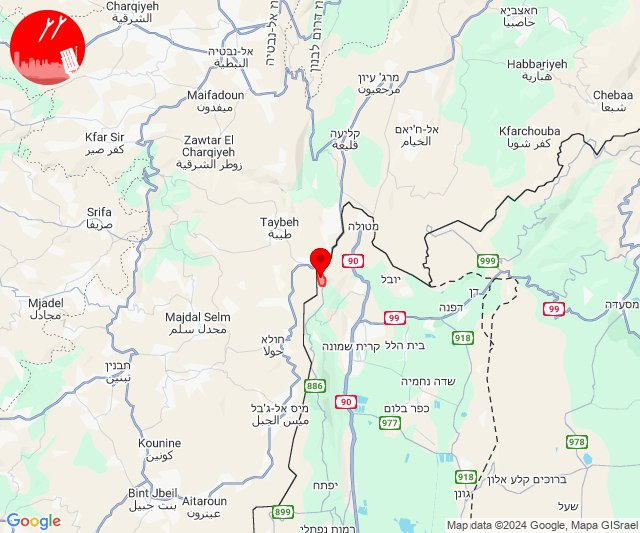

## 03:08

🔴 צבע אדום (02/10/2024):

06:08:
• קו העימות: משגב עם (מיידי)

צופר - צבע אדום

## 03:08

## 03:29

🔴 צבע אדום (02/10/2024):

06:29:
• קו העימות: אביבים, אביבים (מיידי)

צופר - צבע אדום

## 03:29

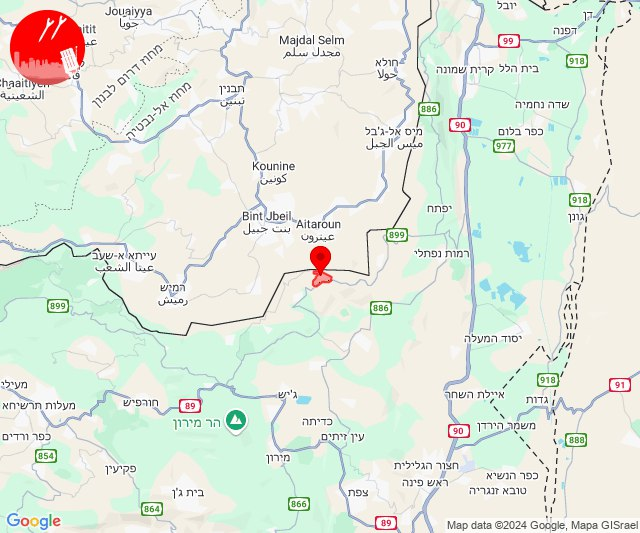

## 03:40

🔴 צבע אדום (02/10/2024):

06:40:
• קו העימות: שדה נחמיה, בית הלל, קריית שמונה, הגושרים (מיידי)

צופר - צבע אדום

## 03:40

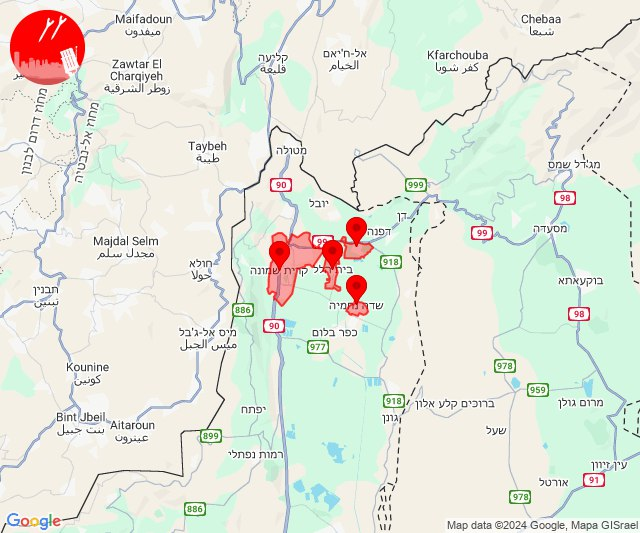

## 04:08

🔴 צבע אדום (02/10/2024):

07:08:
• קו העימות: מטולה (מיידי)

צופר - צבע אדום

## 04:08

## 04:11

🔴 צבע אדום (02/10/2024):

07:11:
• קו העימות: זרעית, שומרה, אבן מנחם (מיידי)

צופר - צבע אדום

## 04:11

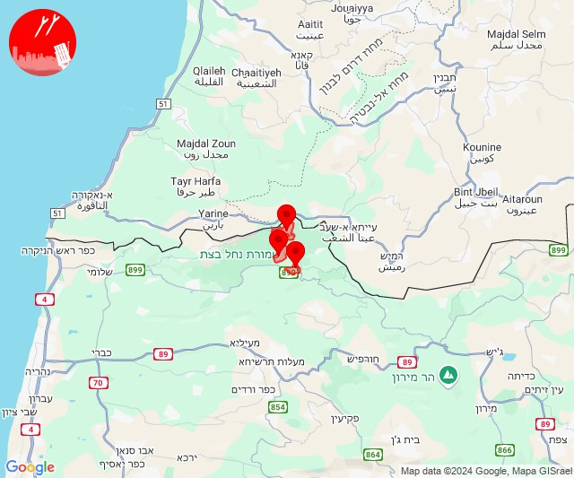

## 04:20

🔴 צבע אדום (02/10/2024):

07:20:
• קו העימות: שתולה (מיידי)

צופר - צבע אדום

## 04:20

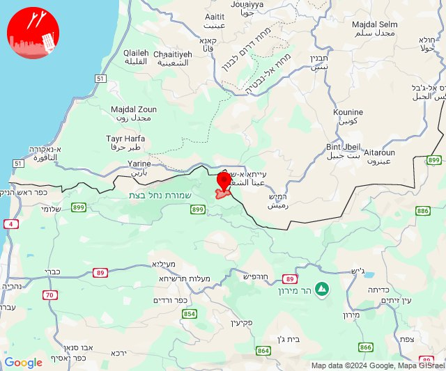

## 04:26

🔴 צבע אדום (02/10/2024):

07:25:
• קו העימות: מטולה (מיידי)

07:26:
• קו העימות: מטולה (מיידי)

צופר - צבע אדום

## 04:26

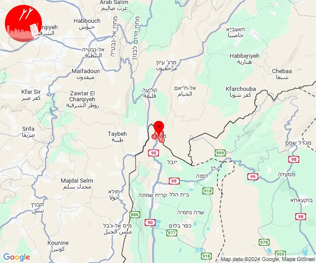

## 04:39

🔴 צבע אדום (02/10/2024):

07:39:
• קו העימות: יראון (מיידי)

צופר - צבע אדום

## 04:39

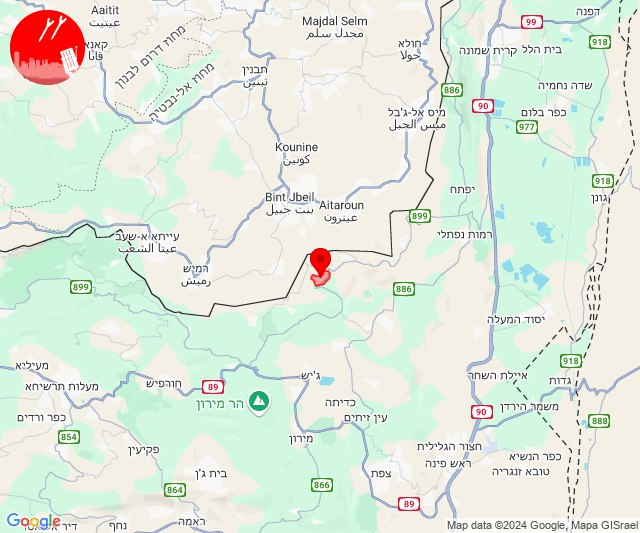

## 05:01

🔴 צבע אדום (02/10/2024):

08:00:
• קו העימות: בית הלל, הגושרים, דפנה, כפר גלעדי, קריית שמונה, תל חי (מיידי)

08:01:
• קו העימות: שאר ישוב, הגושרים (מיידי)

צופר - צבע אדום

## 05:01

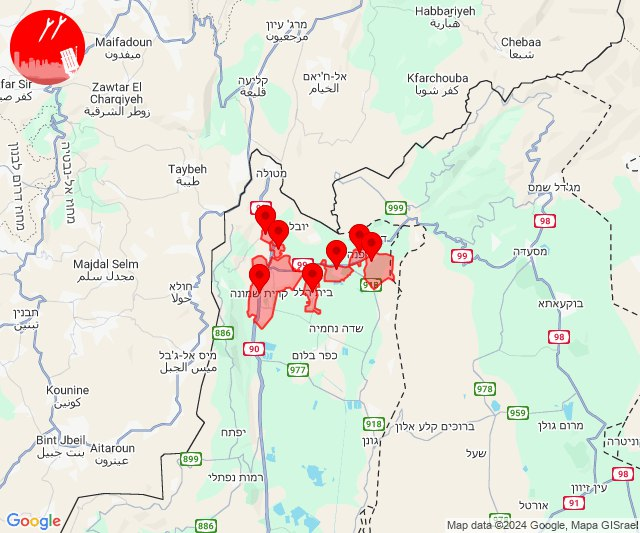

## 05:24

🔴 צבע אדום (02/10/2024):

08:24:
• קו העימות: אבן מנחם, שומרה, שתולה, זרעית (מיידי)

צופר - צבע אדום

## 05:24

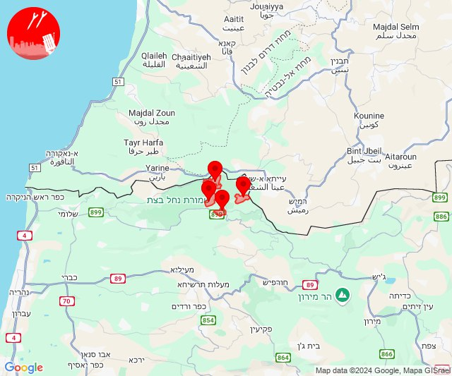

## 05:32

🔴 צבע אדום (02/10/2024):

08:32:
• קו העימות: משגב עם (מיידי)

צופר - צבע אדום

## 05:32

## 05:35

🔴 צבע אדום (02/10/2024):

08:35:
• קו העימות: בית הלל, כפר גלעדי, כפר יובל, מטולה, מנרה, מעיין ברוך, מרגליות, משגב עם, קריית שמונה, תל חי (מיידי)

צופר - צבע אדום

## 05:35

## 05:54

🔴 צבע אדום (02/10/2024):

08:54:
• קו העימות: שמיר (15 שניות)

צופר - צבע אדום

## 05:54

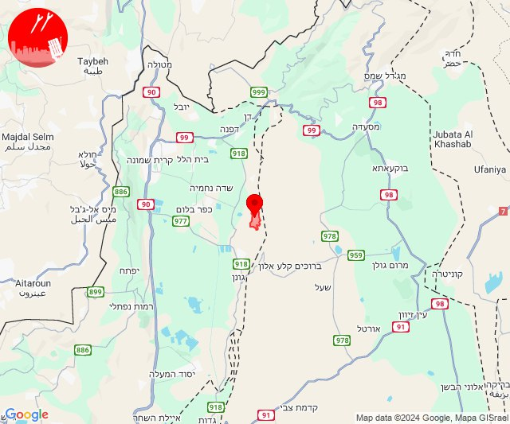

## 06:15

🔴 צבע אדום (02/10/2024):

09:14:
• קו העימות: זרעית, ערב אל עראמשה (מיידי)

09:15:
• קו העימות: שומרה, זרעית (מיידי)

צופר - צבע אדום

## 06:15

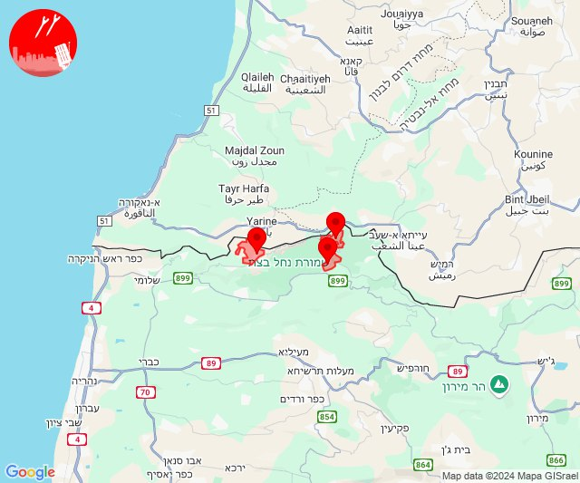

## 06:17

🔴 צבע אדום (02/10/2024):

09:17:
• קו העימות: מטולה (מיידי)

צופר - צבע אדום

## 06:17

## 06:27

🔴 צבע אדום (02/10/2024):

09:26:
• קו העימות: אביבים, יראון (מיידי)

09:27:
• קו העימות: עלמה, ריחאנייה, אביבים (מיידי)

צופר - צבע אדום

## 06:27

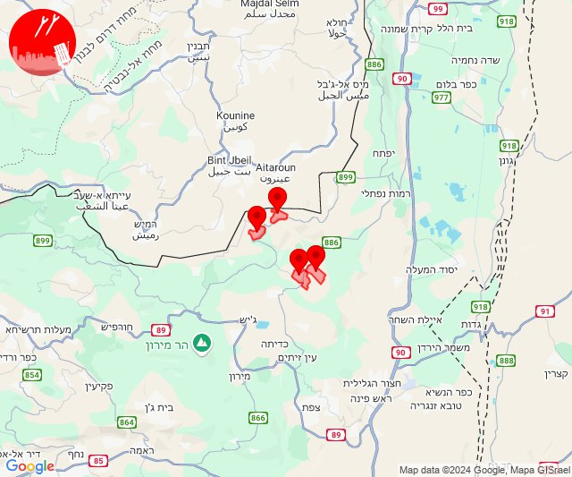

## 06:51

🔴 צבע אדום (02/10/2024):

09:51:
• קו העימות: משגב עם (מיידי)

צופר - צבע אדום

## 06:51

## 06:53

🔴 צבע אדום (02/10/2024):

09:53:
• קו העימות: נווה זיו, מנות, עבדון, יערה, אדמית, גשר הזיו, מצובה, שלומי, ערב אל עראמשה (מיידי)
• גליל עליון: אזור תעשייה שער נעמן, כפר מסריק (דקה, 30 שניות)
• המפרץ: קריית ביאליק, קריית מוצקין, אזור תעשייה קריית ביאליק, קריית ים (דקה)

צופר - צבע אדום

## 06:53

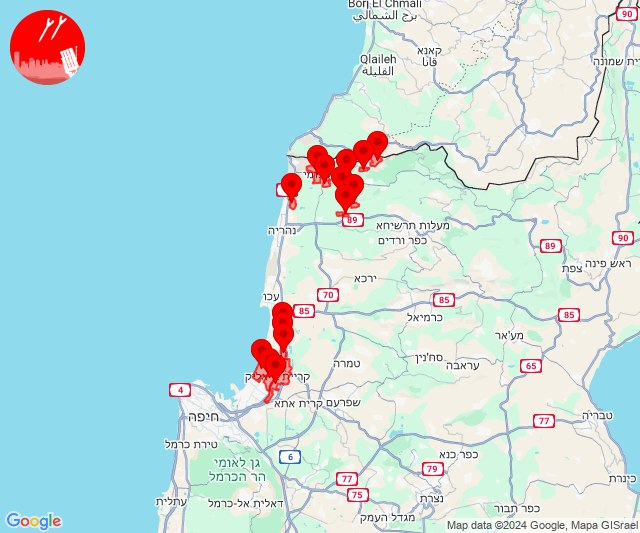

## 08:28

🔴 צבע אדום (02/10/2024):

11:27:
• קו העימות: עבדון, חניתה, יערה, נווה זיו, שלומי (מיידי)

11:28:
• קו העימות: כברי, מצובה, חניתה (מיידי)

צופר - צבע אדום

## 08:28

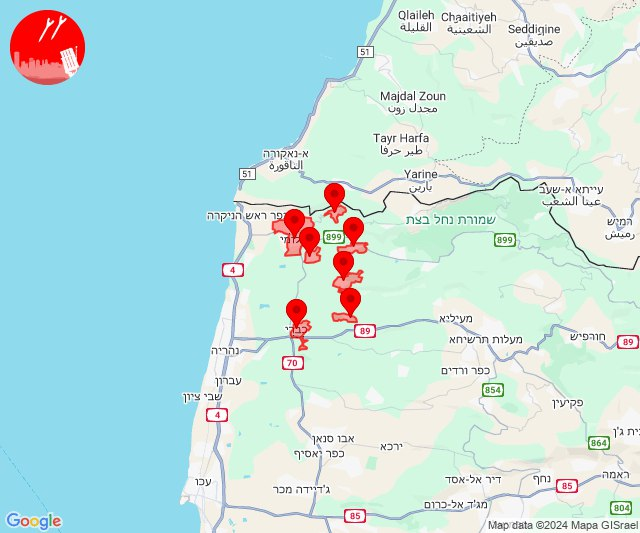

## 08:33

🔴 צבע אדום (02/10/2024):

11:33:
• קו העימות: יראון (מיידי)

צופר - צבע אדום

## 08:33

## 08:48

🔴 צבע אדום (02/10/2024):

11:48:
• קו העימות: אביבים (מיידי)

צופר - צבע אדום

## 08:48

## 09:09

🔴 צבע אדום (02/10/2024):

12:09:
• קו העימות: יערה, עבדון (מיידי)

צופר - צבע אדום

## 09:09

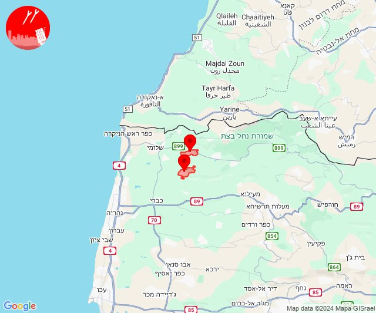

## 09:12

✈️ חדירת כלי טיס עוין (02/10/2024):

12:09:
• קו העימות: מנות, חוות אירוח גורן, אילון, חניתה 

12:10:
• קו העימות: נווה זיו, שלומי, חניתה, בצת 

12:11:
• קו העימות: שלומי 

12:12:
• קו העימות: ראש הנקרה 

צופר - צבע אדום

## 09:12

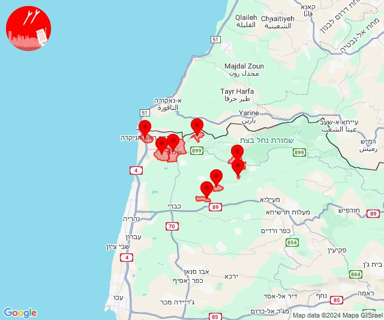

## 10:03

🔴 צבע אדום (02/10/2024):

13:01:
• גליל עליון: צפת - עיר, צפת - עכברה, כפר שמאי (30 שניות)

13:02:
• גליל עליון: כורזים ורד הגליל, עמיעד, כחל, בר יוחאי, מירון, מרכז אזורי מרום גליל, צפת - נוף כנרת, צפת - עיר, צפת - עכברה, קדרים, אמירים, טבחה, כפר שמאי (30 שניות, דקה)

13:03:
• גליל עליון: צפת - עכברה (30 שניות)

צופר - צבע אדום

## 10:03

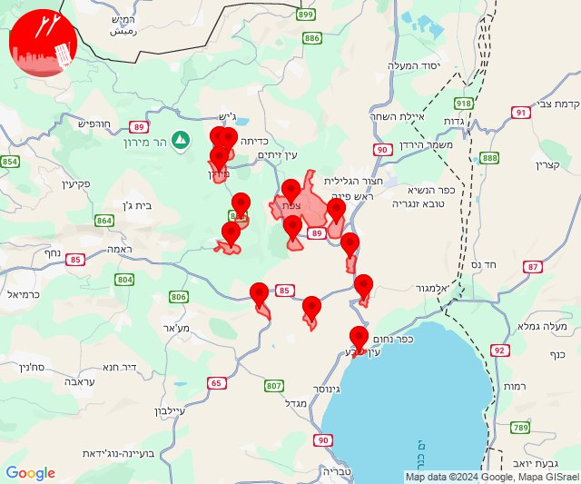

## 10:09

✈️ חדירת כלי טיס עוין (02/10/2024):

13:07:
• קו העימות: מנות, נווה זיו, עבדון 

13:08:
• קו העימות: מנות 

13:09:
• קו העימות: געתון, יחיעם 
• גליל עליון: ינוח ג'ת, כליל, אבו סנאן, ירכא, עמקה 

צופר - צבע אדום

## 10:09

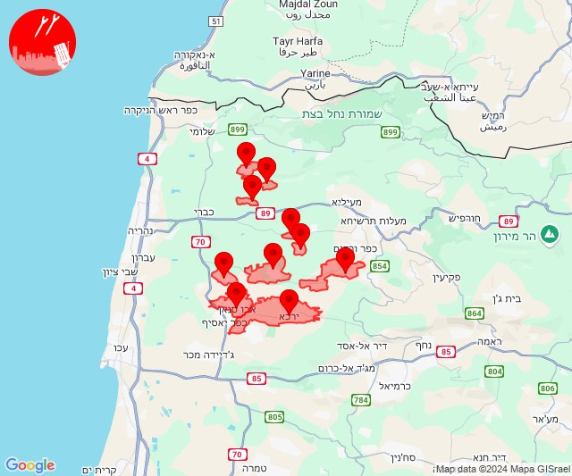

## 10:12

🔴 צבע אדום (02/10/2024):

13:12:
• קו העימות: יראון (מיידי)

צופר - צבע אדום

## 10:12

## 11:45

🔴 צבע אדום (02/10/2024):

14:45:
• קו העימות: משגב עם (מיידי)

צופר - צבע אדום

## 11:45

## 11:50

🔴 צבע אדום (02/10/2024):

14:50:
• קו העימות: בית הלל, כפר גלעדי, כפר יובל, מטולה, מנרה, מעיין ברוך, מרגליות, משגב עם, קריית שמונה, תל חי (מיידי)

צופר - צבע אדום

## 11:50

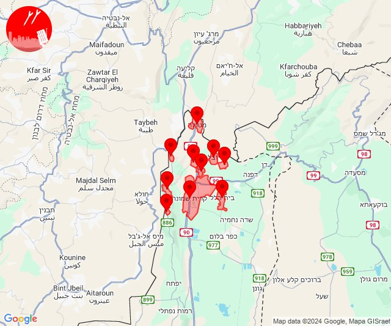

## 11:52

🔴 צבע אדום (02/10/2024):

14:52:
• קו העימות: משגב עם (מיידי)

צופר - צבע אדום

## 11:52

## 12:35

🔴 צבע אדום (02/10/2024):

15:35:
• קו העימות: אבן מנחם (מיידי)

צופר - צבע אדום

## 12:35

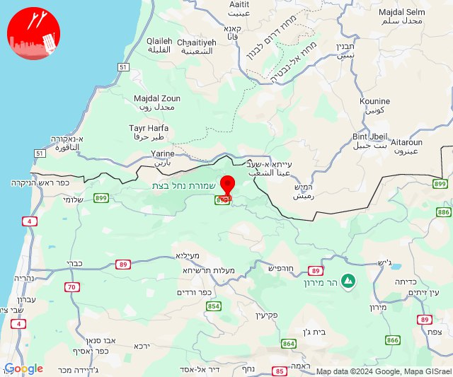

## 13:19

🔴 צבע אדום (02/10/2024):

16:19:
• קו העימות: משגב עם (מיידי)

צופר - צבע אדום

## 13:19

## 14:21

🔴 צבע אדום (02/10/2024):

17:21:
• קו העימות: מטולה (מיידי)

צופר - צבע אדום

## 14:21

## 14:33

🔴 צבע אדום (02/10/2024):

17:33:
• קו העימות: משגב עם (מיידי)

צופר - צבע אדום

## 14:33

## 14:47

🔴 צבע אדום (02/10/2024):

17:45:
• קו העימות: יערה, חניתה, מצובה (מיידי)

17:46:
• קו העימות: יערה, חניתה, מצובה, עבדון, שלומי, יערה (מיידי)

17:47:
• קו העימות: חניתה, מצובה, יערה, חניתה (מיידי)

צופר - צבע אדום

## 14:47

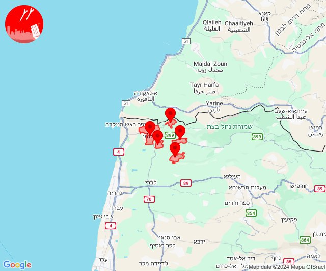

## 15:39

🔴 צבע אדום (02/10/2024):

18:37:
• קו העימות: אביבים, אביבים (מיידי)

18:38:
• קו העימות: אביבים, יראון (מיידי)

18:39:
• קו העימות: אביבים (מיידי)

צופר - צבע אדום

## 15:39

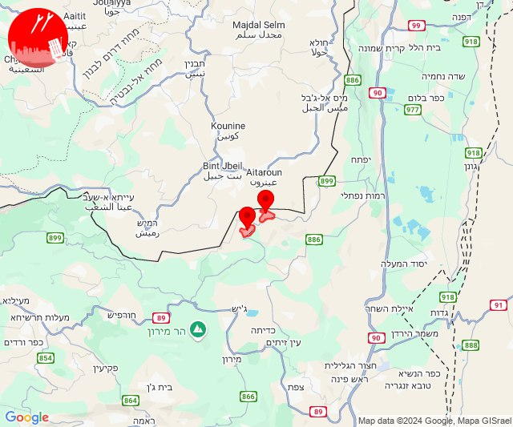

## 16:27

🔴 צבע אדום (02/10/2024):

19:26:
• גליל עליון: בוסתן הגליל, שבי ציון, מזרעה, רגבה, עכו, שומרת, לוחמי הגטאות, שבי ציון (30 שניות)
• קו העימות: נהריה, עברון, בצת, לימן, שלומי, נהריה (15 שניות, מיידי)

19:27:
• גליל עליון: בוסתן הגליל (30 שניות)

צופר - צבע אדום

## 16:27

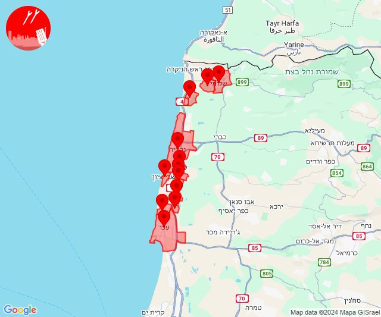

## 17:01

🔴 צבע אדום (02/10/2024):

20:00:
• קו העימות: דישון (מיידי)
• גליל עליון: טובא זנגריה, כפר הנשיא, מחניים, מנחת מחניים, איילת השחר, שדה אליעזר, אזור תעשייה צ.ח.ר, גדות, משמר הירדן, כרכום, אזור תעשייה חצור הגלילית (30 שניות)

20:01:
• גליל עליון: מחניים, טובא זנגריה, כפר הנשיא, חצור הגלילית, מנחת מחניים, איילת השחר, משמר הירדן, אזור תעשייה צ.ח.ר, מחניים, אזור תעשייה חצור הגלילית (30 שניות)
• דרום הגולן: חד נס (15 שניות)

צופר - צבע אדום

## 17:01

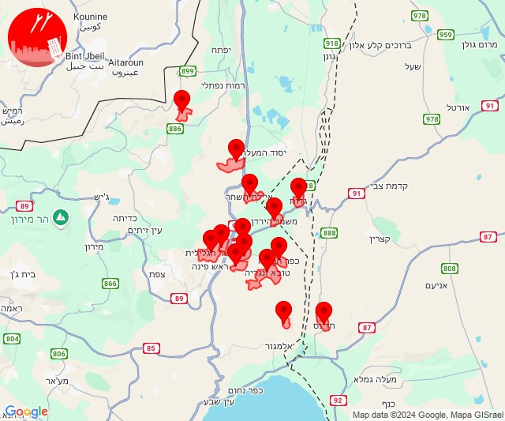

## 19:13

🔴 צבע אדום (02/10/2024):

22:13:
• גליל עליון: צפת - עיר, עמוקה, חצור הגלילית, ראש פינה (30 שניות)

צופר - צבע אדום

## 19:13

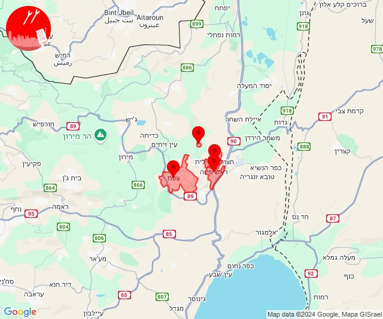

## 20:07

🔴 צבע אדום (02/10/2024):

23:07:
• קו העימות: אביבים (מיידי)

צופר - צבע אדום

## 20:07

## 21:47

🔴 צבע אדום (03/10/2024):

00:47:
• קו העימות: חניתה (מיידי)

צופר - צבע אדום

## 21:47

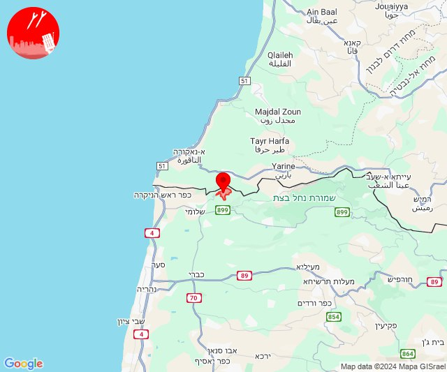

## 23:53

✈️ חדירת כלי טיס עוין (03/10/2024):

02:53:
• דן: בת ים 

צופר - צבע אדום

## 23:53

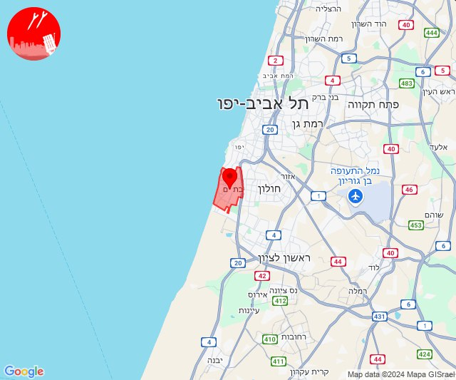

