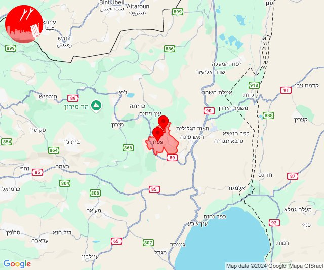

# Alerts for 2024-10-03

## 00:26

✈️ חדירת כלי טיס עוין (03/10/2024):

03:26:
• צפון הגולן: אודם, אורטל, אל רום, בוקעתא, מרום גולן, עין זיוון 
• דרום הגולן: אלוני הבשן 

צופר - צבע אדום

## 00:26

## 00:30

🔴 צבע אדום (03/10/2024):

03:30:
• קו העימות: מצובה, שלומי, חניתה (מיידי)

צופר - צבע אדום

## 00:30

## 04:31

🔴 צבע אדום (03/10/2024):

07:31:
• קו העימות: אביבים (מיידי)

צופר - צבע אדום

## 04:31

## 04:38

🔴 צבע אדום (03/10/2024):

07:38:
• עוטף עזה: נחל עוז (15 שניות)

צופר - צבע אדום

## 04:38

## 04:48

🔴 צבע אדום (03/10/2024):

07:48:
• קו העימות: משגב עם, מטולה (מיידי)

צופר - צבע אדום

## 04:48

## 06:05

🔴 צבע אדום (03/10/2024):

09:05:
• קו העימות: קריית שמונה, מרגליות, משגב עם (מיידי)

צופר - צבע אדום

## 06:05

## 06:07

🔴 צבע אדום (03/10/2024):

09:07:
• קו העימות: מטולה (מיידי)

צופר - צבע אדום

## 06:07

## 06:10

🔴 צבע אדום (03/10/2024):

09:09:
• קו העימות: מעיין ברוך, כפר יובל, תל חי, כפר גלעדי, קריית שמונה, מרגליות, משגב עם (מיידי)

09:10:
• קו העימות: כפר יובל, קריית שמונה, מרגליות, מטולה (מיידי)

צופר - צבע אדום

## 06:10

## 06:27

🔴 צבע אדום (03/10/2024):

09:26:
• קו העימות: יראון, אביבים, ברעם (מיידי)

09:27:
• קו העימות: אביבים, יראון (מיידי)

צופר - צבע אדום

## 06:27

## 07:25

🔴 צבע אדום (03/10/2024):

10:25:
• קו העימות: דוב''ב (מיידי)

צופר - צבע אדום

## 07:25

## 07:38

🔴 צבע אדום (03/10/2024):

10:37:
• קו העימות: שתולה (מיידי)

10:38:
• קו העימות: שתולה (מיידי)

צופר - צבע אדום

## 07:38

## 08:09

🔴 צבע אדום (03/10/2024):

11:08:
• גליל עליון: ביריה, צפת - עיר (30 שניות)

11:09:
• קו העימות: דלתון (מיידי)
• גליל עליון: קדיתא, ביריה, צפת - עיר (30 שניות)

צופר - צבע אדום

## 08:09

## 08:18

🔴 צבע אדום (03/10/2024):

11:18:
• גליל תחתון: טבריה, מצפה, כפר חיטים (דקה)
• קו העימות: כפר גלעדי, משגב עם (מיידי)

צופר - צבע אדום

## 08:18

## 08:31

🔴 צבע אדום (03/10/2024):

11:30:
• קו העימות: יערה, מצובה, שלומי, חניתה (מיידי)

11:31:
• קו העימות: יערה, מצובה, שלומי, מצובה, יערה (מיידי)

צופר - צבע אדום

## 08:31

## 08:41

✈️ חדירת כלי טיס עוין (03/10/2024):

11:40:
• קו העימות: שלומי 

11:41:
• קו העימות: בצת, ראש הנקרה, איזור תעשייה מילואות צפון, חוף בצת 

צופר - צבע אדום

## 08:41

## 08:51

🔴 צבע אדום (03/10/2024):

11:51:
• קו העימות: נטועה, שתולה (מיידי)

צופר - צבע אדום

## 08:51

## 09:01

🔴 צבע אדום (03/10/2024):

12:01:
• קו העימות: סאסא (מיידי)

צופר - צבע אדום

## 09:01

## 09:17

🔴 צבע אדום (03/10/2024):

12:17:
• קו העימות: אביבים, יראון (מיידי)

צופר - צבע אדום

## 09:17

## 09:21

🔴 צבע אדום (03/10/2024):

12:21:
• קו העימות: מתת, חורפיש (מיידי)

צופר - צבע אדום

## 09:21

## 09:24

🔴 צבע אדום (03/10/2024):

12:24:
• קו העימות: סאסא, בית ספר שדה מירון, דוב''ב (מיידי)

צופר - צבע אדום

## 09:24

## 09:33

🔴 צבע אדום (03/10/2024):

12:33:
• קו העימות: מתת (מיידי)

צופר - צבע אדום

## 09:33

## 09:46

🔴 צבע אדום (03/10/2024):

12:45:
• קו העימות: צבעון, דוב''ב (מיידי)

12:46:
• קו העימות: סאסא (מיידי)

צופר - צבע אדום

## 09:46

## 09:47

✈️ חדירת כלי טיס עוין (03/10/2024):

12:47:
• צפון הגולן: אודם, אל רום, בוקעתא, מג'דל שמס, מסעדה, נווה אטי''ב, נמרוד, עין קנייא 

צופר - צבע אדום

## 09:47

## 09:56

🔴 צבע אדום (03/10/2024):

12:56:
• קו העימות: אביבים (מיידי)

צופר - צבע אדום

## 09:56

## 10:10

🔴 צבע אדום (03/10/2024):

13:09:
• קו העימות: מצובה, שלומי, חניתה (מיידי)

13:10:
• קו העימות: חניתה (מיידי)

צופר - צבע אדום

## 10:10

## 11:28

✈️ חדירת כלי טיס עוין (03/10/2024):

14:28:
• קו העימות: רמות נפתלי 

צופר - צבע אדום

## 11:28

## 11:29

🔴 צבע אדום (03/10/2024):

14:29:
• קו העימות: רמות נפתלי (מיידי)

צופר - צבע אדום

## 11:29

## 11:32

✈️ חדירת כלי טיס עוין (03/10/2024):

14:31:
• גליל עליון: גדות, רפטינג נהר הירדן 

14:32:
• צפון הגולן: מלון פרא 
• דרום הגולן: קדמת צבי, קצרין - אזור תעשייה, קצרין 

צופר - צבע אדום

## 11:32

## 11:47

🔴 צבע אדום (03/10/2024):

14:47:
• קו העימות: ראש הנקרה, חוף בצת, איזור תעשייה מילואות צפון (מיידי)

צופר - צבע אדום

## 11:47

## 13:00

🔴 צבע אדום (03/10/2024):

16:00:
• קו העימות: כפר גלעדי (מיידי)

צופר - צבע אדום

## 13:00

## 13:32

🔴 צבע אדום (03/10/2024):

16:30:
• מרכז הגליל: ערב אל נעים, אשבל, אשחר, סכנין, יודפת, אזור תעשייה תרדיון, יובלים, שורשים, שעב, יעד, עצמון - שגב (30 שניות, דקה)
• גליל עליון: כרמיאל, צורית גילון, מג'דל כרום (30 שניות)
• קו העימות: ערב אל עראמשה (מיידי)

16:31:
• מרכז הגליל: עראבה, רקפת (דקה)

16:32:
• מרכז הגליל: מעלה צביה, ערב אל נעים, אשבל, אשחר, סכנין, אזור תעשייה תרדיון, יודפת, מרכז אזורי משגב, קורנית, שכניה (דקה, 30 שניות)
• גליל עליון: כרמיאל (30 שניות)

צופר - צבע אדום

## 13:32

## 14:26

🔴 צבע אדום (03/10/2024):

17:26:
• קו העימות: תל חי, משגב עם, קריית שמונה (מיידי)

צופר - צבע אדום

## 14:26

## 15:15

🔴 צבע אדום (03/10/2024):

18:12:
• קו העימות: מטולה (מיידי)

18:13:
• קו העימות: מטולה, מטולה (מיידי)

18:14:
• קו העימות: מטולה (מיידי)

18:15:
• קו העימות: מטולה (מיידי)

צופר - צבע אדום

## 15:15

## 15:23

🔴 צבע אדום (03/10/2024):

18:23:
• קו העימות: אביבים, יראון (מיידי)

צופר - צבע אדום

## 15:23

## 15:46

🔴 צבע אדום (03/10/2024):

18:46:
• קו העימות: צבעון (מיידי)

צופר - צבע אדום

## 15:46

## 16:00

🔴 צבע אדום (03/10/2024):

19:00:
• גליל עליון: ביריה, צפת - עיר (30 שניות)

צופר - צבע אדום

## 16:00

## 17:02

🔴 צבע אדום (03/10/2024):

20:02:
• קו העימות: קריית שמונה (מיידי)

צופר - צבע אדום

## 17:02

## 18:45

🔴 צבע אדום (03/10/2024):

21:45:
• קו העימות: משגב עם (מיידי)

צופר - צבע אדום

## 18:45

## 18:49

🔴 צבע אדום (03/10/2024):

21:48:
• גליל עליון: אזור תעשייה שער נעמן, אפק, אזור תעשייה בר-לב, אחיהוד, יסעור, ג'וליס, טל - אל, כפר מסריק, עין המפרץ, עכו - אזור תעשייה, בית העלמין החדש עכו, ג'דידה מכר (דקה, 30 שניות)
• המפרץ: קריית אתא, קריית ביאליק, קריית ים, קריית מוצקין, אזור תעשייה קריית ביאליק, חיפה - קריית חיים ושמואל, כפר ביאליק (דקה)
• מרכז הגליל: אזור תעשייה טמרה, טמרה, כאבול, שפרעם, אעבלין, מצפה אבי''ב (דקה)

21:49:
• גליל עליון: ירכא (30 שניות)

צופר - צבע אדום

## 18:49

