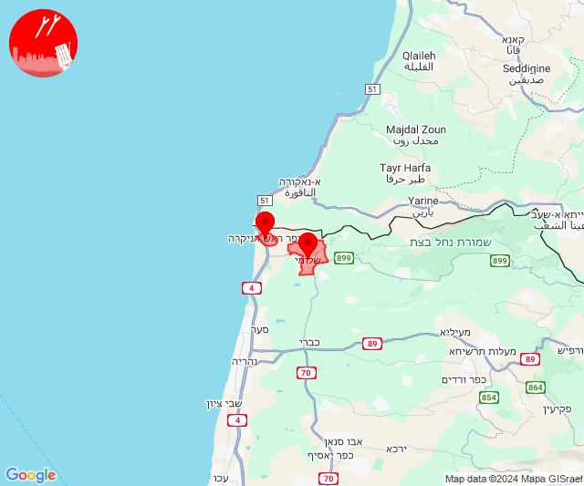

# Alerts for 2024-10-04

## 00:16

✈️ חדירת כלי טיס עוין (04/10/2024):

03:15:
• בקעת בית שאן: מנחמיה 

03:16:
• בקעת בית שאן: גשר 

צופר - צבע אדום

## 00:16

## 01:13

🔴 צבע אדום (04/10/2024):

04:13:
• קו העימות: יראון (מיידי)

צופר - צבע אדום

## 01:13

## 02:45

🔴 צבע אדום (04/10/2024):

05:45:
• קו העימות: חניתה, אבן מנחם, אדמית, ערב אל עראמשה, שומרה (מיידי)

צופר - צבע אדום

## 02:45

## 04:04

🔴 צבע אדום (04/10/2024):

07:01:
• קו העימות: חניתה (מיידי)
• המפרץ: חיפה - מפרץ, חיפה - קריית חיים ושמואל, קריית ים, קריית מוצקין, כפר ביאליק, קריית ביאליק, אזור תעשייה קריית ביאליק, קריית אתא (דקה)
• גליל עליון: אזור תעשייה שער נעמן, כפר מסריק, עכו - אזור תעשייה (דקה, 30 שניות)

07:02:
• גליל עליון: עין המפרץ (30 שניות)

07:03:
• גליל עליון: עכו, בוסתן הגליל, לוחמי הגטאות, רגבה (30 שניות)
• קו העימות: בן עמי, נהריה, סער (מיידי, 15 שניות)
• המפרץ: כפר ביאליק, קריית ביאליק (דקה)

07:04:
• גליל עליון: אזור תעשייה שער נעמן (דקה)
• המפרץ: קריית ים, קריית מוצקין, אזור תעשייה קריית ביאליק (דקה)

צופר - צבע אדום

## 04:04

## 04:23

🔴 צבע אדום (04/10/2024):

07:23:
• גליל עליון: קדיתא, ספסופה - כפר חושן, קדיתא (30 שניות)
• קו העימות: דלתון, אזור תעשייה רמת דלתון, ג'ש - גוש חלב, כרם בן זמרה (מיידי)

צופר - צבע אדום

## 04:23

## 05:10

🔴 צבע אדום (04/10/2024):

08:10:
• קו העימות: אבירים, פסוטה (מיידי)

צופר - צבע אדום

## 05:10

## 05:33

🔴 צבע אדום (04/10/2024):

08:33:
• קו העימות: בית ספר שדה מירון, סאסא (מיידי)

צופר - צבע אדום

## 05:33

## 05:52

🔴 צבע אדום (04/10/2024):

08:52:
• קו העימות: יראון (מיידי)

צופר - צבע אדום

## 05:52

## 05:58

🔴 צבע אדום (04/10/2024):

08:58:
• קו העימות: מרגליות, משגב עם (מיידי)

צופר - צבע אדום

## 05:58

## 06:11

🔴 צבע אדום (04/10/2024):

09:11:
• קו העימות: דוב''ב (מיידי)

צופר - צבע אדום

## 06:11

## 06:39

🔴 צבע אדום (04/10/2024):

09:38:
• קו העימות: קריית שמונה, מרגליות (מיידי)

09:39:
• קו העימות: מנרה (מיידי)

צופר - צבע אדום

## 06:39

## 07:03

🔴 צבע אדום (04/10/2024):

10:03:
• קו העימות: דוב''ב, דוב''ב (מיידי)

צופר - צבע אדום

## 07:03

## 07:15

🔴 צבע אדום (04/10/2024):

10:15:
• מרכז הגליל: חזון, מורן, מע'אר, עינבר, בועיינה-נוג'ידאת, מצפה נטופה, טורעאן, כפר חנניה (דקה)
• גליל תחתון: גבעת אבני, הודיות, לביא, כפר נהר הירדן, שדה אילן, אתר ההנצחה גולני, אזור תעשייה קדמת גליל, נבי שועייב (דקה)
• העמקים: אילניה (דקה)
• גליל עליון: עין אל אסד (30 שניות)

צופר - צבע אדום

## 07:15

## 07:52

🔴 צבע אדום (04/10/2024):

10:49:
• מנשה: בית חנניה, ג'סר א-זרקא, מעגן מיכאל, קיסריה, צומת בנימינה, תלמי אלעזר (דקה וחצי)

10:50:
• מנשה: מעיין צבי, רמת הנדיב, מרכז ימי קיסריה, זכרון יעקב, בית ספר אורט בנימינה (דקה וחצי)
• הכרמל: דור, נחשולים (דקה)

10:52:
• ואדי ערה: אזור תעשייה יקנעם עילית, אזור תעשייה מבוא כרמל, אליקים, יקנעם עילית, עין העמק, רמות מנשה (דקה וחצי)
• מנשה: עמיקם, נשר, החותרים, טירת כרמל, כפר גלים (דקה וחצי, דקה)
• המפרץ: חיפה - כרמל, הדר ועיר תחתית, חיפה - מערב, חיפה - נווה שאנן ורמות כרמל (דקה)
• הכרמל: בית אורן, גבעת וולפסון, דלית אל כרמל, עספיא, אזור תעשייה ניר עציון, בית צבי, בת שלמה, גבע כרמל, הבונים, כפר הנוער ימין אורד, כרם מהר''ל, מאיר שפיה, מגדים, מרכז מיר''ב, נווה ים, ניר עציון, עופר, עין איילה, עין הוד, עין חוד, עין כרמל, עתלית, פוריידיס, צרופה, יערות הכרמל, כלא דמון (דקה)

צופר - צבע אדום

## 07:52

## 07:58

🔴 צבע אדום (04/10/2024):

10:57:
• קו העימות: צבעון (מיידי)

10:58:
• קו העימות: צבעון (מיידי)

צופר - צבע אדום

## 07:58

## 08:18

🔴 צבע אדום (04/10/2024):

11:17:
• קו העימות: ברעם, יראון, דוב''ב (מיידי)

11:18:
• קו העימות: ברעם, סאסא (מיידי)

צופר - צבע אדום

## 08:18

## 08:47

🔴 צבע אדום (04/10/2024):

11:47:
• קו העימות: דוב''ב, מתת, סאסא (מיידי)

צופר - צבע אדום

## 08:47

## 10:01

🔴 צבע אדום (04/10/2024):

12:59:
• מרכז הגליל: שעב, יעד, כאבול (דקה)
• גליל עליון: אזור תעשייה בר-לב (דקה)

13:00:
• גליל עליון: צורית גילון, מג'דל כרום, טל - אל, פלך, תובל, ג'דידה מכר, בית העלמין החדש עכו, ג'וליס, אחיהוד, יסעור, צורית גילון, מג'דל כרום (30 שניות, דקה)
• מרכז הגליל: כאוכב אבו אלהיג'א, מנוף, מרכז אזורי משגב, עצמון - שגב, קורנית, רקפת, שכניה, טמרה, שורשים, יובלים (דקה)
• קו העימות: חוות אירוח גורן, הילה (מיידי)

13:01:
• גליל עליון: פלך, תובל, צורית גילון (30 שניות)

צופר - צבע אדום

## 10:01

## 10:04

🔴 צבע אדום (04/10/2024):

13:04:
• קו העימות: שלומי, ראש הנקרה (מיידי)

צופר - צבע אדום

## 10:04

## 10:42

🔴 צבע אדום (04/10/2024):

13:42:
• קו העימות: דוב''ב, סאסא, דוב''ב (מיידי)

צופר - צבע אדום

## 10:42

## 11:12

🔴 צבע אדום (04/10/2024):

14:12:
• עוטף עזה: עין השלושה, כיסופים (15 שניות)

צופר - צבע אדום

## 11:12

## 11:24

🔴 צבע אדום (04/10/2024):

14:24:
• מרכז הגליל: חוסנייה (דקה)
• גליל עליון: אזור תעשייה כרמיאל, כרמיאל, הר חלוץ, חרשים, נחף, סאג'ור, בענה, דיר אל-אסד, לבון, אזור תעשייה כרמיאל, כרמיאל, מכמנים (30 שניות)

צופר - צבע אדום

## 11:24

## 12:26

🔴 צבע אדום (04/10/2024):

15:26:
• קו העימות: שומרה, זרעית (מיידי)

צופר - צבע אדום

## 12:26

## 12:59

🔴 צבע אדום (04/10/2024):

15:58:
• קו העימות: חורפיש, אלקוש, מתת (מיידי)

15:59:
• קו העימות: מתת (מיידי)

צופר - צבע אדום

## 12:59

## 14:22

🔴 צבע אדום (04/10/2024):

17:22:
• קו העימות: מטולה, ע'ג'ר (מיידי)

צופר - צבע אדום

## 14:22

## 14:47

🔴 צבע אדום (04/10/2024):

17:46:
• דרום הגולן: קדמת צבי, קצרין - אזור תעשייה, קצרין (15 שניות, 30 שניות)

17:47:
• דרום הגולן: קדמת צבי, אניעם, קצרין - אזור תעשייה (15 שניות, 30 שניות)

צופר - צבע אדום

## 14:47

## 15:00

🔴 צבע אדום (04/10/2024):

18:00:
• דרום הגולן: קצרין (30 שניות)
• צפון הגולן: מלון פרא (15 שניות)

צופר - צבע אדום

## 15:00

## 15:04

🔴 צבע אדום (04/10/2024):

18:03:
• קו העימות: תל חי, כפר גלעדי, קריית שמונה, כפר יובל, משגב עם, מטולה (מיידי)

18:04:
• קו העימות: כפר גלעדי, תל חי, כפר יובל (מיידי)

צופר - צבע אדום

## 15:04

## 15:06

🔴 צבע אדום (04/10/2024):

18:06:
• קו העימות: נאות מרדכי, כפר בלום (מיידי)

צופר - צבע אדום

## 15:06

## 15:12

🔴 צבע אדום (04/10/2024):

18:11:
• קו העימות: אביבים (מיידי)

18:12:
• קו העימות: אביבים (מיידי)

צופר - צבע אדום

## 15:12

## 15:25

🔴 צבע אדום (04/10/2024):

18:25:
• גליל עליון: אזור תעשייה צ.ח.ר, מחניים, מנחת מחניים, ראש פינה, אזור תעשייה חצור הגלילית, חצור הגלילית, איילת השחר, עמוקה (30 שניות)

צופר - צבע אדום

## 15:25

## 15:29

🔴 צבע אדום (04/10/2024):

18:28:
• קו העימות: סאסא, דוב''ב (מיידי)

18:29:
• קו העימות: סאסא (מיידי)

צופר - צבע אדום

## 15:29

## 15:32

🔴 צבע אדום (04/10/2024):

18:32:
• קו העימות: ברעם, יראון (מיידי)

צופר - צבע אדום

## 15:33

## 17:40

🔴 צבע אדום (04/10/2024):

20:40:
• קו העימות: כפר גלעדי, משגב עם, קריית שמונה, תל חי (מיידי)

צופר - צבע אדום

## 17:40

## 23:13

🔴 צבע אדום (05/10/2024):

02:13:
• קו העימות: כפר יובל (מיידי)

צופר - צבע אדום

## 23:13

## 23:58

🔴 צבע אדום (05/10/2024):

02:58:
• עוטף עזה: כיסופים, עין השלושה (15 שניות)

צופר - צבע אדום

## 23:58

