# Alerts for 2024-10-05

## 00:09

✈️ חדירת כלי טיס עוין (05/10/2024):

03:09:
• צפון הגולן: אורטל, מרום גולן, עין זיוון 
• דרום הגולן: אלוני הבשן 

צופר - צבע אדום

## 00:09

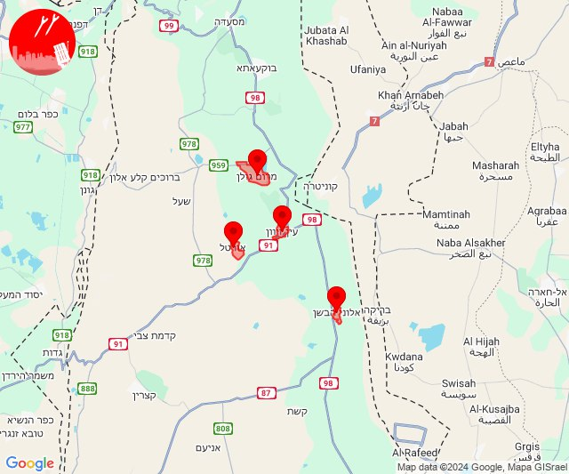

## 05:06

🔴 צבע אדום (05/10/2024):

08:05:
• ואדי ערה: מדרך עוז, קיבוץ מגידו, יקנעם המושבה והזורע, משמר העמק, בית סוהר מגידו (דקה וחצי)

08:06:
• העמקים: כפר ברוך, היוגב, בית שערים, גבת, יפעת, כפר יהושע, מגדל העמק, מנשית זבדה, נהלל, רמת דוד, רמת ישי, שדה יעקב, שריד, תחנת רכבת כפר ברוך, תחנת רכבת כפר יהושוע, בית לחם הגלילית, גבעת אלה, גניגר, זרזיר, חג'אג'רה, יפיע, כפר החורש, נצרת, עילוט, שמשית, תמרת, הסוללים (דקה)

צופר - צבע אדום

## 05:06

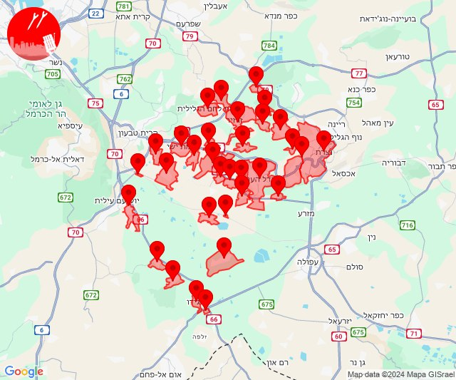

## 08:31

🔴 צבע אדום (05/10/2024):

11:30:
• גליל עליון: צפת - נוף כנרת, חצור הגלילית, צפת - עיר, ראש פינה, עמוקה, אליפלט, עמיעד, ביריה, ראש פינה (30 שניות)
• קו העימות: עלמה (מיידי)

11:31:
• גליל עליון: צפת - נוף כנרת (30 שניות)
• קו העימות: דלתון (מיידי)

צופר - צבע אדום

## 08:31

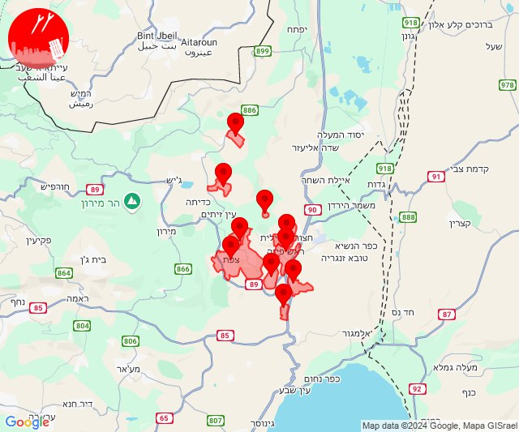

## 09:31

🔴 צבע אדום (05/10/2024):

12:31:
• קו העימות: ערב אל עראמשה (מיידי)

צופר - צבע אדום

## 09:31

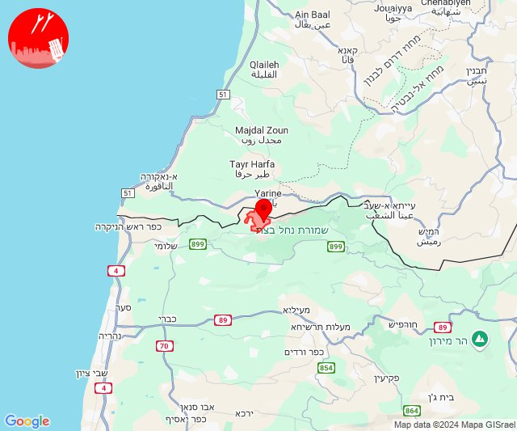

## 09:32

✈️ חדירת כלי טיס עוין (05/10/2024):

12:32:
• קו העימות: אדמית 

צופר - צבע אדום

## 09:32

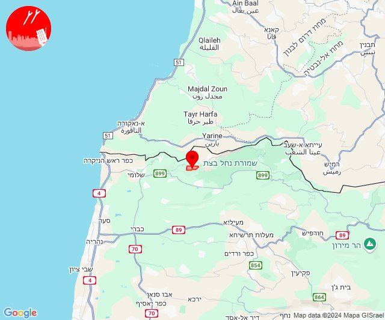

## 10:26

🔴 צבע אדום (05/10/2024):

13:26:
• המפרץ: אושה, כפר ביאליק, כפר המכבי, קריית ים, קריית מוצקין, רמת יוחנן, בית עלמין תל רגב, חיפה - כרמל, הדר ועיר תחתית, חיפה - מערב, חיפה - מפרץ, חיפה - נווה שאנן ורמות כרמל, חיפה - קריית חיים ושמואל, קריית אתא, קריית ביאליק, נשר, איבטין, טירת כרמל, יגור, כפר גלים, כפר חסידים, רכסים (דקה)
• העמקים: חוואלד (דקה)
• הכרמל: עספיא, בית סוהר קישון, כלא דמון (דקה)

צופר - צבע אדום

## 10:26

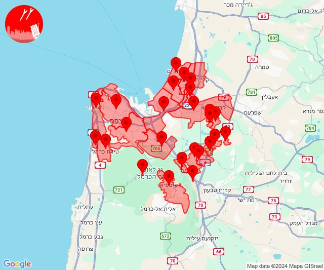

## 11:10

🔴 צבע אדום (05/10/2024):

14:09:
• מרכז הגליל: שורשים, ערב אל נעים, אשבל, אשחר, סכנין, יובלים, חוסנייה, אזור תעשייה תרדיון, מרכז אזורי משגב, עצמון - שגב (דקה, 30 שניות)
• גליל עליון: בענה, דיר אל-אסד, לבון, כרמיאל, מג'דל כרום, תובל, צורית גילון, נחף, אזור תעשייה כרמיאל, כמון, מכמנים, גיתה, ירכא, כישור, כסרא סמיע, לפידות, מגדל תפן (30 שניות)

14:10:
• גליל עליון: בענה, דיר אל-אסד, לבון, מג'דל כרום, כרמיאל, תובל, אזור תעשייה כרמיאל, נחף, צורית גילון (30 שניות)

צופר - צבע אדום

## 11:10

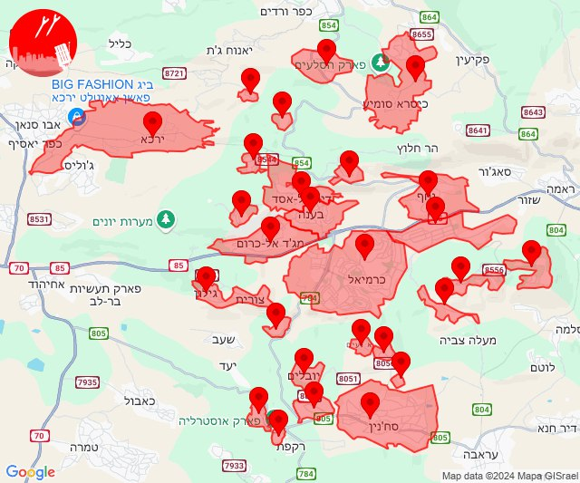

## 11:41

🔴 צבע אדום (05/10/2024):

14:41:
• קו העימות: דוב''ב (מיידי)

צופר - צבע אדום

## 11:41

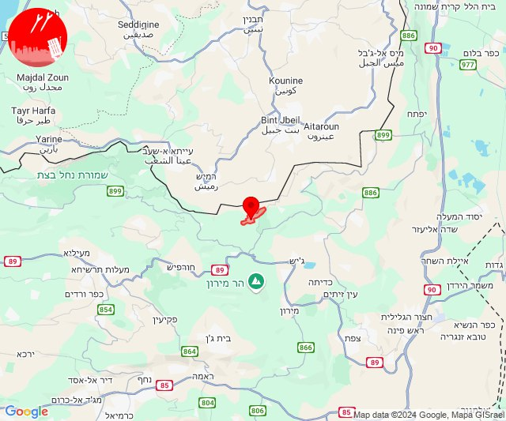

## 11:53

🔴 צבע אדום (05/10/2024):

14:52:
• קו העימות: כרם בן זמרה (מיידי)

14:53:
• קו העימות: ברעם (מיידי)

צופר - צבע אדום

## 11:53

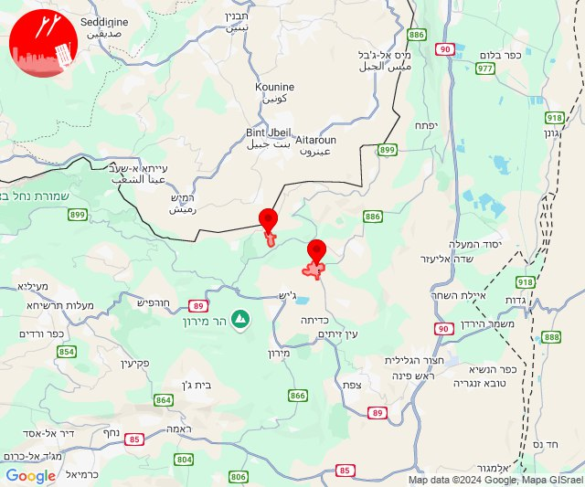

## 11:58

🔴 צבע אדום (05/10/2024):

14:55:
• קו העימות: מטולה, מטולה (מיידי)

14:56:
• קו העימות: דפנה, ע'ג'ר, קיבוץ דן, שאר ישוב, קיבוץ דן, ע'ג'ר, דפנה, מעיין ברוך, שאר ישוב (מיידי)

14:57:
• קו העימות: הגושרים, שניר, דפנה (מיידי)

14:58:
• קו העימות: ע'ג'ר (מיידי)

צופר - צבע אדום

## 11:58

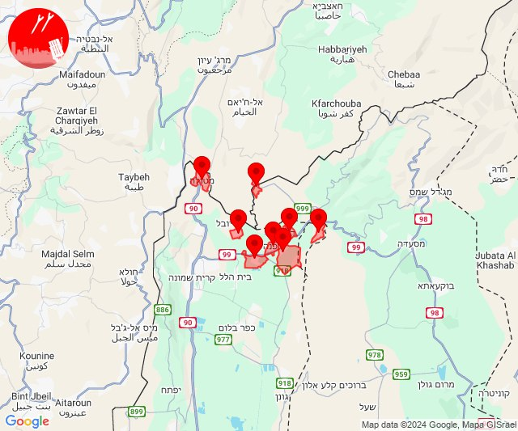

## 13:27

🔴 צבע אדום (05/10/2024):

16:26:
• קו העימות: מטולה (מיידי)

16:27:
• קו העימות: משגב עם (מיידי)

צופר - צבע אדום

## 13:27

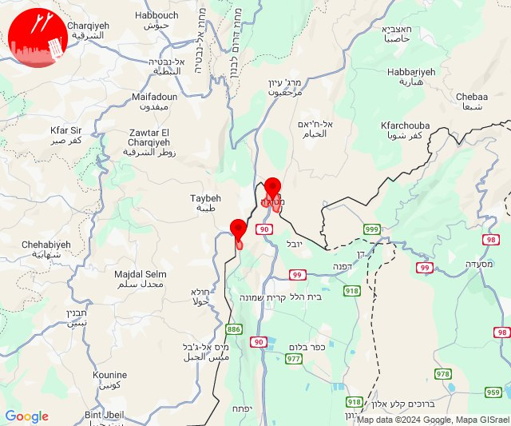

## 13:45

🔴 צבע אדום (05/10/2024):

16:44:
• מרכז הגליל: יובלים, מרכז אזורי משגב, עצמון - שגב, קורנית, רקפת, שכניה, אזור תעשייה תרדיון, כאוכב אבו אלהיג'א, טמרה, יעד, כאבול, מנוף, שעב, יודפת (דקה)
• גליל עליון: אזור תעשייה בר-לב, אחיהוד, יסעור (דקה)

16:45:
• גליל עליון: כרמיאל, מג'דל כרום, צורית גילון (30 שניות)
• מרכז הגליל: ערב אל נעים, שורשים, אשחר, סכנין, מורשת (30 שניות, דקה)

צופר - צבע אדום

## 13:45

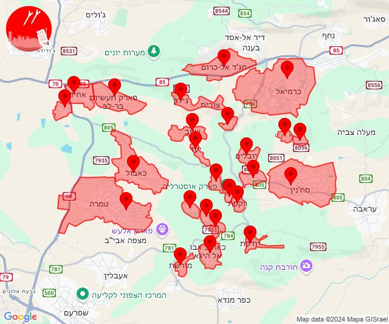

## 14:49

🔴 צבע אדום (05/10/2024):

17:49:
• קו העימות: משגב עם, מטולה (מיידי)

צופר - צבע אדום

## 14:49

## 15:16

🔴 צבע אדום (05/10/2024):

18:16:
• קו העימות: זרעית (מיידי)

צופר - צבע אדום

## 15:16

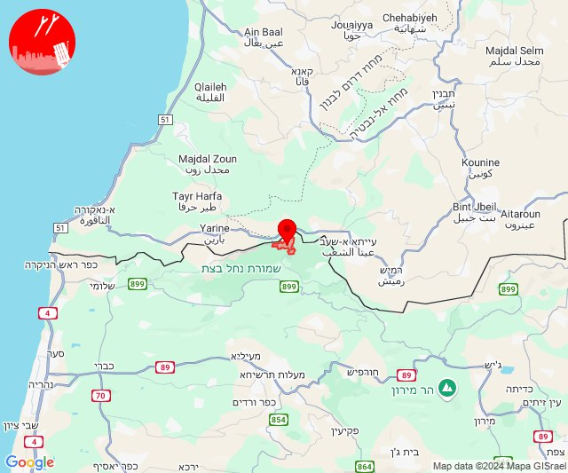

## 15:48

🔴 צבע אדום (05/10/2024):

18:47:
• גליל עליון: ביריה, צפת - עיר (30 שניות)

18:48:
• גליל עליון: עמוקה, כפר שמאי, אור הגנוז, בר יוחאי, מירון, מרכז אזורי מרום גליל, ספסופה - כפר חושן, קדיתא (30 שניות)
• קו העימות: אזור תעשייה רמת דלתון, דלתון, ג'ש - גוש חלב (מיידי)

צופר - צבע אדום

## 15:48

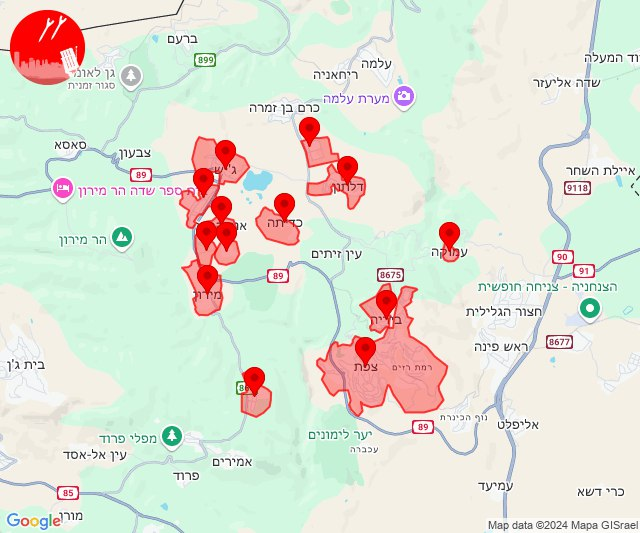

## 16:02

🔴 צבע אדום (05/10/2024):

19:02:
• דרום הגולן: קצרין (30 שניות)

צופר - צבע אדום

## 16:02

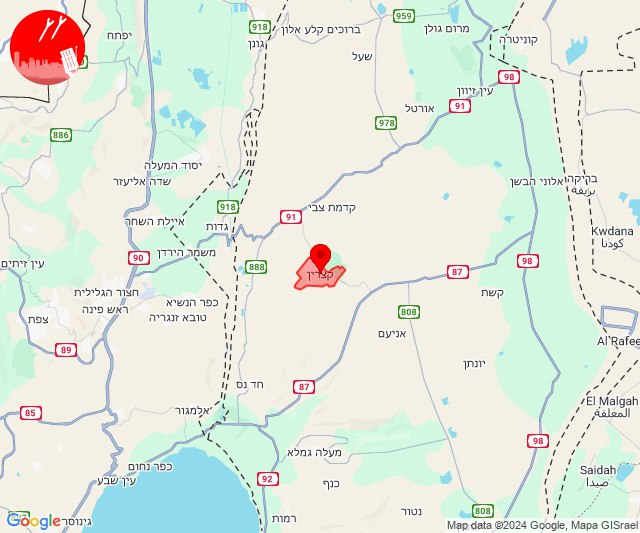

## 21:14

✈️ חדירת כלי טיס עוין (06/10/2024):

00:13:
• צפון הגולן: מרום גולן 

00:14:
• צפון הגולן: אורטל, מרום גולן, עין זיוון 
• דרום הגולן: אלוני הבשן 

צופר - צבע אדום

## 21:14

## 21:31

🔴 צבע אדום (06/10/2024):

00:30:
• קו העימות: קריית שמונה, מרגליות, מנרה, כפר בלום, עמיר, שדה נחמיה (מיידי, 15 שניות)

00:31:
• קו העימות: קריית שמונה, מרגליות (מיידי)

צופר - צבע אדום

## 21:31

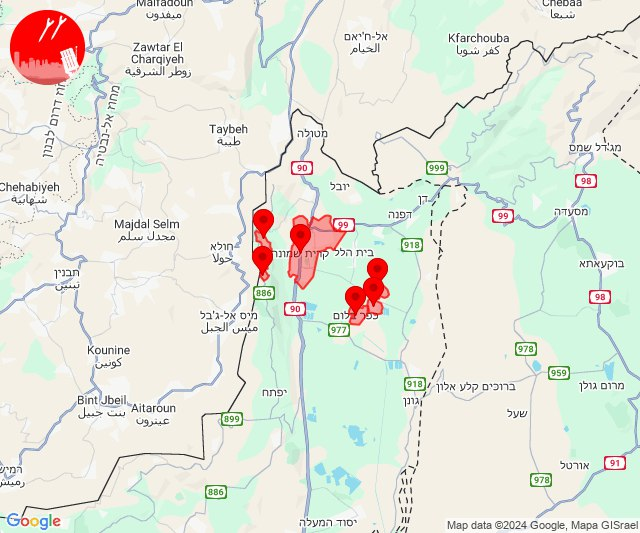

