# Alerts for 2024-10-06

## 04:34

✈️ חדירת כלי טיס עוין (06/10/2024):

07:34:
• קו העימות: ערב אל עראמשה 

צופר - צבע אדום

## 04:34

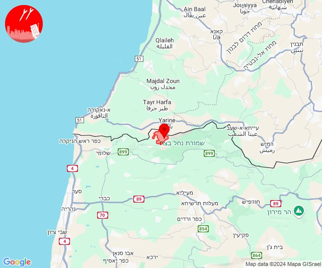

## 05:04

🔴 צבע אדום (06/10/2024):

08:04:
• קו העימות: קריית שמונה, מנרה (מיידי)

צופר - צבע אדום

## 05:04

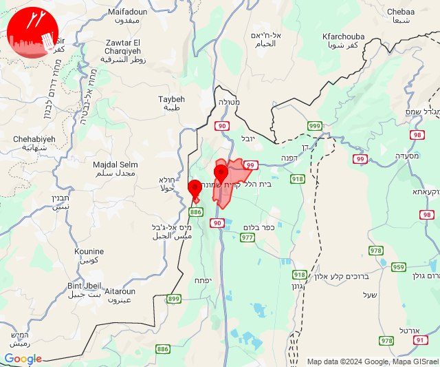

## 05:29

🔴 צבע אדום (06/10/2024):

08:27:
• מנשה: זכרון יעקב, מעגן מיכאל, מעיין צבי (דקה וחצי)

08:28:
• הכרמל: גבע כרמל, דור, הבונים, כרם מהר''ל, מאיר שפיה, מרכז מיר''ב, נווה ים, נחשולים, עופר, עין איילה, עין חוד, עין כרמל, פוריידיס, צרופה (דקה)
• מנשה: תלמי אלעזר, חדרה - נווה חיים, אור עקיבא, אזור תעשייה קיסריה, ג'סר א-זרקא, קיסריה, שדות ים, צומת בנימינה, מרכז ימי קיסריה (דקה וחצי)

08:29:
• הכרמל: אזור תעשייה ניר עציון, בית צבי, בת שלמה, מגדים, ניר עציון, עין הוד, עתלית, בית אורן, גבעת וולפסון, דלית אל כרמל, כפר הנוער ימין אורד, יערות הכרמל, כלא דמון (דקה)
• מנשה: בית חנניה, בנימינה, בית ספר אורט בנימינה, רמת הנדיב (דקה וחצי)
• המפרץ: חיפה - מערב, חיפה - נווה שאנן ורמות כרמל, החותרים, טירת כרמל, כפר גלים (דקה)

צופר - צבע אדום

## 05:29

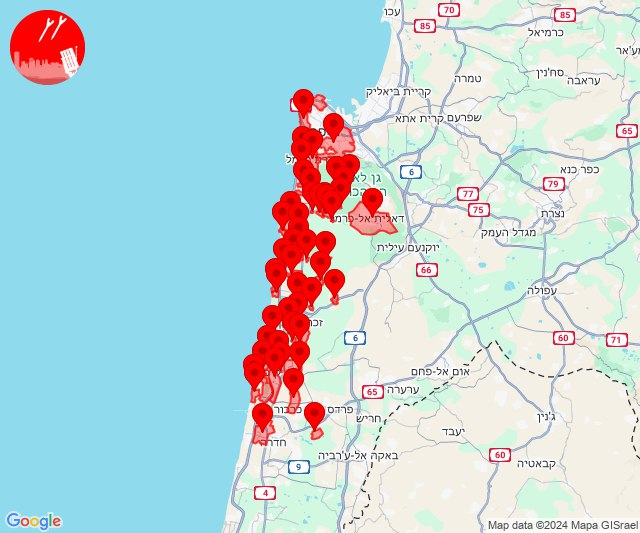

## 07:33

🔴 צבע אדום (06/10/2024):

10:33:
• עוטף עזה: נתיב העשרה (15 שניות)

צופר - צבע אדום

## 07:33

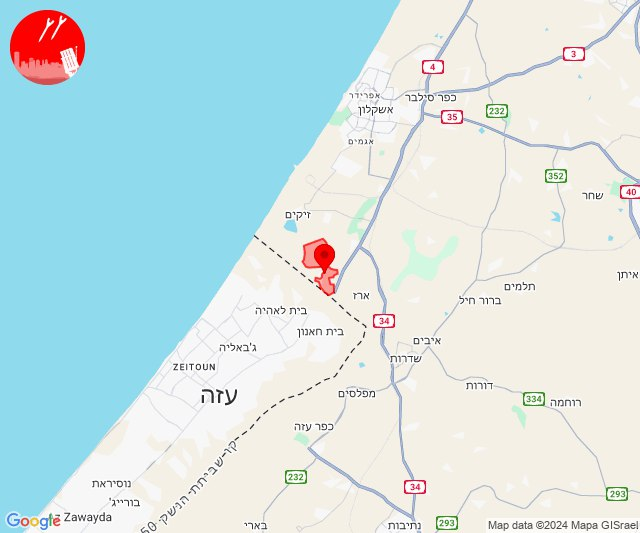

## 08:06

🔴 צבע אדום (06/10/2024):

11:06:
• גליל עליון: כמון, ראמה, שזור, בית ג'אן, סאג'ור, אזור תעשייה כרמיאל (30 שניות)

צופר - צבע אדום

## 08:06

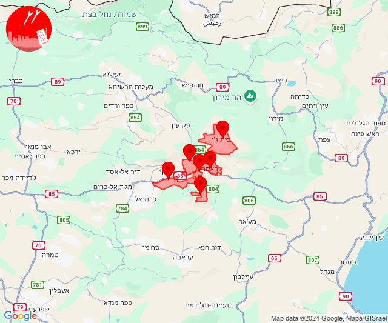

## 10:14

🔴 צבע אדום (06/10/2024):

13:14:
• קו העימות: משגב עם (מיידי)

צופר - צבע אדום

## 10:14

## 10:26

🔴 צבע אדום (06/10/2024):

13:26:
• קו העימות: מטולה (מיידי)

צופר - צבע אדום

## 10:26

## 10:49

🔴 צבע אדום (06/10/2024):

13:49:
• קו העימות: שלומי, בצת, לימן, נווה זיו, עבדון, ראש הנקרה, מנות, חניתה, שלומי, בצת, לימן (מיידי)
• גליל עליון: בית העמק, שייח' דנון, כליל, כפר יאסיף, אבו סנאן, אשרת, עמקה (30 שניות)

צופר - צבע אדום

## 10:50

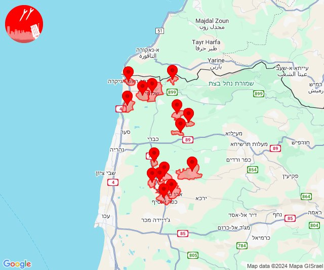

## 11:29

🔴 צבע אדום (06/10/2024):

14:29:
• קו העימות: מטולה (מיידי)

צופר - צבע אדום

## 11:29

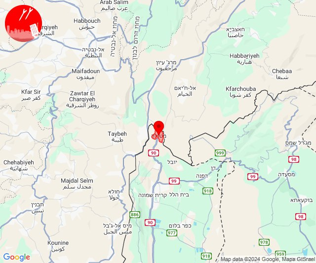

## 12:39

🔴 צבע אדום (06/10/2024):

15:38:
• קו העימות: צבעון (מיידי)

15:39:
• קו העימות: ג'ש - גוש חלב, חורפיש, אזור תעשייה רמת דלתון, דלתון, כרם בן זמרה, עלמה, ריחאנייה, מתת, דוב''ב, ברעם, סאסא (מיידי)
• גליל עליון: ספסופה - כפר חושן, אור הגנוז (30 שניות)

צופר - צבע אדום

## 12:39

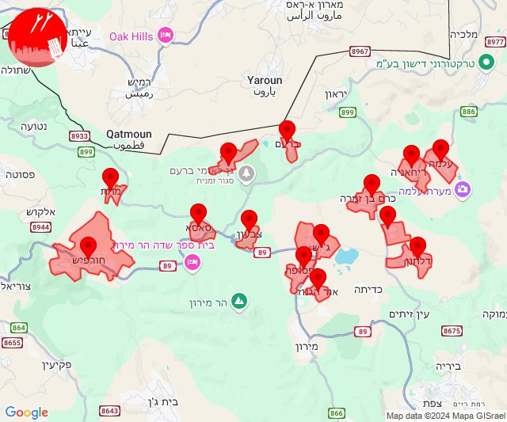

## 13:01

🔴 צבע אדום (06/10/2024):

16:00:
• מערב לכיש: אזור תעשייה הדרומי אשקלון (30 שניות)
• עוטף עזה: חוף זיקים (15 שניות)

16:01:
• עוטף עזה: זיקים (15 שניות)

צופר - צבע אדום

## 13:01

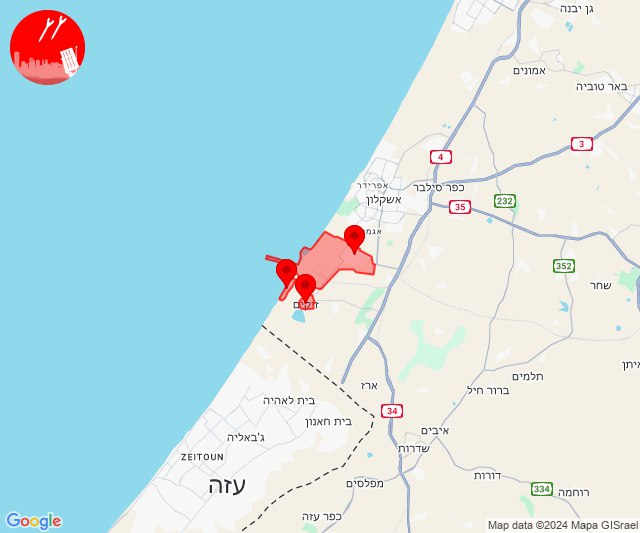

## 13:03

🔴 צבע אדום (06/10/2024):

16:03:
• קו העימות: רמות נפתלי (מיידי)

צופר - צבע אדום

## 13:03

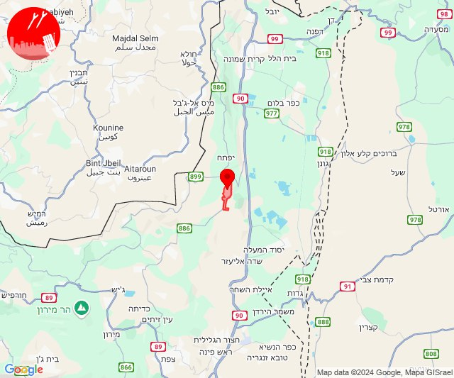

## 14:27

🔴 צבע אדום (06/10/2024):

17:27:
• קו העימות: כפר ורדים, מעלות תרשיחא, אבירים, מעונה, פסוטה, חוסן, פקיעין החדשה (15 שניות, מיידי)
• גליל עליון: כסרא סמיע (30 שניות)

צופר - צבע אדום

## 14:27

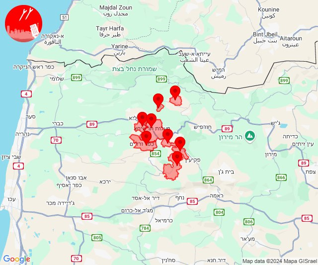

## 15:13

🔴 צבע אדום (06/10/2024):

18:13:
• גליל עליון: ביריה, צפת - עיר, מירון (30 שניות)

צופר - צבע אדום

## 15:13

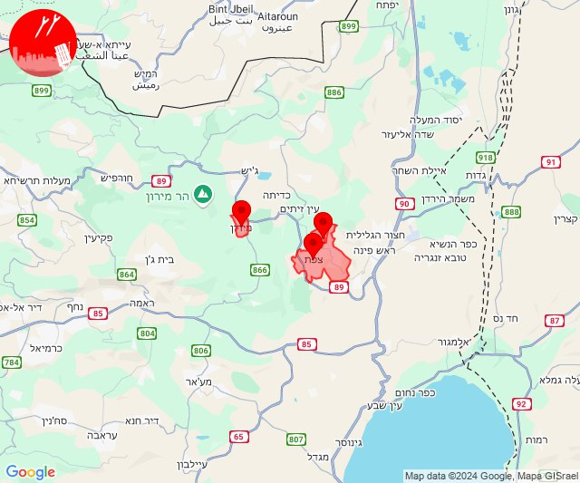

## 17:15

🔴 צבע אדום (06/10/2024):

20:14:
• קו העימות: כפר גלעדי, תל חי, קריית שמונה, כפר יובל, מטולה (מיידי)

20:15:
• קו העימות: גונן, בית הלל, מעיין ברוך, הגושרים, כפר גלעדי (15 שניות, מיידי)

צופר - צבע אדום

## 17:15

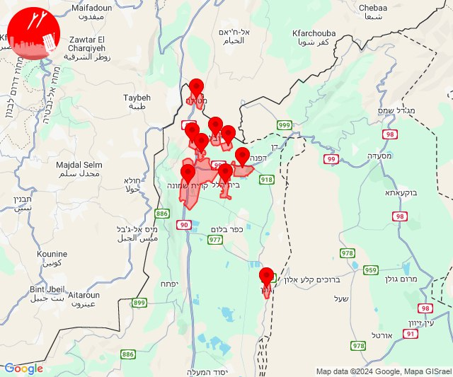

## 18:49

🔴 צבע אדום (06/10/2024):

21:47:
• גליל עליון: כרמיאל, בענה, מג'דל כרום, צורית גילון, דיר אל-אסד, אזור תעשייה כרמיאל, לבון, נחף, כישור, כסרא סמיע, לפידות, תובל (30 שניות)
• מרכז הגליל: שורשים (דקה)

21:48:
• גליל עליון: כרמיאל, בענה, מג'דל כרום, הר חלוץ, אזור תעשייה כרמיאל, דיר אל-אסד, לבון, כישור, כסרא סמיע, לפידות, תובל (30 שניות)

21:49:
• גליל עליון: בענה, כרמיאל, מג'דל כרום (30 שניות)

צופר - צבע אדום

## 18:49

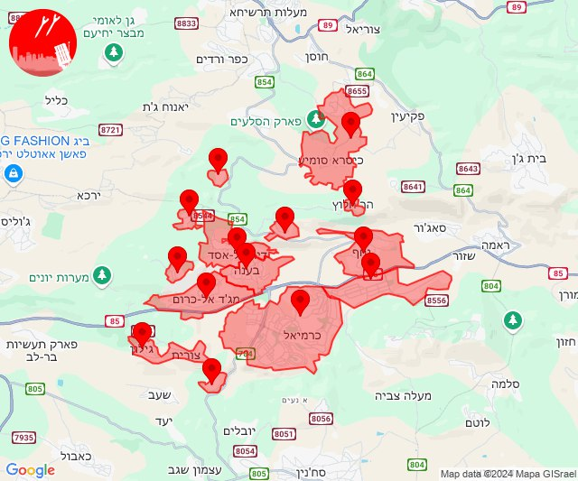

## 19:40

🔴 צבע אדום (06/10/2024):

22:40:
• קו העימות: יפתח (מיידי)

צופר - צבע אדום

## 19:40

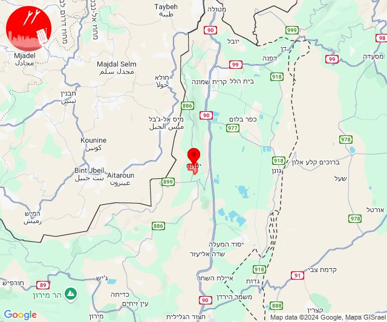

## 20:22

🔴 צבע אדום (06/10/2024):

23:22:
• המפרץ: חיפה - כרמל, הדר ועיר תחתית, חיפה - מערב, חיפה - נווה שאנן ורמות כרמל, החותרים, טירת כרמל, כפר גלים (דקה)
• הכרמל: מגדים (דקה)

צופר - צבע אדום

## 20:22

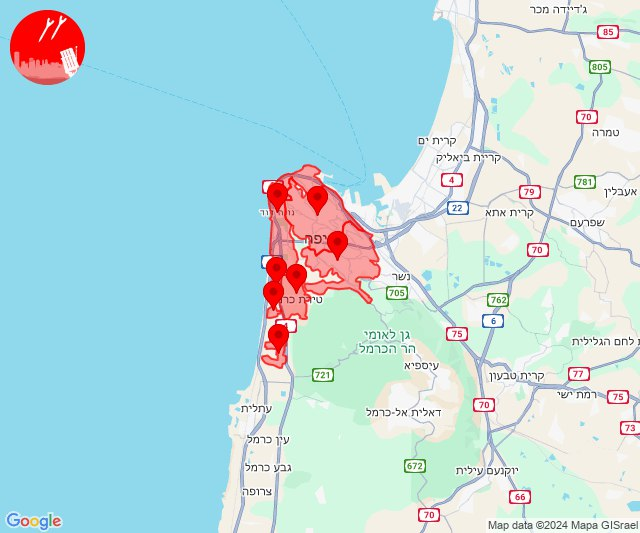

## 20:33

🔴 צבע אדום (06/10/2024):

23:32:
• קו העימות: מנרה, קריית שמונה (מיידי)

23:33:
• קו העימות: קריית שמונה, מרגליות, תל חי, כפר גלעדי, משגב עם, כפר יובל, מנרה (מיידי)

צופר - צבע אדום

## 20:33

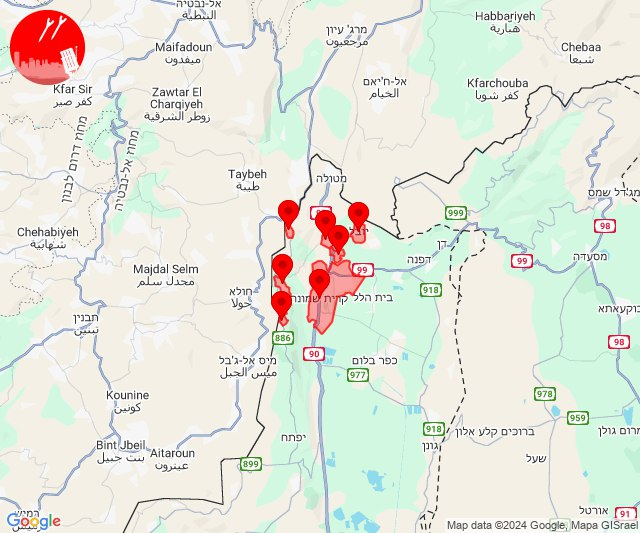

## 20:58

🔴 צבע אדום (06/10/2024):

23:57:
• גליל תחתון: גבעת אבני, הודיות, לביא, טבריה, מצפה, אזור תעשייה קדמת גליל, ארבל, ואדי אל חמאם, כפר זיתים (דקה)
• מרכז הגליל: מסד, עילבון (דקה)

23:58:
• גליל תחתון: נבי שועייב, כפר חיטים, מגדל (דקה)

צופר - צבע אדום

## 20:58

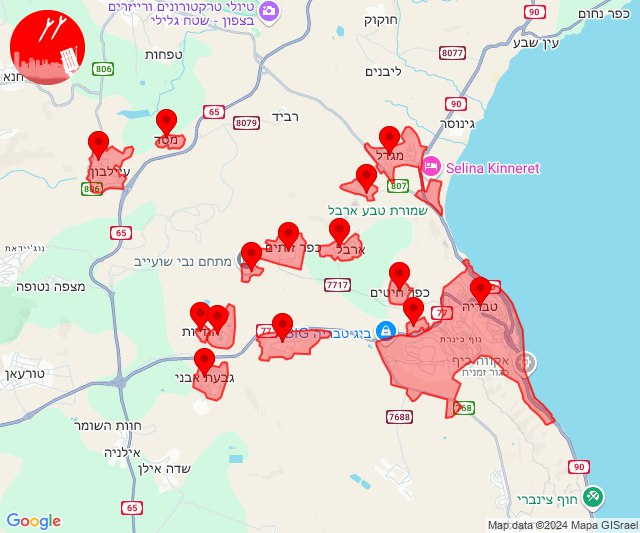

## 23:36

🔴 צבע אדום (07/10/2024):

02:35:
• קו העימות: ערב אל עראמשה, אילון, יערה, עבדון, מנות, אדמית, חוות אירוח גורן (מיידי)

02:36:
• קו העימות: מצובה, אילון, גורן (מיידי)

צופר - צבע אדום

## 23:36

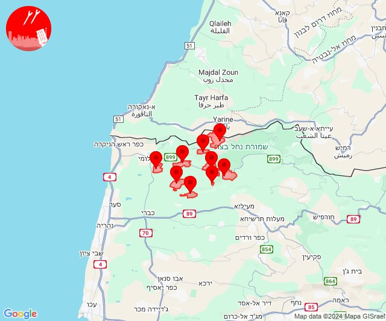

## 23:48

🔴 צבע אדום (07/10/2024):

02:48:
• קו העימות: בצת, לימן, שלומי (מיידי)

צופר - צבע אדום

## 23:48

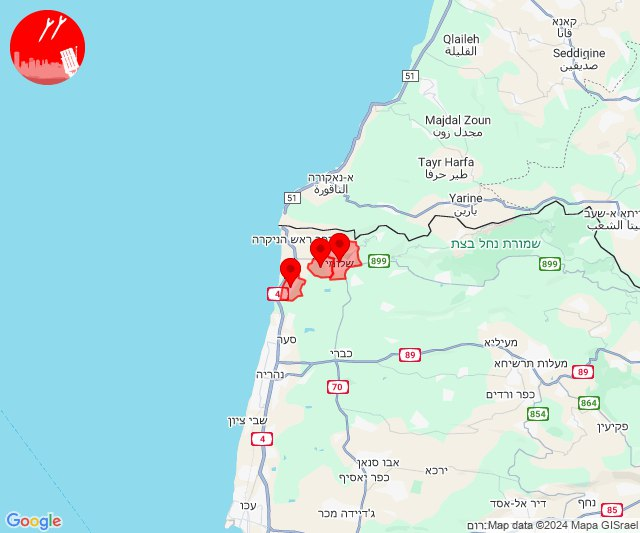

## 23:50

🔴 צבע אדום (07/10/2024):

02:50:
• קו העימות: דישון (מיידי)

צופר - צבע אדום

## 23:50

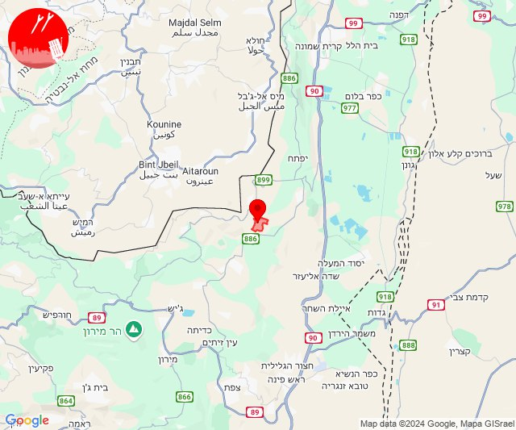

