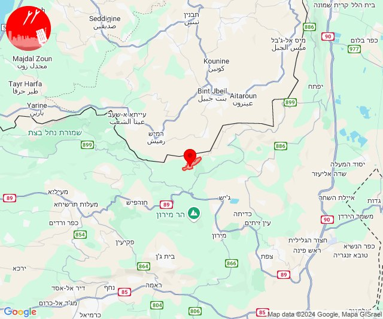

# Alerts for 2024-10-07

## 00:24

🔴 צבע אדום (07/10/2024):

03:24:
• גליל תחתון: כפר נהר הירדן, גבעת אבני, שדה אילן (דקה)

צופר - צבע אדום

## 00:24

## 02:15

✈️ חדירת כלי טיס עוין (07/10/2024):

05:15:
• לכיש: פלמחים 
• השפלה: ראשון לציון - מזרח, ראשון לציון - מערב 

צופר - צבע אדום

## 02:15

## 03:31

🔴 צבע אדום (07/10/2024):

06:31:
• עוטף עזה: סופה, חולית, פרי גן (15 שניות)

צופר - צבע אדום

## 03:31

## 03:53

🔴 צבע אדום (07/10/2024):

06:52:
• גליל עליון: הר חלוץ, נחף, כסרא סמיע, אזור תעשייה כרמיאל, חרשים, סאג'ור, ראמה, שזור, לבון (30 שניות)

06:53:
• קו העימות: חוסן, כפר ורדים, מעלות תרשיחא, פקיעין החדשה, אלקוש, חורפיש, צוריאל, אבן מנחם, זרעית, שומרה, שתולה, פקיעין, אבירים, מעונה (15 שניות, מיידי)
• גליל עליון: ינוח ג'ת, מגדל תפן, בענה, כרמיאל, גיתה, לפידות, הר חלוץ, נחף, כסרא סמיע (30 שניות)

צופר - צבע אדום

## 03:53

## 05:52

🔴 צבע אדום (07/10/2024):

08:51:
• קו העימות: כפר ורדים, מעלות תרשיחא, אבירים, מעונה, פסוטה, מעיליא (15 שניות, מיידי)
• גליל עליון: ינוח ג'ת, מגדל תפן, לפידות (30 שניות)

08:52:
• קו העימות: אבירים, חוסן, כפר ורדים, מעלות תרשיחא, פסוטה (מיידי, 15 שניות)
• גליל עליון: ינוח ג'ת, מגדל תפן (30 שניות)

צופר - צבע אדום

## 05:52

## 06:38

🔴 צבע אדום (07/10/2024):

09:38:
• קו העימות: דוב''ב (מיידי)

צופר - צבע אדום

## 06:38

## 07:20

🔴 צבע אדום (07/10/2024):

10:20:
• קו העימות: משגב עם (מיידי)

צופר - צבע אדום

## 07:20

## 07:47

🔴 צבע אדום (07/10/2024):

10:46:
• דרום הגולן: קצרין (30 שניות)

10:47:
• צפון הגולן: מלון פרא (15 שניות)

צופר - צבע אדום

## 07:47

## 08:02

🔴 צבע אדום (07/10/2024):

10:59:
• קו העימות: משגב עם, מרגליות (מיידי)

11:00:
• דן: חולון (דקה וחצי)
• השפלה: ראשון לציון - מערב (דקה וחצי)

11:01:
• השפלה: כפר חב''ד, צפריה (דקה וחצי)
• דן: תל אביב - דרום העיר ויפו, תל אביב - מזרח, אזור, בת ים, מקווה ישראל (דקה וחצי)
• לכיש: גדרה, קדרון, אזור תעשייה גדרה, בני עי''ש, חצב (דקה)

11:02:
• לכיש: אזור תעשייה כנות, פארק תעשייה ראם (דקה)

צופר - צבע אדום

## 08:02

## 09:41

🔴 צבע אדום (07/10/2024):

12:38:
• קו העימות: עבדון, נווה זיו, מנות, מצובה, אדמית, יערה (מיידי)

12:40:
• קו העימות: כפר ורדים, מעונה, מעיליא, מעלות תרשיחא, אבירים, כפר ורדים, מעלות תרשיחא, מעונה, מעיליא, אבירים, גורנות הגליל (15 שניות, מיידי)
• גליל עליון: ינוח ג'ת, מגדל תפן, לפידות, גיתה, ינוח ג'ת, מגדל תפן, דיר אל-אסד, כישור, בענה, כרמיאל, לבון, מג'דל כרום, כסרא סמיע (30 שניות)

12:41:
• קו העימות: הילה, כפר ורדים (מיידי, 15 שניות)

צופר - צבע אדום

## 09:41

## 09:59

🔴 צבע אדום (07/10/2024):

12:58:
• עוטף עזה: גבים, מכללת ספיר, ניר עם, מפלסים, מטווח ניר עם, שדרות, איבים (15 שניות)

12:59:
• עוטף עזה: ניר עם (15 שניות)

צופר - צבע אדום

## 09:59

## 11:05

🔴 צבע אדום (07/10/2024):

14:05:
• קו העימות: יראון (מיידי)

צופר - צבע אדום

## 11:05

## 11:26

🔴 צבע אדום (07/10/2024):

14:26:
• קו העימות: מלכיה (מיידי)

צופר - צבע אדום

## 11:26

## 11:47

🔴 צבע אדום (07/10/2024):

14:47:
• קו העימות: משגב עם, כפר גלעדי, קריית שמונה, תל חי, כפר יובל, מטולה, מעיין ברוך (מיידי)

צופר - צבע אדום

## 11:47

## 11:57

🔴 צבע אדום (07/10/2024):

14:56:
• קו העימות: זרעית, שומרה, אבן מנחם (מיידי)

14:57:
• קו העימות: ערב אל עראמשה, גורנות הגליל (מיידי)

צופר - צבע אדום

## 11:57

## 12:06

🔴 צבע אדום (07/10/2024):

15:06:
• קו העימות: יפתח (מיידי)

צופר - צבע אדום

## 12:06

## 12:20

🔴 צבע אדום (07/10/2024):

15:19:
• מרכז הגליל: בועיינה-נוג'ידאת, מצפה נטופה, טורעאן, עילבון (דקה)
• גליל עליון: בית ג'אן (30 שניות)
• העמקים: אילניה (דקה)
• גליל תחתון: אתר ההנצחה גולני, כפר נהר הירדן, גבעת אבני, הודיות, לביא, שדה אילן (דקה)

15:20:
• קו העימות: משגב עם (מיידי)

צופר - צבע אדום

## 12:20

## 13:09

🔴 צבע אדום (07/10/2024):

16:09:
• קו העימות: קריית שמונה, הגושרים, בית הלל, תל חי, דפנה, שאר ישוב (מיידי)

צופר - צבע אדום

## 13:09

## 13:14

🔴 צבע אדום (07/10/2024):

16:13:
• קו העימות: קריית שמונה, תל חי, כפר גלעדי, שדה נחמיה, בית הלל (מיידי)

16:14:
• קו העימות: מטולה, כפר יובל, מעיין ברוך, ע'ג'ר (מיידי)

צופר - צבע אדום

## 13:14

## 14:10

🔴 צבע אדום (07/10/2024):

17:07:
• קו העימות: כברי, נווה זיו (מיידי)

17:08:
• קו העימות: גשר הזיו, נהריה, סער, איזור תעשייה מילואות צפון, לימן, בית העלמין החדש נהריה, בן עמי, כברי, נווה זיו (מיידי, 15 שניות, 30 שניות)
• המפרץ: קריית ביאליק, קריית ים, קריית מוצקין, אזור תעשייה קריית ביאליק, חיפה - קריית חיים ושמואל (דקה)
• גליל עליון: אזור תעשייה שער נעמן, נתיב השיירה, שייח' דנון, כפר מסריק, עכו - אזור תעשייה, עין המפרץ, עכו (דקה, 30 שניות)

17:09:
• גליל עליון: ג'דידה מכר, כפר מסריק, עין המפרץ, עכו - אזור תעשייה, עכו (30 שניות)
• קו העימות: גשר הזיו, נהריה, סער, איזור תעשייה מילואות צפון, לימן, נווה זיו (מיידי, 15 שניות)

17:10:
• גליל עליון: אזור תעשייה שער נעמן, כפר מסריק, עין המפרץ, עכו - אזור תעשייה (דקה, 30 שניות)
• המפרץ: אזור תעשייה קריית ביאליק (דקה)
• קו העימות: כברי (מיידי)

צופר - צבע אדום

## 14:10

## 14:28

🔴 צבע אדום (07/10/2024):

17:27:
• קו העימות: מנרה, מרגליות, קריית שמונה, כפר בלום (מיידי)

17:28:
• קו העימות: כברי (מיידי)

צופר - צבע אדום

## 14:28

## 14:42

🔴 צבע אדום (07/10/2024):

17:42:
• ירקון: גמזו, כפר דניאל (דקה וחצי)
• השפלה: אזור תעשייה נשר - רמלה, אזור תעשייה רגמ, אחיסמך, ישרש, לוד, מצליח, רמלה, בית חשמונאי, בית עוזיאל, גזר, גני הדר, יד רמב''ם, יציץ, כפר שמואל, משמר איילון, נען, סתריה, עזריה, פדיה, פתחיה, רמות מאיר (דקה וחצי)

צופר - צבע אדום

## 14:42

## 14:45

🔴 צבע אדום (07/10/2024):

17:43:
• ירקון: מבוא חורון, שעלבים, מודיעין - ישפרו סנטר, חשמונאים, כפר רות, לפיד, מבוא מודיעים, מודיעין - ליגד סנטר, מודיעין מכבים רעות, מתתיהו, נוף איילון, שילת, בני עטרות, אזור תעשייה חבל מודיעין, בית נחמיה, בית עריף, ברקת, חדיד, טירת יהודה, כפר טרומן, נאות קדומים, שוהם, איירפורט סיטי, כפר האורנים (דקה וחצי)
• השפלה: כפר נוער בן שמן, גאליה, נצר סרני, ראשון לציון - מזרח, רחובות, חולדה, כפר חב''ד, כרמי יוסף, מזכרת בתיה, גיבתון, גן שלמה, פארק תעשיות פלמחים, ראשון לציון - מערב, אירוס, באר יעקב, בית חנן, בית עובד, בן שמן, גינתון, גן שורק, נטעים, ניר צבי, נס ציונה, עיינות, תעשיון צריפין, אחיעזר, בית דגן, גני יוחנן, זיתן, חמד, חניון הנתיב מהיר, יגל, יסודות, כפר ביל''ו, כפר בן נון, משמר דוד, משמר השבעה, נצר חזני, צפריה, קריית עקרון, גנות (דקה וחצי, דקה)
• שפלת יהודה: אזור תעשייה הר טוב - צרעה, אשתאול, מסילת ציון, נחם, צרעה, שער הגיא, תרום, בית מאיר, בקוע, גיזו, הראל, טל שחר, כפר אוריה, צלפון, רטורנו - גבעת שמש, תעוז, לטרון, מיני ישראל - נחשון, נווה שלום, נחשון (דקה וחצי)
• לכיש: בית אלעזרי, יד בנימין, כפר הנגיד, קדרון, בית גמליאל, מפעל אגריגדה, גבעת ברנר (דקה, דקה וחצי)

17:44:
• דן: אור יהודה, גבעת השלושה, גבעת שמואל, גת רימון, יהוד מונוסון, כפר סירקין, מעש, סביון, פתח תקווה, קריית אונו, גני תקווה, מגשימים, בית עלמין מורשה, תל אביב - עבר הירקון, בני ברק, הרצליה - מרכז וגליל ים, רמת גן - מזרח, רמת גן - מערב, רמת השרון (דקה וחצי)
• ירקון: מודיעין עילית, אלעד, בארות יצחק, גבעת כ''ח, מזור, נופך, נחלים, נחשונים, עינת, ראש העין, רינתיה, תעשיון חצב, אזור תעשייה אפק ולב הארץ (דקה וחצי)
• שרון: אורנית, אלישמע, ג'לג'וליה, חגור, חורשים, ירחיב, ירקונה, כפר ברא, כפר קאסם, מתן, נווה ירק, נירית, עדנים, שדי חמד, תחנת רכבת ראש העין, אלקנה, עץ אפרים, שערי תקווה, מרכז אזורי דרום השרון, גני עם, הוד השרון, נווה ימין, אלפי מנשה, כפר סבא, גבעת חן, רעננה, אייל, בית ברל, גן חיים, טירה, כוכב יאיר - צור יגאל, כפר מל''ל, ניר אליהו, צופית, רמות השבים, רמת הכובש, שדה ורבורג, צופים, אזור תעשייה טירה (דקה וחצי)
• שומרון: ברקן, קריית נטפים, אזור תעשייה אריאל, אזור תעשייה ברקן, בית אריה, ברוכין, חלמיש, נילי, נעלה, עלי זהב, פדואל, עופרים, חוות יאיר, נופים, קרני שומרון, רבבה (דקה וחצי)

17:45:
• השפלה: גני הדר, יציץ, נען, סתריה, פדיה, רמות מאיר, אזור תעשייה נשר - רמלה, מצליח, בית חשמונאי, בית עוזיאל, גזר, יד רמב''ם, כפר שמואל, משמר איילון, עזריה, פתחיה (דקה וחצי)
• שפלת יהודה: בית שמש, זנוח, ישעי, מחסיה, אזור תעשייה ברוש (דקה וחצי)

צופר - צבע אדום

## 14:45

## 18:36

🔴 צבע אדום (07/10/2024):

21:36:
• קו העימות: מטולה, ע'ג'ר, כפר גלעדי, כפר יובל, תל חי (מיידי)

צופר - צבע אדום

## 18:36

## 19:39

🔴 צבע אדום (07/10/2024):

22:39:
• קו העימות: יראון, אביבים, דלתון (מיידי)
• גליל עליון: קדיתא (30 שניות)

צופר - צבע אדום

## 19:39

## 19:42

🔴 צבע אדום (07/10/2024):

22:42:
• קו העימות: משגב עם, מטולה (מיידי)

צופר - צבע אדום

## 19:42

## 19:44

🔴 צבע אדום (07/10/2024):

22:44:
• קו העימות: משגב עם (מיידי)

צופר - צבע אדום

## 19:44

## 20:14

🔴 צבע אדום (07/10/2024):

23:13:
• דן: תל אביב - עבר הירקון, הרצליה - מערב, הרצליה - מרכז וגליל ים, רמת השרון, סינמה סיטי גלילות, מתחם פי גלילות, גבעת השלושה, כפר סירקין, פתח תקווה, בית עלמין מורשה (דקה וחצי)
• שרון: גבעת חן, אורנית, אלישמע, ג'לג'וליה, גני עם, הוד השרון, חגור, חורשים, ירחיב, ירקונה, כפר ברא, כפר מל''ל, כפר סבא, כפר קאסם, מתן, נווה ימין, נווה ירק, נירית, עדנים, רמות השבים, שדי חמד, תחנת רכבת ראש העין, מרכז אזורי דרום השרון (דקה וחצי)
• ירקון: עינת, ראש העין, אזור תעשייה אפק ולב הארץ, תעשיון חצב (דקה וחצי)

23:14:
• דן: כפר שמריהו (דקה וחצי)
• שרון: רעננה, אייל, בית ברל, בני דרור, גן חיים, חרות, טירה, כוכב יאיר - צור יגאל, כפר הס, כפר עבודה, משמרת, ניר אליהו, עזריאל, עין ורד, צופית, צור יצחק, רמת הכובש, שדה ורבורג, תל מונד, אבן יהודה, אלפי מנשה, ארסוף, בית יהושע, בני ציון, בצרה, חרוצים, צופים, רשפון, שפיים, תל יצחק, אזור תעשייה טירה, מתחם "חנה וסע" שפיים, בית סוהר השרון, געש (דקה וחצי)

צופר - צבע אדום

## 20:14

## 21:09

🔴 צבע אדום (08/10/2024):

00:09:
• קו העימות: חניתה, אדמית, שלומי (מיידי)

צופר - צבע אדום

## 21:09

## 21:20

🔴 צבע אדום (08/10/2024):

00:20:
• קו העימות: מצובה, יערה, שלומי, אילון, עבדון (מיידי)

צופר - צבע אדום

## 21:20

## 21:28

🔴 צבע אדום (08/10/2024):

00:28:
• קו העימות: ראש הנקרה, חוף בצת (מיידי)

צופר - צבע אדום

## 21:28

## 22:06

🔴 צבע אדום (08/10/2024):

01:06:
• קו העימות: קריית שמונה (מיידי)

צופר - צבע אדום

## 22:06

