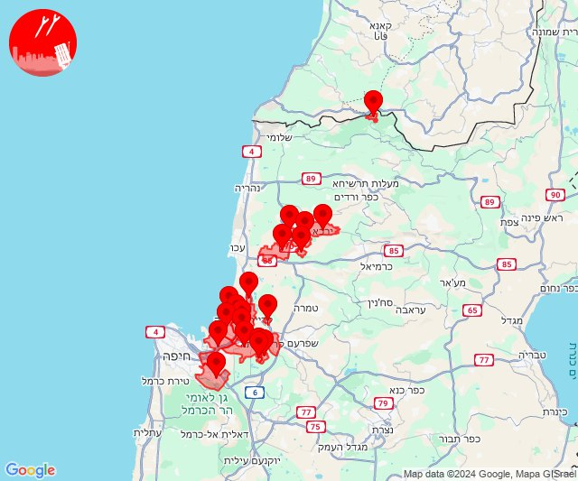
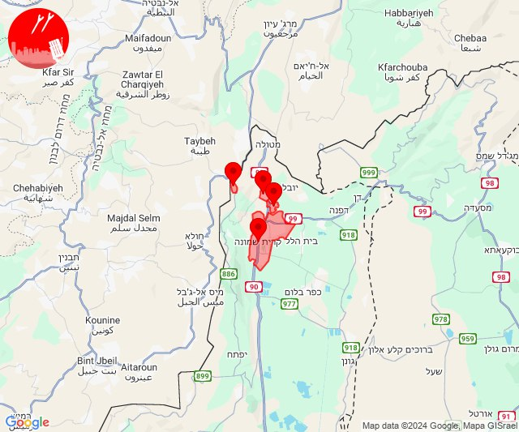

# Alerts for 2024-10-08

## 01:46

🔴 צבע אדום (08/10/2024):

04:46:
• קו העימות: כרם בן זמרה (מיידי)

צופר - צבע אדום

## 01:46

## 01:51

🔴 צבע אדום (08/10/2024):

04:50:
• גליל עליון: אור הגנוז, בר יוחאי, מרכז אזורי מרום גליל, ספסופה - כפר חושן, קדיתא (30 שניות)
• קו העימות: ג'ש - גוש חלב, צבעון (מיידי)

04:51:
• קו העימות: ברעם, כרם בן זמרה (מיידי)

צופר - צבע אדום

## 01:51

## 04:55

🔴 צבע אדום (08/10/2024):

07:55:
• קו העימות: חניתה, יערה, מצובה, שלומי (מיידי)

צופר - צבע אדום

## 04:55

## 04:57

🔴 צבע אדום (08/10/2024):

07:57:
• קו העימות: ג'ש - גוש חלב (מיידי)
• גליל עליון: אור הגנוז, בר יוחאי, כפר שמאי, מירון, מרכז אזורי מרום גליל, ספסופה - כפר חושן (30 שניות)

צופר - צבע אדום

## 04:57

## 05:31

🔴 צבע אדום (08/10/2024):

08:31:
• קו העימות: מנרה (מיידי)

צופר - צבע אדום

## 05:31

## 08:11

🔴 צבע אדום (08/10/2024):

11:09:
• גליל תחתון: מצפה, טבריה, כפר חיטים, הזורעים, ארבל, אזור תעשייה קדמת גליל, כפר זיתים, נבי שועייב, לביא (דקה)

11:11:
• גליל תחתון: טבריה (דקה)

צופר - צבע אדום

## 08:11

## 09:15

🔴 צבע אדום (08/10/2024):

12:11:
• המפרץ: חיפה - מפרץ, חיפה - קריית חיים ושמואל, קריית ים, קריית מוצקין, קריית ביאליק, כפר ביאליק, אזור תעשייה קריית ביאליק (דקה)
• גליל עליון: אזור תעשייה שער נעמן, כפר מסריק, עכו - אזור תעשייה (דקה, 30 שניות)

12:12:
• המפרץ: קריית אתא, חיפה - נווה שאנן ורמות כרמל, נשר (דקה)
• קו העימות: אילון, ערב אל עראמשה (מיידי)
• מרכז הגליל: אזור תעשייה טמרה, שפרעם, טמרה (דקה)
• גליל עליון: אפק, עין המפרץ, יסעור, כפר מסריק, ג'דידה מכר, עכו (דקה, 30 שניות)

12:13:
• גליל עליון: עכו - אזור תעשייה (30 שניות)
• המפרץ: קריית ים, קריית מוצקין (דקה)

12:14:
• המפרץ: חיפה - מפרץ, חיפה - קריית חיים ושמואל, קריית ביאליק, אזור תעשייה קריית ביאליק, חיפה - כרמל, הדר ועיר תחתית, חיפה - מערב (דקה)

12:15:
• המפרץ: כפר ביאליק, קריית אתא, קריית ים, קריית מוצקין (דקה)
• גליל עליון: אזור תעשייה שער נעמן, כפר מסריק, עין המפרץ, עכו - אזור תעשייה, אפק, כפר מסריק, עכו - אזור תעשייה (דקה, 30 שניות)
• קו העימות: אלקוש (מיידי)

צופר - צבע אדום

## 09:15

## 09:46

🔴 צבע אדום (08/10/2024):

12:43:
• קו העימות: זרעית (מיידי)

12:44:
• המפרץ: כפר ביאליק, קריית אתא, אושה, רמת יוחנן, חיפה - מפרץ, חיפה - קריית חיים ושמואל, קריית ביאליק, כפר המכבי, קריית מוצקין (דקה)
• גליל עליון: ג'דידה מכר, ג'וליס, טל - אל, ירכא, כפר יאסיף, אפק (30 שניות, דקה)

12:45:
• המפרץ: נשר, אזור תעשייה קריית ביאליק, קריית ים (דקה)

12:46:
• המפרץ: קריית ביאליק (דקה)

צופר - צבע אדום

## 09:46

## 13:33

🔴 צבע אדום (08/10/2024):

16:32:
• קו העימות: כפר גלעדי, קריית שמונה, תל חי (מיידי)

16:33:
• קו העימות: משגב עם (מיידי)

צופר - צבע אדום

## 13:33

## 13:36

🔴 צבע אדום (08/10/2024):

16:35:
• קו העימות: קריית שמונה (מיידי)

16:36:
• קו העימות: משגב עם, מרגליות, קריית שמונה, כפר גלעדי (מיידי)

צופר - צבע אדום

## 13:36

## 13:52

🔴 צבע אדום (08/10/2024):

16:52:
• קו העימות: ראש הנקרה (מיידי)

צופר - צבע אדום

## 13:52

## 14:02

🔴 צבע אדום (08/10/2024):

17:02:
• קו העימות: מטולה (מיידי)

צופר - צבע אדום

## 14:02

## 14:04

🔴 צבע אדום (08/10/2024):

17:04:
• קו העימות: מטולה (מיידי)

צופר - צבע אדום

## 14:04

## 14:39

🔴 צבע אדום (08/10/2024):

17:39:
• קו העימות: יפתח (מיידי)

צופר - צבע אדום

## 14:39

## 14:54

✈️ חדירת כלי טיס עוין (08/10/2024):

17:52:
• קו העימות: ע'ג'ר 

17:53:
• קו העימות: מטולה, ע'ג'ר 

17:54:
• קו העימות: דפנה, הגושרים, ע'ג'ר, קיבוץ דן, שאר ישוב, שניר 

צופר - צבע אדום

## 14:54

## 14:57

✈️ חדירת כלי טיס עוין (08/10/2024):

17:56:
• קו העימות: ע'ג'ר 

17:57:
• קו העימות: ע'ג'ר 

צופר - צבע אדום

## 14:57

## 14:59

✈️ חדירת כלי טיס עוין (08/10/2024):

17:59:
• קו העימות: ע'ג'ר 

צופר - צבע אדום

## 14:59

## 15:03

✈️ חדירת כלי טיס עוין (08/10/2024):

18:03:
• קו העימות: ע'ג'ר, קיבוץ דן, שניר 

צופר - צבע אדום

## 15:03

## 15:53

🔴 צבע אדום (08/10/2024):

18:53:
• מערב הנגב: חוות שיקמים (15 שניות)
• עוטף עזה: ניר עם, שדרות, איבים, מטווח ניר עם, גבים, מכללת ספיר (15 שניות)

צופר - צבע אדום

## 15:53

## 15:56

🔴 צבע אדום (08/10/2024):

18:56:
• קו העימות: מנרה, מרגליות, קריית שמונה (מיידי)

צופר - צבע אדום

## 15:56

## 17:41

✈️ חדירת כלי טיס עוין (08/10/2024):

20:40:
• גליל עליון: שדה אליעזר, מלון אחוזת ירדן 

20:41:
• גליל עליון: איילת השחר 

צופר - צבע אדום

## 17:41

## 17:46

✈️ חדירת כלי טיס עוין (08/10/2024):

20:43:
• גליל עליון: מחניים, אזור תעשייה חצור הגלילית, חצור הגלילית, מנחת מחניים 

20:44:
• גליל עליון: ראש פינה, אזור תעשייה חצור הגלילית, אזור תעשייה צ.ח.ר, מנחת מחניים, חצור הגלילית 

20:45:
• גליל עליון: ראש פינה, אליפלט 

20:46:
• גליל עליון: צפת - נוף כנרת, עמיעד 

צופר - צבע אדום

## 17:46

## 18:37

🔴 צבע אדום (08/10/2024):

21:37:
• קו העימות: אביבים (מיידי)

צופר - צבע אדום

## 18:37

## 20:34

🔴 צבע אדום (08/10/2024):

23:34:
• קו העימות: ראש הנקרה (מיידי)

צופר - צבע אדום

## 20:34

