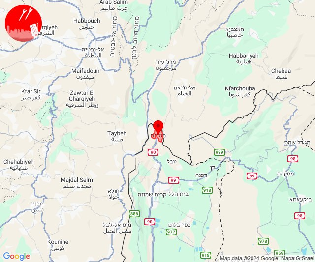

# Alerts for 2024-10-09

## 01:54

🔴 צבע אדום (09/10/2024):

04:53:
• קו העימות: שלומי, בצת, לימן, איזור תעשייה מילואות צפון, חוף בצת, ראש הנקרה (מיידי)

04:54:
• קו העימות: שלומי (מיידי)

צופר - צבע אדום

## 01:54

## 02:56

🔴 צבע אדום (09/10/2024):

05:56:
• קו העימות: מטולה (מיידי)

צופר - צבע אדום

## 02:56

## 04:37

🔴 צבע אדום (09/10/2024):

07:36:
• קו העימות: חניתה, שלומי (מיידי)

07:37:
• קו העימות: בצת, חניתה, שלומי (מיידי)

צופר - צבע אדום

## 04:37

## 05:20

🔴 צבע אדום (09/10/2024):

08:20:
• קו העימות: אביבים (מיידי)

צופר - צבע אדום

## 05:20

## 05:29

🔴 צבע אדום (09/10/2024):

08:26:
• מנשה: ג'סר א-זרקא, קיסריה, צומת בנימינה, מרכז ימי קיסריה (דקה וחצי)

08:27:
• מנשה: תלמי אלעזר, זכרון יעקב, מעיין צבי, מעגן מיכאל, רמת הנדיב (דקה וחצי)
• הכרמל: דור, הבונים, מאיר שפיה, נחשולים, עין איילה, פוריידיס (דקה)

08:28:
• המפרץ: החותרים, טירת כרמל, כפר גלים (דקה)
• הכרמל: אזור תעשייה ניר עציון, בית צבי, גבע כרמל, כפר הנוער ימין אורד, מגדים, מרכז מיר''ב, נווה ים, ניר עציון, עין הוד, עין כרמל, עתלית, צרופה (דקה)

08:29:
• הכרמל: הבונים (דקה)

צופר - צבע אדום

## 05:29

## 06:00

🔴 צבע אדום (09/10/2024):

09:00:
• קו העימות: מנרה, מרגליות (מיידי)

צופר - צבע אדום

## 06:00

## 08:21

🔴 צבע אדום (09/10/2024):

11:21:
• קו העימות: יפתח, מרכז אזורי מבואות חרמון (מיידי)

צופר - צבע אדום

## 08:21

## 09:43

🔴 צבע אדום (09/10/2024):

12:43:
• קו העימות: אביבים (מיידי)

צופר - צבע אדום

## 09:43

## 09:58

🔴 צבע אדום (09/10/2024):

12:57:
• קו העימות: משגב עם, כפר גלעדי (מיידי)

12:58:
• קו העימות: תל חי, משגב עם (מיידי)

צופר - צבע אדום

## 09:58

## 10:12

🔴 צבע אדום (09/10/2024):

13:10:
• המפרץ: כפר ביאליק, קריית אתא, קריית ביאליק (דקה)

13:11:
• גליל עליון: אפק (דקה)
• המפרץ: חיפה - קריית חיים ושמואל, קריית מוצקין, חיפה - מפרץ, קריית ים, אזור תעשייה קריית ביאליק, אושה, כפר המכבי, רמת יוחנן (דקה)

13:12:
• גליל עליון: אזור תעשייה בר-לב, אחיהוד, אזור תעשייה שער נעמן, כפר מסריק, עין המפרץ, עכו - אזור תעשייה (דקה, 30 שניות)

צופר - צבע אדום

## 10:12

## 11:05

✈️ חדירת כלי טיס עוין (09/10/2024):

14:04:
• קו העימות: קריית שמונה, הגושרים, בית הלל 

14:05:
• קו העימות: הגושרים 

צופר - צבע אדום

## 11:05

## 11:16

🔴 צבע אדום (09/10/2024):

14:16:
• קו העימות: קריית שמונה, מנרה, תל חי, קריית שמונה (מיידי)

צופר - צבע אדום

## 11:16

## 12:13

🔴 צבע אדום (09/10/2024):

15:13:
• קו העימות: ראש הנקרה, איזור תעשייה מילואות צפון, חוף בצת, לימן (מיידי)

צופר - צבע אדום

## 12:13

## 12:28

🔴 צבע אדום (09/10/2024):

15:27:
• קו העימות: מרגליות, משגב עם (מיידי)

15:28:
• קו העימות: משגב עם, מרגליות (מיידי)

צופר - צבע אדום

## 12:28

## 12:36

🔴 צבע אדום (09/10/2024):

15:35:
• קו העימות: עלמה (מיידי)

15:36:
• גליל עליון: טובא זנגריה, אזור תעשייה צ.ח.ר, מנחת מחניים, אזור תעשייה חצור הגלילית, חצור הגלילית, מחניים, ראש פינה, עמוקה, אליפלט (30 שניות)

צופר - צבע אדום

## 12:36

## 12:41

🔴 צבע אדום (09/10/2024):

15:41:
• עוטף עזה: יד מרדכי, נתיב העשרה (15 שניות)

צופר - צבע אדום

## 12:41

## 13:04

🔴 צבע אדום (09/10/2024):

16:04:
• קו העימות: מטולה, משגב עם (מיידי)

צופר - צבע אדום

## 13:04

## 13:21

🔴 צבע אדום (09/10/2024):

16:21:
• קו העימות: מטולה (מיידי)

צופר - צבע אדום

## 13:21

## 13:46

🔴 צבע אדום (09/10/2024):

16:41:
• גליל עליון: אזור תעשייה חצור הגלילית, חצור הגלילית (30 שניות)

16:42:
• גליל עליון: מחניים, מנחת מחניים, ראש פינה, עמוקה, אזור תעשייה צ.ח.ר, טובא זנגריה, אליפלט, קדיתא, חצור הגלילית, גדות, צפת - עיר, אזור תעשייה חצור הגלילית, איילת השחר, משמר הירדן, מחניים, כפר הנשיא (30 שניות)
• קו העימות: ריחאנייה, דלתון, מלכיה, אזור תעשייה רמת דלתון, ג'ש - גוש חלב, כרם בן זמרה (מיידי)
• דרום הגולן: קצרין (30 שניות)

16:43:
• גליל עליון: טובא זנגריה, אזור תעשייה צ.ח.ר, מנחת מחניים, כפר הנשיא, טובא זנגריה, מחניים (30 שניות)

16:44:
• קו העימות: עלמה, ריחאנייה, אביבים, יראון, כרם בן זמרה, אזור תעשייה רמת דלתון, ג'ש - גוש חלב, דלתון, אביבים, דלתון, כרם בן זמרה, אזור תעשייה רמת דלתון (מיידי)
• גליל עליון: צפת - עכברה, צפת - עיר, ביריה, קדיתא, אור הגנוז, בר יוחאי, גדות, רפטינג נהר הירדן, כורזים ורד הגליל, עמיעד, אמנון, ספסופה - כפר חושן, צפת - עכברה, צפת - עיר, צפת - נוף כנרת, אליפלט, ראש פינה, כפר נחום, ביריה, קדיתא (30 שניות)
• צפון הגולן: מלון פרא (15 שניות)

16:45:
• גליל עליון: כפר שמאי, אזור תעשייה צ.ח.ר, חצור הגלילית, כורזים ורד הגליל, עמיעד, אמנון, צפת - עיר, צפת - עכברה, אור הגנוז, אמירים, בר יוחאי, מירון, מרכז אזורי מרום גליל, ספסופה - כפר חושן, שפר, אליפלט, צפת - נוף כנרת, ראש פינה, קדיתא (30 שניות)
• קו העימות: ג'ש - גוש חלב, עלמה, ריחאנייה, כרם בן זמרה, ברעם (מיידי)

16:46:
• גליל עליון: כורזים ורד הגליל, עמיעד, ביריה, חצור הגלילית, צפת - עיר (30 שניות)

צופר - צבע אדום

## 13:46

## 13:49

🔴 צבע אדום (09/10/2024):

16:48:
• קו העימות: בצת, חניתה, ראש הנקרה, שלומי, אילון, גורן, חוף בצת, מצובה, יערה, עבדון (מיידי)

16:49:
• קו העימות: חוות אירוח גורן, אילון, יערה (מיידי)

צופר - צבע אדום

## 13:49

## 14:28

🔴 צבע אדום (09/10/2024):

17:28:
• קו העימות: הגושרים, שדה נחמיה, עמיר (מיידי, 15 שניות)

צופר - צבע אדום

## 14:28

## 18:17

✈️ חדירת כלי טיס עוין (09/10/2024):

21:17:
• קו העימות: דוב''ב, מתת, סאסא 

צופר - צבע אדום

## 18:17

## 20:24

✈️ חדירת כלי טיס עוין (09/10/2024):

23:24:
• צפון הגולן: מג'דל שמס 

צופר - צבע אדום

## 20:24

