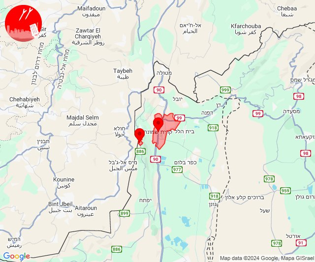

# Alerts for 2024-10-10

## 07:02

🔴 צבע אדום (10/10/2024):

10:01:
• קו העימות: משגב עם, מרגליות, קריית שמונה, כפר גלעדי, תל חי, מנרה, מרגליות, משגב עם (מיידי)

10:02:
• קו העימות: מעיין ברוך, מטולה, קריית שמונה, כפר יובל, הגושרים, כפר גלעדי, בית הלל, משגב עם, תל חי, מעיין ברוך, מטולה (מיידי)

צופר - צבע אדום

## 07:02

## 07:04

🔴 צבע אדום (10/10/2024):

10:04:
• קו העימות: מנרה, מרגליות, קריית שמונה, משגב עם (מיידי)

צופר - צבע אדום

## 07:04

## 08:15

🔴 צבע אדום (10/10/2024):

11:14:
• קו העימות: מטולה, קריית שמונה, כפר גלעדי, תל חי, כפר יובל (מיידי)

11:15:
• קו העימות: משגב עם (מיידי)

צופר - צבע אדום

## 08:15

## 08:19

🔴 צבע אדום (10/10/2024):

11:19:
• קו העימות: כפר גלעדי, תל חי, קריית שמונה, מטולה (מיידי)

צופר - צבע אדום

## 08:19

## 10:34

🔴 צבע אדום (10/10/2024):

13:34:
• קו העימות: מנרה, קריית שמונה, כפר בלום (מיידי)

צופר - צבע אדום

## 10:34

## 10:57

🔴 צבע אדום (10/10/2024):

13:56:
• קו העימות: כפר גלעדי, תל חי, קריית שמונה, כפר יובל, בית הלל, מעיין ברוך, מטולה (מיידי)

13:57:
• קו העימות: הגושרים, כפר גלעדי, תל חי, קריית שמונה, כפר יובל (מיידי)

צופר - צבע אדום

## 10:57

## 11:13

🔴 צבע אדום (10/10/2024):

14:11:
• קו העימות: כפר גלעדי, קריית שמונה, משגב עם (מיידי)

14:13:
• קו העימות: משגב עם, כפר גלעדי, קריית שמונה, תל חי, כפר יובל, מטולה (מיידי)

צופר - צבע אדום

## 11:13

## 11:20

🔴 צבע אדום (10/10/2024):

14:20:
• קו העימות: משגב עם (מיידי)

צופר - צבע אדום

## 11:20

## 11:25

🔴 צבע אדום (10/10/2024):

14:23:
• מרכז הגליל: חוסנייה (דקה)
• גליל עליון: מכמנים (30 שניות)

14:24:
• גליל עליון: אזור תעשייה כרמיאל, כרמיאל, נחף, שזור, הר חלוץ, חרשים, כסרא סמיע, סאג'ור, בענה, דיר אל-אסד, לבון, מג'דל כרום (30 שניות)
• קו העימות: פקיעין החדשה, פקיעין, צוריאל (15 שניות, מיידי)
• מרכז הגליל: מעלה צביה (דקה)

14:25:
• גליל עליון: נחף (30 שניות)

צופר - צבע אדום

## 11:25

## 11:36

🔴 צבע אדום (10/10/2024):

14:36:
• קו העימות: מנרה (מיידי)

צופר - צבע אדום

## 11:36

## 12:01

🔴 צבע אדום (10/10/2024):

15:01:
• קו העימות: מנרה, קריית שמונה (מיידי)

צופר - צבע אדום

## 12:01

## 12:45

🔴 צבע אדום (10/10/2024):

15:44:
• גליל עליון: בוסתן הגליל, עכו, שבי ציון, שומרת, לוחמי הגטאות, מזרעה, רגבה, עכו - אזור תעשייה (30 שניות)
• קו העימות: בן עמי, נהריה, עברון, סער (מיידי, 15 שניות)

15:45:
• קו העימות: גשר הזיו, בן עמי, נהריה, סער, עברון (מיידי, 15 שניות)
• גליל עליון: ג'דידה מכר, בית העלמין החדש עכו, בוסתן הגליל, עכו, שבי ציון, שומרת, לוחמי הגטאות, רגבה, כפר מסריק, עין המפרץ, מזרעה, ג'דידה מכר, עכו (30 שניות)

צופר - צבע אדום

## 12:45

## 12:55

🔴 צבע אדום (10/10/2024):

15:54:
• קו העימות: כרם בן זמרה, אזור תעשייה רמת דלתון, דלתון (מיידי)

15:55:
• קו העימות: יראון (מיידי)

צופר - צבע אדום

## 12:55

## 12:59

🔴 צבע אדום (10/10/2024):

15:59:
• קו העימות: אזור תעשייה רמת דלתון, דלתון (מיידי)

צופר - צבע אדום

## 12:59

## 13:24

✈️ חדירת כלי טיס עוין (10/10/2024):

16:23:
• קו העימות: קריית שמונה 

16:24:
• קו העימות: מרגליות 

צופר - צבע אדום

## 13:24

## 13:58

🔴 צבע אדום (10/10/2024):

16:58:
• קו העימות: ראש הנקרה, קריית שמונה (מיידי)

צופר - צבע אדום

## 13:58

## 17:04

🔴 צבע אדום (10/10/2024):

20:04:
• קו העימות: בצת, שלומי (מיידי)

צופר - צבע אדום

## 17:04

## 19:21

🔴 צבע אדום (10/10/2024):

22:21:
• קו העימות: מטולה (מיידי)

צופר - צבע אדום

## 19:21

## 19:59

✈️ חדירת כלי טיס עוין (10/10/2024):

22:59:
• צפון הגולן: מרום גולן 

צופר - צבע אדום

## 19:59

## 20:34

🔴 צבע אדום (10/10/2024):

23:34:
• קו העימות: כפר גלעדי, מטולה (מיידי)

צופר - צבע אדום

## 20:34

