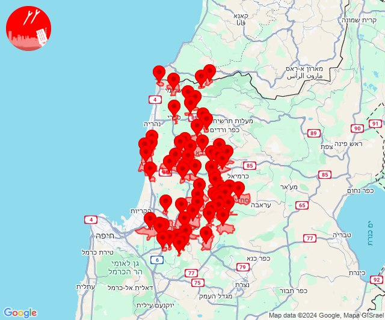
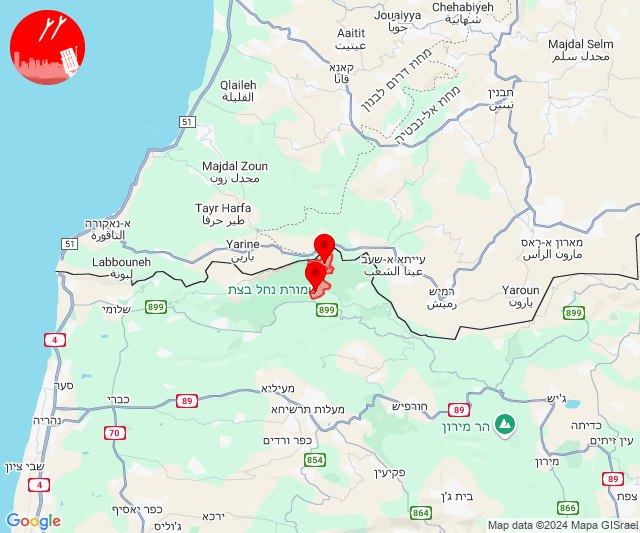

# Alerts for 2024-10-11

## 03:38

🔴 צבע אדום (11/10/2024):

06:38:
• מערב לכיש: ניר ישראל (30 שניות)

צופר - צבע אדום

## 03:38

## 03:39

✈️ חדירת כלי טיס עוין (11/10/2024):

06:36:
• מערב לכיש: באר גנים 

06:37:
• מערב לכיש: אשקלון - צפון, אזור תעשייה צפוני אשקלון, אשקלון - דרום, ברכיה, כפר סילבר, הודיה, משען, ניר ישראל, באר גנים 

06:39:
• מערב לכיש: הודיה 

צופר - צבע אדום

## 03:39

## 05:19

🔴 צבע אדום (11/10/2024):

08:19:
• קו העימות: קריית שמונה, מרגליות (מיידי)

צופר - צבע אדום

## 05:19

## 05:31

🔴 צבע אדום (11/10/2024):

08:30:
• גליל עליון: אזור תעשייה שער נעמן, עכו - אזור תעשייה, כפר מסריק (דקה, 30 שניות)
• המפרץ: קריית ים, קריית מוצקין, אזור תעשייה קריית ביאליק, קריית ביאליק (דקה)

08:31:
• גליל עליון: עין המפרץ, עכו, בית העלמין החדש עכו, ג'דידה מכר, כפר מסריק, עכו - אזור תעשייה, עין המפרץ (30 שניות)

צופר - צבע אדום

## 05:31

## 06:44

🔴 צבע אדום (11/10/2024):

09:44:
• קו העימות: זרעית (מיידי)

צופר - צבע אדום

## 06:44

## 07:49

🔴 צבע אדום (11/10/2024):

10:47:
• קו העימות: שמיר, כפר סאלד, שדה נחמיה, עמיר, כפר בלום (15 שניות, מיידי)

10:48:
• קו העימות: שמיר, כפר סאלד (15 שניות)

10:49:
• קו העימות: כפר סאלד (15 שניות)

צופר - צבע אדום

## 07:49

## 11:22

🔴 צבע אדום (11/10/2024):

14:22:
• קו העימות: אדמית, יערה, אילון, ערב אל עראמשה (מיידי)

צופר - צבע אדום

## 11:22

## 11:44

🔴 צבע אדום (11/10/2024):

14:44:
• עוטף עזה: ניר עם, גבים, מכללת ספיר, שדרות, איבים (15 שניות)

צופר - צבע אדום

## 11:44

## 12:02

🔴 צבע אדום (11/10/2024):

15:01:
• קו העימות: נטועה, אלקוש (מיידי)

15:02:
• קו העימות: ראש הנקרה, שלומי (מיידי)

צופר - צבע אדום

## 12:02

## 12:20

🔴 צבע אדום (11/10/2024):

15:20:
• קו העימות: שומרה (מיידי)

צופר - צבע אדום

## 12:20

## 12:27

🔴 צבע אדום (11/10/2024):

15:27:
• קו העימות: משגב עם, מטולה, משגב עם (מיידי)

צופר - צבע אדום

## 12:27

## 13:01

🔴 צבע אדום (11/10/2024):

16:01:
• קו העימות: מטולה, כפר גלעדי, כפר יובל (מיידי)

צופר - צבע אדום

## 13:01

## 13:32

🔴 צבע אדום (11/10/2024):

16:31:
• גליל עליון: אפק, לפידות, מגדל תפן, דיר אל-אסד, ביריה, אור הגנוז, בר יוחאי, מרכז אזורי מרום גליל, ספסופה - כפר חושן, עמוקה, קדיתא (דקה, 30 שניות)
• המפרץ: קריית אתא (דקה)
• מרכז הגליל: אזור תעשייה טמרה, אעבלין, ביר אלמכסור, דמיידה, חנתון, טמרה, יודפת, כאבול, כאוכב אבו אלהיג'א, כפר מנדא, מורשת, מנוף, מצפה אבי''ב, מרכז אזורי משגב, קורנית, שכניה, שפרעם, בית רימון, עוזייר, רומאנה, רומת אל הייב (דקה)
• העמקים: אלון הגליל, הושעיה, הסוללים, כפר כנא, משהד, נוף הגליל, עדי, עין מאהל, ציפורי, ריינה, שמשית, אזור תעשייה ציפורית (דקה)
• קו העימות: ברעם, אזור תעשייה רמת דלתון, ג'ש - גוש חלב, דלתון, כרם בן זמרה, עלמה, צבעון, ריחאנייה (מיידי)

16:32:
• קו העימות: אביבים, דוב''ב, יראון, סאסא, שתולה, מתת (מיידי)

צופר - צבע אדום

## 13:32

## 13:33

🔴 צבע אדום (11/10/2024):

16:33:
• קו העימות: מנרה, מרגליות (מיידי)

צופר - צבע אדום

## 13:33

## 13:35

✈️ חדירת כלי טיס עוין (11/10/2024):

16:35:
• גליל עליון: מלון אחוזת ירדן, איילת השחר, גדות, חולתה, יסוד המעלה, משמר הירדן, עמוקה, רפטינג נהר הירדן, שדה אליעזר 

צופר - צבע אדום

## 13:35

## 13:37

✈️ חדירת כלי טיס עוין (11/10/2024):

16:37:
• גליל עליון: ביריה 

צופר - צבע אדום

## 13:37

## 13:40

🔴 צבע אדום (11/10/2024):

16:39:
• צפון הגולן: רמת טראמפ, שעל (15 שניות)

16:40:
• צפון הגולן: מצוק עורבים, שעל (15 שניות)
• קו העימות: שמיר (15 שניות)

צופר - צבע אדום

## 13:40

## 13:52

🔴 צבע אדום (11/10/2024):

16:52:
• קו העימות: כפר גלעדי, משגב עם, קריית שמונה, תל חי, מרגליות, מנרה, כפר יובל, מטולה, כפר גלעדי (מיידי)

צופר - צבע אדום

## 13:52

## 14:10

🔴 צבע אדום (11/10/2024):

17:10:
• העמקים: אכסאל, תל עדשים (דקה)

צופר - צבע אדום

## 14:10

## 14:23

🔴 צבע אדום (11/10/2024):

17:21:
• מרכז הגליל: אזור תעשייה טמרה, אעבלין, טמרה, מצפה אבי''ב, שפרעם, כאבול (דקה)
• גליל עליון: אחיהוד, יסעור, אזור תעשייה בר-לב (דקה)

17:22:
• המפרץ: אושה, כפר המכבי, קריית אתא, רמת יוחנן, בית עלמין תל רגב (דקה)
• גליל עליון: אפק, טל - אל, אבו סנאן, ג'וליס, ירכא, כליל, ג'דידה מכר, בוסתן הגליל, עכו, שומרת, לוחמי הגטאות, בית העלמין החדש עכו, כפר יאסיף (דקה, 30 שניות)
• העמקים: חוואלד, עדי, ראס עלי, ח'וואלד, סואעד חמירה (דקה)
• קו העימות: אדמית, ערב אל עראמשה, מנות, נווה זיו, עבדון (מיידי)
• מרכז הגליל: שעב, ביר אלמכסור, דמיידה, יודפת, יעד, כאוכב אבו אלהיג'א, כפר מנדא, מורשת, מנוף, מרכז אזורי משגב, עצמון - שגב, קורנית, רקפת, שכניה, אזור תעשייה תרדיון, סכנין (דקה)

17:23:
• קו העימות: כברי, געתון, יחיעם, ראש הנקרה, שלומי (מיידי, 15 שניות)
• גליל עליון: ג'וליס, טל - אל, דיר אל-אסד, מג'דל כרום, צורית גילון, כישור, פלך, תובל, עין המפרץ, ג'דידה מכר, אבו סנאן, ירכא, כליל, כפר יאסיף, בית העלמין החדש עכו (30 שניות)

צופר - צבע אדום

## 14:23

## 14:47

🔴 צבע אדום (11/10/2024):

17:45:
• גליל עליון: עמוקה, צפת - עיר (30 שניות)

17:46:
• גליל עליון: צפת - נוף כנרת, צפת - עכברה, ביריה, חצור הגלילית, כורזים ורד הגליל, עמיעד, עמוקה, צפת - עיר, ראש פינה, צפת - נוף כנרת (30 שניות)
• קו העימות: דלתון (מיידי)

17:47:
• גליל עליון: ביריה, חצור הגלילית, צפת - עיר, צפת - נוף כנרת (30 שניות)

צופר - צבע אדום

## 14:47

## 15:07

🔴 צבע אדום (11/10/2024):

18:07:
• קו העימות: ראש הנקרה, שלומי (מיידי)

צופר - צבע אדום

## 15:07

## 15:13

🔴 צבע אדום (11/10/2024):

18:13:
• קו העימות: מרגליות, קריית שמונה (מיידי)

צופר - צבע אדום

## 15:13

## 16:56

🔴 צבע אדום (11/10/2024):

19:56:
• קו העימות: משגב עם (מיידי)

צופר - צבע אדום

## 16:56

## 17:50

🔴 צבע אדום (11/10/2024):

20:50:
• קו העימות: מנרה, מרגליות, קריית שמונה (מיידי)

צופר - צבע אדום

## 17:50

## 18:00

🔴 צבע אדום (11/10/2024):

21:00:
• קו העימות: כפר גלעדי, משגב עם (מיידי)

צופר - צבע אדום

## 18:00

## 18:21

🔴 צבע אדום (11/10/2024):

21:21:
• קו העימות: מרגליות (מיידי)

צופר - צבע אדום

## 18:21

## 18:56

✈️ חדירת כלי טיס עוין (11/10/2024):

21:53:
• דן: הרצליה - מערב, כפר שמריהו 

21:54:
• דן: הרצליה - מרכז וגליל ים, רמת השרון 

21:55:
• שרון: גבעת חן 

21:56:
• שרון: הוד השרון 

צופר - צבע אדום

## 18:56

## 19:06

🔴 צבע אדום (11/10/2024):

22:06:
• קו העימות: משגב עם (מיידי)

צופר - צבע אדום

## 19:06

## 22:10

🔴 צבע אדום (12/10/2024):

01:10:
• קו העימות: ערב אל עראמשה, אדמית (מיידי)

צופר - צבע אדום

## 22:10

## 22:35

🔴 צבע אדום (12/10/2024):

01:35:
• גליל עליון: גדות (30 שניות)

צופר - צבע אדום

## 22:35

## 23:14

🔴 צבע אדום (12/10/2024):

02:13:
• קו העימות: זרעית, שומרה (מיידי)

02:14:
• קו העימות: זרעית (מיידי)

צופר - צבע אדום

## 23:14

## 23:42

🔴 צבע אדום (12/10/2024):

02:42:
• קו העימות: ערב אל עראמשה (מיידי)

צופר - צבע אדום

## 23:42

