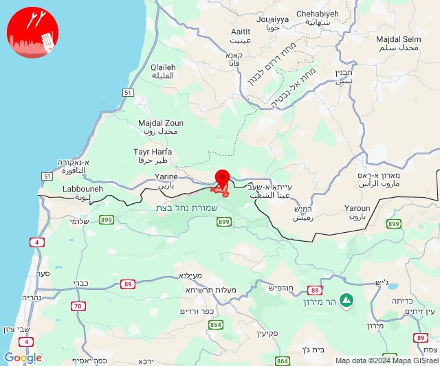

# Alerts for 2024-10-12

## 00:49

🔴 צבע אדום (12/10/2024):

03:49:
• קו העימות: הילה, מעיליא, גורן, גורנות הגליל, חוות אירוח גורן, אילון (מיידי)

צופר - צבע אדום

## 00:49

## 07:06

🔴 צבע אדום (12/10/2024):

10:06:
• מרכז הגליל: טפחות, מסד, עילבון, מע'אר (דקה)

צופר - צבע אדום

## 07:06

## 07:21

🔴 צבע אדום (12/10/2024):

10:20:
• קו העימות: מרגליות (מיידי)

10:21:
• קו העימות: מרגליות (מיידי)

צופר - צבע אדום

## 07:21

## 07:56

🔴 צבע אדום (12/10/2024):

10:55:
• גליל עליון: אזור תעשייה חצור הגלילית, חצור הגלילית, ראש פינה (30 שניות)

10:56:
• גליל עליון: צפת - עיר, עמוקה, אזור תעשייה צ.ח.ר, מחניים, מנחת מחניים, ביריה, אור הגנוז, בר יוחאי, קדיתא (30 שניות)
• קו העימות: דלתון (מיידי)

צופר - צבע אדום

## 07:56

## 09:17

🔴 צבע אדום (12/10/2024):

12:15:
• קו העימות: מטולה (מיידי)

12:16:
• קו העימות: מטולה, ע'ג'ר, כפר גלעדי (מיידי)

12:17:
• קו העימות: מטולה (מיידי)

צופר - צבע אדום

## 09:17

## 09:20

🔴 צבע אדום (12/10/2024):

12:20:
• קו העימות: מטולה (מיידי)

צופר - צבע אדום

## 09:20

## 09:24

🔴 צבע אדום (12/10/2024):

12:24:
• קו העימות: מטולה (מיידי)

צופר - צבע אדום

## 09:24

## 10:07

🔴 צבע אדום (12/10/2024):

13:06:
• מנשה: תלמי אלעזר (דקה וחצי)

13:07:
• המפרץ: חיפה - כרמל, הדר ועיר תחתית, חיפה - מערב, חיפה - מפרץ, חיפה - נווה שאנן ורמות כרמל, חיפה - קריית חיים ושמואל, קריית אתא, נשר, החותרים, טירת כרמל, כפר גלים (דקה)
• הכרמל: בית אורן, גבעת וולפסון, אזור תעשייה ניר עציון, בית צבי, כפר הנוער ימין אורד, מגדים, נווה ים, ניר עציון, עין הוד, עין כרמל, עתלית, יערות הכרמל, כלא דמון (דקה)

צופר - צבע אדום

## 10:07

## 10:09

🔴 צבע אדום (12/10/2024):

13:09:
• קו העימות: מנרה, מרגליות, קריית שמונה (מיידי)

צופר - צבע אדום

## 10:09

## 12:14

🔴 צבע אדום (12/10/2024):

15:13:
• גליל עליון: אזור תעשייה שער נעמן, ג'דידה מכר, עין המפרץ, כפר מסריק, עכו - אזור תעשייה, עכו, בית העלמין החדש עכו, בוסתן הגליל, טל - אל, כפר יאסיף, אחיהוד, יסעור (דקה, 30 שניות)
• המפרץ: אזור תעשייה קריית ביאליק, קריית ביאליק, קריית ים, קריית מוצקין (דקה)

15:14:
• גליל עליון: שומרת, ג'דידה מכר, עין המפרץ, עכו, עכו - אזור תעשייה, כפר מסריק, בית העלמין החדש עכו, נס עמים, לוחמי הגטאות, בוסתן הגליל, רגבה, עכו (30 שניות)

צופר - צבע אדום

## 12:14

## 12:17

🔴 צבע אדום (12/10/2024):

15:16:
• גליל עליון: עין המפרץ, עכו (30 שניות)

15:17:
• גליל עליון: עכו - אזור תעשייה (30 שניות)

צופר - צבע אדום

## 12:17

## 13:51

🔴 צבע אדום (12/10/2024):

16:48:
• קו העימות: שניר, קיבוץ דן (מיידי)

16:49:
• קו העימות: שאר ישוב, קיבוץ דן, שניר (מיידי)

16:50:
• קו העימות: משגב עם (מיידי)

16:51:
• קו העימות: משגב עם, כפר גלעדי, משגב עם (מיידי)

צופר - צבע אדום

## 13:51

## 13:59

🔴 צבע אדום (12/10/2024):

16:59:
• קו העימות: בית הלל, מעיין ברוך, קריית שמונה, תל חי, הגושרים (מיידי)

צופר - צבע אדום

## 13:59

## 14:10

🔴 צבע אדום (12/10/2024):

17:09:
• מערב לכיש: אזור תעשייה הדרומי אשקלון (30 שניות)

17:10:
• מערב לכיש: אשקלון - דרום (30 שניות)

צופר - צבע אדום

## 14:10

## 16:05

🔴 צבע אדום (12/10/2024):

19:05:
• דרום הגולן: קדמת צבי (15 שניות)
• צפון הגולן: מג'דל שמס (מיידי)

צופר - צבע אדום

## 16:05

## 17:01

🔴 צבע אדום (12/10/2024):

20:01:
• קו העימות: סאסא, בית ספר שדה מירון (מיידי)

צופר - צבע אדום

## 17:01

## 17:43

🔴 צבע אדום (12/10/2024):

20:43:
• קו העימות: זרעית (מיידי)

צופר - צבע אדום

## 17:43

## 18:08

🔴 צבע אדום (12/10/2024):

21:08:
• קו העימות: רמות נפתלי, לב החולה, יפתח, מרכז אזורי מבואות חרמון, רמות נפתלי (מיידי)
• גליל עליון: יסוד המעלה (30 שניות)

צופר - צבע אדום

## 18:08

## 18:36

🔴 צבע אדום (12/10/2024):

21:36:
• קו העימות: להבות הבשן (15 שניות)

צופר - צבע אדום

## 18:36

## 19:11

🔴 צבע אדום (12/10/2024):

22:11:
• צפון הגולן: מרום גולן (מיידי)

צופר - צבע אדום

## 19:11

## 20:22

🔴 צבע אדום (12/10/2024):

23:21:
• קו העימות: דישון, מלכיה, רמות נפתלי (מיידי)

23:22:
• קו העימות: יפתח, דישון, מלכיה (מיידי)

צופר - צבע אדום

## 20:22

## 20:28

🔴 צבע אדום (12/10/2024):

23:27:
• קו העימות: משגב עם, כפר גלעדי, תל חי, כפר יובל (מיידי)

23:28:
• קו העימות: קריית שמונה, משגב עם (מיידי)

צופר - צבע אדום

## 20:28

## 21:21

🔴 צבע אדום (13/10/2024):

00:20:
• קו העימות: הילה (מיידי)

00:21:
• קו העימות: חוות אירוח גורן (מיידי)

צופר - צבע אדום

## 21:21

## 22:19

🔴 צבע אדום (13/10/2024):

01:19:
• קו העימות: משגב עם (מיידי)

צופר - צבע אדום

## 22:19

## 22:44

🔴 צבע אדום (13/10/2024):

01:44:
• קו העימות: קריית שמונה, מנרה, מרגליות (מיידי)

צופר - צבע אדום

## 22:44

