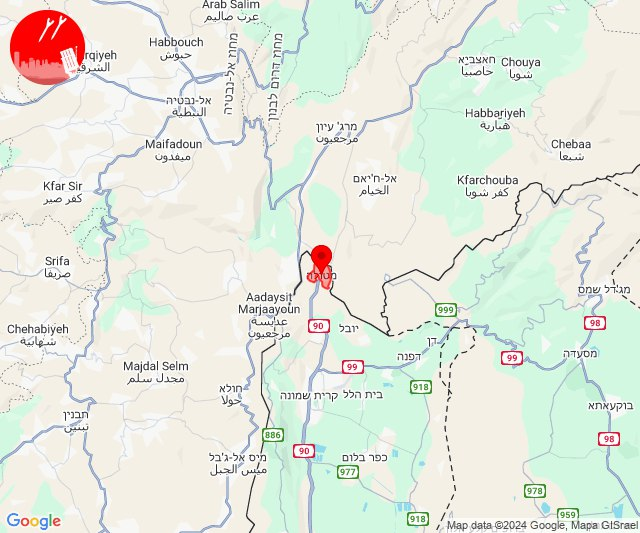

# Alerts for 2024-10-13

## 00:07

🔴 צבע אדום (13/10/2024):

03:07:
• קו העימות: נטועה (מיידי)

צופר - צבע אדום

## 00:07

## 00:48

🔴 צבע אדום (13/10/2024):

03:48:
• קו העימות: זרעית (מיידי)

צופר - צבע אדום

## 00:48

## 02:25

🔴 צבע אדום (13/10/2024):

05:25:
• קו העימות: מטולה, ע'ג'ר (מיידי)

צופר - צבע אדום

## 02:25

## 02:41

🔴 צבע אדום (13/10/2024):

05:41:
• קו העימות: זרעית (מיידי)

צופר - צבע אדום

## 02:41

## 02:48

🔴 צבע אדום (13/10/2024):

05:48:
• קו העימות: פסוטה, אבירים, אבן מנחם, שומרה (מיידי)

צופר - צבע אדום

## 02:48

## 03:08

🔴 צבע אדום (13/10/2024):

06:08:
• קו העימות: שומרה, זרעית (מיידי)

צופר - צבע אדום

## 03:08

## 03:17

🔴 צבע אדום (13/10/2024):

06:17:
• קו העימות: זרעית, שומרה (מיידי)

צופר - צבע אדום

## 03:17

## 04:06

🔴 צבע אדום (13/10/2024):

07:05:
• גליל עליון: בית ג'אן, חרשים, כסרא סמיע (30 שניות)
• קו העימות: הילה, חוות אירוח גורן, חוסן, כפר ורדים, מעונה, מעיליא, מעלות תרשיחא, בית ספר שדה מירון, חורפיש, עין יעקב, פקיעין החדשה, פקיעין, צוריאל, אבירים, אבן מנחם, אדמית, אילון, אלקוש, גורן, גורנות הגליל, זרעית, יערה, מתת, נטועה, סאסא, ערב אל עראמשה, פסוטה, שומרה, שתולה, צבעון (מיידי, 15 שניות)

07:06:
• קו העימות: שתולה (מיידי)

צופר - צבע אדום

## 04:06

## 06:01

🔴 צבע אדום (13/10/2024):

08:59:
• המפרץ: חיפה - מערב, חיפה - כרמל, הדר ועיר תחתית, חיפה - מפרץ, חיפה - נווה שאנן ורמות כרמל, חיפה - קריית חיים ושמואל, קריית אתא, נשר, טירת כרמל, כפר גלים (דקה)
• הכרמל: כלא דמון (דקה)

09:00:
• המפרץ: קריית ים, החותרים (דקה)
• הכרמל: בית אורן (דקה)
• גליל עליון: עכו - אזור תעשייה (30 שניות)

09:01:
• קו העימות: איזור תעשייה מילואות צפון, לימן, בית העלמין החדש נהריה, בן עמי, גשר הזיו, נהריה, סער, עברון, כברי, נווה זיו (מיידי, 30 שניות, 15 שניות)
• גליל עליון: בוסתן הגליל, בית העמק, ג'דידה מכר, כפר מסריק, נס עמים, נתיב השיירה, עין המפרץ, עכו - אזור תעשייה, עכו, שבי ציון, שומרת, שייח' דנון, אבו סנאן, אשרת, בית העלמין החדש עכו, ג'וליס, טל - אל, ירכא, כליל, כפר יאסיף, לוחמי הגטאות, מזרעה, עמקה, רגבה, אזור תעשייה שער נעמן, אפק, אזור תעשייה בר-לב, אחיהוד, יסעור (30 שניות, דקה)
• המפרץ: כפר ביאליק, קריית ביאליק, קריית מוצקין, אזור תעשייה קריית ביאליק (דקה)
• מרכז הגליל: טמרה, כאבול (דקה)

צופר - צבע אדום

## 06:01

## 06:45

🔴 צבע אדום (13/10/2024):

09:44:
• גליל עליון: אזור תעשייה שער נעמן, אזור תעשייה בר-לב, אחיהוד, יסעור (דקה)

09:45:
• גליל עליון: בוסתן הגליל, ג'דידה מכר, כפר מסריק, נס עמים, עין המפרץ, עכו - אזור תעשייה, עכו, שבי ציון, שומרת, בית העלמין החדש עכו, ג'וליס, טל - אל, לוחמי הגטאות, מזרעה, רגבה (30 שניות)
• קו העימות: נהריה, עברון (15 שניות)
• המפרץ: אזור תעשייה קריית ביאליק (דקה)

צופר - צבע אדום

## 06:45

## 06:49

🔴 צבע אדום (13/10/2024):

09:49:
• קו העימות: שתולה (מיידי)

צופר - צבע אדום

## 06:49

## 07:15

🔴 צבע אדום (13/10/2024):

10:15:
• קו העימות: יראון (מיידי)

צופר - צבע אדום

## 07:15

## 09:06

🔴 צבע אדום (13/10/2024):

12:06:
• קו העימות: שתולה (מיידי)

צופר - צבע אדום

## 09:06

## 09:57

🔴 צבע אדום (13/10/2024):

12:57:
• קו העימות: מרגליות, קריית שמונה, כפר גלעדי, תל חי, משגב עם, כפר יובל, בית הלל, מרגליות (מיידי)

צופר - צבע אדום

## 09:57

## 11:03

🔴 צבע אדום (13/10/2024):

14:01:
• מרכז הגליל: יובלים, שורשים, אזור תעשייה תרדיון, יעד, שעב, מרכז אזורי משגב, עצמון - שגב (דקה)

14:02:
• מרכז הגליל: רקפת, כאוכב אבו אלהיג'א, מנוף, קורנית, שכניה, יודפת, כפר מנדא, סכנין (דקה)
• גליל עליון: דיר אל-אסד, מג'דל כרום, גיתה, ינוח ג'ת, ירכא, כישור, לפידות, פלך, תובל, בענה, כרמיאל, צורית גילון, לבון, דיר אל-אסד, מג'דל כרום, כישור, לפידות, תובל, צורית גילון, כרמיאל (30 שניות)

14:03:
• גליל עליון: בענה, פלך, גיתה, ינוח ג'ת, ירכא, לפידות (30 שניות)

צופר - צבע אדום

## 11:03

## 11:09

🔴 צבע אדום (13/10/2024):

14:09:
• קו העימות: אבן מנחם, שתולה (מיידי)

צופר - צבע אדום

## 11:09

## 11:27

🔴 צבע אדום (13/10/2024):

14:27:
• מרכז הגליל: טפחות, מסד, עילבון, דיר חנא (דקה)

צופר - צבע אדום

## 11:27

## 11:54

🔴 צבע אדום (13/10/2024):

14:54:
• קו העימות: זרעית, שומרה (מיידי)

צופר - צבע אדום

## 11:54

## 12:19

🔴 צבע אדום (13/10/2024):

15:17:
• קו העימות: שתולה, שומרה, זרעית (מיידי)

15:19:
• קו העימות: זרעית, שומרה, זרעית (מיידי)

צופר - צבע אדום

## 12:19

## 12:23

🔴 צבע אדום (13/10/2024):

15:22:
• קו העימות: משגב עם, זרעית, משגב עם, שומרה (מיידי)

15:23:
• קו העימות: אבן מנחם, זרעית, שומרה, שתולה (מיידי)

צופר - צבע אדום

## 12:23

## 12:37

🔴 צבע אדום (13/10/2024):

15:37:
• קו העימות: שתולה (מיידי)

צופר - צבע אדום

## 12:37

## 12:47

🔴 צבע אדום (13/10/2024):

15:47:
• קו העימות: מטולה (מיידי)

צופר - צבע אדום

## 12:47

## 13:15

🔴 צבע אדום (13/10/2024):

16:15:
• קו העימות: זרעית, שתולה (מיידי)

צופר - צבע אדום

## 13:15

## 13:19

🔴 צבע אדום (13/10/2024):

16:19:
• קו העימות: שתולה (מיידי)

צופר - צבע אדום

## 13:19

## 15:36

🔴 צבע אדום (13/10/2024):

18:35:
• קו העימות: הילה, מעונה, מעיליא, מעלות תרשיחא, אבירים, גורן, גורנות הגליל, עין יעקב, כפר ורדים (מיידי, 15 שניות)
• גליל עליון: ינוח ג'ת, ירכא, כליל, מגדל תפן (30 שניות)

18:36:
• קו העימות: געתון, יחיעם, כפר ורדים, מעונה, מעלות תרשיחא (15 שניות, מיידי)

צופר - צבע אדום

## 15:36

## 15:50

✈️ חדירת כלי טיס עוין (13/10/2024):

18:43:
• קו העימות: לימן, גשר הזיו, נהריה, סער 

18:44:
• קו העימות: נהריה, סער 

18:45:
• קו העימות: בן עמי, עברון 

18:46:
• גליל עליון: מזרעה, רגבה 

18:47:
• גליל עליון: נס עמים, לוחמי הגטאות, מזרעה, שומרת 

18:48:
• גליל עליון: בוסתן הגליל, עכו, לוחמי הגטאות 

18:49:
• גליל עליון: עכו 

18:50:
• גליל עליון: כפר מסריק, עין המפרץ, עכו - אזור תעשייה, עכו 

צופר - צבע אדום

## 15:50

## 15:55

🔴 צבע אדום (13/10/2024):

18:55:
• קו העימות: זרעית (מיידי)

צופר - צבע אדום

## 15:55

## 16:02

🔴 צבע אדום (13/10/2024):

19:00:
• מנשה: תלמי אלעזר (דקה וחצי)

19:01:
• קו העימות: הילה, חוות אירוח גורן, אבירים, אבן מנחם, אדמית, אילון, גורן, גורנות הגליל, זרעית, חניתה, יערה, נטועה, ערב אל עראמשה, פסוטה, שומרה, שלומי, שתולה (מיידי)

19:02:
• קו העימות: איזור תעשייה מילואות צפון, בצת, חוף בצת, לימן, ראש הנקרה, גשר הזיו, נהריה, אדמית, בצת, חניתה, ערב אל עראמשה, ראש הנקרה, שלומי (מיידי, 15 שניות)

צופר - צבע אדום

## 16:02

## 18:23

🔴 צבע אדום (13/10/2024):

21:23:
• קו העימות: משגב עם, מטולה, קריית שמונה, מנרה, מרגליות, כפר גלעדי, תל חי (מיידי)

צופר - צבע אדום

## 18:23

## 18:32

🔴 צבע אדום (13/10/2024):

21:32:
• קו העימות: מנרה (מיידי)

צופר - צבע אדום

## 18:32

## 18:52

🔴 צבע אדום (13/10/2024):

21:52:
• קו העימות: מנרה, מרגליות, קריית שמונה, מנרה (מיידי)

צופר - צבע אדום

## 18:52

## 19:04

🔴 צבע אדום (13/10/2024):

22:02:
• קו העימות: משגב עם (מיידי)

22:03:
• קו העימות: קריית שמונה (מיידי)

22:04:
• קו העימות: שתולה (מיידי)

צופר - צבע אדום

## 19:04

## 19:37

✈️ חדירת כלי טיס עוין (13/10/2024):

22:37:
• קו העימות: קריית שמונה 

צופר - צבע אדום

## 19:37

## 20:04

🔴 צבע אדום (13/10/2024):

23:03:
• המפרץ: חיפה - כרמל, הדר ועיר תחתית, חיפה - מערב (דקה)

23:04:
• המפרץ: חיפה - נווה שאנן ורמות כרמל, טירת כרמל, כפר גלים (דקה)

צופר - צבע אדום

## 20:04

## 22:23

✈️ חדירת כלי טיס עוין (14/10/2024):

01:23:
• קו העימות: קריית שמונה 

צופר - צבע אדום

## 22:23

