# Alerts for 2024-10-14

## 04:08

🔴 צבע אדום (14/10/2024):

07:08:
• המפרץ: חיפה - מערב, חיפה - כרמל, הדר ועיר תחתית (דקה)

צופר - צבע אדום

## 04:08

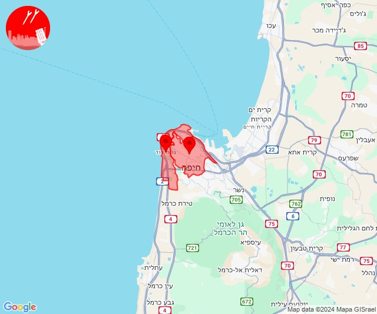

## 05:16

🔴 צבע אדום (14/10/2024):

08:16:
• קו העימות: מרגליות, מנרה, משגב עם (מיידי)

צופר - צבע אדום

## 05:16

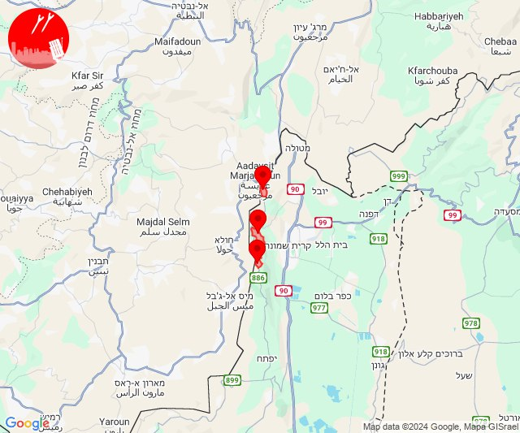

## 06:32

🔴 צבע אדום (14/10/2024):

09:31:
• המפרץ: חיפה - כרמל, הדר ועיר תחתית, חיפה - מערב (דקה)

09:32:
• המפרץ: חיפה - נווה שאנן ורמות כרמל, חיפה - מפרץ, נשר, החותרים, טירת כרמל, כפר גלים, חיפה - קריית חיים ושמואל, קריית ים (דקה)

צופר - צבע אדום

## 06:32

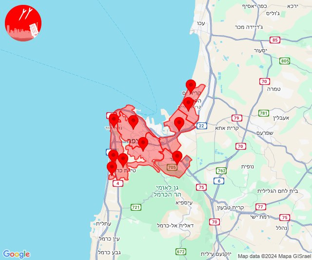

## 07:12

🔴 צבע אדום (14/10/2024):

10:11:
• קו העימות: צבעון, סאסא, מתת, צבעון (מיידי)

10:12:
• קו העימות: סאסא, דוב''ב, סאסא, צבעון (מיידי)

צופר - צבע אדום

## 07:12

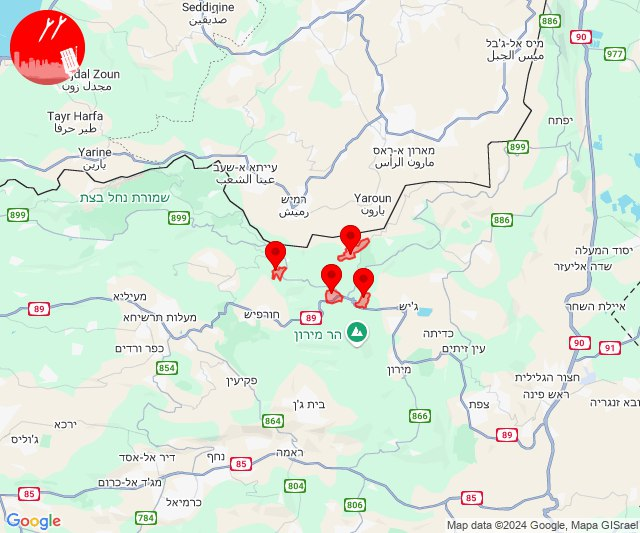

## 08:21

🔴 צבע אדום (14/10/2024):

11:19:
• שרון: אביחיל, נתניה - מזרח, נתניה - מערב, שושנת העמקים, ביתן אהרן, בת חן, גבעת שפירא, חבצלת השרון וצוקי ים, פרדסיה, צור משה, אזור תעשייה כפר יונה, בית הלוי, גנות הדר, המרכז האקדמי רופין, כפר יונה, כפר מונש, נורדיה, בארותיים, בורגתה, חניאל, ינוב, תנובות, עולש, קדימה צורן, אבן יהודה, כפר נטר, בית חרות, בית ינאי, בית יצחק - שער חפר, הדר עם, חופית, כפר ויתקין, כפר חיים, כפר ידידיה, מעברות, משמר השרון, נעורים, עין ורד, עין שריד, גאולים, קלנסווה, שער אפרים, אחיטוב, אמץ, בחן, בת חפר, גן יאשיה, המעפיל, זמר, יד חנה, ניצני עוז (דקה וחצי)
• מנשה: להבות חביבה (דקה וחצי)

11:20:
• שרון: אלישיב, העוגן, עין החורש, אזור תעשייה עמק חפר, בית חזון, גאולי תימן, חיבת ציון, חרב לאת, כפר הרא''ה, מכמורת, גבעת חיים איחוד, גבעת חיים מאוחד, חגלה, חרות, כפר הס, כפר יעבץ, כפר עבודה, פורת, תל מונד (דקה וחצי)
• ואדי ערה: מגל, באקה אל גרבייה, מייסר, מצר, חריש (דקה וחצי)
• מנשה: שדה יצחק, גבעת חביבה, מאור, מענית, שער מנשה, עין שמר (דקה וחצי)

11:21:
• ואדי ערה: ג'ת, גבעת ניל''י, רגבים, כפר קרע, ערערה (דקה וחצי)
• מנשה: אזור תעשייה רגבים, גבעת עדה (דקה וחצי)

צופר - צבע אדום

## 08:21

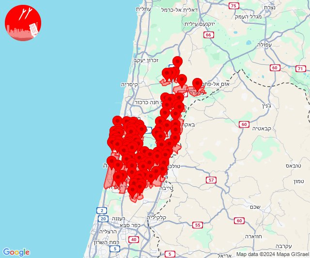

## 10:26

🔴 צבע אדום (14/10/2024):

13:26:
• דרום הגולן: קדמת צבי (15 שניות)

צופר - צבע אדום

## 10:26

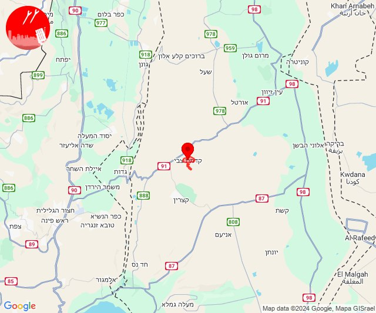

## 10:34

🔴 צבע אדום (14/10/2024):

13:34:
• קו העימות: רמות נפתלי (מיידי)

צופר - צבע אדום

## 10:34

## 10:50

🔴 צבע אדום (14/10/2024):

13:49:
• קו העימות: רמות נפתלי (מיידי)

13:50:
• קו העימות: רמות נפתלי (מיידי)

צופר - צבע אדום

## 10:50

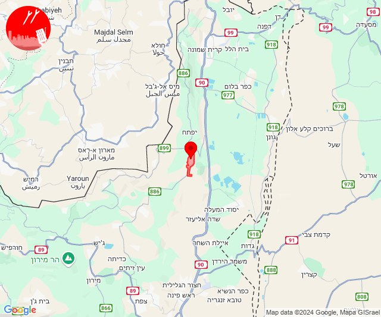

## 11:34

🔴 צבע אדום (14/10/2024):

14:32:
• מרכז הגליל: אשחר, ערב אל נעים, יובלים, שורשים (דקה, 30 שניות)

14:33:
• מרכז הגליל: מרכז אזורי משגב, רקפת, אזור תעשייה תרדיון, סכנין (דקה)
• גליל עליון: כרמיאל, דיר אל-אסד, לבון, לפידות, בענה, מג'דל כרום, נחף, אזור תעשייה כרמיאל, כרמיאל (30 שניות)

14:34:
• גליל עליון: דיר אל-אסד, לבון, גיתה, כישור, לפידות, פלך, תובל, בענה, מג'דל כרום (30 שניות)

צופר - צבע אדום

## 11:34

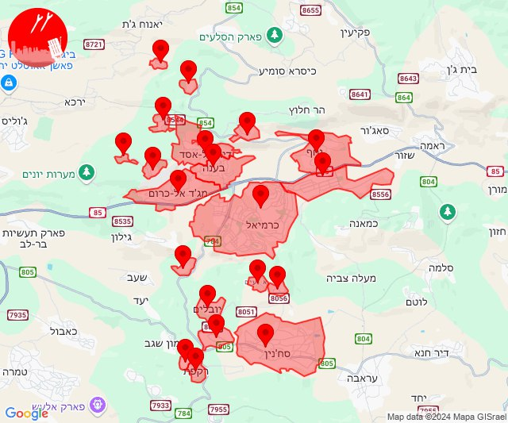

## 12:12

✈️ חדירת כלי טיס עוין (14/10/2024):

15:12:
• גליל עליון: יסוד המעלה 

צופר - צבע אדום

## 12:12

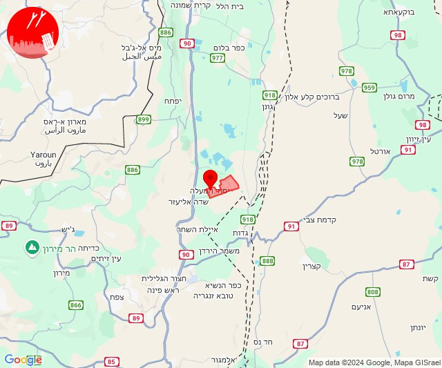

## 12:14

🔴 צבע אדום (14/10/2024):

15:13:
• קו העימות: יחיעם, געתון, הילה, מעיליא (15 שניות, מיידי)
• גליל עליון: כליל (30 שניות)

15:14:
• קו העימות: מנות, עין יעקב (מיידי, 15 שניות)
• גליל עליון: כליל (30 שניות)

צופר - צבע אדום

## 12:14

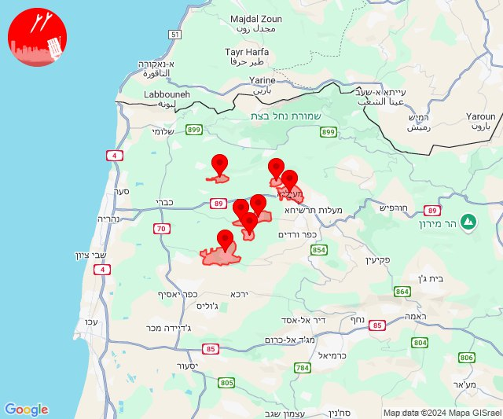

## 12:51

🔴 צבע אדום (14/10/2024):

15:50:
• קו העימות: אלקוש, פסוטה, שתולה (מיידי)

15:51:
• קו העימות: מעלות תרשיחא, אבירים, אבן מנחם (מיידי)

צופר - צבע אדום

## 12:51

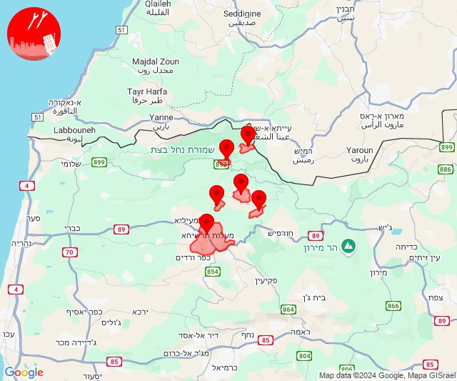

## 13:09

🔴 צבע אדום (14/10/2024):

16:09:
• קו העימות: יראון, אביבים (מיידי)

צופר - צבע אדום

## 13:09

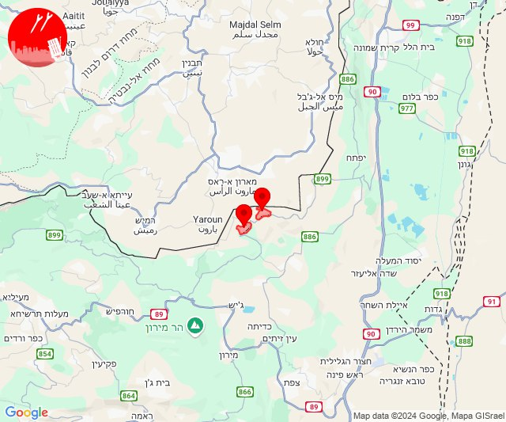

## 13:12

🔴 צבע אדום (14/10/2024):

16:12:
• קו העימות: יראון (מיידי)

צופר - צבע אדום

## 13:12

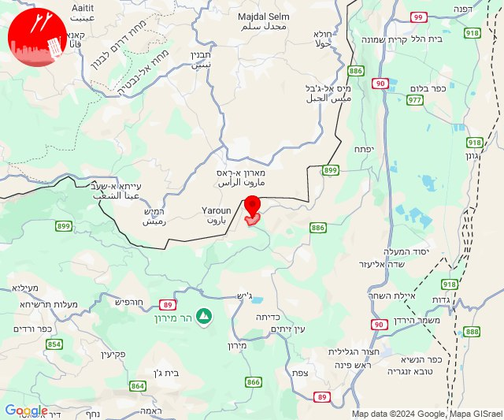

## 14:11

🔴 צבע אדום (14/10/2024):

17:10:
• קו העימות: שתולה (מיידי)

17:11:
• קו העימות: שתולה (מיידי)

צופר - צבע אדום

## 14:11

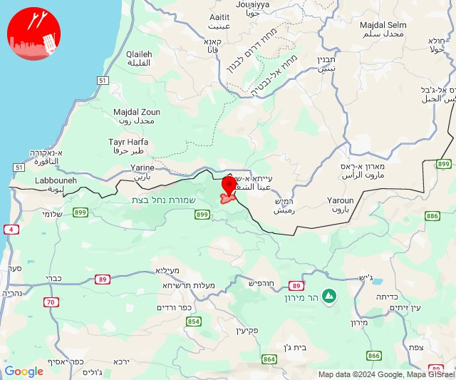

## 14:16

🔴 צבע אדום (14/10/2024):

17:14:
• הכרמל: נווה ים (דקה)

17:15:
• מנשה: תלמי אלעזר (דקה וחצי)
• גליל עליון: עכו - אזור תעשייה (30 שניות)

17:16:
• המפרץ: החותרים, טירת כרמל, כפר גלים (דקה)
• הכרמל: מגדים, עתלית (דקה)

צופר - צבע אדום

## 14:16

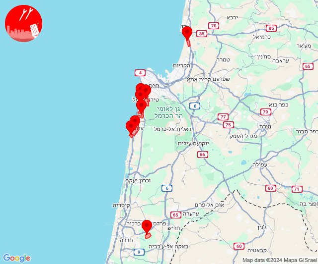

## 14:24

🔴 צבע אדום (14/10/2024):

17:24:
• קו העימות: מרגליות, משגב עם (מיידי)

צופר - צבע אדום

## 14:24

## 14:37

🔴 צבע אדום (14/10/2024):

17:33:
• דן: תל אביב - עבר הירקון, בני ברק, הרצליה - מערב, הרצליה - מרכז וגליל ים, כפר שמריהו, פתח תקווה, רמת גן - מערב, רמת השרון, בית עלמין מורשה, סינמה סיטי גלילות, מתחם פי גלילות (דקה וחצי)
• שרון: גבעת חן, רעננה, אלישמע, בית ברל, בני דרור, ג'לג'וליה, גן חיים, גני עם, הוד השרון, חגור, חרות, טירה, ירחיב, ירקונה, כפר הס, כפר מל''ל, כפר סבא, משמרת, מתן, נווה ימין, נווה ירק, ניר אליהו, עדנים, עין ורד, צופית, קדימה צורן, רמות השבים, רמת הכובש, שדה ורבורג, שדי חמד, תחנת רכבת ראש העין, תל מונד, אבן יהודה, אודים, ארסוף, בית יהושע, בני ציון, בצרה, געש, חרוצים, יקום, כפר נטר, מכון וינגייט, רשפון, שפיים, תל יצחק, מתחם "חנה וסע" שפיים, בית סוהר השרון, מרכז אזורי דרום השרון, אחיטוב, גבעת חיים איחוד, גבעת חיים מאוחד, המעפיל, עין החורש, נתניה - מזרח, נתניה - מערב, בית יצחק - שער חפר, אביחיל, שושנת העמקים, בית חרות, בית ינאי, ביתן אהרן, בת חן, גבעת שפירא, חבצלת השרון וצוקי ים, חופית, כפר ויתקין, נעורים, גאולים, טייבה, יעף, כפר יעבץ, עזריאל, עין שריד, פורת, פרדסיה, צור משה, קלנסווה, שער אפרים, בארותיים, בורגתה, חניאל, ינוב, כפר יונה, ניצני עוז, עולש, תנובות, אליכין, אורנית, אייל, חורשים, כוכב יאיר - צור יגאל, כפר ברא, כפר עבודה, כפר קאסם, נירית, צור יצחק, צור נתן, אלפי מנשה, צופים, אזור תעשייה טירה, אמץ, בחן, בת חפר, גן יאשיה, יד חנה, סלעית (דקה וחצי)
• מנשה: חדרה - מזרח, חדרה - מרכז, גן השומרון, גן שמואל, עין שמר, פרדס חנה כרכור, מאור, שדה יצחק, תלמי אלעזר (דקה וחצי)

17:34:
• דן: בת ים, חולון (דקה וחצי)
• השפלה: פארק תעשיות פלמחים, ראשון לציון - מזרח, ראשון לציון - מערב, אירוס, בית חנן, בית עובד, גן שורק, נטעים, נס ציונה, עיינות (דקה וחצי)
• לכיש: פלמחים (דקה וחצי)
• שרון: אזור תעשייה עמק חפר, גאולי תימן, מכמורת (דקה וחצי)
• מנשה: מתחם שביל התפוזים (דקה וחצי)

17:35:
• שרון: כפר ידידיה, הדר עם, כפר חיים, מעברות, משמר השרון, גנות הדר, המרכז האקדמי רופין, כפר מונש, אזור תעשייה כפר יונה, בית הלוי, העוגן (דקה וחצי)
• מנשה: אזור תעשייה קיסריה (דקה וחצי)
• דן: תל אביב - דרום העיר ויפו, תל אביב - מזרח, תל אביב - מרכז העיר, אור יהודה, אזור, גבעת שמואל, גבעתיים, יהוד מונוסון, מקווה ישראל, סביון, קריית אונו, רמת גן - מזרח, גני תקווה (דקה וחצי)
• השפלה: באר יעקב, לוד, ניר צבי, תעשיון צריפין, אחיעזר, בית דגן, זיתן, חמד, חניון הנתיב מהיר, יגל, כפר חב''ד, משמר השבעה, צפריה, גנות (דקה וחצי)
• שומרון: אבני חפץ, ענב (דקה וחצי)

17:36:
• מנשה: חדרה - מערב, חדרה - נווה חיים, חדרה - מרכז, חדרה - מזרח (דקה וחצי)
• שרון: אלישיב, בית חזון, חגלה, חיבת ציון, חרב לאת, כפר הרא''ה, נורדיה, נתניה - מערב, בית יצחק - שער חפר, גבעת חיים איחוד, גבעת חיים מאוחד, אביחיל, שושנת העמקים, אליכין, בית חרות, בית ינאי, ביתן אהרן, בת חן, גבעת שפירא, חבצלת השרון וצוקי ים, חופית, כפר ויתקין, נעורים (דקה וחצי)

17:37:
• שרון: נתניה - מזרח, בני דרור, גאולים, חרות, טירה, יעף, כפר הס, כפר יעבץ, כפר עבודה, משמרת, עזריאל, עין ורד, עין שריד, פורת, פרדסיה, צור משה, קדימה צורן, קלנסווה, תל מונד, אבן יהודה, אודים, בית יהושע, כפר נטר, תל יצחק, ינוב, כפר יונה, תנובות, בית סוהר השרון (דקה וחצי)

צופר - צבע אדום

## 14:37

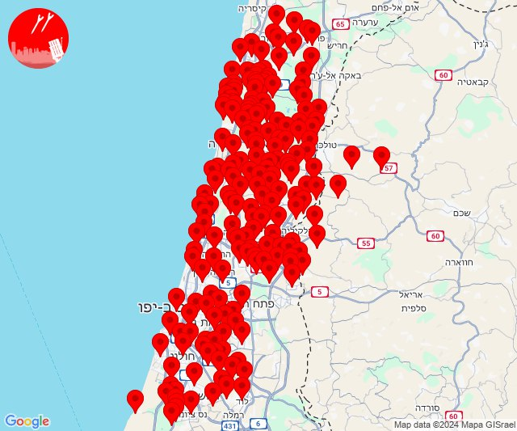

## 15:25

🔴 צבע אדום (14/10/2024):

18:24:
• גליל עליון: צפת - עכברה, צפת - עיר, בר יוחאי, מירון, מרכז אזורי מרום גליל, כחל, כורזים ורד הגליל, עמיעד, צפת - עכברה (30 שניות, דקה)

18:25:
• גליל עליון: צפת - נוף כנרת, ביריה, צפת - עיר (30 שניות)

צופר - צבע אדום

## 15:25

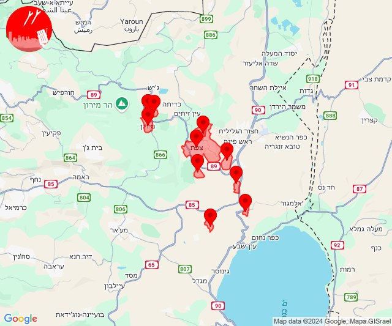

## 15:59

🔴 צבע אדום (14/10/2024):

18:59:
• קו העימות: משגב עם, מרגליות (מיידי)

צופר - צבע אדום

## 15:59

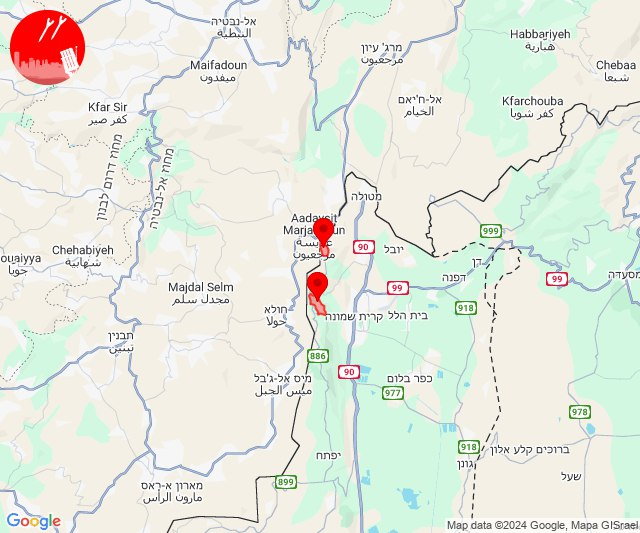

## 17:05

🔴 צבע אדום (14/10/2024):

20:05:
• קו העימות: רמות נפתלי (מיידי)

צופר - צבע אדום

## 17:05

## 19:41

🔴 צבע אדום (14/10/2024):

22:41:
• קו העימות: מרגליות, משגב עם (מיידי)

צופר - צבע אדום

## 19:41

## 22:14

🔴 צבע אדום (15/10/2024):

01:13:
• קו העימות: מרגליות (מיידי)

01:14:
• קו העימות: מרגליות (מיידי)

צופר - צבע אדום

## 22:14

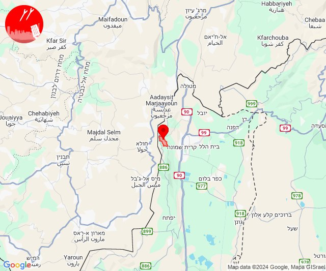

## 22:18

🔴 צבע אדום (15/10/2024):

01:18:
• קו העימות: שתולה (מיידי)

צופר - צבע אדום

## 22:18

