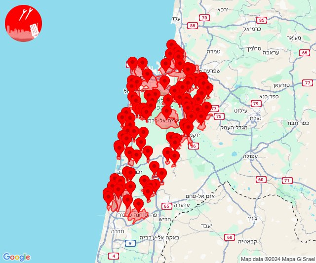
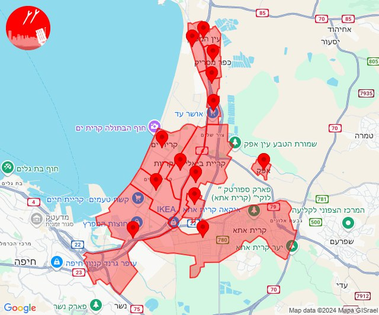

# Alerts for 2024-10-15

## 02:32

🔴 צבע אדום (15/10/2024):

05:32:
• קו העימות: קריית שמונה, בית הלל, הגושרים, כפר יובל, מעיין ברוך (מיידי)

צופר - צבע אדום

## 02:32

## 02:56

🔴 צבע אדום (15/10/2024):

05:56:
• קו העימות: כפר גלעדי, משגב עם (מיידי)

צופר - צבע אדום

## 02:56

## 04:25

🔴 צבע אדום (15/10/2024):

07:24:
• מנשה: זכרון יעקב, מעגן מיכאל, מעיין צבי (דקה וחצי)

07:25:
• הכרמל: גבעת וולפסון, דלית אל כרמל, אזור תעשייה ניר עציון, גבע כרמל, דור, הבונים, כפר הנוער ימין אורד, כרם מהר''ל, מאיר שפיה, מרכז מיר''ב, נווה ים, נחשולים, ניר עציון, עופר, עין איילה, עין הוד, עין חוד, עין כרמל, עתלית, פוריידיס, צרופה, יערות הכרמל (דקה)
• מנשה: תלמי אלעזר (דקה וחצי)

צופר - צבע אדום

## 04:25

## 04:27

🔴 צבע אדום (15/10/2024):

07:27:
• הכרמל: בית אורן, גבעת וולפסון, דלית אל כרמל, אזור תעשייה ניר עציון, בית צבי, בת שלמה, גבע כרמל, דור, הבונים, כפר הנוער ימין אורד, כרם מהר''ל, מאיר שפיה, מגדים, מרכז מיר''ב, נווה ים, נחשולים, ניר עציון, עופר, עין איילה, עין הוד, עין חוד, עין כרמל, עתלית, פוריידיס, צרופה, יערות הכרמל, עספיא, בית סוהר קישון, כלא דמון (דקה)
• מנשה: אביאל, אור עקיבא, אזור תעשייה קיסריה, אלוני יצחק, בית חנניה, בנימינה, ג'סר א-זרקא, גבעת עדה, כפר גליקסון, עמיקם, פרדס חנה כרכור, קיסריה, שדות ים, צומת בנימינה, אזור תעשייה רגבים, בית ספר אורט בנימינה, מרכז ימי קיסריה, רמת הנדיב (דקה וחצי)
• ואדי ערה: אזור תעשייה מבוא כרמל, אליקים, גבעת ניל''י, דליה, יקנעם עילית, רמות מנשה, אזור תעשייה יקנעם עילית, יקנעם המושבה והזורע, עין העמק (דקה וחצי)
• המפרץ: אושה, חיפה - כרמל, הדר ועיר תחתית, חיפה - מערב, חיפה - מפרץ, חיפה - נווה שאנן ורמות כרמל, חיפה - קריית חיים ושמואל, כפר ביאליק, כפר המכבי, קריית אתא, קריית ביאליק, קריית ים, קריית מוצקין, רמת יוחנן, נשר, איבטין, החותרים, טירת כרמל, יגור, כפר גלים, כפר חסידים, רכסים, בית עלמין תל רגב (דקה)
• העמקים: אורנים, אלונים, בסמת טבעון, כפר טבאש, כפר יהושע, כפר תקווה, נופית, קריית טבעון - בית זייד, ראס עלי, רמת ישי, שדה יעקב, שער העמקים, ח'וואלד, חוואלד, תחנת רכבת כפר יהושוע (דקה)

צופר - צבע אדום

## 04:27

## 04:29

🔴 צבע אדום (15/10/2024):

07:29:
• קו העימות: משגב עם (מיידי)

צופר - צבע אדום

## 04:29

## 06:55

🔴 צבע אדום (15/10/2024):

09:54:
• קו העימות: משגב עם, כפר גלעדי, קריית שמונה (מיידי)

09:55:
• קו העימות: משגב עם (מיידי)

צופר - צבע אדום

## 06:55

## 11:20

🔴 צבע אדום (15/10/2024):

14:20:
• המפרץ: קריית ביאליק, קריית ים, קריית מוצקין, אזור תעשייה קריית ביאליק, חיפה - קריית חיים ושמואל, חיפה - מפרץ, כפר ביאליק, קריית אתא (דקה)
• גליל עליון: אזור תעשייה שער נעמן, אפק, כפר מסריק, עין המפרץ, עכו - אזור תעשייה (דקה, 30 שניות)

צופר - צבע אדום

## 11:20

## 11:24

🔴 צבע אדום (15/10/2024):

14:24:
• קו העימות: מטולה (מיידי)

צופר - צבע אדום

## 11:24

## 11:31

🔴 צבע אדום (15/10/2024):

14:31:
• קו העימות: גשר הזיו (מיידי)

צופר - צבע אדום

## 11:31

## 11:31

✈️ חדירת כלי טיס עוין (15/10/2024):

14:30:
• קו העימות: נהריה, סער 

14:31:
• קו העימות: כברי, בית העלמין החדש נהריה 
• גליל עליון: נתיב השיירה 

צופר - צבע אדום

## 11:31

## 11:52

🔴 צבע אדום (15/10/2024):

14:52:
• קו העימות: דוב''ב (מיידי)

צופר - צבע אדום

## 11:52

## 13:10

🔴 צבע אדום (15/10/2024):

16:10:
• קו העימות: חורפיש, מתת (מיידי)

צופר - צבע אדום

## 13:10

## 15:20

🔴 צבע אדום (15/10/2024):

18:20:
• גליל עליון: ביריה (30 שניות)

צופר - צבע אדום

## 15:20

## 15:51

🔴 צבע אדום (15/10/2024):

18:51:
• קו העימות: שאר ישוב (מיידי)

צופר - צבע אדום

## 15:51

## 16:02

🔴 צבע אדום (15/10/2024):

19:02:
• מרכז הגליל: חזון, מע'אר, מורן, טורעאן, מצפה נטופה, בועיינה-נוג'ידאת (דקה)
• העמקים: אילניה (דקה)
• גליל תחתון: אתר ההנצחה גולני (דקה)

צופר - צבע אדום

## 16:02

## 16:05

🔴 צבע אדום (15/10/2024):

19:05:
• מרכז הגליל: טורעאן (דקה)

צופר - צבע אדום

## 16:05

## 17:01

🔴 צבע אדום (15/10/2024):

20:00:
• קו העימות: מתת (מיידי)

20:01:
• גליל עליון: בית ג'אן, ראמה (30 שניות)

צופר - צבע אדום

## 17:01

## 17:56

🔴 צבע אדום (15/10/2024):

20:56:
• קו העימות: ראש הנקרה, שלומי, חוף בצת (מיידי)

צופר - צבע אדום

## 17:56

## 19:06

🔴 צבע אדום (15/10/2024):

22:06:
• קו העימות: נטועה, שתולה (מיידי)

צופר - צבע אדום

## 19:06

## 19:43

🔴 צבע אדום (15/10/2024):

22:43:
• עוטף עזה: נירים (15 שניות)

צופר - צבע אדום

## 19:43

## 20:50

🔴 צבע אדום (15/10/2024):

23:50:
• קו העימות: יערה (מיידי)

צופר - צבע אדום

## 20:50

## 21:10

🔴 צבע אדום (16/10/2024):

00:10:
• קו העימות: כפר סאלד, שאר ישוב (15 שניות, מיידי)

צופר - צבע אדום

## 21:10

## 21:21

✈️ חדירת כלי טיס עוין (16/10/2024):

00:21:
• קו העימות: כפר יובל, כפר גלעדי 

צופר - צבע אדום

## 21:22

## 22:40

🔴 צבע אדום (16/10/2024):

01:38:
• גליל עליון: צפת - נוף כנרת, צפת - עיר (30 שניות)

01:39:
• קו העימות: אזור תעשייה רמת דלתון, דלתון, עלמה, ריחאנייה, כרם בן זמרה, אזור תעשייה רמת דלתון, עלמה, ריחאנייה (מיידי)
• גליל עליון: ביריה, עמוקה, צפת - עכברה, חצור הגלילית, ראש פינה, צפת - נוף כנרת, צפת - עיר, אליפלט, ביריה, עמוקה (30 שניות)

01:40:
• גליל עליון: צפת - עכברה, חצור הגלילית, ראש פינה, צפת - נוף כנרת, צפת - עיר (30 שניות)

צופר - צבע אדום

## 22:40

## 23:29

🔴 צבע אדום (16/10/2024):

02:29:
• קו העימות: דישון (מיידי)

צופר - צבע אדום

## 23:29

## 23:32

🔴 צבע אדום (16/10/2024):

02:32:
• גליל עליון: אור הגנוז, בר יוחאי, ספסופה - כפר חושן (30 שניות)
• קו העימות: ג'ש - גוש חלב (מיידי)

צופר - צבע אדום

## 23:32

