# Alerts for 2024-10-16

## 09:31

🔴 צבע אדום (16/10/2024):

12:31:
• קו העימות: כפר גלעדי, משגב עם (מיידי)

צופר - צבע אדום

## 09:31

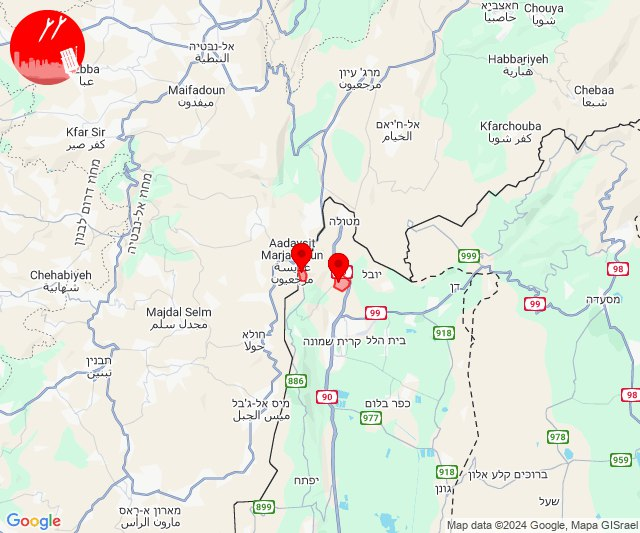

## 11:17

🔴 צבע אדום (16/10/2024):

14:16:
• מרכז הגליל: שורשים, שעב (דקה)
• גליל עליון: בענה, כרמיאל, מג'דל כרום, צורית גילון, פלך, תובל (30 שניות)
• קו העימות: מעיליא, מעלות תרשיחא (מיידי)

14:17:
• גליל עליון: דיר אל-אסד, לבון, ירכא, גיתה, כישור, לפידות, ינוח ג'ת, מגדל תפן, כליל, מג'דל כרום, בענה, כרמיאל, צורית גילון, תובל, דיר אל-אסד, לבון, גיתה, ירכא, כישור, לפידות, פלך, ינוח ג'ת, מגדל תפן (30 שניות)
• קו העימות: כפר ורדים, הילה, מעונה, מעיליא, מעלות תרשיחא (15 שניות, מיידי)

צופר - צבע אדום

## 11:17

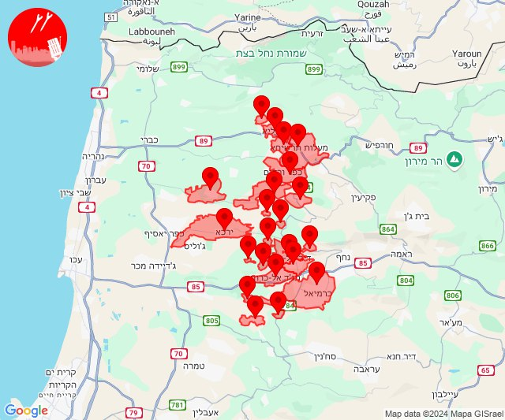

## 12:24

🔴 צבע אדום (16/10/2024):

15:24:
• העמקים: גבת, יפעת, רמת דוד, שריד (דקה)

צופר - צבע אדום

## 12:24

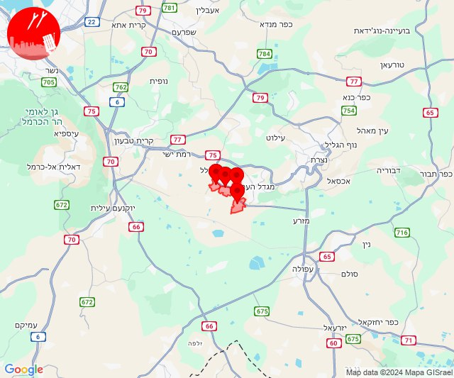

## 13:16

🔴 צבע אדום (16/10/2024):

16:16:
• עוטף עזה: מטווח ניר עם, מפלסים (15 שניות)

צופר - צבע אדום

## 13:16

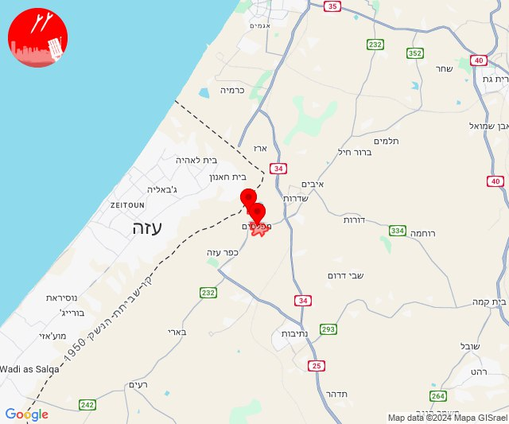

## 13:50

🔴 צבע אדום (16/10/2024):

16:50:
• קו העימות: משגב עם, מנרה, מרגליות (מיידי)

צופר - צבע אדום

## 13:50

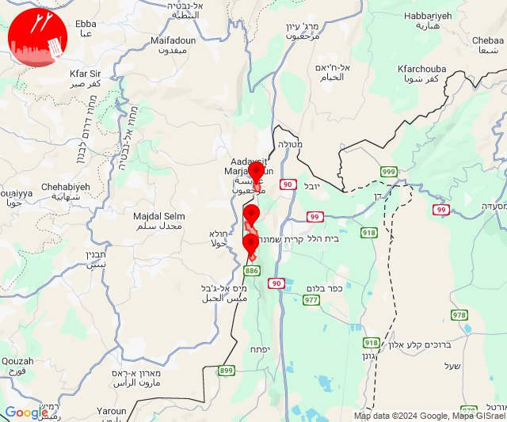

## 14:31

🔴 צבע אדום (16/10/2024):

17:31:
• קו העימות: משגב עם (מיידי)

צופר - צבע אדום

## 14:31

## 14:36

🔴 צבע אדום (16/10/2024):

17:36:
• קו העימות: מלכיה (מיידי)

צופר - צבע אדום

## 14:36

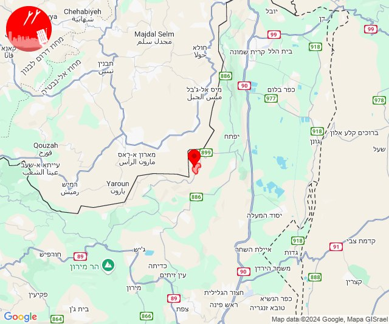

## 15:03

🔴 צבע אדום (16/10/2024):

18:03:
• גליל עליון: צפת - עכברה, ביריה, צפת - עיר (30 שניות)

צופר - צבע אדום

## 15:03

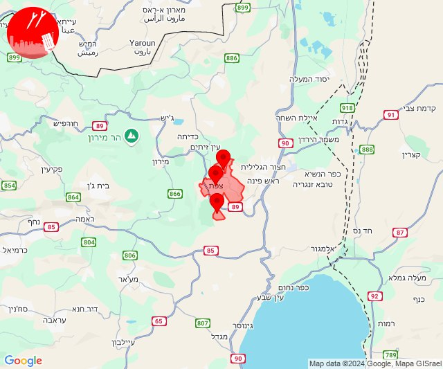

## 15:16

✈️ חדירת כלי טיס עוין (16/10/2024):

18:16:
• קו העימות: פקיעין 
• גליל עליון: בית ג'אן 

צופר - צבע אדום

## 15:16

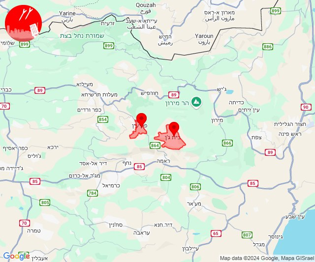

## 15:43

🔴 צבע אדום (16/10/2024):

18:43:
• קו העימות: חניתה (מיידי)

צופר - צבע אדום

## 15:43

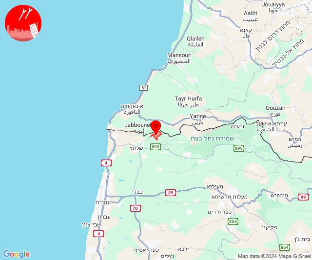

## 15:43

✈️ חדירת כלי טיס עוין (16/10/2024):

18:40:
• קו העימות: אדמית, ערב אל עראמשה 

18:41:
• קו העימות: חניתה, יערה, אדמית 

18:42:
• קו העימות: שלומי, חניתה 

18:43:
• קו העימות: בצת, שלומי, איזור תעשייה מילואות צפון, בצת, חוף בצת, לימן, מצובה, ראש הנקרה, שלומי 

צופר - צבע אדום

## 15:43

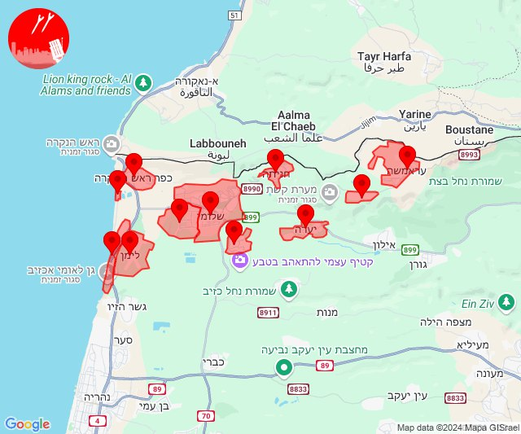

## 15:46

✈️ חדירת כלי טיס עוין (16/10/2024):

18:46:
• קו העימות: בן עמי, גשר הזיו, נהריה, סער, עברון 
• גליל עליון: שבי ציון 

צופר - צבע אדום

## 15:46

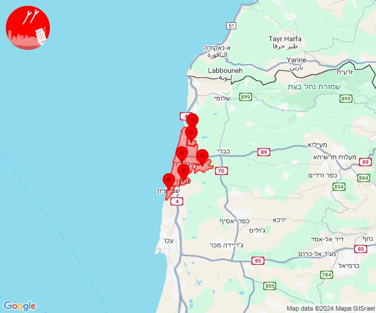

## 15:52

🔴 צבע אדום (16/10/2024):

18:52:
• קו העימות: משגב עם, מרגליות (מיידי)

צופר - צבע אדום

## 15:52

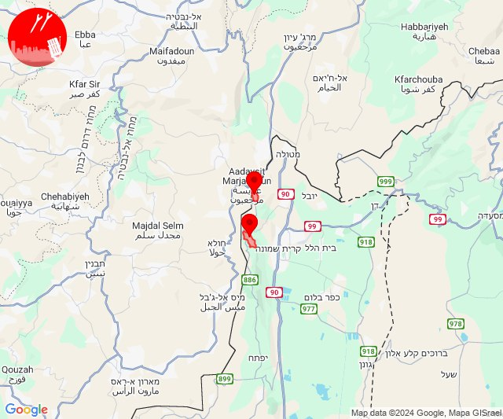

## 18:00

🔴 צבע אדום (16/10/2024):

21:00:
• עוטף עזה: שדרות, איבים, ניר עם (15 שניות)

צופר - צבע אדום

## 18:00

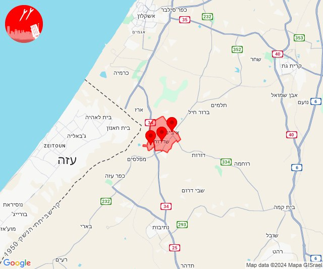

## 18:09

🔴 צבע אדום (16/10/2024):

21:09:
• קו העימות: זרעית (מיידי)

צופר - צבע אדום

## 18:09

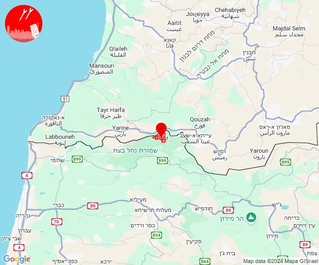

## 18:15

🔴 צבע אדום (16/10/2024):

21:15:
• גליל עליון: אור הגנוז, בר יוחאי, מרכז אזורי מרום גליל, ספסופה - כפר חושן, קדיתא (30 שניות)
• קו העימות: ג'ש - גוש חלב, ברעם, צבעון, דוב''ב (מיידי)

צופר - צבע אדום

## 18:15

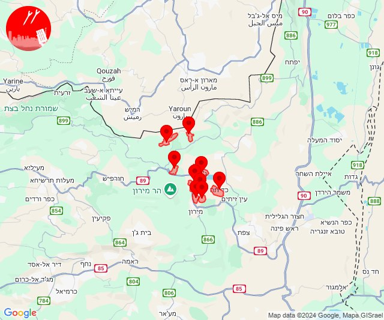

## 19:18

🔴 צבע אדום (16/10/2024):

22:18:
• קו העימות: כפר גלעדי, מטולה (מיידי)

צופר - צבע אדום

## 19:18

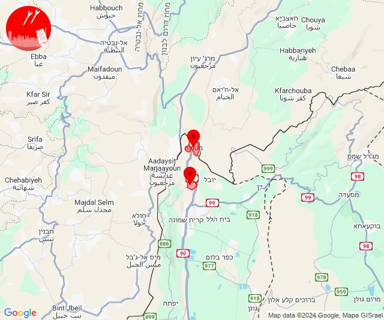

## 21:03

🔴 צבע אדום (17/10/2024):

00:02:
• קו העימות: קריית שמונה, משגב עם, כפר גלעדי, מטולה (מיידי)

00:03:
• קו העימות: תל חי, מרגליות, קריית שמונה (מיידי)

צופר - צבע אדום

## 21:03

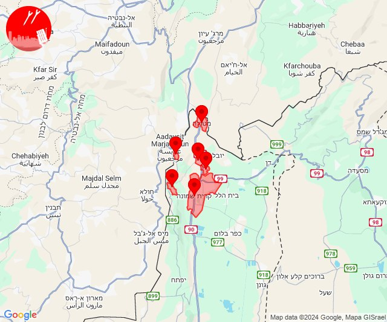

## 21:51

🔴 צבע אדום (17/10/2024):

00:50:
• קו העימות: מרגליות, קריית שמונה (מיידי)

00:51:
• קו העימות: מנרה (מיידי)

צופר - צבע אדום

## 21:51

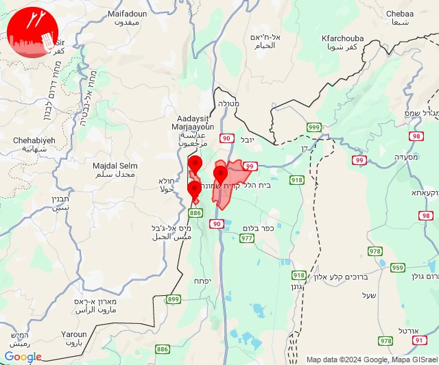

## 21:54

✈️ חדירת כלי טיס עוין (17/10/2024):

00:54:
• ערבה: ספיר 

צופר - צבע אדום

## 21:54

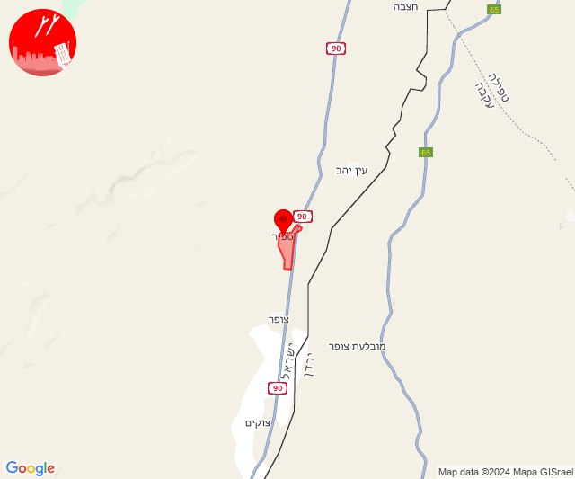

## 21:57

✈️ חדירת כלי טיס עוין (17/10/2024):

00:57:
• ערבה: עין יהב 

צופר - צבע אדום

## 21:57

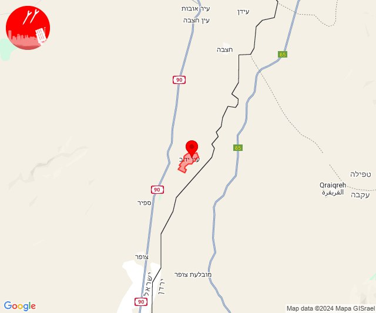

## 22:12

✈️ חדירת כלי טיס עוין (17/10/2024):

01:12:
• דרום הנגב: הר הנגב 

צופר - צבע אדום

## 22:12

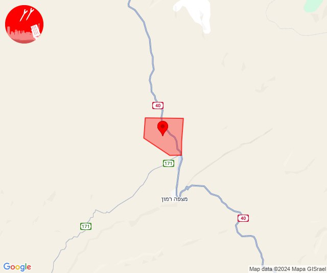

## 22:22

🔴 צבע אדום (17/10/2024):

01:22:
• גליל עליון: כפר שמאי (30 שניות)

צופר - צבע אדום

## 22:22

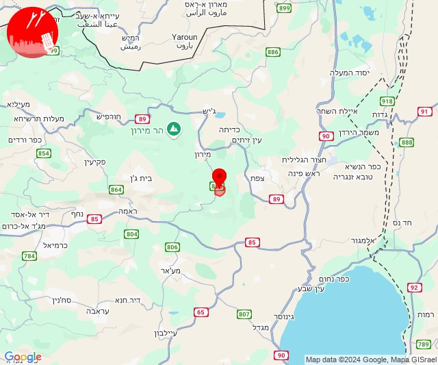

