# Alerts for 2024-10-17

## 00:28

🔴 צבע אדום (17/10/2024):

03:26:
• מרכז הגליל: אזור תעשייה טמרה, אעבלין, ביר אלמכסור, דמיידה, חנתון, טמרה, יודפת, כאוכב אבו אלהיג'א, כפר מנדא, מורשת, מצפה אבי''ב, קורנית, שכניה, שפרעם, בועיינה-נוג'ידאת, בית רימון, טורעאן, עוזייר, רומאנה, רומת אל הייב, מנוף, מצפה נטופה, אשבל, סכנין, עראבה (דקה)
• העמקים: אלון הגליל, הושעיה, הסוללים, הרדוף, כעביה, כפר כנא, משהד, נוף הגליל, נצרת, עדי, עילוט, עין מאהל, ציפורי, ריינה, שמשית, אילניה, בית קשת, אזור תעשייה ציפורית, סואעד חמירה (דקה)
• גליל תחתון: אתר ההנצחה גולני, שדה אילן (דקה)

03:27:
• מרכז הגליל: אזור תעשייה תרדיון (דקה)

03:28:
• קו העימות: אלקוש, מתת, סאסא, חוסן, כפר ורדים, מעונה, מעיליא, מעלות תרשיחא, בית ספר שדה מירון, חורפיש, יחיעם, עין יעקב, פקיעין החדשה, פקיעין, צבעון, צוריאל (מיידי, 15 שניות)
• גליל עליון: אזור תעשייה כרמיאל, בית ג'אן, בענה, דיר אל-אסד, הר חלוץ, חרשים, כרמיאל, לבון, מג'דל כרום, נחף, סאג'ור, עין אל אסד, צורית גילון, ראמה, שזור, אור הגנוז, אמירים, בר יוחאי, ג'וליס, גיתה, טל - אל, ינוח ג'ת, ירכא, כישור, כליל, כסרא סמיע, כפר שמאי, לפידות, מגדל תפן, מירון, מרכז אזורי מרום גליל, ספסופה - כפר חושן, עין כמונים, פלך, פרוד, שפר, תובל, אזור תעשייה בר-לב, אחיהוד, כמון, מכמנים, קדרים (30 שניות, דקה)
• מרכז הגליל: אעבלין, ביר אלמכסור, דמיידה, טמרה, יובלים, יודפת, יעד, כאבול, כאוכב אבו אלהיג'א, כפר מנדא, מורשת, מצפה אבי''ב, מרכז אזורי משגב, עצמון - שגב, ערב אל נעים, קורנית, רקפת, שורשים, שכניה, שעב, אבטליון, אשחר, בועיינה-נוג'ידאת, בית סוהר צלמון, בית רימון, דיר חנא, הררית יחד, חוסנייה, חזון, טורעאן, טפחות, כלנית, כפר חנניה, לוטם וחמדון, מורן, מסד, מע'אר, מעלה צביה, סלמה, עוזייר, עילבון, עינבר, ראס אל-עין, רומאנה, רומת אל הייב (דקה, 30 שניות)
• גליל תחתון: חוקוק, לבנים, רביד (דקה)

צופר - צבע אדום

## 00:28

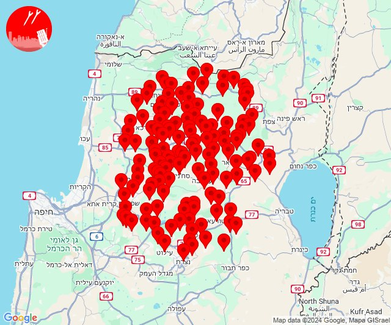

## 04:29

🔴 צבע אדום (17/10/2024):

07:28:
• המפרץ: אושה, חיפה - כרמל, הדר ועיר תחתית, חיפה - מערב, חיפה - מפרץ, חיפה - קריית חיים ושמואל, כפר ביאליק, כפר המכבי, קריית אתא, קריית ביאליק, קריית ים, קריית מוצקין, רמת יוחנן, אזור תעשייה קריית ביאליק (דקה)
• גליל עליון: אזור תעשייה שער נעמן, אפק, כפר מסריק, עכו - אזור תעשייה, עין המפרץ, עכו (דקה, 30 שניות)
• מרכז הגליל: שפרעם, אזור תעשייה טמרה (דקה)

07:29:
• מרכז הגליל: טמרה (דקה)
• גליל עליון: יסעור, אחיהוד, כפר מסריק, עין המפרץ, עכו - אזור תעשייה, עכו (דקה, 30 שניות)
• קו העימות: הילה, חוות אירוח גורן, חוסן, מעונה, מעיליא, מעלות תרשיחא, צוריאל, אבירים, אבן מנחם, אדמית, אילון, אלקוש, גורן, גורנות הגליל, זרעית, נטועה, ערב אל עראמשה, פסוטה, שומרה, שתולה (מיידי, 15 שניות)

צופר - צבע אדום

## 04:29

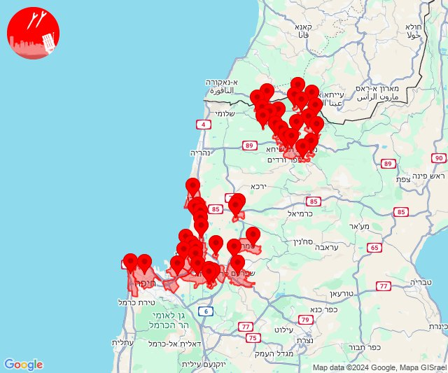

## 04:31

🔴 צבע אדום (17/10/2024):

07:31:
• המפרץ: אושה, כפר המכבי, קריית אתא, רמת יוחנן, נשר, איבטין, יגור, כפר חסידים, רכסים, בית עלמין תל רגב (דקה)
• העמקים: אורנים, אלון הגליל, אלוני אבא, אלונים, בית לחם הגלילית, בית שערים, בסמת טבעון, גבעת אלה, גבת, הסוללים, הרדוף, זרזיר, חג'אג'רה, יפעת, כעביה טבאש, כעביה, כפר טבאש, כפר יהושע, כפר תקווה, מגדל העמק, מנשית זבדה, נהלל, נופית, עדי, קריית טבעון - בית זייד, ראס עלי, רמת דוד, רמת ישי, שדה יעקב, שמשית, שער העמקים, שריד, תמרת, כפר ברוך, ח'וואלד, חוואלד, סואעד חמירה, תחנת רכבת כפר יהושוע (דקה)
• מרכז הגליל: ביר אלמכסור, שפרעם (דקה)
• הכרמל: דלית אל כרמל, עספיא, בית סוהר קישון (דקה)
• ואדי ערה: אזור תעשייה יקנעם עילית, יקנעם המושבה והזורע, יקנעם עילית (דקה וחצי)

צופר - צבע אדום

## 04:31

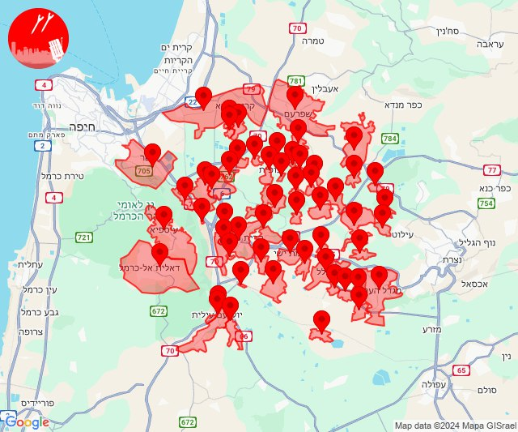

## 05:13

🔴 צבע אדום (17/10/2024):

08:11:
• גליל עליון: מגדל תפן, כסרא סמיע (30 שניות)
• קו העימות: כפר ורדים, חוסן, פקיעין החדשה, מעלות תרשיחא (15 שניות, מיידי)

08:12:
• קו העימות: מעונה, מעיליא, אבירים, פסוטה, אלקוש, צוריאל, פקיעין החדשה, חוסן, כפר ורדים, מעלות תרשיחא, פקיעין (מיידי, 15 שניות)
• גליל עליון: כסרא סמיע, ינוח ג'ת, מגדל תפן, חרשים (30 שניות)

08:13:
• קו העימות: אבירים, אלקוש, פסוטה (מיידי)
• גליל עליון: כסרא סמיע (30 שניות)

צופר - צבע אדום

## 05:13

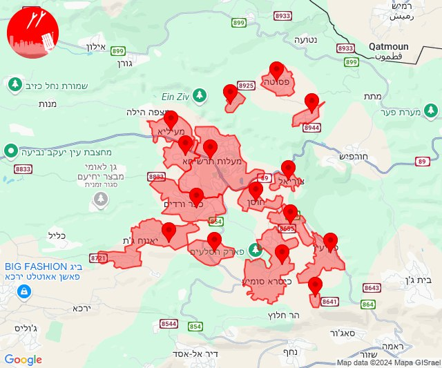

## 08:43

🔴 צבע אדום (17/10/2024):

11:42:
• קו העימות: מטולה (מיידי)

11:43:
• קו העימות: כפר גלעדי, משגב עם (מיידי)

צופר - צבע אדום

## 08:43

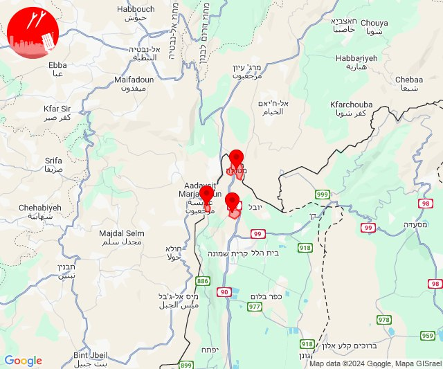

## 09:06

🔴 צבע אדום (17/10/2024):

12:06:
• קו העימות: משגב עם, מרגליות (מיידי)

צופר - צבע אדום

## 09:06

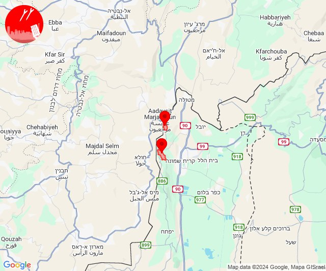

## 09:24

✈️ חדירת כלי טיס עוין (17/10/2024):

12:24:
• קו העימות: ע'ג'ר 

צופר - צבע אדום

## 09:24

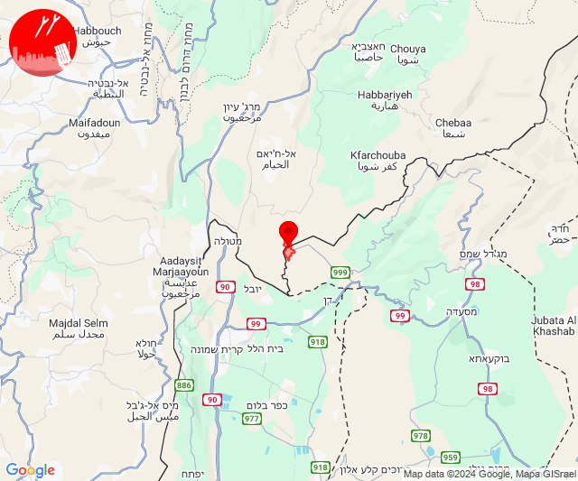

## 09:42

🔴 צבע אדום (17/10/2024):

12:42:
• קו העימות: משגב עם (מיידי)

צופר - צבע אדום

## 09:42

## 10:41

🔴 צבע אדום (17/10/2024):

13:41:
• קו העימות: מטולה (מיידי)

צופר - צבע אדום

## 10:41

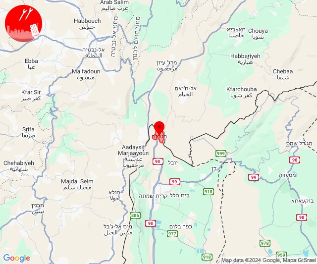

## 10:52

🔴 צבע אדום (17/10/2024):

13:51:
• קו העימות: משגב עם (מיידי)

13:52:
• קו העימות: כפר גלעדי (מיידי)

צופר - צבע אדום

## 10:52

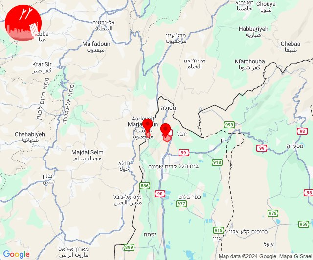

## 10:53

🔴 צבע אדום (17/10/2024):

13:53:
• קו העימות: משגב עם (מיידי)

צופר - צבע אדום

## 10:53

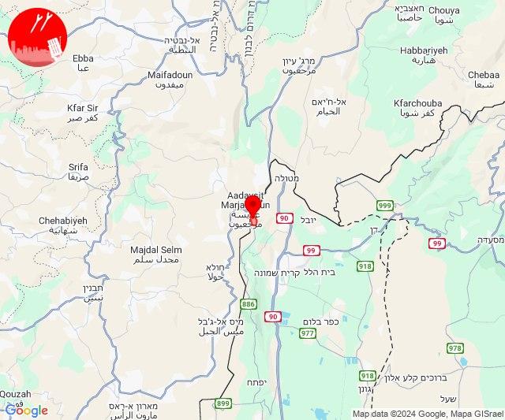

## 11:11

🔴 צבע אדום (17/10/2024):

14:11:
• קו העימות: משגב עם, כפר גלעדי, כפר יובל (מיידי)

צופר - צבע אדום

## 11:11

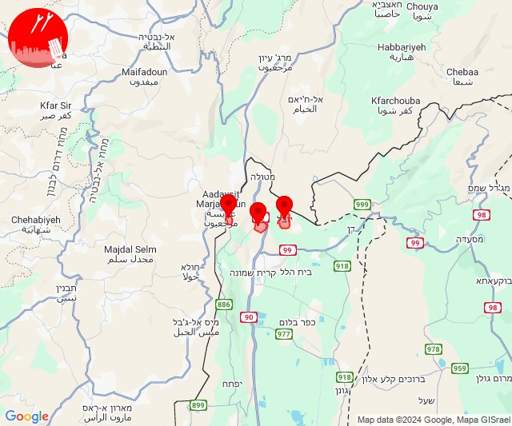

## 11:17

🔴 צבע אדום (17/10/2024):

14:17:
• קו העימות: רמות נפתלי (מיידי)

צופר - צבע אדום

## 11:17

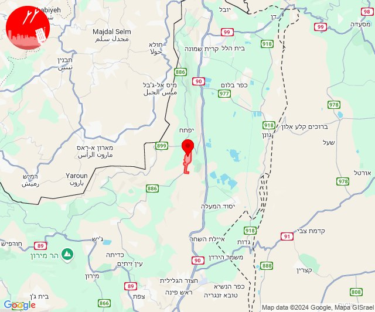

## 12:26

🔴 צבע אדום (17/10/2024):

15:26:
• קו העימות: מטולה (מיידי)

צופר - צבע אדום

## 12:26

## 13:51

🔴 צבע אדום (17/10/2024):

16:51:
• קו העימות: דישון (מיידי)

צופר - צבע אדום

## 13:51

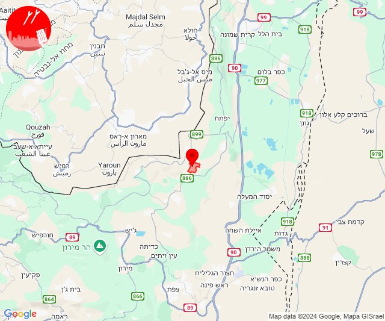

## 14:09

🔴 צבע אדום (17/10/2024):

17:09:
• קו העימות: קריית שמונה, מרגליות (מיידי)

צופר - צבע אדום

## 14:09

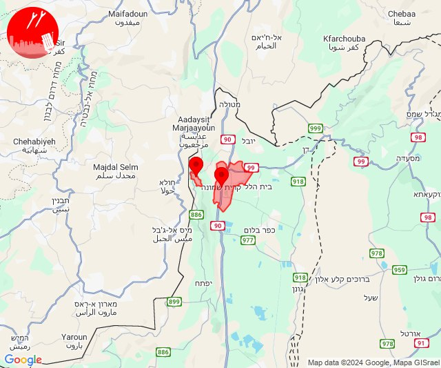

## 15:34

🔴 צבע אדום (17/10/2024):

18:34:
• קו העימות: מטולה, ע'ג'ר (מיידי)

צופר - צבע אדום

## 15:34

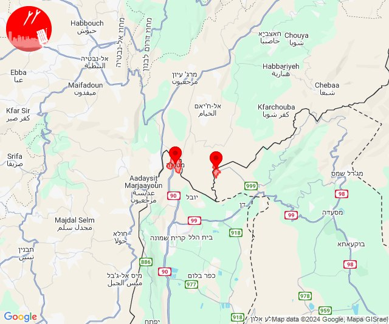

## 18:30

🔴 צבע אדום (17/10/2024):

21:30:
• צפון הגולן: נווה אטי''ב (מיידי)

צופר - צבע אדום

## 18:30

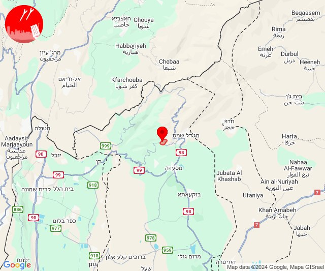

## 22:51

🔴 צבע אדום (18/10/2024):

01:51:
• קו העימות: זרעית (מיידי)

צופר - צבע אדום

## 22:51

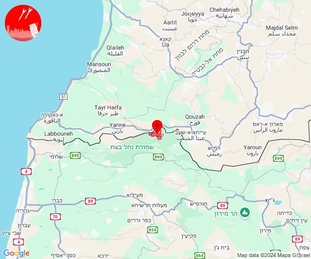

