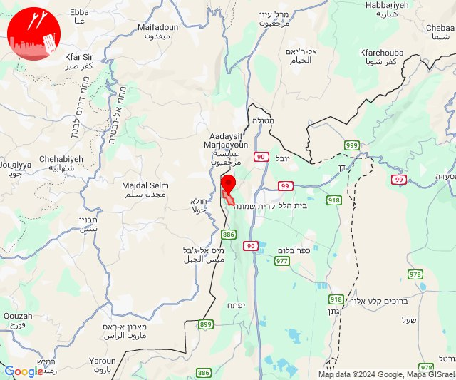

# Alerts for 2024-10-18

## 03:49

✈️ חדירת כלי טיס עוין (18/10/2024):

06:49:
• אילת: אילות, אילת 

צופר - צבע אדום

## 03:49

## 04:00

🔴 צבע אדום (18/10/2024):

06:58:
• המפרץ: קריית ביאליק, אזור תעשייה קריית ביאליק (דקה)
• גליל עליון: אזור תעשייה שער נעמן (דקה)
• קו העימות: כברי (מיידי)

06:59:
• גליל עליון: כפר מסריק, עכו - אזור תעשייה, עין המפרץ, עכו, יסעור, כפר מסריק, עכו - אזור תעשייה (30 שניות, דקה)
• מרכז הגליל: טמרה, כאבול (דקה)

07:00:
• גליל עליון: ג'דידה מכר, עין המפרץ, עכו, בית העלמין החדש עכו (30 שניות)

צופר - צבע אדום

## 04:00

## 06:07

🔴 צבע אדום (18/10/2024):

09:07:
• קו העימות: אדמית, אילון, יערה (מיידי)

צופר - צבע אדום

## 06:07

## 06:41

✈️ חדירת כלי טיס עוין (18/10/2024):

09:41:
• קו העימות: ראש הנקרה 

צופר - צבע אדום

## 06:41

## 07:13

🔴 צבע אדום (18/10/2024):

10:13:
• קו העימות: זרעית, שומרה (מיידי)

צופר - צבע אדום

## 07:13

## 07:39

🔴 צבע אדום (18/10/2024):

10:39:
• קו העימות: מרגליות (מיידי)

צופר - צבע אדום

## 07:39

## 07:55

🔴 צבע אדום (18/10/2024):

10:54:
• צפון הגולן: מצוק עורבים, רמת טראמפ (15 שניות)

10:55:
• צפון הגולן: שעל, שעל (15 שניות)

צופר - צבע אדום

## 07:55

## 10:45

🔴 צבע אדום (18/10/2024):

13:42:
• קו העימות: משגב עם (מיידי)

13:43:
• קו העימות: משגב עם (מיידי)

13:44:
• קו העימות: כפר גלעדי (מיידי)

13:45:
• קו העימות: מטולה, תל חי (מיידי)

צופר - צבע אדום

## 10:45

## 11:40

🔴 צבע אדום (18/10/2024):

14:40:
• קו העימות: זרעית, שומרה (מיידי)

צופר - צבע אדום

## 11:40

## 11:54

🔴 צבע אדום (18/10/2024):

14:54:
• קו העימות: ראש הנקרה (מיידי)

צופר - צבע אדום

## 11:54

## 12:02

🔴 צבע אדום (18/10/2024):

15:02:
• קו העימות: שומרה (מיידי)

צופר - צבע אדום

## 12:02

## 12:25

🔴 צבע אדום (18/10/2024):

15:25:
• קו העימות: נטועה, פסוטה (מיידי)

צופר - צבע אדום

## 12:25

## 12:34

🔴 צבע אדום (18/10/2024):

15:34:
• גליל עליון: מירון (30 שניות)

צופר - צבע אדום

## 12:34

## 13:03

🔴 צבע אדום (18/10/2024):

16:02:
• קו העימות: כפר גלעדי, קריית שמונה, כפר גלעדי (מיידי)

16:03:
• קו העימות: משגב עם, תל חי (מיידי)

צופר - צבע אדום

## 13:03

## 13:22

🔴 צבע אדום (18/10/2024):

16:22:
• קו העימות: שלומי, בצת (מיידי)

צופר - צבע אדום

