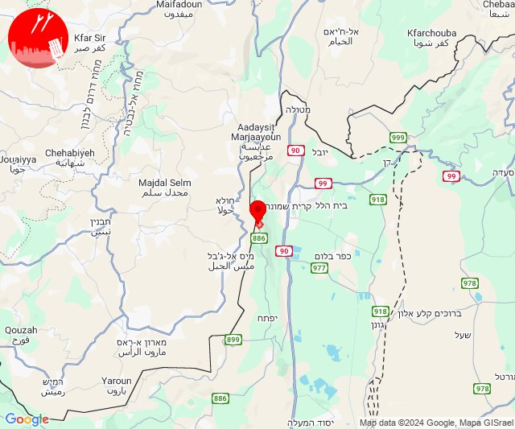

# Alerts for 2024-10-19

## 00:35

✈️ חדירת כלי טיס עוין (19/10/2024):

03:35:
• צפון הגולן: מרום גולן, אודם, אל רום 

צופר - צבע אדום

## 00:35

## 03:19

✈️ חדירת כלי טיס עוין (19/10/2024):

06:18:
• שרון: גן יאשיה 

06:19:
• שרון: עולש, אמץ, בת חפר, יד חנה, בארותיים 

צופר - צבע אדום

## 03:19

## 04:00

✈️ חדירת כלי טיס עוין (19/10/2024):

06:54:
• קו העימות: גשר הזיו, סער, נהריה 

06:55:
• קו העימות: סער, בן עמי, נהריה 

06:56:
• קו העימות: עברון, נהריה 
• גליל עליון: מזרעה 

06:57:
• גליל עליון: רגבה, נס עמים, לוחמי הגטאות, מזרעה 

06:58:
• גליל עליון: שומרת, לוחמי הגטאות, עכו 

06:59:
• גליל עליון: בוסתן הגליל, ג'דידה מכר, עכו 

07:00:
• גליל עליון: עין המפרץ 

צופר - צבע אדום

## 04:00

## 04:08

✈️ חדירת כלי טיס עוין (19/10/2024):

07:04:
• גליל עליון: אזור תעשייה שער נעמן 
• המפרץ: כפר ביאליק, קריית ביאליק, קריית ים, קריית מוצקין, אזור תעשייה קריית ביאליק 

07:05:
• המפרץ: קריית אתא 

07:07:
• המפרץ: כפר המכבי, איבטין 

07:08:
• המפרץ: רכסים, כפר חסידים 

צופר - צבע אדום

## 04:08

## 04:18

🔴 צבע אדום (19/10/2024):

07:18:
• גליל תחתון: טבריה, פוריה נווה עובד, מצפה, מגדל (דקה)
• דרום הגולן: חוף גופרה, חוף סוסיתא, עין גב, חוף כורסי, לבנון, חלוקים (15 שניות)

צופר - צבע אדום

## 04:18

## 04:40

🔴 צבע אדום (19/10/2024):

07:40:
• קו העימות: יערה (מיידי)

צופר - צבע אדום

## 04:40

## 05:03

🔴 צבע אדום (19/10/2024):

08:02:
• ואדי ערה: אזור תעשייה מבוא כרמל, אליקים, יקנעם עילית, עין העמק, רמות מנשה, רמת השופט (דקה וחצי)
• המפרץ: החותרים, כפר גלים, חיפה - מערב, טירת כרמל (דקה)
• הכרמל: מגדים (דקה)

08:03:
• המפרץ: חיפה - כרמל, הדר ועיר תחתית, חיפה - נווה שאנן ורמות כרמל (דקה)

צופר - צבע אדום

## 05:03

## 05:53

🔴 צבע אדום (19/10/2024):

08:52:
• קו העימות: משגב עם (מיידי)

08:53:
• קו העימות: משגב עם (מיידי)

צופר - צבע אדום

## 05:53

## 07:02

🔴 צבע אדום (19/10/2024):

10:02:
• קו העימות: משגב עם (מיידי)

צופר - צבע אדום

## 07:02

## 07:09

🔴 צבע אדום (19/10/2024):

10:09:
• צפון הגולן: מצוק עורבים (15 שניות)

צופר - צבע אדום

## 07:09

## 07:23

🔴 צבע אדום (19/10/2024):

10:22:
• המפרץ: קריית ביאליק, אושה, כפר המכבי, קריית אתא, רמת יוחנן, כפר ביאליק, קריית מוצקין, אזור תעשייה קריית ביאליק, קריית ים (דקה)
• גליל עליון: אפק, אזור תעשייה שער נעמן (דקה)

10:23:
• המפרץ: חיפה - מפרץ, חיפה - קריית חיים ושמואל, נשר, בית עלמין תל רגב (דקה)
• מרכז הגליל: שפרעם, טמרה, אזור תעשייה טמרה (דקה)
• גליל עליון: כפר מסריק, עין המפרץ (30 שניות)

צופר - צבע אדום

## 07:23

## 07:37

🔴 צבע אדום (19/10/2024):

10:35:
• קו העימות: בצת, שלומי, מצובה, חוף בצת, ראש הנקרה, חניתה, איזור תעשייה מילואות צפון, עבדון, יערה, לימן, בית העלמין החדש נהריה, בן עמי, נהריה, סער, כברי, גשר הזיו, שלומי, בצת, מצובה, חוף בצת, ראש הנקרה, חניתה, איזור תעשייה מילואות צפון, לימן (מיידי, 30 שניות, 15 שניות)
• גליל עליון: נתיב השיירה (30 שניות)

10:36:
• קו העימות: יערה, עבדון, שלומי, בצת, מצובה, חוף בצת, גשר הזיו, חניתה, לימן, שלומי (מיידי)

10:37:
• קו העימות: מצובה (מיידי)

צופר - צבע אדום

## 07:37

## 09:09

🔴 צבע אדום (19/10/2024):

12:09:
• קו העימות: זרעית (מיידי)

צופר - צבע אדום

## 09:09

## 09:20

🔴 צבע אדום (19/10/2024):

12:20:
• קו העימות: אבן מנחם, זרעית, שומרה, שתולה (מיידי)

צופר - צבע אדום

## 09:20

## 09:23

🔴 צבע אדום (19/10/2024):

12:22:
• גליל עליון: צפת - נוף כנרת, צפת - עכברה, אליפלט, כורזים ורד הגליל, עמיעד, צפת - עיר, כפר שמאי, מירון (30 שניות)
• קו העימות: אביבים (מיידי)

12:23:
• גליל עליון: צפת - נוף כנרת, צפת - עכברה, צפת - עיר, עמיעד, ביריה (30 שניות)

צופר - צבע אדום

## 09:23

## 09:27

🔴 צבע אדום (19/10/2024):

12:25:
• גליל עליון: אזור תעשייה שער נעמן, יסעור, עכו - אזור תעשייה, כפר מסריק, עין המפרץ, ג'דידה מכר, עכו (דקה, 30 שניות)
• המפרץ: אזור תעשייה קריית ביאליק, קריית ביאליק, קריית ים, קריית מוצקין (דקה)

12:26:
• גליל עליון: בית העלמין החדש עכו, עכו - אזור תעשייה, כפר מסריק, עין המפרץ (30 שניות)
• מרכז הגליל: טמרה, כאבול (דקה)

12:27:
• גליל עליון: ג'דידה מכר, כפר מסריק, עין המפרץ, עכו - אזור תעשייה, עכו, בית העלמין החדש עכו (30 שניות)
• קו העימות: אבן מנחם, שומרה, שתולה, זרעית, נטועה, פסוטה (מיידי)

צופר - צבע אדום

## 09:27

## 09:28

✈️ חדירת כלי טיס עוין (19/10/2024):

12:28:
• קו העימות: ברעם, דוב''ב, יראון 

צופר - צבע אדום

## 09:28

## 10:37

🔴 צבע אדום (19/10/2024):

13:37:
• קו העימות: משגב עם (מיידי)

צופר - צבע אדום

## 10:37

## 12:39

✈️ חדירת כלי טיס עוין (19/10/2024):

15:39:
• קו העימות: בצת, מצובה, שלומי, לימן, איזור תעשייה מילואות צפון, חוף בצת 

צופר - צבע אדום

## 12:39

## 13:25

🔴 צבע אדום (19/10/2024):

16:23:
• קו העימות: מטולה (מיידי)

צופר - צבע אדום

## 13:25

## 13:37

🔴 צבע אדום (19/10/2024):

16:36:
• קו העימות: משגב עם, כפר גלעדי, כפר יובל, משגב עם (מיידי)

16:37:
• קו העימות: כפר גלעדי (מיידי)

צופר - צבע אדום

## 13:37

## 13:53

🔴 צבע אדום (19/10/2024):

16:53:
• קו העימות: זרעית (מיידי)

צופר - צבע אדום

## 13:53

## 14:40

🔴 צבע אדום (19/10/2024):

17:40:
• קו העימות: קריית שמונה, בית הלל, הגושרים, משגב עם, כפר גלעדי, תל חי, מרגליות (מיידי)

צופר - צבע אדום

## 14:40

## 15:16

🔴 צבע אדום (19/10/2024):

18:16:
• קו העימות: רמות נפתלי, מלכיה (מיידי)

צופר - צבע אדום

## 15:16

## 15:28

🔴 צבע אדום (19/10/2024):

18:28:
• קו העימות: זרעית, שומרה, שתולה (מיידי)

צופר - צבע אדום

## 15:28

## 18:26

🔴 צבע אדום (19/10/2024):

21:25:
• קו העימות: אבירים (מיידי)

21:26:
• קו העימות: אבן מנחם (מיידי)

צופר - צבע אדום

## 18:26

## 18:43

✈️ חדירת כלי טיס עוין (19/10/2024):

21:40:
• דרום הגולן: רמת מגשימים 

21:41:
• דרום הגולן: נוב 

21:42:
• דרום הגולן: אבני איתן 

21:43:
• דרום הגולן: אלי עד 

צופר - צבע אדום

## 18:43

## 18:45

✈️ חדירת כלי טיס עוין (19/10/2024):

21:45:
• דרום הגולן: מיצר 

צופר - צבע אדום

## 18:45

## 18:57

🔴 צבע אדום (19/10/2024):

21:57:
• קו העימות: מנרה (מיידי)

צופר - צבע אדום

## 18:57

## 20:59

🔴 צבע אדום (19/10/2024):

23:58:
• גליל עליון: צפת - עיר, צפת - נוף כנרת, אליפלט, ראש פינה, חצור הגלילית, בר יוחאי, קדיתא, ביריה, עמוקה, מירון, מרכז אזורי מרום גליל (30 שניות)
• קו העימות: דלתון (מיידי)

23:59:
• גליל עליון: אזור תעשייה צ.ח.ר (30 שניות)

צופר - צבע אדום

## 20:59

## 22:19

🔴 צבע אדום (20/10/2024):

01:19:
• דרום הגולן: קצרין - אזור תעשייה, קצרין (30 שניות)

צופר - צבע אדום

## 22:19

