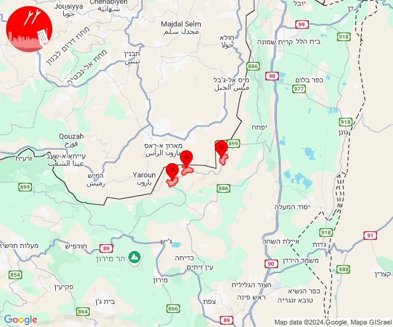

# Alerts for 2024-10-20

## 00:33

🔴 צבע אדום (20/10/2024):

03:33:
• קו העימות: קריית שמונה, כפר גלעדי, כפר יובל, מטולה, מעיין ברוך, תל חי, בית הלל, הגושרים, מרגליות (מיידי)

צופר - צבע אדום

## 00:33

## 01:22

✈️ חדירת כלי טיס עוין (20/10/2024):

04:21:
• צפון הגולן: מרום גולן 

04:22:
• צפון הגולן: מרום גולן 

צופר - צבע אדום

## 01:22

## 05:12

🔴 צבע אדום (20/10/2024):

08:12:
• קו העימות: משגב עם (מיידי)

צופר - צבע אדום

## 05:12

## 06:32

🔴 צבע אדום (20/10/2024):

09:32:
• קו העימות: אבן מנחם, אבירים, פסוטה (מיידי)

צופר - צבע אדום

## 06:32

## 06:38

🔴 צבע אדום (20/10/2024):

09:37:
• המפרץ: חיפה - כרמל, הדר ועיר תחתית, חיפה - מערב, חיפה - נווה שאנן ורמות כרמל, החותרים, טירת כרמל, כפר גלים, נשר (דקה)
• הכרמל: בית אורן, גבעת וולפסון, דלית אל כרמל, אזור תעשייה ניר עציון, בית צבי, כפר הנוער ימין אורד, מגדים, ניר עציון, עין הוד, עין חוד, עתלית, יערות הכרמל, כלא דמון (דקה)
• גליל עליון: עכו - אזור תעשייה (30 שניות)

09:38:
• הכרמל: עספיא (דקה)
• המפרץ: חיפה - מפרץ, חיפה - קריית חיים ושמואל, כפר ביאליק, קריית אתא, קריית ביאליק, קריית ים, קריית מוצקין, אזור תעשייה קריית ביאליק (דקה)

צופר - צבע אדום

## 06:38

## 06:50

🔴 צבע אדום (20/10/2024):

09:49:
• המפרץ: כפר גלים (דקה)

09:50:
• המפרץ: חיפה - מערב (דקה)

צופר - צבע אדום

## 06:50

## 08:12

🔴 צבע אדום (20/10/2024):

11:09:
• קו העימות: עבדון, יערה, מצובה, חניתה, שלומי (מיידי)

11:10:
• קו העימות: אילון, גורן, גורנות הגליל, בצת, לימן, ראש הנקרה, איזור תעשייה מילואות צפון, חוף בצת, הילה, חוות אירוח גורן, מעיליא, יערה, אדמית, בית העלמין החדש נהריה, כברי, מצובה, עבדון, חניתה, שלומי, מנות, ערב אל עראמשה, אילון, יערה, מצובה, בצת, בן עמי, נהריה (מיידי, 30 שניות, 15 שניות)
• גליל עליון: נתיב השיירה, שייח' דנון (30 שניות)

11:11:
• גליל עליון: נס עמים, עין המפרץ, עכו - אזור תעשייה, עכו (30 שניות)
• קו העימות: כברי, עבדון, חניתה, שלומי, אדמית, איזור תעשייה מילואות צפון, חוף בצת, לימן, ראש הנקרה, יערה, מצובה, שלומי, בצת, חניתה (מיידי)

11:12:
• קו העימות: איזור תעשייה מילואות צפון, לימן, בצת, שלומי, מצובה (מיידי)

צופר - צבע אדום

## 08:12

## 09:08

🔴 צבע אדום (20/10/2024):

12:08:
• קו העימות: משגב עם (מיידי)

צופר - צבע אדום

## 09:08

## 09:26

🔴 צבע אדום (20/10/2024):

12:26:
• דרום הגולן: קצרין (30 שניות)

צופר - צבע אדום

## 09:26

## 09:31

🔴 צבע אדום (20/10/2024):

12:28:
• גליל עליון: ביריה, צפת - עיר (30 שניות)
• קו העימות: אזור תעשייה רמת דלתון, דלתון (מיידי)

12:29:
• גליל עליון: צפת - נוף כנרת, ראש פינה, אליפלט, עמיעד, חצור הגלילית, עמוקה, קדיתא, ביריה, צפת - עיר, צפת - נוף כנרת, אליפלט, ראש פינה, חצור הגלילית (30 שניות)
• קו העימות: עלמה, ריחאנייה, אזור תעשייה רמת דלתון, דלתון (מיידי)

12:30:
• גליל עליון: עמוקה, עמיעד, אזור תעשייה חצור הגלילית, אזור תעשייה צ.ח.ר, מנחת מחניים, טובא זנגריה, ביריה, צפת - עיר, ראש פינה, צפת - נוף כנרת, אליפלט, חצור הגלילית, מחניים, עמוקה, אזור תעשייה חצור הגלילית, אזור תעשייה צ.ח.ר, קדיתא, עמיעד (30 שניות)
• קו העימות: ריחאנייה, דלתון, אזור תעשייה רמת דלתון, כרם בן זמרה (מיידי)

12:31:
• גליל עליון: אור הגנוז, טובא זנגריה (30 שניות)
• קו העימות: ג'ש - גוש חלב, ריחאנייה, עלמה (מיידי)

צופר - צבע אדום

## 09:31

## 09:57

🔴 צבע אדום (20/10/2024):

12:57:
• קו העימות: כפר גלעדי (מיידי)

צופר - צבע אדום

## 09:57

## 10:35

🔴 צבע אדום (20/10/2024):

13:35:
• קו העימות: משגב עם (מיידי)

צופר - צבע אדום

## 10:35

## 12:24

🔴 צבע אדום (20/10/2024):

15:24:
• קו העימות: מרגליות (מיידי)

צופר - צבע אדום

## 12:24

## 12:29

🔴 צבע אדום (20/10/2024):

15:29:
• קו העימות: מטולה (מיידי)

צופר - צבע אדום

## 12:29

## 12:42

🔴 צבע אדום (20/10/2024):

15:40:
• המפרץ: חיפה - כרמל, הדר ועיר תחתית, חיפה - מערב, חיפה - נווה שאנן ורמות כרמל, טירת כרמל, כפר גלים, החותרים (דקה)

15:41:
• המפרץ: חיפה - מפרץ, נשר, יגור, כפר חסידים, חיפה - קריית חיים ושמואל, כפר ביאליק, קריית אתא, קריית ביאליק, קריית ים, קריית מוצקין, אזור תעשייה קריית ביאליק (דקה)
• הכרמל: בית אורן, גבעת וולפסון, דלית אל כרמל, עספיא, בית סוהר קישון, בית צבי, מגדים, יערות הכרמל, כלא דמון (דקה)
• גליל עליון: אזור תעשייה שער נעמן, עכו - אזור תעשייה, כפר מסריק, עכו, עין המפרץ, בוסתן הגליל, שומרת, שבי ציון, לוחמי הגטאות, רגבה, ג'דידה מכר, נס עמים, בית העלמין החדש עכו, מזרעה, ג'וליס, טל - אל, ירכא, כפר יאסיף, בית העמק, אשרת, אבו סנאן (דקה, 30 שניות)
• קו העימות: נהריה, עברון (15 שניות)

15:42:
• גליל עליון: עכו - אזור תעשייה, עכו, עין המפרץ, כפר מסריק, בוסתן הגליל, בית העמק, ג'דידה מכר, נס עמים, נתיב השיירה, שבי ציון, שומרת, בית העלמין החדש עכו, לוחמי הגטאות, מזרעה, רגבה, שייח' דנון, אבו סנאן, אשרת, כפר יאסיף (30 שניות)
• קו העימות: נהריה, עברון (15 שניות)

צופר - צבע אדום

## 12:42

## 12:56

✈️ חדירת כלי טיס עוין (20/10/2024):

15:56:
• המפרץ: חיפה - כרמל, הדר ועיר תחתית, חיפה - מערב 

צופר - צבע אדום

## 12:56

## 13:02

✈️ חדירת כלי טיס עוין (20/10/2024):

16:01:
• המפרץ: קריית ים 

16:02:
• המפרץ: חיפה - כרמל, הדר ועיר תחתית, חיפה - מערב, חיפה - מפרץ, חיפה - קריית חיים ושמואל 

צופר - צבע אדום

## 13:02

## 13:22

✈️ חדירת כלי טיס עוין (20/10/2024):

16:22:
• העמקים: אזור תעשייה אלון התבור, טמרה בגלבוע, נאעורה, נין 

צופר - צבע אדום

## 13:22

## 13:25

🔴 צבע אדום (20/10/2024):

16:25:
• גליל עליון: צפת - עיר, כפר שמאי (30 שניות)

צופר - צבע אדום

## 13:26

🔴 צבע אדום (20/10/2024):

16:25:
• גליל עליון: צפת - עיר, כפר שמאי, אור הגנוז, בר יוחאי, ספסופה - כפר חושן, קדיתא (30 שניות)
• קו העימות: אזור תעשייה רמת דלתון, ג'ש - גוש חלב, דלתון, כרם בן זמרה (מיידי)

16:26:
• גליל עליון: ביריה (30 שניות)

צופר - צבע אדום

## 13:26

## 13:33

🔴 צבע אדום (20/10/2024):

16:32:
• מרכז הגליל: מצפה נטופה, עילבון, בועיינה-נוג'ידאת, טורעאן, טפחות, מסד (דקה)
• גליל תחתון: כפר נהר הירדן, שדה אילן, אתר ההנצחה גולני, גבעת אבני, הודיות, לביא, אזור תעשייה קדמת גליל, ארבל, ואדי אל חמאם, כפר זיתים, נבי שועייב, רביד (דקה)
• העמקים: אילניה (דקה)

16:33:
• מרכז הגליל: בית סוהר צלמון, כלנית (דקה)

צופר - צבע אדום

## 13:33

## 15:40

🔴 צבע אדום (20/10/2024):

18:40:
• קו העימות: שאר ישוב (מיידי)

צופר - צבע אדום

## 15:40

## 16:03

🔴 צבע אדום (20/10/2024):

19:01:
• קו העימות: כפר גלעדי, כפר יובל, מעיין ברוך, קריית שמונה, תל חי, הגושרים, בית הלל, מטולה, כפר גלעדי, כפר יובל, מעיין ברוך, קריית שמונה, תל חי (מיידי)

19:02:
• קו העימות: קריית שמונה, תל חי (מיידי)

19:03:
• קו העימות: כפר גלעדי, מטולה (מיידי)

צופר - צבע אדום

## 16:03

## 16:28

🔴 צבע אדום (20/10/2024):

19:28:
• צפון הגולן: אודם, עין קנייא (מיידי)

צופר - צבע אדום

## 16:28

## 16:45

🔴 צבע אדום (20/10/2024):

19:45:
• קו העימות: קריית שמונה, כפר יובל, מטולה, כפר גלעדי, מעיין ברוך, תל חי (מיידי)

צופר - צבע אדום

## 16:45

## 18:09

✈️ חדירת כלי טיס עוין (20/10/2024):

21:09:
• המפרץ: חיפה - כרמל, הדר ועיר תחתית, חיפה - מערב 

צופר - צבע אדום

## 18:09

## 18:50

✈️ חדירת כלי טיס עוין (20/10/2024):

21:49:
• קו העימות: ראש הנקרה, חוף בצת 

21:50:
• קו העימות: ראש הנקרה 

צופר - צבע אדום

## 18:50

## 18:58

🔴 צבע אדום (20/10/2024):

21:58:
• קו העימות: נטועה, שתולה (מיידי)

צופר - צבע אדום

## 18:58

## 20:03

🔴 צבע אדום (20/10/2024):

23:03:
• קו העימות: יראון (מיידי)

צופר - צבע אדום

## 20:03

## 20:05

🔴 צבע אדום (20/10/2024):

23:05:
• קו העימות: יראון (מיידי)

צופר - צבע אדום

## 20:05

## 20:30

🔴 צבע אדום (20/10/2024):

23:30:
• קו העימות: זרעית (מיידי)

צופר - צבע אדום

## 20:30

## 21:05

✈️ חדירת כלי טיס עוין (21/10/2024):

00:05:
• קו העימות: משגב עם 

צופר - צבע אדום

## 21:05

## 21:06

✈️ חדירת כלי טיס עוין (21/10/2024):

00:06:
• קו העימות: מרגליות, מנרה, קריית שמונה 

צופר - צבע אדום

## 21:06

## 22:55

✈️ חדירת כלי טיס עוין (21/10/2024):

01:55:
• בקעה: מחולה, שדמות מחולה 

צופר - צבע אדום

## 22:55

## 23:49

🔴 צבע אדום (21/10/2024):

02:49:
• קו העימות: מלכיה, אביבים, יראון (מיידי)

צופר - צבע אדום

## 23:49

