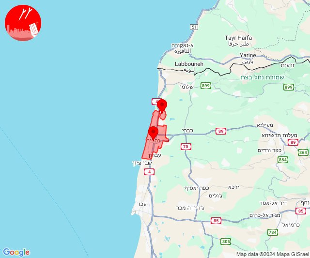

# Alerts for 2024-10-21

## 04:57

🔴 צבע אדום (21/10/2024):

07:57:
• קו העימות: מנרה, מרגליות (מיידי)

צופר - צבע אדום

## 04:57

## 05:15

🔴 צבע אדום (21/10/2024):

08:15:
• קו העימות: מרגליות (מיידי)

צופר - צבע אדום

## 05:15

## 05:23

🔴 צבע אדום (21/10/2024):

08:22:
• קו העימות: מעלות תרשיחא, חוסן (מיידי, 15 שניות)

08:23:
• קו העימות: אבירים, פסוטה, צוריאל, כפר ורדים, פקיעין החדשה, מעלות תרשיחא, מעונה, מעיליא, חוסן (מיידי, 15 שניות)
• מרכז הגליל: ערב אל נעים, אשבל, אשחר, סכנין (30 שניות, דקה)
• גליל עליון: כרמיאל, כסרא סמיע, מגדל תפן (30 שניות)

צופר - צבע אדום

## 05:23

## 05:35

✈️ חדירת כלי טיס עוין (21/10/2024):

08:35:
• קו העימות: נאות מרדכי 

צופר - צבע אדום

## 05:35

## 06:19

🔴 צבע אדום (21/10/2024):

09:19:
• קו העימות: מרגליות (מיידי)

צופר - צבע אדום

## 06:19

## 07:11

🔴 צבע אדום (21/10/2024):

10:11:
• קו העימות: מרגליות (מיידי)

צופר - צבע אדום

## 07:11

## 07:52

🔴 צבע אדום (21/10/2024):

10:51:
• קו העימות: משגב עם, מנרה, מרגליות (מיידי)

10:52:
• קו העימות: כפר גלעדי, קריית שמונה, תל חי, מרגליות (מיידי)

צופר - צבע אדום

## 07:52

## 08:41

🔴 צבע אדום (21/10/2024):

11:41:
• קו העימות: מטולה, משגב עם (מיידי)

צופר - צבע אדום

## 08:41

## 08:46

🔴 צבע אדום (21/10/2024):

11:46:
• קו העימות: רמות נפתלי (מיידי)

צופר - צבע אדום

## 08:46

## 09:06

🔴 צבע אדום (21/10/2024):

12:06:
• קו העימות: מעונה, מעיליא, עין יעקב, הילה (מיידי, 15 שניות)

צופר - צבע אדום

## 09:06

## 09:09

🔴 צבע אדום (21/10/2024):

12:09:
• קו העימות: מטולה (מיידי)

צופר - צבע אדום

## 09:09

## 09:28

🔴 צבע אדום (21/10/2024):

12:27:
• ואדי ערה: אזור תעשייה יקנעם עילית (דקה וחצי)
• המפרץ: אושה, כפר המכבי, קריית אתא, רמת יוחנן, נשר, איבטין, יגור, כפר חסידים, רכסים, בית עלמין תל רגב (דקה)
• העמקים: אורנים, אלוני אבא, אלונים, בסמת טבעון, כפר טבאש, כפר תקווה, נופית, קריית טבעון - בית זייד, ראס עלי, רמת ישי, שדה יעקב, שער העמקים, סואעד חמירה, ח'וואלד, חוואלד, תחנת רכבת כפר יהושוע (דקה)
• הכרמל: דלית אל כרמל, עספיא, בית סוהר קישון (דקה)

12:28:
• גליל עליון: אזור תעשייה כרמיאל, בוסתן הגליל, בית העמק, בענה, ג'דידה מכר, דיר אל-אסד, הר חלוץ, חרשים, כפר מסריק, כרמיאל, לבון, מג'דל כרום, נחף, נס עמים, נתיב השיירה, סאג'ור, עין המפרץ, עכו - אזור תעשייה, עכו, צורית גילון, שומרת, שזור, שייח' דנון, אבו סנאן, אשרת, בית העלמין החדש עכו, ג'וליס, גיתה, טל - אל, ינוח ג'ת, ירכא, כישור, כליל, כסרא סמיע, כפר יאסיף, לוחמי הגטאות, לפידות, מגדל תפן, עמקה, פלך, רגבה, תובל, אזור תעשייה שער נעמן, אפק, אזור תעשייה בר-לב, אחיהוד, יסעור, כמון, מכמנים (30 שניות, דקה)
• קו העימות: כפר ורדים, געתון, יחיעם, פקיעין (15 שניות)
• המפרץ: חיפה - מפרץ, חיפה - קריית חיים ושמואל, כפר ביאליק, קריית ביאליק, קריית ים, קריית מוצקין, אזור תעשייה קריית ביאליק (דקה)
• מרכז הגליל: אזור תעשייה טמרה, אעבלין, ביר אלמכסור, דמיידה, חנתון, טמרה, יובלים, יודפת, יעד, כאבול, כאוכב אבו אלהיג'א, כפר מנדא, מורשת, מנוף, מצפה אבי''ב, מרכז אזורי משגב, עצמון - שגב, ערב אל נעים, קורנית, רקפת, שורשים, שכניה, שעב, שפרעם, אבטליון, אזור תעשייה תרדיון, אשבל, אשחר, בית רימון, דיר חנא, הררית יחד, חוסנייה, לוטם וחמדון, מעלה צביה, סכנין, סלמה, עוזייר, עראבה, רומאנה, רומת אל הייב (דקה, 30 שניות)
• העמקים: אלון הגליל, בית לחם הגלילית, הושעיה, הסוללים, הרדוף, חג'אג'רה, כעביה טבאש, כעביה, עדי, ציפורי (דקה)

צופר - צבע אדום

## 09:28

## 10:13

🔴 צבע אדום (21/10/2024):

13:13:
• גליל עליון: איילת השחר, מלון אחוזת ירדן, שדה אליעזר (30 שניות)

צופר - צבע אדום

## 10:13

## 11:10

🔴 צבע אדום (21/10/2024):

14:09:
• מרכז הגליל: חוסנייה, חזון, מורן (דקה)
• גליל עליון: מכמנים, בענה, דיר אל-אסד, מג'דל כרום, כרמיאל, לבון, כישור, לפידות, אזור תעשייה כרמיאל, נחף (30 שניות)

14:10:
• גליל עליון: תובל, בענה, דיר אל-אסד, כרמיאל, מג'דל כרום (30 שניות)

צופר - צבע אדום

## 11:10

## 11:37

🔴 צבע אדום (21/10/2024):

14:36:
• קו העימות: מרגליות, משגב עם, מנרה, קריית שמונה (מיידי)

14:37:
• קו העימות: מרגליות, משגב עם, מנרה, קריית שמונה, כפר גלעדי (מיידי)

צופר - צבע אדום

## 11:37

## 12:38

🔴 צבע אדום (21/10/2024):

15:37:
• גליל עליון: יסוד המעלה (30 שניות)

15:38:
• דרום הגולן: קצרין - אזור תעשייה, קצרין (30 שניות)
• גליל עליון: חולתה (30 שניות)

צופר - צבע אדום

## 12:38

## 12:45

🔴 צבע אדום (21/10/2024):

15:43:
• מנשה: תלמי אלעזר (דקה וחצי)
• בקעת בית שאן: בית אלפא וחפציבה, בית השיטה, מסילות, מעלה גלבוע, ניר דוד, שדה נחום (דקה)
• העמקים: עין חרוד, תל יוסף, בית סוהר שיטה וגלבוע (דקה)
• קו העימות: גורנות הגליל, גורן (מיידי)

15:44:
• דרום הגולן: האון, מסדה, מעגן, צמח, שער הגולן, תל קציר, אשדות יעקב (30 שניות, דקה)
• העמקים: אזור תעשייה אלון התבור, אחוזת ברק, דברת, טמרה בגלבוע, נאעורה, נין, רמת צבי, אכסאל, כפר כנא, משהד, נוף הגליל, עין מאהל, ריינה, אילניה, בית קשת, גזית, דבוריה, כדורי, כפר מצר, כפר קיש, כפר תבור, עין דור, שבלי, שדמות דבורה, אום אלג'נם, כפר יחזקאל, קבוצת גבע (דקה)
• בקעת בית שאן: גשר, טייבה בגלבוע, מולדת, נווה אור, מנחמיה, אזור תעשייה צבאים, בית שאן, רשפים, שלפים (דקה)
• גליל תחתון: טבריה, כפר נהר הירדן, מצפה, אזור תעשייה קדמת גליל, אלומות, אפיקים, ארבל, אתר ההנצחה גולני, בית זרע, בית ירח, גבעת אבני, דגניה א, דגניה ב, הודיות, הזורעים, ואדי אל חמאם, יבנאל, כינרת מושבה, כינרת קבוצה, כפר זיתים, כפר חיטים, כפר כמא, לביא, מגדל, נבי שועייב, פוריה כפר עבודה, פוריה נווה עובד, פוריה עילית, שדה אילן, שרונה (דקה)
• מרכז הגליל: בועיינה-נוג'ידאת, טורעאן, מצפה נטופה (דקה)
• קו העימות: זרעית, שומרה (מיידי)

15:45:
• מרכז הגליל: טפחות, מסד, עילבון (דקה)

צופר - צבע אדום

## 12:45

## 13:10

🔴 צבע אדום (21/10/2024):

16:10:
• קו העימות: זרעית, שומרה, אבן מנחם, שתולה (מיידי)

צופר - צבע אדום

## 13:10

## 13:26

🔴 צבע אדום (21/10/2024):

16:26:
• קו העימות: כברי, יערה, מצובה, שלומי, בן עמי (מיידי)

צופר - צבע אדום

## 13:26

## 13:52

🔴 צבע אדום (21/10/2024):

16:52:
• קו העימות: כפר גלעדי, קריית שמונה, תל חי, בית הלל, הגושרים, משגב עם (מיידי)

צופר - צבע אדום

## 13:52

## 13:55

🔴 צבע אדום (21/10/2024):

16:54:
• קו העימות: משגב עם, קריית שמונה, כפר גלעדי, משגב עם (מיידי)

16:55:
• קו העימות: משגב עם, כפר גלעדי, קריית שמונה (מיידי)

צופר - צבע אדום

## 13:55

## 14:10

🔴 צבע אדום (21/10/2024):

17:10:
• עוטף עזה: שדרות, איבים (15 שניות)

צופר - צבע אדום

## 14:10

## 14:52

🔴 צבע אדום (21/10/2024):

17:52:
• קו העימות: שניר (מיידי)
• צפון הגולן: מרום גולן (מיידי)

צופר - צבע אדום

## 14:52

## 14:53

✈️ חדירת כלי טיס עוין (21/10/2024):

17:53:
• קו העימות: גשר הזיו, נהריה 

צופר - צבע אדום

## 14:53

## 15:35

🔴 צבע אדום (21/10/2024):

18:35:
• קו העימות: מנרה, מרגליות (מיידי)

צופר - צבע אדום

## 15:35

## 15:38

🔴 צבע אדום (21/10/2024):

18:38:
• קו העימות: שתולה (מיידי)

צופר - צבע אדום

## 15:38

## 16:23

🔴 צבע אדום (21/10/2024):

19:23:
• קו העימות: מנרה (מיידי)

צופר - צבע אדום

## 16:23

## 19:16

🔴 צבע אדום (21/10/2024):

22:16:
• קו העימות: מנרה (מיידי)

צופר - צבע אדום

## 19:16

## 21:26

🔴 צבע אדום (22/10/2024):

00:26:
• קו העימות: כפר גלעדי, קריית שמונה, תל חי (מיידי)

צופר - צבע אדום

## 21:26

## 21:52

✈️ חדירת כלי טיס עוין (22/10/2024):

00:51:
• צפון הגולן: עין זיוון 

00:52:
• צפון הגולן: אורטל, עין זיוון 

צופר - צבע אדום

## 21:52

