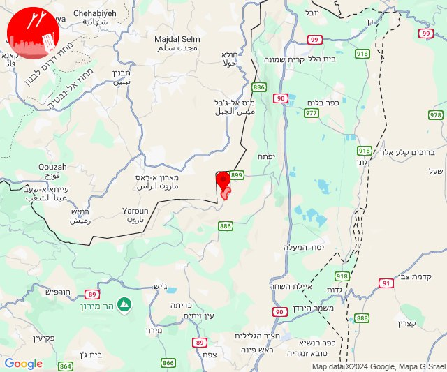

# Alerts for 2024-10-22

## 01:52

🔴 צבע אדום (22/10/2024):

04:51:
• ואדי ערה: אזור תעשייה יקנעם עילית, יקנעם המושבה והזורע, יקנעם עילית (דקה וחצי)
• הכרמל: דלית אל כרמל, עספיא, בית סוהר קישון, בית אורן, גבעת וולפסון, יערות הכרמל, כלא דמון, אזור תעשייה ניר עציון, בית צבי, כפר הנוער ימין אורד, מגדים, ניר עציון, עין הוד, עין חוד (דקה)
• המפרץ: יגור, חיפה - כרמל, הדר ועיר תחתית, חיפה - מפרץ, חיפה - נווה שאנן ורמות כרמל, קריית אתא, נשר, טירת כרמל, כפר חסידים, רכסים, חיפה - מערב, החותרים, כפר גלים (דקה)
• העמקים: אורנים, אלונים, בסמת טבעון, כפר תקווה, קריית טבעון - בית זייד, שדה יעקב, שער העמקים, תחנת רכבת כפר יהושוע (דקה)

04:52:
• המפרץ: חיפה - קריית חיים ושמואל, כפר ביאליק, קריית ביאליק, קריית ים, קריית מוצקין, אושה, כפר המכבי, רמת יוחנן, אזור תעשייה קריית ביאליק, איבטין, בית עלמין תל רגב (דקה)
• גליל עליון: עכו - אזור תעשייה, אזור תעשייה שער נעמן, אפק (30 שניות, דקה)
• מרכז הגליל: אזור תעשייה טמרה, אעבלין, טמרה, שפרעם (דקה)
• העמקים: אלוני אבא, בית לחם הגלילית, הרדוף, כעביה טבאש, כעביה, כפר טבאש, נופית, עדי, ראס עלי, ח'וואלד, חוואלד, סואעד חמירה (דקה)

צופר - צבע אדום

## 01:52

## 03:32

🔴 צבע אדום (22/10/2024):

06:32:
• גליל עליון: ג'דידה מכר, עכו (30 שניות)

צופר - צבע אדום

## 03:32

## 03:34

🔴 צבע אדום (22/10/2024):

06:34:
• ירקון: מודיעין עילית (דקה וחצי)
• שומרון: בית אריה, נילי, נעלה, עופרים (דקה וחצי)

צופר - צבע אדום

## 03:34

## 04:45

🔴 צבע אדום (22/10/2024):

07:43:
• מנשה: ג'סר א-זרקא, זכרון יעקב, מעגן מיכאל, קיסריה, מעיין צבי, אור עקיבא, בית חנניה, בנימינה, צומת בנימינה, בית ספר אורט בנימינה, מרכז ימי קיסריה, רמת הנדיב (דקה וחצי)
• דן: הרצליה - מערב, כפר שמריהו, תל אביב - מרכז העיר, תל אביב - עבר הירקון, מתחם פי גלילות, סינמה סיטי גלילות, תל אביב - דרום העיר ויפו, תל אביב - מזרח, אור יהודה, אזור, בני ברק, בת ים, גבעתיים, חולון, מקווה ישראל, קריית אונו, רמת גן - מזרח, רמת גן - מערב (דקה וחצי)
• שרון: ארסוף, בני ציון, געש, יקום, רשפון, שפיים, מתחם "חנה וסע" שפיים (דקה וחצי)
• הכרמל: דור, מאיר שפיה, פוריידיס (דקה)
• השפלה: חמד, משמר השבעה, גנות (דקה וחצי)
• צפון הגולן: אורטל (מיידי)
• קו העימות: משגב עם (מיידי)

07:44:
• קו העימות: מרגליות, קריית שמונה (מיידי)
• הכרמל: נחשולים, עין איילה (דקה)
• השפלה: ראשון לציון - מערב (דקה וחצי)
• צפון הגולן: שעל, אורטל (15 שניות, מיידי)
• שרון: בית יהושע, תל יצחק (דקה וחצי)

07:45:
• דן: רמת השרון (דקה וחצי)

צופר - צבע אדום

## 04:45

## 06:58

🔴 צבע אדום (22/10/2024):

09:58:
• קו העימות: קריית שמונה, כפר גלעדי, מטולה, משגב עם, כפר יובל, תל חי, קריית שמונה (מיידי)

צופר - צבע אדום

## 06:58

## 08:38

🔴 צבע אדום (22/10/2024):

11:38:
• קו העימות: מטולה, משגב עם, מטולה (מיידי)

צופר - צבע אדום

## 08:38

## 08:53

🔴 צבע אדום (22/10/2024):

11:53:
• קו העימות: נאות מרדכי (מיידי)

צופר - צבע אדום

## 08:53

## 10:28

🔴 צבע אדום (22/10/2024):

13:26:
• גליל עליון: בית העמק, עמקה, אשרת (30 שניות)

13:27:
• גליל עליון: נתיב השיירה, שייח' דנון, כליל, אבו סנאן, כפר יאסיף, נס עמים, שבי ציון, מזרעה, בית העמק, נתיב השיירה, שייח' דנון, עמקה, אבו סנאן, אשרת, כפר יאסיף, כליל, רגבה (30 שניות)
• קו העימות: בית העלמין החדש נהריה, בן עמי, נהריה, עברון, כברי, נווה זיו (30 שניות, מיידי, 15 שניות)

13:28:
• גליל עליון: ג'וליס, ירכא (30 שניות)

צופר - צבע אדום

## 10:28

## 11:12

🔴 צבע אדום (22/10/2024):

14:11:
• קו העימות: זרעית, שומרה (מיידי)

14:12:
• קו העימות: שתולה (מיידי)

צופר - צבע אדום

## 11:12

## 12:37

🔴 צבע אדום (22/10/2024):

15:34:
• קו העימות: משגב עם, כפר גלעדי, משגב עם (מיידי)

15:36:
• קו העימות: משגב עם, משגב עם (מיידי)

15:37:
• קו העימות: משגב עם (מיידי)

צופר - צבע אדום

## 12:37

## 13:17

🔴 צבע אדום (22/10/2024):

16:16:
• קו העימות: דפנה, שאר ישוב, קיבוץ דן (מיידי)

16:17:
• קו העימות: ע'ג'ר, דפנה, קיבוץ דן, שניר (מיידי)

צופר - צבע אדום

## 13:17

## 13:30

🔴 צבע אדום (22/10/2024):

16:30:
• גליל עליון: בית העלמין החדש עכו (30 שניות)

צופר - צבע אדום

## 13:30

## 13:43

🔴 צבע אדום (22/10/2024):

16:43:
• קו העימות: שומרה (מיידי)

צופר - צבע אדום

## 13:43

## 14:53

## 14:54

🔴 צבע אדום (22/10/2024):

17:53:
• קו העימות: קריית שמונה, משגב עם, מרגליות (מיידי)

17:54:
• קו העימות: קריית שמונה, כפר גלעדי, תל חי, משגב עם, מרגליות, קריית שמונה, כפר גלעדי (מיידי)

צופר - צבע אדום

## 14:54

## 15:17

✈️ חדירת כלי טיס עוין (22/10/2024):

18:16:
• קו העימות: בצת, לימן, מצובה, שלומי, חוף בצת, ראש הנקרה 

18:17:
• קו העימות: איזור תעשייה מילואות צפון 

צופר - צבע אדום

## 15:17

## 15:27

✈️ חדירת כלי טיס עוין (22/10/2024):

18:18:
• קו העימות: גשר הזיו, נהריה, סער, בן עמי 

18:19:
• קו העימות: עברון, נהריה, בן עמי 
• גליל עליון: מזרעה 

18:20:
• גליל עליון: רגבה, שבי ציון, נס עמים, לוחמי הגטאות, בית העמק, מזרעה 

18:21:
• גליל עליון: שומרת, בוסתן הגליל, עכו, לוחמי הגטאות 

18:22:
• גליל עליון: ג'דידה מכר, עכו, עין המפרץ, עכו - אזור תעשייה, אזור תעשייה שער נעמן, כפר מסריק 
• המפרץ: קריית ים, אזור תעשייה קריית ביאליק 

18:23:
• המפרץ: חיפה - כרמל, הדר ועיר תחתית, חיפה - מערב 
• גליל עליון: עין המפרץ, עכו - אזור תעשייה, כפר מסריק 

18:24:
• המפרץ: קריית ביאליק, קריית מוצקין, קריית ים, אזור תעשייה קריית ביאליק 
• גליל עליון: אפק 

18:25:
• המפרץ: חיפה - קריית חיים ושמואל, כפר ביאליק 

18:26:
• המפרץ: קריית אתא, חיפה - מפרץ, קריית ביאליק, קריית מוצקין 

18:27:
• המפרץ: חיפה - קריית חיים ושמואל, כפר ביאליק, קריית ים 

צופר - צבע אדום

## 15:27

## 15:31

✈️ חדירת כלי טיס עוין (22/10/2024):

18:29:
• המפרץ: יגור, כפר חסידים, רכסים 
• הכרמל: עספיא, בית סוהר קישון 
• העמקים: קריית טבעון - בית זייד, שער העמקים 

18:30:
• העמקים: אורנים 

18:31:
• הכרמל: דלית אל כרמל 
• העמקים: קריית טבעון - בית זייד 

צופר - צבע אדום

## 15:31

## 15:33

✈️ חדירת כלי טיס עוין (22/10/2024):

18:33:
• העמקים: אורנים, נהלל, רמת דוד, כפר ברוך, קריית טבעון - בית זייד 

צופר - צבע אדום

## 15:33

## 15:36

✈️ חדירת כלי טיס עוין (22/10/2024):

18:35:
• ואדי ערה: אליקים, אזור תעשייה מבוא כרמל, יקנעם עילית, עין העמק, רמת השופט 

18:36:
• ואדי ערה: עין השופט 

צופר - צבע אדום

## 15:36

## 15:42

✈️ חדירת כלי טיס עוין (22/10/2024):

18:37:
• הכרמל: בת שלמה 
• ואדי ערה: גלעד 

18:39:
• הכרמל: מאיר שפיה, פוריידיס 
• ואדי ערה: כפר קרע, ערערה 
• מנשה: זכרון יעקב 

18:41:
• מנשה: ברקאי 
• ואדי ערה: חריש 

18:42:
• מנשה: מאור, שער מנשה 

צופר - צבע אדום

## 15:42

## 16:02

🔴 צבע אדום (22/10/2024):

19:01:
• מרכז הגליל: ערב אל נעים, אשחר (30 שניות, דקה)

19:02:
• גליל עליון: כרמיאל, מג'דל כרום, צורית גילון, בענה, תובל, דיר אל-אסד (30 שניות)

צופר - צבע אדום

## 16:02

## 16:48

🔴 צבע אדום (22/10/2024):

19:48:
• קו העימות: מלכיה (מיידי)

צופר - צבע אדום

## 16:48

## 18:45

🔴 צבע אדום (22/10/2024):

21:45:
• קו העימות: מנרה (מיידי)

צופר - צבע אדום

## 18:45

## 19:57

🔴 צבע אדום (22/10/2024):

22:57:
• קו העימות: מרגליות (מיידי)

צופר - צבע אדום

## 19:57

## 20:34

🔴 צבע אדום (22/10/2024):

23:34:
• קו העימות: קריית שמונה, משגב עם, כפר גלעדי (מיידי)

צופר - צבע אדום

## 20:34

