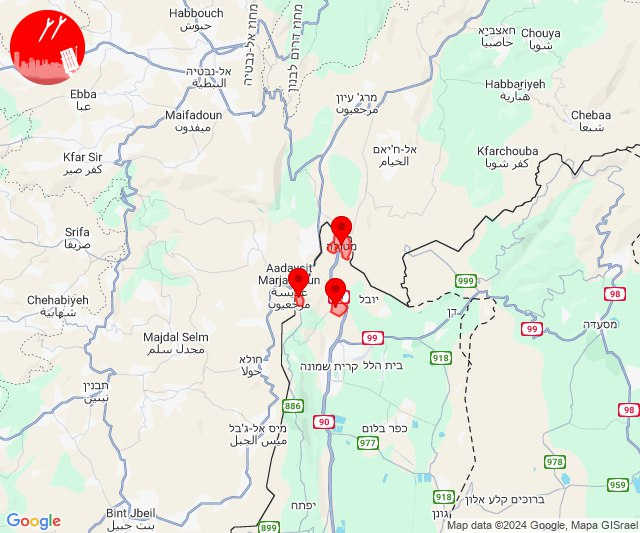
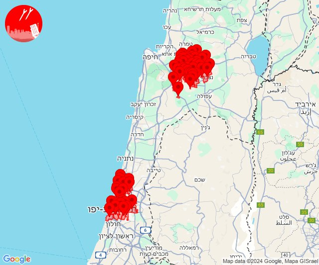
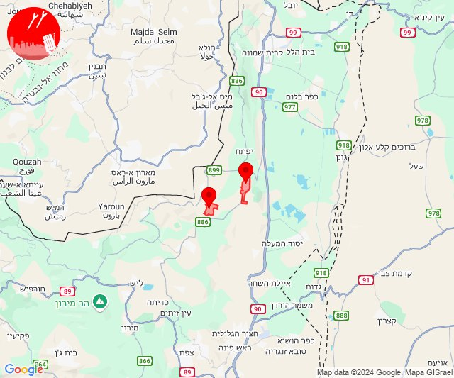
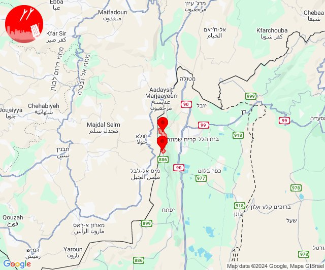
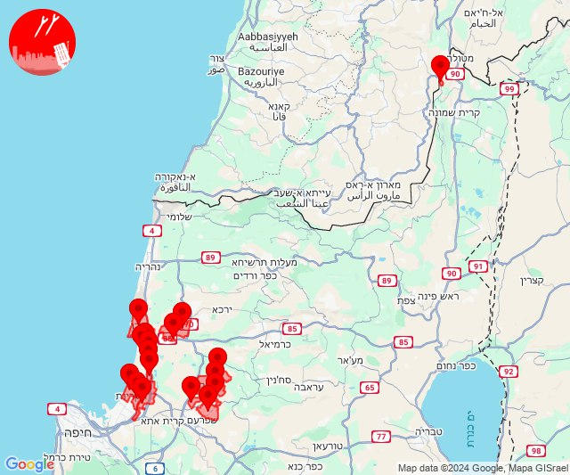

# Alerts for 2024-10-23

## 04:55

🔴 צבע אדום (23/10/2024):

07:53:
• קו העימות: משגב עם, כפר גלעדי, מטולה (מיידי)

07:54:
• קו העימות: משגב עם, משגב עם (מיידי)

07:55:
• קו העימות: כפר גלעדי, משגב עם (מיידי)

צופר - צבע אדום

## 04:55

## 05:04

🔴 צבע אדום (23/10/2024):

08:03:
• דן: תל אביב - דרום העיר ויפו, תל אביב - מזרח, תל אביב - מרכז העיר, תל אביב - עבר הירקון, בני ברק, גבעתיים, רמת גן - מערב, רמת השרון, סינמה סיטי גלילות, מתחם פי גלילות, גבעת שמואל, פתח תקווה, קריית אונו, רמת גן - מזרח (דקה וחצי)
• ואדי ערה: יקנעם המושבה והזורע, משמר העמק (דקה וחצי)
• העמקים: אלון הגליל, אלוני אבא, אלונים, בית לחם הגלילית, בית שערים, בסמת טבעון, גבעת אלה, גבת, הסוללים, זרזיר, חג'אג'רה, יפעת, כעביה טבאש, כעביה, כפר החורש, כפר טבאש, כפר יהושע, מגדל העמק, מנשית זבדה, נהלל, עילוט, קריית טבעון - בית זייד, רמת דוד, רמת ישי, שדה יעקב, שמשית, שריד, תמרת, תחנת רכבת כפר ברוך, הרדוף, נצרת, ציפורי, ריינה, ח'וואלד (דקה)
• מרכז הגליל: ביר אלמכסור (דקה)

08:04:
• שרון: גבעת חן, רעננה, רשפון (דקה וחצי)
• דן: הרצליה - מערב, הרצליה - מרכז וגליל ים, כפר שמריהו (דקה וחצי)
• מרכז הגליל: חנתון (דקה)
• העמקים: הושעיה, סואעד חמירה (דקה)

צופר - צבע אדום

## 05:04

## 05:55

🔴 צבע אדום (23/10/2024):

08:53:
• קו העימות: משגב עם, כפר גלעדי, מטולה (מיידי)

08:54:
• קו העימות: משגב עם, כפר גלעדי, משגב עם (מיידי)

08:55:
• קו העימות: משגב עם (מיידי)

צופר - צבע אדום

## 05:55

## 07:40

✈️ חדירת כלי טיס עוין (23/10/2024):

10:39:
• קו העימות: רמות נפתלי 

10:40:
• קו העימות: דישון 

צופר - צבע אדום

## 07:40

## 07:58

🔴 צבע אדום (23/10/2024):

10:58:
• קו העימות: מרגליות, מנרה (מיידי)

צופר - צבע אדום

## 07:58

## 08:05

🔴 צבע אדום (23/10/2024):

11:02:
• קו העימות: משגב עם (מיידי)

11:03:
• גליל עליון: אזור תעשייה שער נעמן, כפר מסריק, עכו - אזור תעשייה, עין המפרץ, עכו, ג'דידה מכר, בית העלמין החדש עכו (דקה, 30 שניות)
• המפרץ: קריית ביאליק, קריית ים, קריית מוצקין, אזור תעשייה קריית ביאליק (דקה)
• מרכז הגליל: אזור תעשייה טמרה, אעבלין, טמרה, כאבול, מצפה אבי''ב (דקה)

11:04:
• גליל עליון: כפר מסריק, עכו - אזור תעשייה (30 שניות)

11:05:
• גליל עליון: כפר מסריק, עין המפרץ, עכו - אזור תעשייה (30 שניות)

צופר - צבע אדום

## 08:05

## 08:17

🔴 צבע אדום (23/10/2024):

11:15:
• קו העימות: כפר גלעדי, כפר יובל, תל חי (מיידי)

11:16:
• קו העימות: כפר גלעדי, כפר יובל, תל חי, קריית שמונה (מיידי)

11:17:
• קו העימות: כפר גלעדי, כפר יובל, תל חי, מטולה (מיידי)

צופר - צבע אדום

