# Alerts for 2024-10-23

## 04:55

🔴 צבע אדום (23/10/2024):

07:53:
• קו העימות: משגב עם, כפר גלעדי, מטולה (מיידי)

07:54:
• קו העימות: משגב עם, משגב עם (מיידי)

07:55:
• קו העימות: כפר גלעדי, משגב עם (מיידי)

צופר - צבע אדום

## 04:55

## 05:04

🔴 צבע אדום (23/10/2024):

08:03:
• דן: תל אביב - דרום העיר ויפו, תל אביב - מזרח, תל אביב - מרכז העיר, תל אביב - עבר הירקון, בני ברק, גבעתיים, רמת גן - מערב, רמת השרון, סינמה סיטי גלילות, מתחם פי גלילות, גבעת שמואל, פתח תקווה, קריית אונו, רמת גן - מזרח (דקה וחצי)
• ואדי ערה: יקנעם המושבה והזורע, משמר העמק (דקה וחצי)
• העמקים: אלון הגליל, אלוני אבא, אלונים, בית לחם הגלילית, בית שערים, בסמת טבעון, גבעת אלה, גבת, הסוללים, זרזיר, חג'אג'רה, יפעת, כעביה טבאש, כעביה, כפר החורש, כפר טבאש, כפר יהושע, מגדל העמק, מנשית זבדה, נהלל, עילוט, קריית טבעון - בית זייד, רמת דוד, רמת ישי, שדה יעקב, שמשית, שריד, תמרת, תחנת רכבת כפר ברוך, הרדוף, נצרת, ציפורי, ריינה, ח'וואלד (דקה)
• מרכז הגליל: ביר אלמכסור (דקה)

08:04:
• שרון: גבעת חן, רעננה, רשפון (דקה וחצי)
• דן: הרצליה - מערב, הרצליה - מרכז וגליל ים, כפר שמריהו (דקה וחצי)
• מרכז הגליל: חנתון (דקה)
• העמקים: הושעיה, סואעד חמירה (דקה)

צופר - צבע אדום

## 05:04

## 05:55

🔴 צבע אדום (23/10/2024):

08:53:
• קו העימות: משגב עם, כפר גלעדי, מטולה (מיידי)

08:54:
• קו העימות: משגב עם, כפר גלעדי, משגב עם (מיידי)

08:55:
• קו העימות: משגב עם (מיידי)

צופר - צבע אדום

## 05:55

## 07:40

✈️ חדירת כלי טיס עוין (23/10/2024):

10:39:
• קו העימות: רמות נפתלי 

10:40:
• קו העימות: דישון 

צופר - צבע אדום

## 07:40

## 07:58

🔴 צבע אדום (23/10/2024):

10:58:
• קו העימות: מרגליות, מנרה (מיידי)

צופר - צבע אדום

## 07:58

## 08:05

🔴 צבע אדום (23/10/2024):

11:02:
• קו העימות: משגב עם (מיידי)

11:03:
• גליל עליון: אזור תעשייה שער נעמן, כפר מסריק, עכו - אזור תעשייה, עין המפרץ, עכו, ג'דידה מכר, בית העלמין החדש עכו (דקה, 30 שניות)
• המפרץ: קריית ביאליק, קריית ים, קריית מוצקין, אזור תעשייה קריית ביאליק (דקה)
• מרכז הגליל: אזור תעשייה טמרה, אעבלין, טמרה, כאבול, מצפה אבי''ב (דקה)

11:04:
• גליל עליון: כפר מסריק, עכו - אזור תעשייה (30 שניות)

11:05:
• גליל עליון: כפר מסריק, עין המפרץ, עכו - אזור תעשייה (30 שניות)

צופר - צבע אדום

## 08:05

## 08:17

🔴 צבע אדום (23/10/2024):

11:15:
• קו העימות: כפר גלעדי, כפר יובל, תל חי (מיידי)

11:16:
• קו העימות: כפר גלעדי, כפר יובל, תל חי, קריית שמונה (מיידי)

11:17:
• קו העימות: כפר גלעדי, כפר יובל, תל חי, מטולה (מיידי)

צופר - צבע אדום

## 08:17

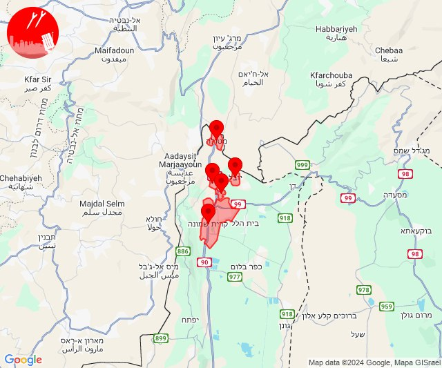

## 08:41

🔴 צבע אדום (23/10/2024):

11:41:
• קו העימות: משגב עם (מיידי)

צופר - צבע אדום

## 08:42

## 08:47

🔴 צבע אדום (23/10/2024):

11:46:
• קו העימות: מרגליות, משגב עם (מיידי)

11:47:
• קו העימות: משגב עם, מרגליות (מיידי)

צופר - צבע אדום

## 08:47

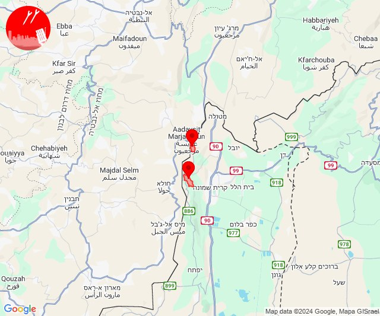

## 09:27

🔴 צבע אדום (23/10/2024):

12:27:
• קו העימות: מטולה (מיידי)

צופר - צבע אדום

## 09:27

## 09:45

🔴 צבע אדום (23/10/2024):

12:45:
• קו העימות: כפר גלעדי, משגב עם, קריית שמונה (מיידי)

צופר - צבע אדום

## 09:45

## 10:42

🔴 צבע אדום (23/10/2024):

13:39:
• גליל עליון: אזור תעשייה שער נעמן (דקה)

13:40:
• המפרץ: אזור תעשייה קריית ביאליק, קריית ביאליק, קריית ים, קריית מוצקין (דקה)
• גליל עליון: כפר מסריק, עין המפרץ, עכו - אזור תעשייה, ג'דידה מכר, עכו (30 שניות)

13:41:
• גליל עליון: כפר מסריק, עכו - אזור תעשייה, עין המפרץ, עכו, כפר מסריק, עין המפרץ, עכו - אזור תעשייה, בוסתן הגליל, ג'דידה מכר, שומרת (30 שניות)

13:42:
• גליל עליון: אזור תעשייה שער נעמן (דקה)
• המפרץ: אזור תעשייה קריית ביאליק (דקה)

צופר - צבע אדום

## 10:42

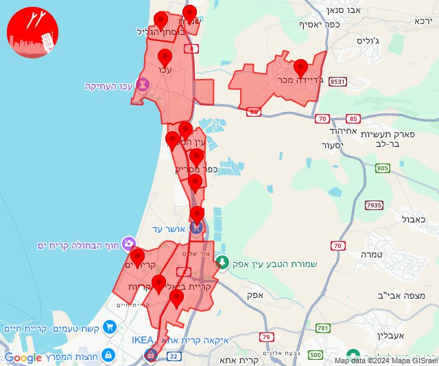

## 10:49

🔴 צבע אדום (23/10/2024):

13:49:
• קו העימות: משגב עם, קריית שמונה (מיידי)

צופר - צבע אדום

## 10:49

## 10:51

🔴 צבע אדום (23/10/2024):

13:50:
• קו העימות: משגב עם (מיידי)

13:51:
• קו העימות: קריית שמונה, משגב עם, קריית שמונה, מרגליות (מיידי)

צופר - צבע אדום

## 10:51

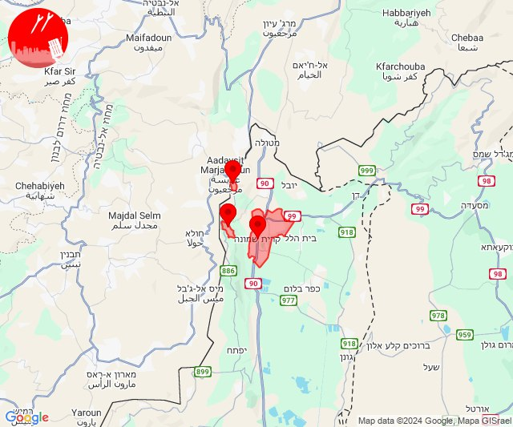

## 11:52

🔴 צבע אדום (23/10/2024):

14:51:
• קו העימות: משגב עם (מיידי)

14:52:
• קו העימות: משגב עם, קריית שמונה (מיידי)

צופר - צבע אדום

## 11:52

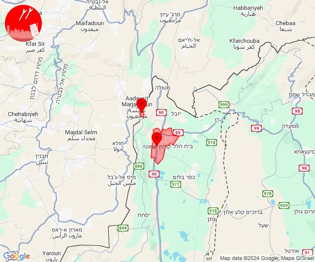

## 13:14

🔴 צבע אדום (23/10/2024):

16:12:
• קו העימות: נהריה (15 שניות)

16:13:
• קו העימות: גשר הזיו, סער, בצת, לימן, מצובה, שלומי, איזור תעשייה מילואות צפון, עברון, נהריה, בן עמי, גשר הזיו, סער, לימן, איזור תעשייה מילואות צפון (מיידי, 15 שניות)
• גליל עליון: שבי ציון, מזרעה (30 שניות)

16:14:
• קו העימות: כברי (מיידי)

צופר - צבע אדום

## 13:14

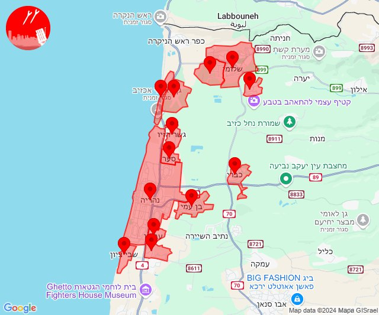

## 13:36

🔴 צבע אדום (23/10/2024):

16:36:
• מנשה: תלמי אלעזר (דקה וחצי)
• בקעת בית שאן: גשר, ירדנה, נווה אור, מנחמיה (דקה)
• דרום הגולן: אשדות יעקב, חמת גדר, מבוא חמה, כפר חרוב, נאות גולן, בני יהודה וגבעת יואב, מסדה, שער הגולן, צמח, מעגן, תל קציר, האון, עין גב, חוף גולן, צאלון, חוף כורסי, לבנון, חלוקים, חוף גופרה, חוף סוסיתא (דקה, 15 שניות, 30 שניות)
• גליל תחתון: אפיקים, טבריה, כפר נהר הירדן, מצפה, אזור תעשייה קדמת גליל, אלומות, ארבל, אתר ההנצחה גולני, בית זרע, בית ירח, גבעת אבני, גינוסר, דגניה א, דגניה ב, הודיות, הזורעים, ואדי אל חמאם, יבנאל, כינרת מושבה, כינרת קבוצה, כפר זיתים, כפר חיטים, כפר כמא, לביא, מגדל, נבי שועייב, פוריה כפר עבודה, פוריה נווה עובד, פוריה עילית, שדה אילן, שרונה (דקה)
• העמקים: אילניה, בית קשת, גזית, כדורי, כפר מצר, כפר קיש, כפר תבור, עין דור, שבלי, שדמות דבורה, אום אלג'נם (דקה)

צופר - צבע אדום

## 13:36

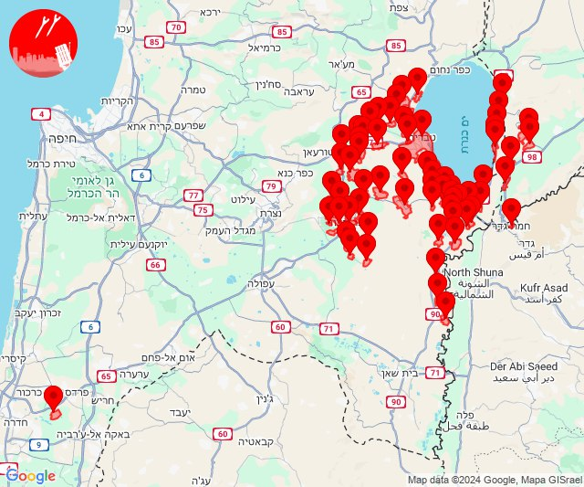

## 13:39

🔴 צבע אדום (23/10/2024):

16:38:
• בקעת בית שאן: שדה אליהו, רחוב, כפר רופין, שלוחות, חוות עדן, עין הנצי''ב, רשפים, שלפים, בית שאן, מסילות, נוה איתן, מעוז חיים, שדה נחום, חמדיה, אזור תעשייה צבאים, גני חוגה, תל תאומים (דקה)

16:39:
• דרום הגולן: מסדה, מעגן, צמח, שער הגולן, תל קציר, אשדות יעקב (30 שניות, דקה)
• העמקים: אכסאל, עין מאהל, אזור תעשייה אלון התבור, אחוזת ברק, דברת, דחי, טמרה בגלבוע, נאעורה, נין, סולם, עפולה, רמת צבי, אילניה, בית קשת, גזית, דבוריה, כדורי, כפר מצר, כפר קיש, כפר תבור, עין דור, שבלי, שדמות דבורה, כפר יחזקאל, עין חרוד, קבוצת גבע, תל יוסף, אום אלג'נם, בית סוהר שיטה וגלבוע (דקה)
• גליל תחתון: טבריה, כפר נהר הירדן, אלומות, אפיקים, בית זרע, בית ירח, גבעת אבני, דגניה א, דגניה ב, הזורעים, יבנאל, כינרת מושבה, כינרת קבוצה, כפר כמא, פוריה כפר עבודה, פוריה נווה עובד, פוריה עילית, שדה אילן, שרונה (דקה)
• בקעת בית שאן: בית אלפא וחפציבה, בית השיטה, בית יוסף, גשר, טייבה בגלבוע, ירדנה, מולדת, נווה אור, מנחמיה (דקה)

צופר - צבע אדום

## 13:39

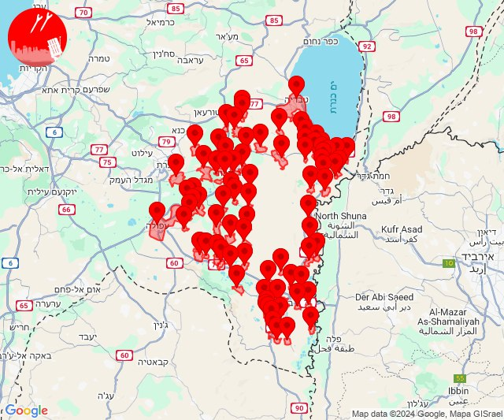

## 14:23

🔴 צבע אדום (23/10/2024):

17:23:
• קו העימות: שתולה (מיידי)

צופר - צבע אדום

## 14:23

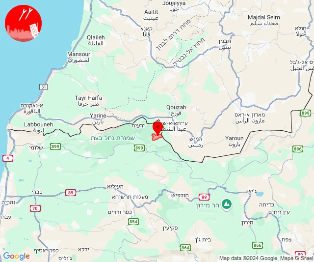

## 15:18

🔴 צבע אדום (23/10/2024):

18:16:
• קו העימות: מרגליות (מיידי)

18:17:
• קו העימות: מרגליות, קריית שמונה, משגב עם (מיידי)

18:18:
• קו העימות: כפר גלעדי, תל חי (מיידי)

צופר - צבע אדום

## 15:18

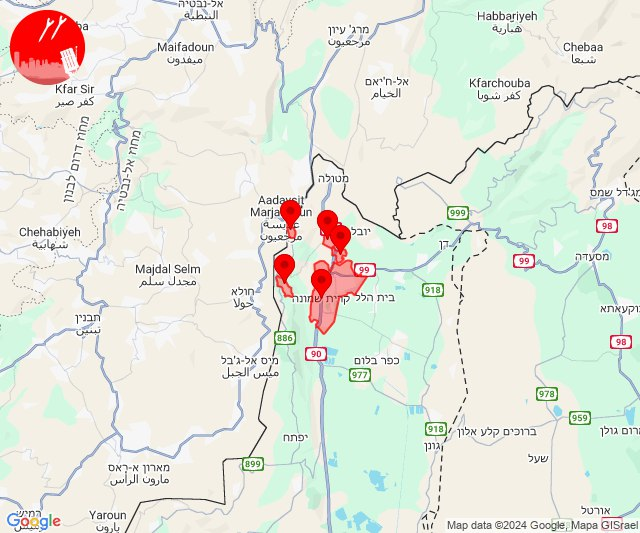

## 15:22

🔴 צבע אדום (23/10/2024):

18:22:
• קו העימות: שתולה (מיידי)

צופר - צבע אדום

## 15:22

## 15:25

🔴 צבע אדום (23/10/2024):

18:25:
• קו העימות: שתולה (מיידי)

צופר - צבע אדום

## 15:25

## 16:14

🔴 צבע אדום (23/10/2024):

19:14:
• קו העימות: ערב אל עראמשה, אדמית (מיידי)

צופר - צבע אדום

## 16:14

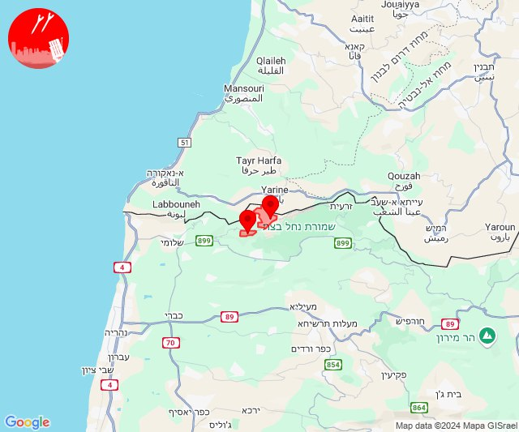

## 16:59

🔴 צבע אדום (23/10/2024):

19:59:
• קו העימות: מטולה (מיידי)

צופר - צבע אדום

## 16:59

## 17:34

🔴 צבע אדום (23/10/2024):

20:33:
• דן: תל אביב - עבר הירקון, אור יהודה, בני ברק, גבעת שמואל, גבעתיים, גת רימון, הרצליה - מרכז וגליל ים, מעש, סביון, פתח תקווה, קריית אונו, רמת גן - מזרח, רמת גן - מערב, רמת השרון, גני תקווה, בית עלמין מורשה, גבעת השלושה, הרצליה - מערב, סינמה סיטי גלילות, מתחם פי גלילות, כפר שמריהו (דקה וחצי)
• שרון: גבעת חן, רעננה, בית ברל, גן חיים, גני עם, הוד השרון, ירקונה, כפר מל''ל, כפר סבא, משמרת, נווה ירק, עדנים, צופית, רמות השבים, שדה ורבורג, בני ציון, בצרה, מרכז אזורי דרום השרון, אלישמע, ג'לג'וליה, חגור, כפר קאסם, שדי חמד, תחנת רכבת ראש העין, נתניה - מערב, אודים, געש, יקום, מכון וינגייט, נווה ימין, אורנית, חורשים, ירחיב, כפר ברא, מתן, נירית, אלפי מנשה, אלקנה, עץ אפרים, צופים, שערי תקווה, ניר אליהו, אייל, כוכב יאיר - צור יגאל (דקה וחצי)
• השפלה: חמד, גנות (דקה וחצי)
• ירקון: ראש העין, אזור תעשייה אפק ולב הארץ (דקה וחצי)

20:34:
• שרון: רמת הכובש (דקה וחצי)

צופר - צבע אדום

## 17:34

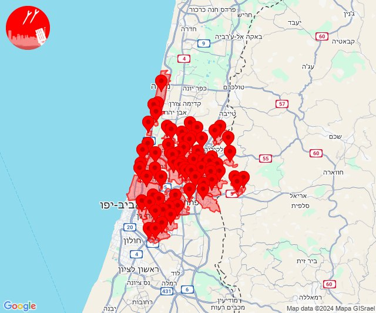

## 20:06

✈️ חדירת כלי טיס עוין (23/10/2024):

23:06:
• קו העימות: אדמית, יערה 

צופר - צבע אדום

## 20:06

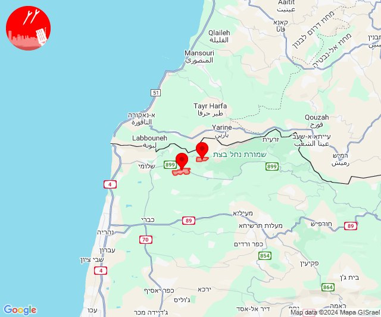

## 21:15

🔴 צבע אדום (24/10/2024):

00:15:
• קו העימות: מנרה, מרגליות, קריית שמונה, מרגליות (מיידי)

צופר - צבע אדום

## 21:15

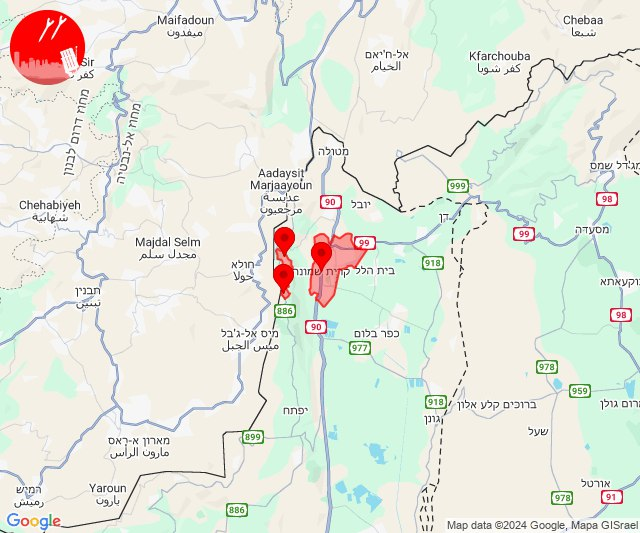

## 23:47

🔴 צבע אדום (24/10/2024):

02:46:
• קו העימות: אדמית (מיידי)

02:47:
• קו העימות: יערה (מיידי)

צופר - צבע אדום

## 23:47

