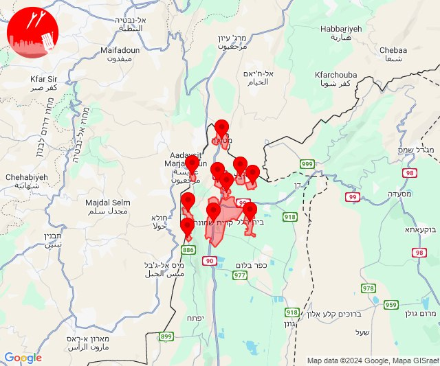

# Alerts for 2024-10-24

## 06:18

🔴 צבע אדום (24/10/2024):

09:18:
• קו העימות: דוב''ב (מיידי)

צופר - צבע אדום

## 06:18

## 06:53

🔴 צבע אדום (24/10/2024):

09:51:
• קו העימות: מלכיה, מלכיה (מיידי)

09:52:
• קו העימות: בית העלמין החדש נהריה, מלכיה, בן עמי, נהריה, עברון, כברי, מצובה, נווה זיו (30 שניות, מיידי, 15 שניות)
• גליל עליון: נתיב השיירה, שייח' דנון, עמקה, שבי ציון, מזרעה, רגבה, בית העמק, אשרת, כליל (30 שניות)

09:53:
• קו העימות: סער, גשר הזיו, בצת, שלומי, איזור תעשייה מילואות צפון, לימן, בית העלמין החדש נהריה, בן עמי, נהריה, כברי (מיידי, 30 שניות, 15 שניות)
• גליל עליון: נתיב השיירה, שייח' דנון (30 שניות)

צופר - צבע אדום

## 06:53

## 07:53

🔴 צבע אדום (24/10/2024):

10:52:
• גליל עליון: אליפלט, ראש פינה, צפת - נוף כנרת, עמיעד, חצור הגלילית, אזור תעשייה חצור הגלילית, אזור תעשייה צ.ח.ר, צפת - עיר, ביריה, עמוקה, קדיתא, כורזים ורד הגליל, מנחת מחניים, טובא זנגריה (30 שניות)
• קו העימות: דלתון (מיידי)

10:53:
• גליל עליון: ראש פינה, אליפלט, צפת - נוף כנרת, עמיעד, חצור הגלילית, מחניים, אזור תעשייה צ.ח.ר, אזור תעשייה חצור הגלילית, צפת - עיר, עמוקה, צפת - עכברה, ביריה, כפר הנשיא (30 שניות)
• קו העימות: ג'ש - גוש חלב, אזור תעשייה רמת דלתון, כרם בן זמרה, ריחאנייה (מיידי)

צופר - צבע אדום

## 07:53

## 08:29

🔴 צבע אדום (24/10/2024):

11:29:
• גליל עליון: עכו - אזור תעשייה (30 שניות)

צופר - צבע אדום

## 08:29

## 08:56

🔴 צבע אדום (24/10/2024):

11:56:
• קו העימות: משגב עם (מיידי)

צופר - צבע אדום

## 08:56

## 09:18

🔴 צבע אדום (24/10/2024):

12:17:
• גליל עליון: נס עמים, מזרעה, נתיב השיירה, לוחמי הגטאות, רגבה, שבי ציון, בית העמק, נס עמים, מזרעה, בוסתן הגליל, ג'דידה מכר, עכו, שומרת (30 שניות)
• קו העימות: נהריה, עברון, בן עמי (15 שניות, מיידי)

12:18:
• גליל עליון: רגבה (30 שניות)

צופר - צבע אדום

## 09:18

## 12:18

🔴 צבע אדום (24/10/2024):

15:17:
• מרכז הגליל: ערב אל נעים, אשחר (30 שניות, דקה)
• גליל עליון: כרמיאל (30 שניות)

15:18:
• גליל עליון: אזור תעשייה כרמיאל, בענה, דיר אל-אסד, לבון, מג'דל כרום, נחף (30 שניות)

צופר - צבע אדום

## 12:18

## 12:51

🔴 צבע אדום (24/10/2024):

15:51:
• קו העימות: מנרה (מיידי)

צופר - צבע אדום

## 12:51

## 13:07

🔴 צבע אדום (24/10/2024):

16:07:
• קו העימות: מרגליות, קריית שמונה (מיידי)

צופר - צבע אדום

## 13:08

## 13:44

🔴 צבע אדום (24/10/2024):

16:43:
• קו העימות: משגב עם (מיידי)

16:44:
• קו העימות: מעיין ברוך (מיידי)

צופר - צבע אדום

## 13:44

## 13:46

✈️ חדירת כלי טיס עוין (24/10/2024):

16:40:
• קו העימות: מעיין ברוך, הגושרים, דפנה, שאר ישוב 

16:41:
• קו העימות: הגושרים, קיבוץ דן, שניר, דפנה, כפר סאלד 

16:42:
• קו העימות: שמיר 

16:43:
• קו העימות: כפר סאלד, מטולה 

16:44:
• קו העימות: מטולה, כפר יובל 

16:45:
• קו העימות: מעיין ברוך, כפר יובל 

16:46:
• קו העימות: הגושרים, גונן, כפר בלום, כפר סאלד, להבות הבשן, נאות מרדכי, עמיר, שדה נחמיה, שמיר, דפנה, שאר ישוב 

צופר - צבע אדום

## 13:46

## 13:48

🔴 צבע אדום (24/10/2024):

16:48:
• קו העימות: שאר ישוב (מיידי)

צופר - צבע אדום

## 13:48

## 13:50

🔴 צבע אדום (24/10/2024):

16:50:
• קו העימות: מרגליות, משגב עם, מרגליות (מיידי)

צופר - צבע אדום

## 13:50

## 13:55

🔴 צבע אדום (24/10/2024):

16:55:
• גליל עליון: כפר שמאי (30 שניות)

צופר - צבע אדום

## 13:55

## 13:59

🔴 צבע אדום (24/10/2024):

16:59:
• קו העימות: משגב עם (מיידי)

צופר - צבע אדום

## 13:59

## 14:23

✈️ חדירת כלי טיס עוין (24/10/2024):

17:23:
• קו העימות: שלומי 

צופר - צבע אדום

## 14:23

## 15:17

✈️ חדירת כלי טיס עוין (24/10/2024):

18:17:
• קו העימות: מטולה, בית הלל, כפר גלעדי, כפר יובל, מטולה, מנרה, מעיין ברוך, מרגליות, משגב עם, קריית שמונה, תל חי 

צופר - צבע אדום

## 15:17

## 15:20

✈️ חדירת כלי טיס עוין (24/10/2024):

18:20:
• קו העימות: גונן, כפר בלום, כפר סאלד, להבות הבשן, נאות מרדכי, עמיר, שדה נחמיה, שמיר 

צופר - צבע אדום

## 15:20

## 18:48

🔴 צבע אדום (24/10/2024):

21:48:
• קו העימות: מרגליות (מיידי)

צופר - צבע אדום

## 18:48

## 20:26

🔴 צבע אדום (24/10/2024):

23:26:
• קו העימות: דישון, מלכיה (מיידי)

צופר - צבע אדום

## 20:26

## 21:59

🔴 צבע אדום (25/10/2024):

00:59:
• קו העימות: מנרה, מרגליות (מיידי)

צופר - צבע אדום

## 21:59

## 22:11

🔴 צבע אדום (25/10/2024):

01:10:
• קו העימות: מלכיה (מיידי)

01:11:
• צפון הגולן: מרום גולן (מיידי)

צופר - צבע אדום

## 22:11

