# Alerts for 2024-10-25

## 02:20

🔴 צבע אדום (25/10/2024):

05:19:
• קו העימות: משגב עם (מיידי)

05:20:
• קו העימות: משגב עם (מיידי)

צופר - צבע אדום

## 02:20

## 02:22

🔴 צבע אדום (25/10/2024):

05:22:
• קו העימות: משגב עם (מיידי)

צופר - צבע אדום

## 02:22

## 02:25

🔴 צבע אדום (25/10/2024):

05:25:
• קו העימות: משגב עם (מיידי)

צופר - צבע אדום

## 02:25

## 02:43

🔴 צבע אדום (25/10/2024):

05:43:
• קו העימות: משגב עם (מיידי)

צופר - צבע אדום

## 02:43

## 02:49

🔴 צבע אדום (25/10/2024):

05:49:
• קו העימות: משגב עם (מיידי)

צופר - צבע אדום

## 02:49

## 03:48

🔴 צבע אדום (25/10/2024):

06:46:
• ואדי ערה: גלעד, מדרך עוז, עין השופט, אום אל פחם, אל עריאן, מועאוויה, מי עמי, מעלה עירון, עין אל סהלה, ערערה, קציר (דקה וחצי)
• מנשה: אביאל, אור עקיבא, אזור תעשייה קיסריה, בית חנניה, בנימינה, ג'סר א-זרקא, גבעת עדה, מעגן מיכאל, מעיין צבי, משמרות, פרדס חנה כרכור, קיסריה, שדות ים, מתחם שביל התפוזים, צומת בנימינה, מרכז ימי קיסריה, זכרון יעקב, בית ספר אורט בנימינה, רמת הנדיב (דקה וחצי)
• הכרמל: מאיר שפיה, פוריידיס (דקה)

06:47:
• ואדי ערה: דליה (דקה וחצי)

06:48:
• הכרמל: בת שלמה, עופר (דקה)

צופר - צבע אדום

## 03:48

## 06:02

🔴 צבע אדום (25/10/2024):

09:02:
• המפרץ: חיפה - כרמל, הדר ועיר תחתית, חיפה - מערב, חיפה - מפרץ, חיפה - נווה שאנן ורמות כרמל, חיפה - קריית חיים ושמואל, כפר ביאליק, קריית אתא, קריית ביאליק, קריית ים, קריית מוצקין, אזור תעשייה קריית ביאליק, נשר (דקה)
• גליל עליון: אזור תעשייה שער נעמן, כפר מסריק, עין המפרץ, עכו - אזור תעשייה (דקה, 30 שניות)

צופר - צבע אדום

## 06:02

## 06:23

🔴 צבע אדום (25/10/2024):

09:23:
• קו העימות: עלמה (מיידי)

צופר - צבע אדום

## 06:23

## 06:51

🔴 צבע אדום (25/10/2024):

09:51:
• קו העימות: דישון, מלכיה (מיידי)

צופר - צבע אדום

## 06:51

## 08:08

🔴 צבע אדום (25/10/2024):

11:08:
• דרום הגולן: נטור (מיידי)

צופר - צבע אדום

## 08:08

## 08:17

✈️ חדירת כלי טיס עוין (25/10/2024):

11:15:
• גליל עליון: חוף אמנון 

11:16:
• גליל עליון: כפר נחום, אמנון, חוף אמנון 

11:17:
• גליל עליון: טבחה 

צופר - צבע אדום

## 08:17

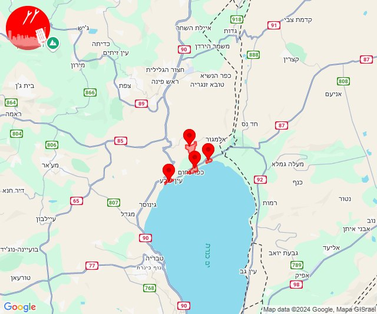

## 09:26

🔴 צבע אדום (25/10/2024):

12:26:
• קו העימות: זרעית, שומרה, אבן מנחם (מיידי)

צופר - צבע אדום

## 09:26

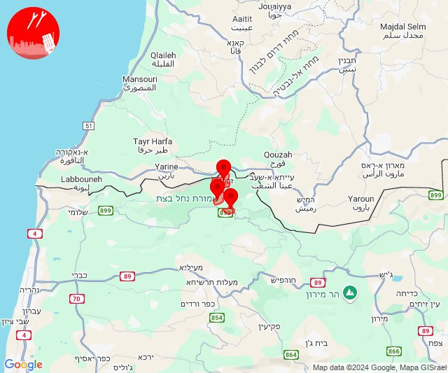

## 11:47

🔴 צבע אדום (25/10/2024):

14:47:
• קו העימות: אבן מנחם, שומרה (מיידי)

צופר - צבע אדום

## 11:47

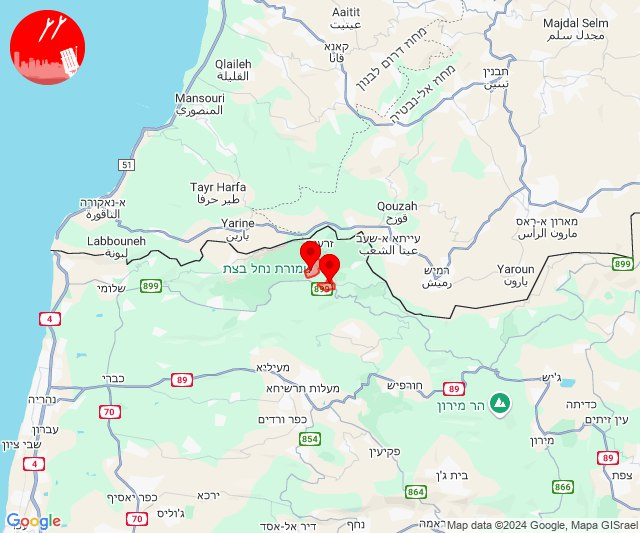

## 12:00

🔴 צבע אדום (25/10/2024):

14:58:
• מרכז הגליל: שורשים (דקה)

14:59:
• גליל עליון: בענה, כרמיאל, מג'דל כרום, צורית גילון, דיר אל-אסד, גיתה, ינוח ג'ת, ירכא, כישור, כסרא סמיע, לפידות, מגדל תפן, לבון, תובל, פלך, בענה, מג'דל כרום, כרמיאל (30 שניות)
• קו העימות: כפר ורדים (15 שניות)

15:00:
• גליל עליון: צורית גילון, דיר אל-אסד, כישור, לפידות, לבון (30 שניות)

צופר - צבע אדום

## 12:00

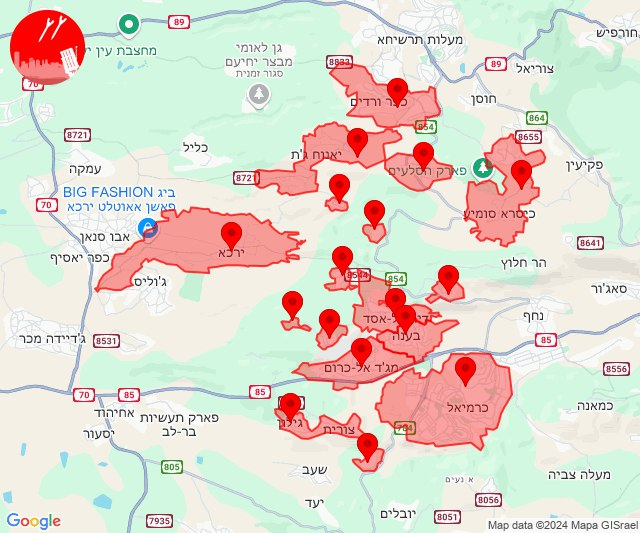

## 12:30

🔴 צבע אדום (25/10/2024):

15:30:
• גליל עליון: כפר שמאי (30 שניות)

צופר - צבע אדום

## 12:30

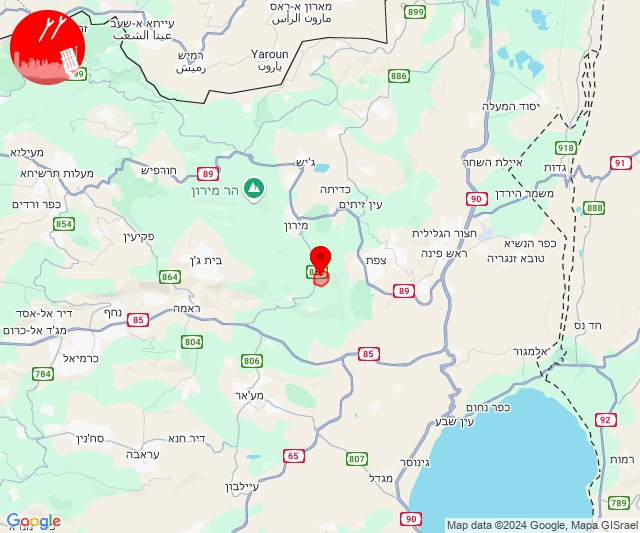

## 14:23

🔴 צבע אדום (25/10/2024):

17:23:
• קו העימות: כפר גלעדי, משגב עם, תל חי (מיידי)

צופר - צבע אדום

## 14:23

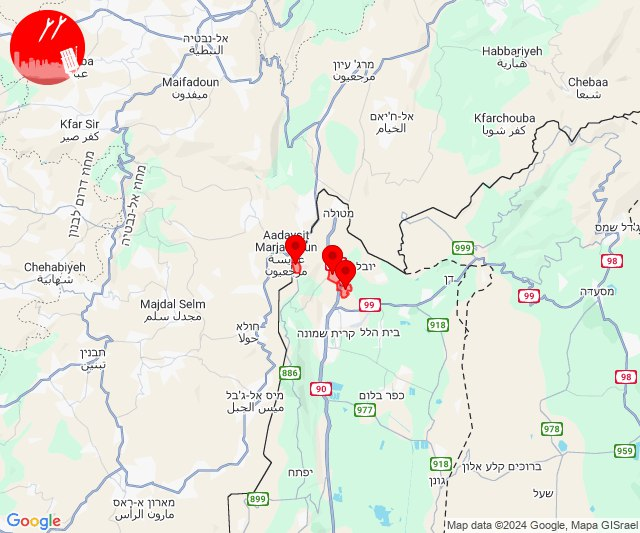

## 14:31

🔴 צבע אדום (25/10/2024):

17:31:
• קו העימות: נווה זיו, יערה, עבדון (מיידי)

צופר - צבע אדום

## 14:31

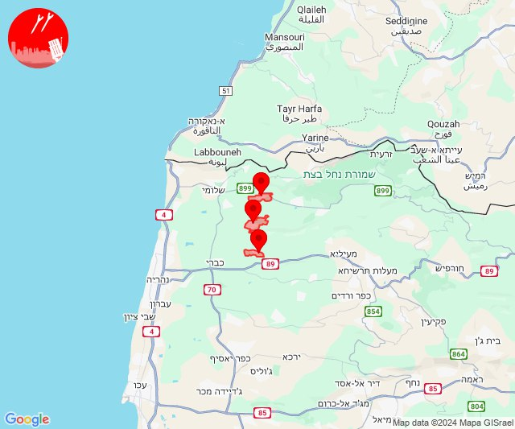

## 14:43

🔴 צבע אדום (25/10/2024):

17:43:
• קו העימות: כפר גלעדי, מרגליות, משגב עם, תל חי (מיידי)

צופר - צבע אדום

## 14:43

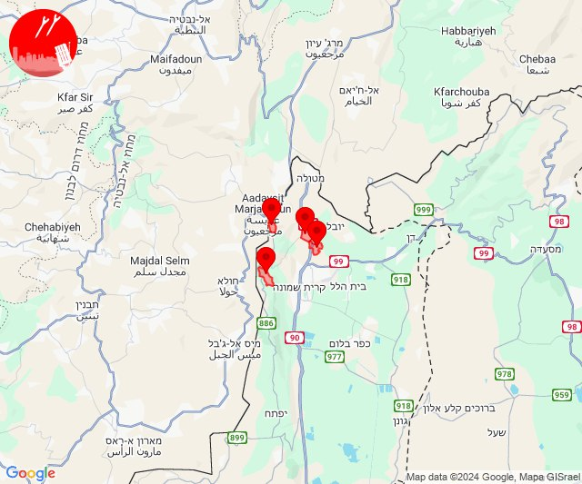

## 15:15

🔴 צבע אדום (25/10/2024):

18:15:
• גליל עליון: צפת - עיר, ראש פינה, חצור הגלילית, צפת - נוף כנרת, ביריה, עמוקה (30 שניות)

צופר - צבע אדום

## 15:16

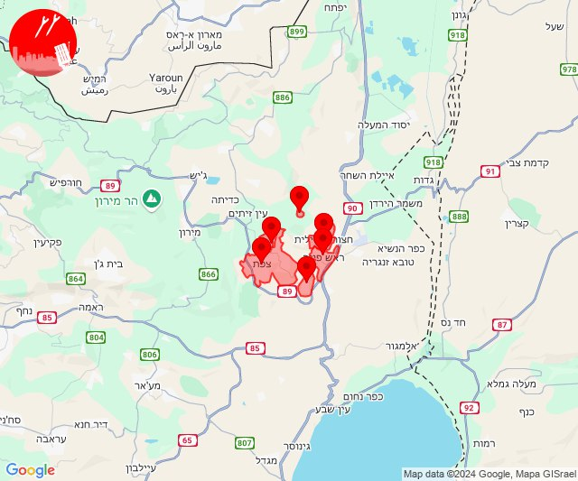

## 15:49

🔴 צבע אדום (25/10/2024):

18:49:
• קו העימות: משגב עם (מיידי)

צופר - צבע אדום

## 15:49

## 16:20

🔴 צבע אדום (25/10/2024):

19:20:
• קו העימות: קריית שמונה, בית הלל, הגושרים, כפר יובל, מעיין ברוך, ע'ג'ר, דפנה, מטולה (מיידי)

צופר - צבע אדום

## 16:20

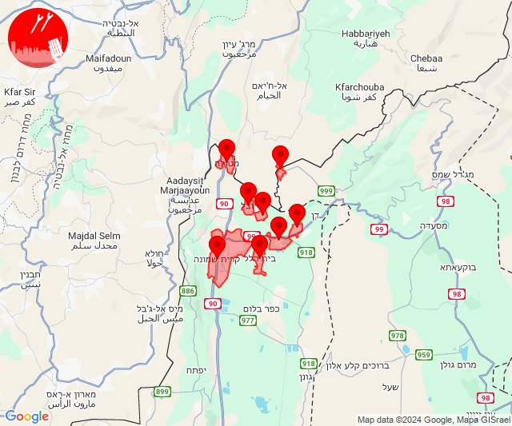

## 16:29

🔴 צבע אדום (25/10/2024):

19:29:
• קו העימות: מרגליות, משגב עם, מנרה (מיידי)

צופר - צבע אדום

## 16:29

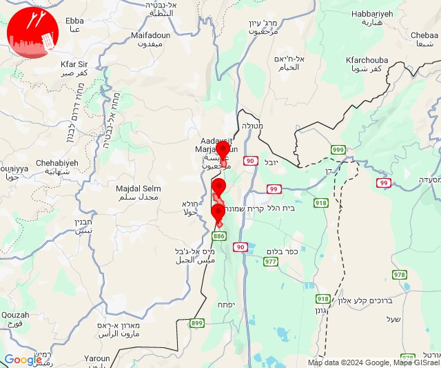

## 18:38

🔴 צבע אדום (25/10/2024):

21:38:
• קו העימות: משגב עם (מיידי)

צופר - צבע אדום

## 18:38

## 19:19

🔴 צבע אדום (25/10/2024):

22:19:
• קו העימות: קריית שמונה, משגב עם, מרגליות, מנרה (מיידי)

צופר - צבע אדום

## 19:19

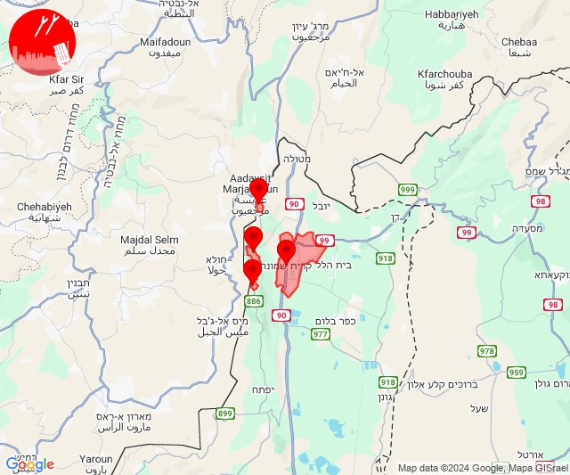

## 21:08

🔴 צבע אדום (26/10/2024):

00:08:
• קו העימות: קריית שמונה, כפר גלעדי, משגב עם (מיידי)

צופר - צבע אדום

## 21:08

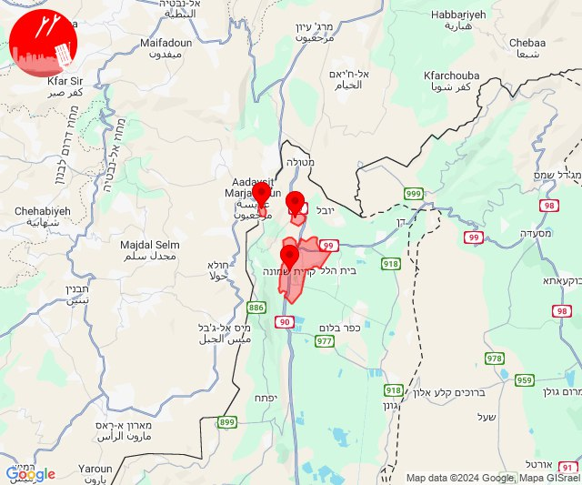

