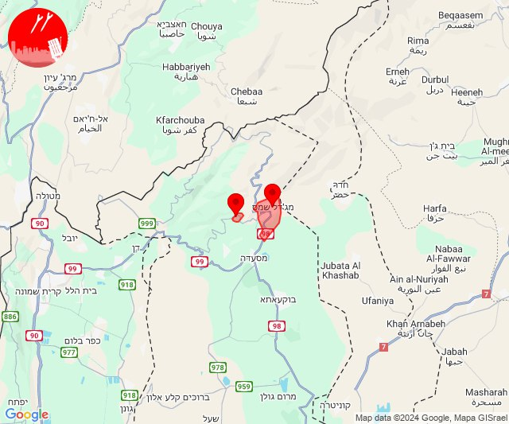
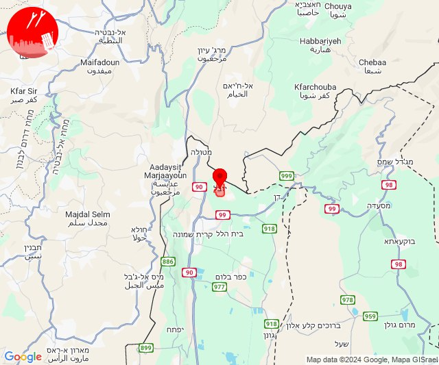
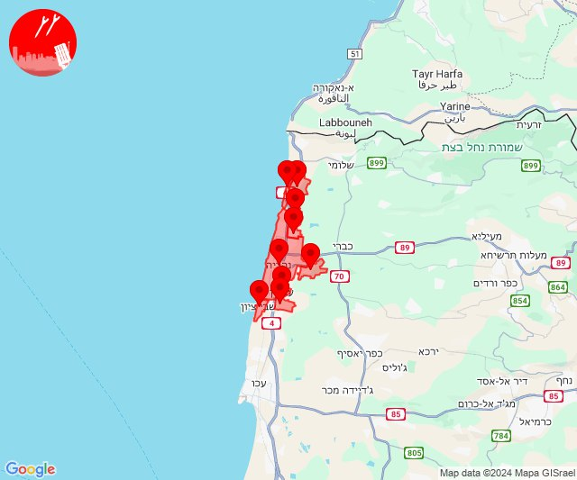
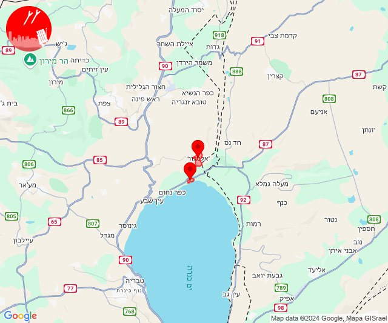
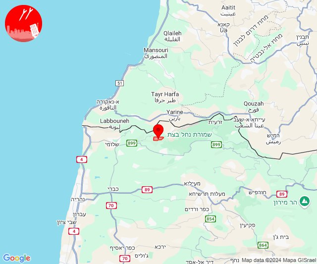
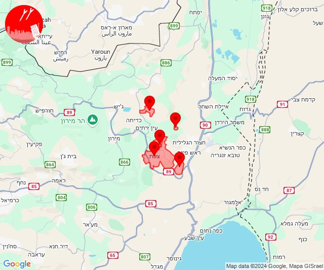
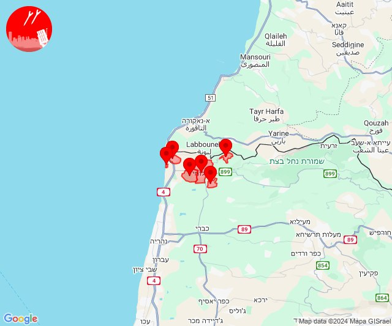
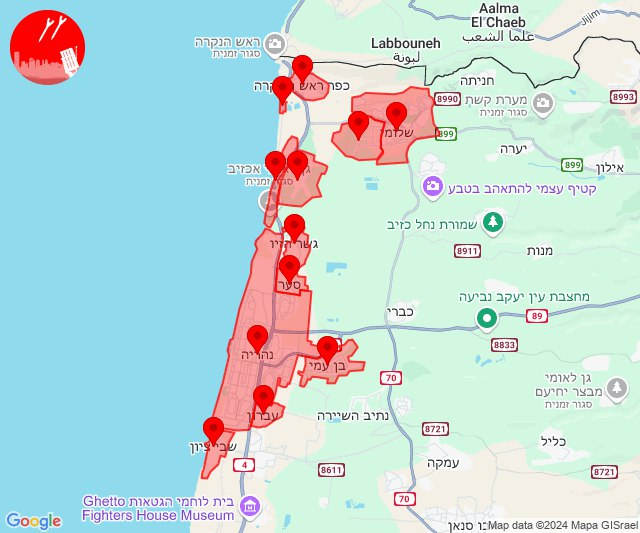

# Alerts for 2024-10-26

## 01:07

✈️ חדירת כלי טיס עוין (26/10/2024):

04:04:
• קו העימות: נהריה 

04:05:
• גליל עליון: שבי ציון, רגבה, מזרעה 
• קו העימות: נהריה 

04:06:
• גליל עליון: לוחמי הגטאות, שבי ציון, בוסתן הגליל, שומרת, עכו 

04:07:
• גליל עליון: ג'דידה מכר 

צופר - צבע אדום

## 01:07

## 01:35

✈️ חדירת כלי טיס עוין (26/10/2024):

04:35:
• קו העימות: מצובה, שלומי 

צופר - צבע אדום

## 01:35

## 04:04

📈/🏚 רעידת אדמה (26/10/2024):

07:02:
• בקעת בית שאן: מעלה גלבוע, שלוחות, רשפים, שלפים, בית שאן, מסילות, נוה איתן, מעוז חיים, ניר דוד, בית אלפא וחפציבה, שדה נחום, חמדיה, אזור תעשייה צבאים, בית השיטה, בית יוסף, ירדנה, מולדת, נווה אור, גשר, גני חוגה, מנחמיה 
• דרום הגולן: אשדות יעקב 
• גליל תחתון: אפיקים, בית זרע, יבנאל, דגניה ב, אלומות, כינרת קבוצה, דגניה א, כפר כמא, שרונה, פוריה כפר עבודה, כינרת מושבה, בית ירח, פוריה עילית, פוריה נווה עובד, שדה אילן, הזורעים, כפר נהר הירדן, גבעת אבני, טבריה, לביא, אזור תעשייה קדמת גליל, הודיות, מצפה, כפר חיטים, ואדי אל חמאם, לבנים, חוקוק, אתר ההנצחה גולני, נבי שועייב 
• מרכז הגליל: בועיינה-נוג'ידאת, מצפה נטופה, עילבון, טפחות, כלנית, כפר חנניה 
• גליל עליון: כורזים ורד הגליל, עין כמונים, אמירים, אליפלט, כפר שמאי, מחניים, מרכז אזורי מרום גליל, טבחה, אפק, אזור תעשייה שער נעמן 
• העמקים: תחנת רכבת כפר יהושוע, קריית טבעון - בית זייד, כפר תקווה, אורנים, אלונים, שער העמקים, בסמת טבעון, נופית, ח'וואלד, חוואלד, ראס עלי 
• המפרץ: יגור, כפר חסידים, רכסים, איבטין, קריית אתא, כפר המכבי, רמת יוחנן, אושה, קריית ביאליק, כפר ביאליק, קריית מוצקין, קריית ים, בית עלמין תל רגב, אזור תעשייה קריית ביאליק 
• הכרמל: בית סוהר קישון 

07:03:
• העמקים: הרדוף, אלון הגליל, סואעד חמירה, עדי, רמת צבי, עפולה, היוגב, מרחביה מושב, מרחביה קיבוץ, סולם, נאעורה, דחי, בלפוריה, נין, אזור תעשייה אלון התבור, טמרה בגלבוע, כפר ברוך, כפר גדעון, אחוזת ברק, גזית, מזרע, תל עדשים, דברת, כפר מצר, שריד, מגדל העמק, גניגר, עין דור, כפר יהושע, גבת, יפעת, כפר קיש, נהלל, רמת דוד, יפיע, נצרת, אכסאל, דבוריה, שבלי, כפר תבור, שדה יעקב, בית שערים, נוף הגליל, אום אלג'נם, רמת ישי, שדמות דבורה, מנשית זבדה, זרזיר, תמרת, כפר החורש, כדורי, עילוט, ריינה, עין מאהל, אלוני אבא, גבעת אלה, בית קשת, בית לחם הגלילית, חג'אג'רה, שמשית, משהד, ציפורי, כפר כנא, כפר טבאש, כעביה טבאש, כעביה, הסוללים, אילניה, הושעיה, אזור תעשייה ציפורית, תחנת רכבת כפר ברוך 
• מרכז הגליל: ביר אלמכסור, שפרעם, חנתון, כפר מנדא, אעבלין, דמיידה, מורשת, מצפה אבי''ב, כאוכב אבו אלהיג'א, יודפת, טמרה, קורנית, עראבה, אבטליון, מנוף, שכניה, רקפת, הררית יחד, מרכז אזורי משגב, סכנין, דיר חנא, כאבול, עצמון - שגב, אזור תעשייה תרדיון, יעד, יובלים, אשבל, שעב, אשחר, לוטם וחמדון, סלמה, שורשים, ערב אל נעים, מעלה צביה, חוסנייה, חזון, ראס אל-עין, מורן, אזור תעשייה טמרה, מסד, מע'אר, עינבר, בית סוהר צלמון, רומת אל הייב, טורעאן, רומאנה, בית רימון, עוזייר 
• גליל עליון: כפר מסריק, עכו - אזור תעשייה, עין המפרץ, יסעור, אחיהוד, אזור תעשייה בר-לב, צורית גילון, כרמיאל, עכו, ג'דידה מכר, מג'דל כרום, מכמנים, כמון, טל - אל, בענה, אזור תעשייה כרמיאל, פלך, תובל, דיר אל-אסד, נחף, שזור, ג'וליס, כישור, לבון, סאג'ור, ראמה, עין אל אסד, בוסתן הגליל, שומרת, כפר יאסיף, ירכא, הר חלוץ, לוחמי הגטאות, אבו סנאן, לפידות, כסרא סמיע, חרשים, בית ג'אן, רגבה, נס עמים, בית העמק, אשרת, גיתה, מזרעה, עמקה, כליל, ינוח ג'ת, מגדל תפן, נתיב השיירה, שייח' דנון, בית העלמין החדש עכו, כחל, קדרים, אמנון, עמיעד, פרוד, כרכום, שפר, צפת - עיר, ראש פינה, טובא זנגריה, אזור תעשייה צ.ח.ר, מירון, ביריה, חצור הגלילית, אזור תעשייה חצור הגלילית, מנחת מחניים, כפר הנשיא, בר יוחאי, קדיתא, ספסופה - כפר חושן, אור הגנוז, צפת - עכברה, צפת - נוף כנרת, כפר נחום, חוף אמנון 
• קו העימות: בית העלמין החדש נהריה 
• ואדי ערה: ברטעה, קציר, כפר קרע, ערערה, עין אל סהלה, אל עריאן, אום אל פחם, מי עמי, רגבים, מועאוויה, גבעת ניל''י, מעלה עירון, גלעד, גבעת עוז, קיבוץ מגידו, רמות מנשה, דליה, עין השופט, מדרך עוז, רמת השופט, משמר העמק, אזור תעשייה מבוא כרמל, אליקים, עין העמק, יקנעם עילית, יקנעם המושבה והזורע, אזור תעשייה יקנעם עילית, בית סוהר מגידו 
• מנשה: קיסריה, אור עקיבא, כפר גליקסון, בנימינה, אלוני יצחק, גבעת עדה, אזור תעשייה רגבים, ג'סר א-זרקא, בית חנניה, אביאל, מעגן מיכאל, בית ספר אורט בנימינה, רמת הנדיב, זכרון יעקב, מעיין צבי, עמיקם, צומת בנימינה 
• הכרמל: פוריידיס, מאיר שפיה, דור, בת שלמה, נחשולים, עופר, הבונים, עין איילה, כרם מהר''ל, צרופה, מרכז מיר''ב, גבע כרמל, עין כרמל, נווה ים, עתלית, דלית אל כרמל, עין חוד, עין הוד, כפר הנוער ימין אורד, ניר עציון, יערות הכרמל, עספיא, מגדים, בית צבי, גבעת וולפסון, בית אורן, כלא דמון, אזור תעשייה ניר עציון 
• גליל תחתון: כפר זיתים, ארבל, מגדל, גינוסר, רביד 
• דרום הגולן: אלמגור

## 04:04

• בקעת בית שאן: טייבה בגלבוע 

07:04:
• קו העימות: פקיעין, נהריה, עברון, יחיעם, כפר ורדים, חוסן, בן עמי, געתון, מעלות תרשיחא, כברי, עין יעקב, מעונה, צוריאל, חורפיש, מעיליא, ג'ש - גוש חלב, דלתון, סער, גשר הזיו, נווה זיו, אלקוש, סאסא, צבעון, אזור תעשייה רמת דלתון, מנות, הילה, אבירים, מתת, כרם בן זמרה, איזור תעשייה מילואות צפון, לימן, עבדון, גורן, פסוטה, ריחאנייה, מצובה, אילון, גורנות הגליל, דוב''ב, ברעם, עלמה, בצת, שלומי, יערה, נטועה, אבן מנחם, ראש הנקרה, חניתה, אדמית, ערב אל עראמשה, שומרה, שתולה, יראון, דישון, זרעית, אביבים, רמות נפתלי, מלכיה, מרכז אזורי מבואות חרמון, יפתח, גונן, להבות הבשן, נאות מרדכי, שמיר, כפר בלום, עמיר, שדה נחמיה, מנרה, קריית שמונה, כפר סאלד, בית הלל, מרגליות, הגושרים, שאר ישוב, תל חי, דפנה, כפר גלעדי, מעיין ברוך, קיבוץ דן, שניר, משגב עם, כפר יובל, ע'ג'ר, מטולה, בית ספר שדה מירון, פקיעין החדשה, חוות אירוח גורן, לב החולה, חוף בצת 
• גליל עליון: שבי ציון, עמוקה, משמר הירדן, גדות, איילת השחר, שדה אליעזר, יסוד המעלה, חולתה, מלון אחוזת ירדן, רפטינג נהר הירדן 
• שומרון: ריחן, שקד, טל מנשה, חיננית, אזור תעשייה שחק 
• העמקים: מוקיבלה, מגן שאול, רם און, סנדלה, גן נר, מרכז חבר, ישובי יעל, נורית, גדעונה, תל יוסף, ישובי אומן, יזרעאל, כפר יחזקאל, עין חרוד, אזור תעשייה מבואות הגלבוע, קבוצת גבע, בית סוהר שיטה וגלבוע, מתחם סקי גלבוע 
• דרום הגולן: מסדה, שער הגולן, חמת גדר, צמח, מעגן, תל קציר, האון, מבוא חמה, כפר חרוב, מיצר, עין גב, אפיק, נאות גולן, בני יהודה וגבעת יואב, אזור תעשייה בני יהודה, אלי עד, גשור, אבני איתן, נוב, רמות, חספין, רמת מגשימים, נטור, כנף, מעלה גמלא, חד נס, יונתן, אניעם, קשת, קצרין, קדמת צבי, אלוני הבשן, קצרין - אזור תעשייה, חוף כינר, דוגה, דוגית, חוף גולן, צאלון, חוף כורסי, לבנון, חלוקים, חוף גופרה, חוף סוסיתא 
• צפון הגולן: אורטל, עין זיוון, שעל, מצוק עורבים, מרום גולן, אל רום, אודם, בוקעתא, עין קנייא, מסעדה, נמרוד, מג'דל שמס, נווה אטי''ב, רמת טראמפ, מלון פרא 

צופר - צבע אדום

## 04:04

## 05:41

✈️ חדירת כלי טיס עוין (26/10/2024):

08:39:
• קו העימות: מטולה, כפר יובל 

08:40:
• קו העימות: כפר גלעדי, כפר יובל 

08:41:
• קו העימות: מעיין ברוך, קריית שמונה, תל חי, מטולה 

צופר - צבע אדום

## 05:41

## 06:05

🔴 צבע אדום (26/10/2024):

09:05:
• קו העימות: עין יעקב (15 שניות)

צופר - צבע אדום

## 06:05

## 06:06

✈️ חדירת כלי טיס עוין (26/10/2024):

09:04:
• קו העימות: עין יעקב, געתון 

09:05:
• קו העימות: יחיעם, געתון 

09:06:
• גליל עליון: כליל 
• קו העימות: יחיעם, עין יעקב 

צופר - צבע אדום

## 06:06

## 09:25

🔴 צבע אדום (26/10/2024):

12:24:
• קו העימות: בצת, חניתה, מצובה, שלומי, עבדון, גשר הזיו, נהריה, סער, גורנות הגליל, גורן, לימן, חוף בצת, איזור תעשייה מילואות צפון, נווה זיו, מנות, כברי, ראש הנקרה (מיידי, 15 שניות)
• עוטף עזה: דקל, תלמי יוסף (15 שניות)

צופר - צבע אדום

## 09:25

## 09:55

✈️ חדירת כלי טיס עוין (26/10/2024):

12:54:
• קו העימות: מטולה 

12:55:
• קו העימות: כפר יובל 

צופר - צבע אדום

## 09:55

## 10:20

✈️ חדירת כלי טיס עוין (26/10/2024):

13:18:
• קו העימות: ערב אל עראמשה 

13:19:
• קו העימות: חניתה, גורן, גורנות הגליל, אילון, חוות אירוח גורן, יערה, הילה, מצובה, שלומי 

13:20:
• קו העימות: מעיליא, מנות, מעונה, גורן 

צופר - צבע אדום

## 10:20

## 11:11

🔴 צבע אדום (26/10/2024):

14:09:
• קו העימות: יפתח, רמות נפתלי, לב החולה (מיידי)
• גליל עליון: יסוד המעלה, חולתה, מלון אחוזת ירדן, שדה אליעזר, איילת השחר (30 שניות)

14:10:
• קו העימות: מרכז אזורי מבואות חרמון, רמות נפתלי (מיידי)
• גליל עליון: משמר הירדן, יסוד המעלה, חולתה (30 שניות)
• דרום הגולן: קדמת צבי (15 שניות)

14:11:
• גליל עליון: יסוד המעלה (30 שניות)

צופר - צבע אדום

## 11:11

## 13:04

🔴 צבע אדום (26/10/2024):

16:03:
• קו העימות: שניר, דפנה, קיבוץ דן, שאר ישוב (מיידי)

16:04:
• קו העימות: שניר, ע'ג'ר, קיבוץ דן, שאר ישוב, דפנה, שניר, ע'ג'ר, קיבוץ דן (מיידי)

צופר - צבע אדום

## 13:04

## 13:07

🔴 צבע אדום (26/10/2024):

16:07:
• קו העימות: משגב עם, מטולה (מיידי)

צופר - צבע אדום

## 13:07

## 13:11

🔴 צבע אדום (26/10/2024):

16:10:
• צפון הגולן: מג'דל שמס (מיידי)

16:11:
• צפון הגולן: מג'דל שמס, נווה אטי''ב (מיידי)

צופר - צבע אדום

## 13:11

## 13:32

🔴 צבע אדום (26/10/2024):

16:32:
• קו העימות: כפר יובל (מיידי)

צופר - צבע אדום

## 13:32

## 14:13

🔴 צבע אדום (26/10/2024):

17:12:
• קו העימות: נהריה, בן עמי, גשר הזיו, סער, איזור תעשייה מילואות צפון, לימן (15 שניות, מיידי)
• גליל עליון: שבי ציון (30 שניות)

17:13:
• קו העימות: עברון, נהריה, בן עמי, גשר הזיו, סער, איזור תעשייה מילואות צפון (15 שניות, מיידי)
• גליל עליון: מזרעה, שבי ציון (30 שניות)

צופר - צבע אדום

## 14:13

## 14:46

🔴 צבע אדום (26/10/2024):

17:46:
• קו העימות: מלכיה (מיידי)

צופר - צבע אדום

## 14:46

## 15:11

🔴 צבע אדום (26/10/2024):

18:11:
• קו העימות: מטולה (מיידי)

צופר - צבע אדום

## 15:11

## 16:02

✈️ חדירת כלי טיס עוין (26/10/2024):

19:02:
• דרום הגולן: אלמגור 
• גליל עליון: חוף אמנון 

צופר - צבע אדום

## 16:02

## 16:05

✈️ חדירת כלי טיס עוין (26/10/2024):

19:05:
• קו העימות: אדמית 

צופר - צבע אדום

## 16:05

## 16:37

🔴 צבע אדום (26/10/2024):

19:37:
• גליל עליון: צפת - נוף כנרת, צפת - עיר, ביריה, עמוקה (30 שניות)
• קו העימות: דלתון (מיידי)

צופר - צבע אדום

## 16:37

## 17:00

🔴 צבע אדום (26/10/2024):

19:59:
• קו העימות: מרגליות, מנרה (מיידי)

20:00:
• קו העימות: מנרה (מיידי)

צופר - צבע אדום

## 17:00

## 17:19

🔴 צבע אדום (26/10/2024):

20:19:
• קו העימות: מנרה, מרגליות (מיידי)

צופר - צבע אדום

## 17:19

## 20:46

🔴 צבע אדום (26/10/2024):

23:45:
• קו העימות: קריית שמונה, משגב עם (מיידי)

23:46:
• קו העימות: כפר גלעדי, קריית שמונה, מרגליות (מיידי)

צופר - צבע אדום

## 20:46

## 21:02

🔴 צבע אדום (27/10/2024):

00:02:
• דרום הגולן: קדמת צבי (15 שניות)

צופר - צבע אדום

## 21:02

## 23:15

✈️ חדירת כלי טיס עוין (27/10/2024):

01:15:
• קו העימות: חניתה, ראש הנקרה, שלומי, שלומי, ראש הנקרה, חניתה, בצת, חוף בצת, בצת, חוף בצת, מצובה, מצובה 

צופר - צבע אדום

## 23:15

## 23:19

✈️ חדירת כלי טיס עוין (27/10/2024):

01:17:
• קו העימות: שלומי, ראש הנקרה 

01:18:
• קו העימות: חוף בצת, איזור תעשייה מילואות צפון, לימן, בצת, ראש הנקרה 

01:19:
• קו העימות: בן עמי, גשר הזיו, נהריה, סער, עברון, איזור תעשייה מילואות צפון, לימן 
• גליל עליון: שבי ציון 

צופר - צבע אדום

## 23:19

