# Alerts for 2024-10-27

## 06:03

✈️ חדירת כלי טיס עוין (27/10/2024):

08:01:
• קו העימות: לימן 

08:02:
• קו העימות: גשר הזיו, נהריה, סער 

08:03:
• קו העימות: גשר הזיו, נהריה, סער 

צופר - צבע אדום

## 06:03

## 06:07

✈️ חדירת כלי טיס עוין (27/10/2024):

08:06:
• גליל עליון: נתיב השיירה, מזרעה, רגבה, נס עמים 
• קו העימות: עברון 

08:07:
• גליל עליון: בית העמק, אבו סנאן, אשרת, כפר יאסיף, עמקה, לוחמי הגטאות, מזרעה, רגבה, שבי ציון 
• קו העימות: נהריה, עברון 

צופר - צבע אדום

## 06:07

## 06:11

✈️ חדירת כלי טיס עוין (27/10/2024):

08:11:
• גליל עליון: ג'דידה מכר 

צופר - צבע אדום

## 06:11

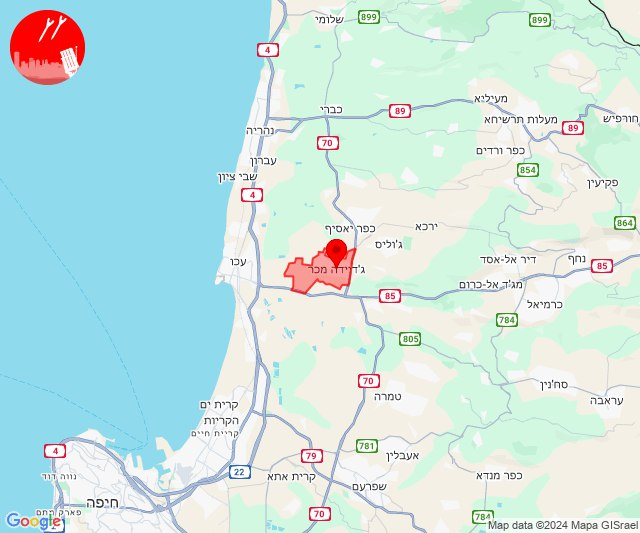

## 07:16

🔴 צבע אדום (27/10/2024):

09:15:
• קו העימות: מלכיה (מיידי)

09:16:
• קו העימות: דישון, אביבים, יראון (מיידי)

צופר - צבע אדום

## 07:16

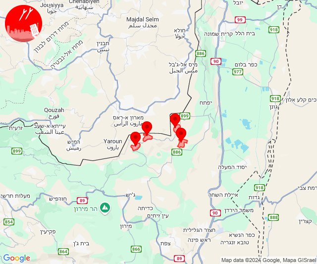

## 07:43

✈️ חדירת כלי טיס עוין (27/10/2024):

09:42:
• קו העימות: מנרה, קריית שמונה 

09:43:
• קו העימות: מרגליות 

צופר - צבע אדום

## 07:43

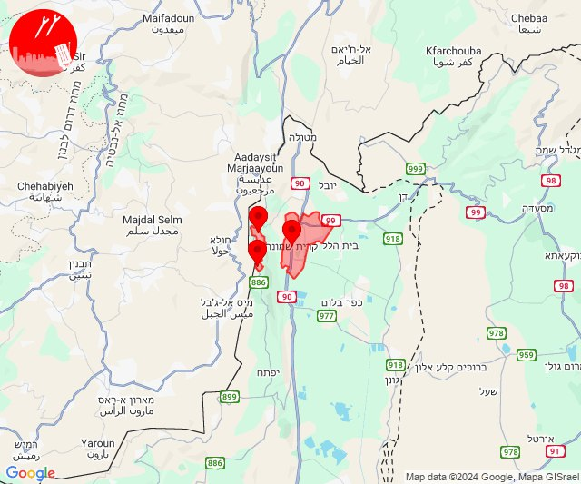

## 08:46

✈️ חדירת כלי טיס עוין (27/10/2024):

10:46:
• קו העימות: משגב עם 

צופר - צבע אדום

## 08:46

## 10:07

🔴 צבע אדום (27/10/2024):

12:07:
• קו העימות: מטולה (מיידי)

צופר - צבע אדום

## 10:07

## 10:14

🔴 צבע אדום (27/10/2024):

12:14:
• קו העימות: מטולה (מיידי)

צופר - צבע אדום

## 10:14

## 10:33

🔴 צבע אדום (27/10/2024):

12:31:
• מרכז הגליל: טמרה, כאבול, מצפה אבי''ב, שעב (דקה)
• גליל עליון: אזור תעשייה בר-לב, אחיהוד, מג'דל כרום, צורית גילון, פלך, טל - אל (דקה, 30 שניות)

12:32:
• מרכז הגליל: מנוף, שכניה, יודפת, רקפת, כאוכב אבו אלהיג'א, מורשת, עראבה, אבטליון, יעד, עצמון - שגב, לוטם וחמדון, מעלה צביה, אשבל, אשחר, סכנין (דקה)
• גליל עליון: מג'דל כרום, צורית גילון (30 שניות)

12:33:
• מרכז הגליל: חוסנייה (דקה)

צופר - צבע אדום

## 10:33

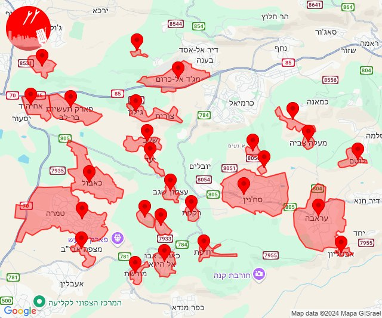

## 11:11

🔴 צבע אדום (27/10/2024):

13:11:
• קו העימות: קריית שמונה, כפר גלעדי, משגב עם, מרגליות (מיידי)

צופר - צבע אדום

## 11:11

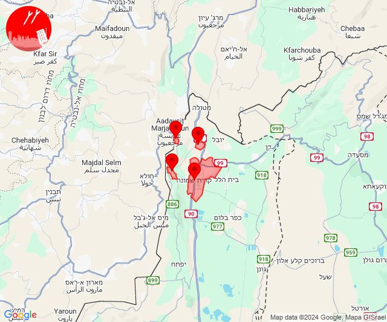

## 11:42

✈️ חדירת כלי טיס עוין (27/10/2024):

13:42:
• קו העימות: יערה, מצובה 

צופר - צבע אדום

## 11:42

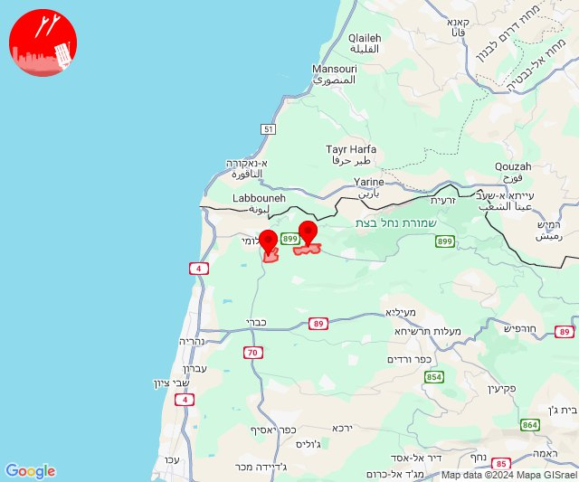

## 11:56

🔴 צבע אדום (27/10/2024):

13:56:
• קו העימות: מלכיה (מיידי)

צופר - צבע אדום

## 11:56

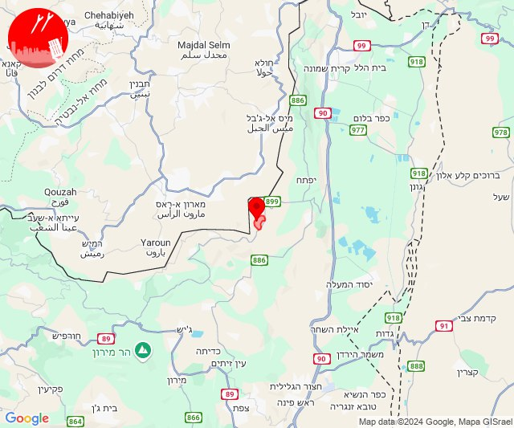

## 11:58

🔴 צבע אדום (27/10/2024):

13:58:
• קו העימות: קריית שמונה, כפר גלעדי, משגב עם, תל חי (מיידי)

צופר - צבע אדום

## 11:58

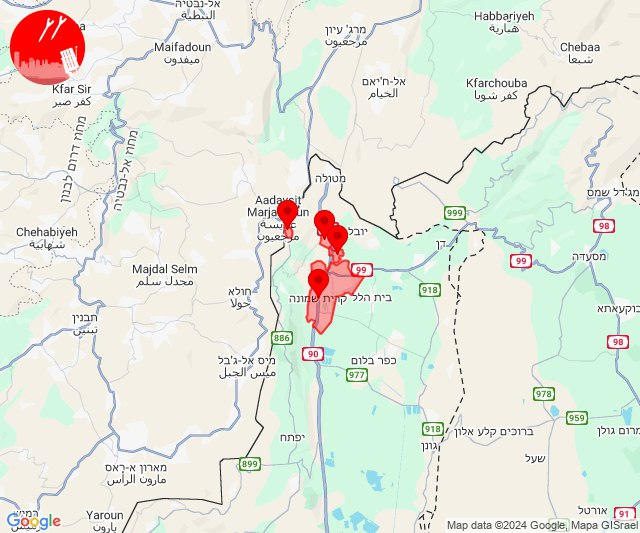

## 12:39

🔴 צבע אדום (27/10/2024):

14:37:
• קו העימות: נהריה, עברון, גשר הזיו, איזור תעשייה מילואות צפון, בצת, לימן, שלומי, סער (15 שניות, מיידי)

14:38:
• קו העימות: בן עמי, כברי, נהריה, גשר הזיו, סער (מיידי, 15 שניות)
• גליל עליון: מזרעה (30 שניות)

14:39:
• קו העימות: מעיין ברוך, כפר יובל (מיידי)

צופר - צבע אדום

## 12:39

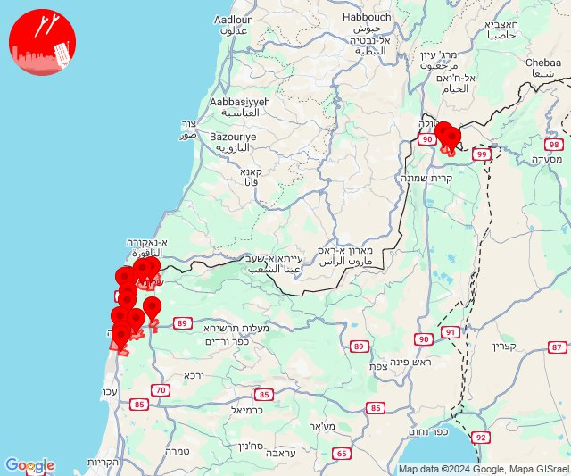

## 12:52

✈️ חדירת כלי טיס עוין (27/10/2024):

14:51:
• קו העימות: שלומי 

14:52:
• קו העימות: בצת 

צופר - צבע אדום

## 12:52

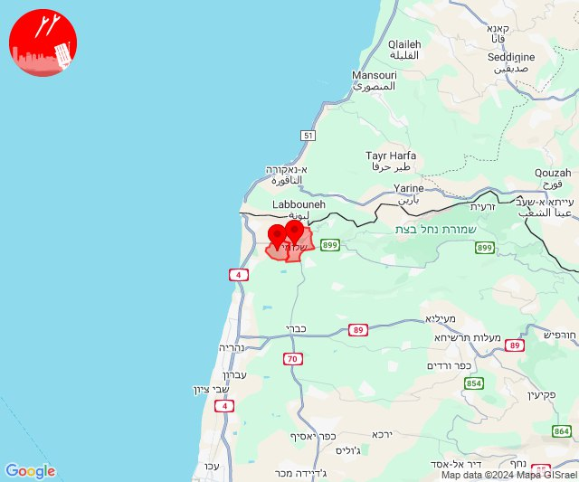

## 12:58

🔴 צבע אדום (27/10/2024):

14:58:
• קו העימות: מרגליות (מיידי)

צופר - צבע אדום

## 12:58

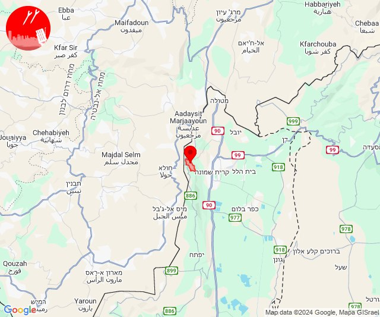

## 13:31

✈️ חדירת כלי טיס עוין (27/10/2024):

15:29:
• קו העימות: איזור תעשייה מילואות צפון, לימן 

15:30:
• קו העימות: נהריה, גשר הזיו, איזור תעשייה מילואות צפון 

15:31:
• קו העימות: נהריה 

צופר - צבע אדום

## 13:31

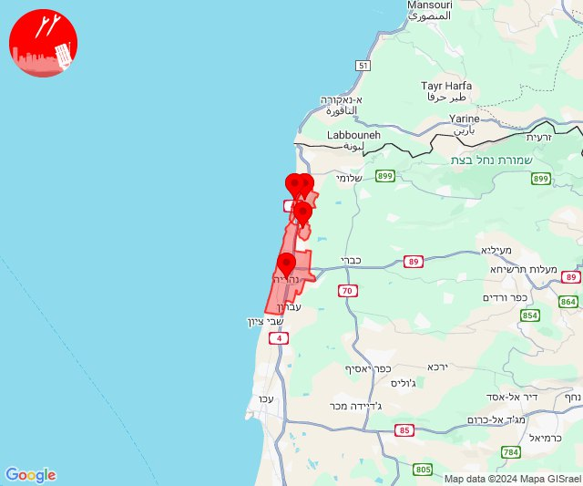

## 13:33

🔴 צבע אדום (27/10/2024):

15:33:
• קו העימות: נהריה, יראון (15 שניות, מיידי)

צופר - צבע אדום

## 13:33

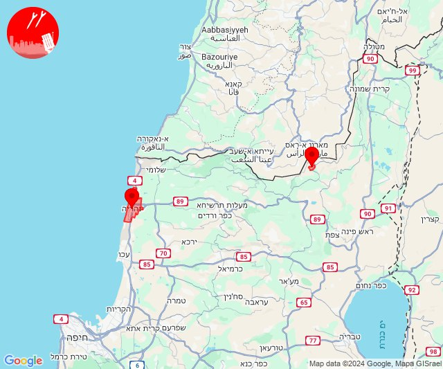

## 13:34

✈️ חדירת כלי טיס עוין (27/10/2024):

15:34:
• קו העימות: נהריה 
• גליל עליון: שבי ציון 

צופר - צבע אדום

## 13:34

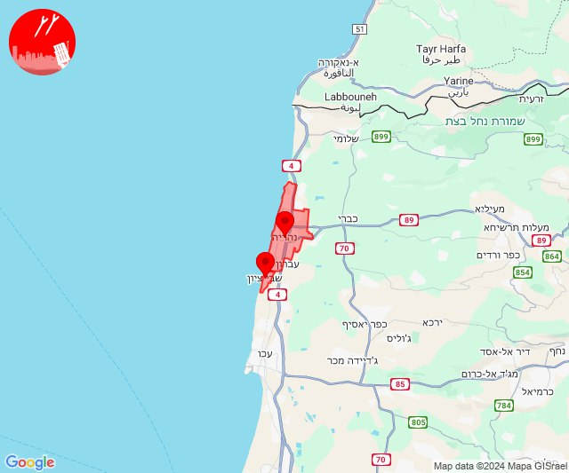

## 14:05

🔴 צבע אדום (27/10/2024):

16:04:
• קו העימות: מנרה (מיידי)

16:05:
• קו העימות: מנרה (מיידי)

צופר - צבע אדום

