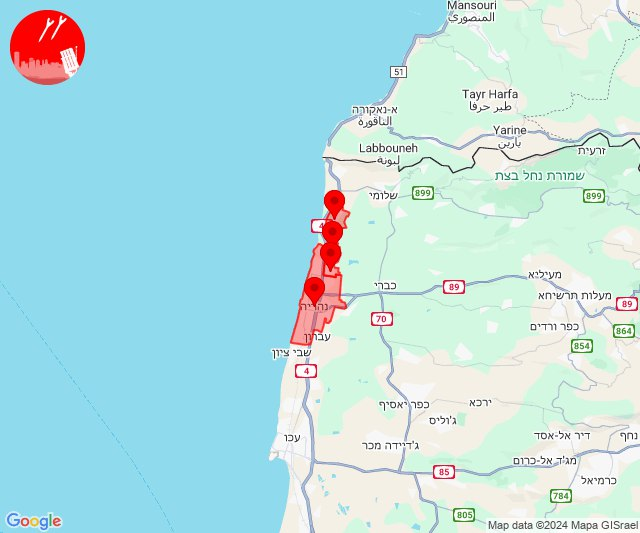
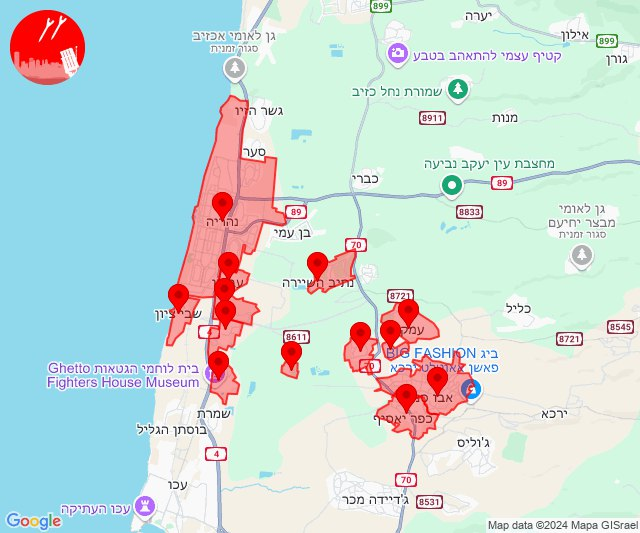

# Alerts for 2024-10-27

## 06:03

✈️ חדירת כלי טיס עוין (27/10/2024):

08:01:
• קו העימות: לימן 

08:02:
• קו העימות: גשר הזיו, נהריה, סער 

08:03:
• קו העימות: גשר הזיו, נהריה, סער 

צופר - צבע אדום

## 06:03

## 06:07

✈️ חדירת כלי טיס עוין (27/10/2024):

08:06:
• גליל עליון: נתיב השיירה, מזרעה, רגבה, נס עמים 
• קו העימות: עברון 

08:07:
• גליל עליון: בית העמק, אבו סנאן, אשרת, כפר יאסיף, עמקה, לוחמי הגטאות, מזרעה, רגבה, שבי ציון 
• קו העימות: נהריה, עברון 

צופר - צבע אדום

## 06:07

## 06:11

✈️ חדירת כלי טיס עוין (27/10/2024):

08:11:
• גליל עליון: ג'דידה מכר 

צופר - צבע אדום

