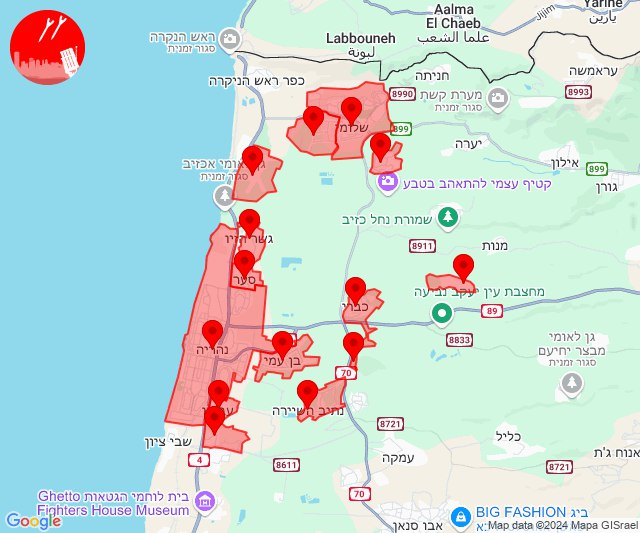
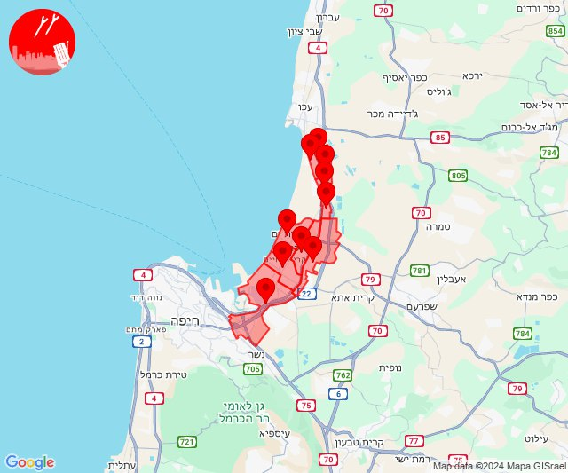
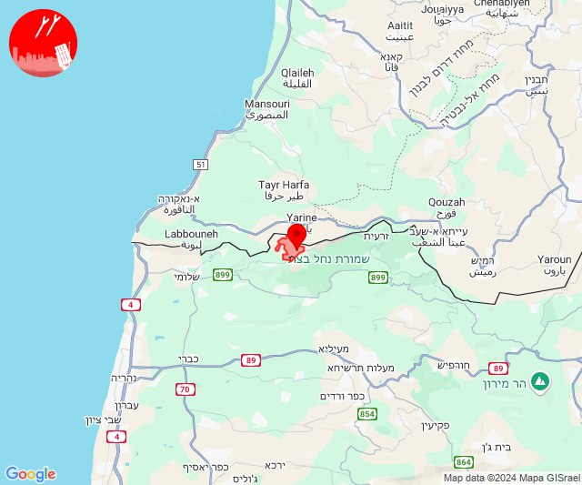
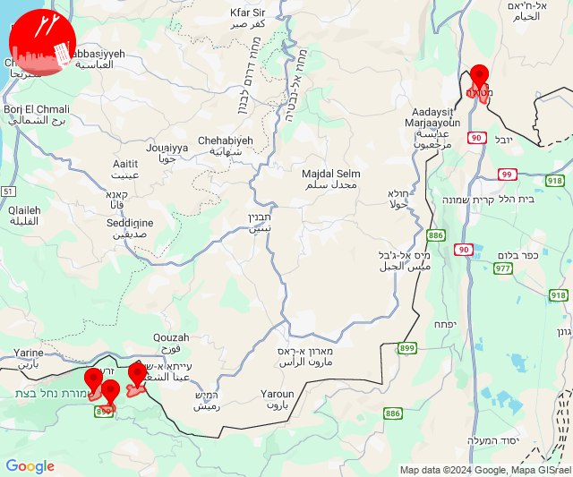
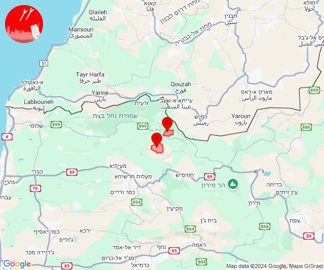
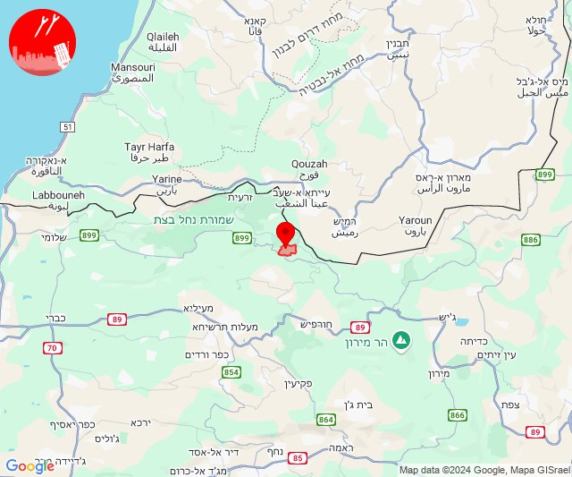
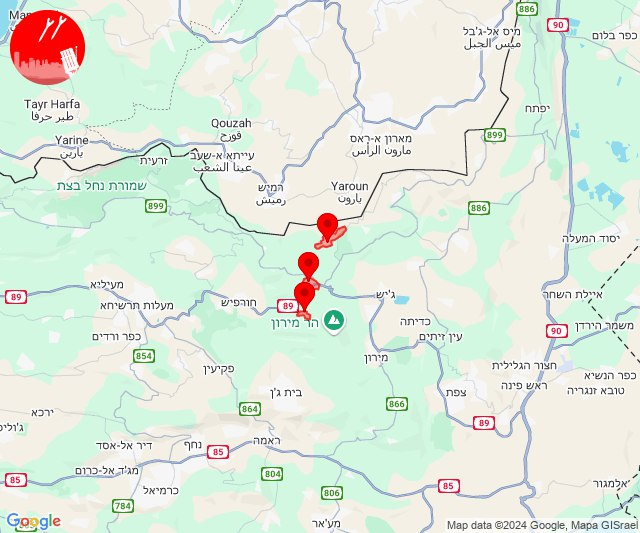
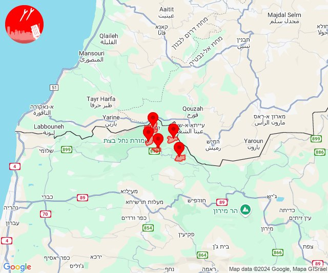
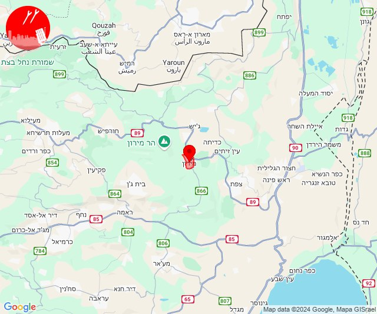

# Alerts for 2024-10-28

## 04:29

🔴 צבע אדום (28/10/2024):

06:29:
• קו העימות: מטולה (מיידי)

צופר - צבע אדום

## 04:29

## 04:41

🔴 צבע אדום (28/10/2024):

06:41:
• קו העימות: מטולה (מיידי)

צופר - צבע אדום

## 04:41

## 05:04

🔴 צבע אדום (28/10/2024):

07:04:
• קו העימות: מטולה (מיידי)

צופר - צבע אדום

## 05:04

## 05:13

🔴 צבע אדום (28/10/2024):

07:12:
• קו העימות: קריית שמונה (מיידי)

07:13:
• קו העימות: מרגליות, מנרה, בית הלל, תל חי, כפר סאלד, שדה נחמיה (מיידי, 15 שניות)

צופר - צבע אדום

## 05:13

## 05:26

✈️ חדירת כלי טיס עוין (28/10/2024):

07:26:
• קו העימות: חניתה, שלומי 

צופר - צבע אדום

## 05:26

## 05:28

## 05:30

✈️ חדירת כלי טיס עוין (28/10/2024):

07:28:
• קו העימות: ראש הנקרה, איזור תעשייה מילואות צפון, בצת, חוף בצת 

07:29:
• קו העימות: לימן, שלומי, איזור תעשייה מילואות צפון, בצת, חוף בצת, לימן, מצובה, ראש הנקרה, שלומי 

07:30:
• קו העימות: לימן, איזור תעשייה מילואות צפון 

צופר - צבע אדום

## 05:30

## 06:07

🔴 צבע אדום (28/10/2024):

08:07:
• קו העימות: מטולה (מיידי)

צופר - צבע אדום

## 06:07

## 08:12

🔴 צבע אדום (28/10/2024):

10:11:
• קו העימות: מטולה (מיידי)

10:12:
• קו העימות: מטולה (מיידי)

צופר - צבע אדום

## 08:12

## 10:55

🔴 צבע אדום (28/10/2024):

12:55:
• קו העימות: מנרה, קריית שמונה (מיידי)

צופר - צבע אדום

## 10:55

## 11:45

🔴 צבע אדום (28/10/2024):

13:45:
• קו העימות: משגב עם (מיידי)

צופר - צבע אדום

## 11:45

## 11:47

🔴 צבע אדום (28/10/2024):

13:47:
• קו העימות: מטולה, מטולה (מיידי)

צופר - צבע אדום

## 11:47

## 12:34

🔴 צבע אדום (28/10/2024):

14:33:
• קו העימות: בן עמי, נהריה, גשר הזיו, סער, כברי (מיידי, 15 שניות)
• גליל עליון: נתיב השיירה, מזרעה (30 שניות)

14:34:
• קו העימות: עברון, לימן, בן עמי, נהריה, בצת, מצובה, שלומי, גשר הזיו, סער, כברי, בית העלמין החדש נהריה, נווה זיו (15 שניות, מיידי, 30 שניות)
• גליל עליון: נתיב השיירה (30 שניות)

צופר - צבע אדום

## 12:34

## 13:14

🔴 צבע אדום (28/10/2024):

15:13:
• המפרץ: חיפה - קריית חיים ושמואל, קריית ביאליק, קריית ים, קריית מוצקין, אזור תעשייה קריית ביאליק (דקה)

15:14:
• המפרץ: חיפה - מפרץ (דקה)
• גליל עליון: אזור תעשייה שער נעמן, כפר מסריק, עין המפרץ, עכו - אזור תעשייה (דקה, 30 שניות)

צופר - צבע אדום

## 13:14

## 13:19

🔴 צבע אדום (28/10/2024):

15:19:
• קו העימות: ערב אל עראמשה (מיידי)

צופר - צבע אדום

## 13:19

## 13:39

🔴 צבע אדום (28/10/2024):

15:38:
• קו העימות: מטולה (מיידי)

15:39:
• קו העימות: אבן מנחם, שומרה, שתולה (מיידי)

צופר - צבע אדום

## 13:39

## 13:41

🔴 צבע אדום (28/10/2024):

15:41:
• קו העימות: נטועה, נטועה, פסוטה (מיידי)

צופר - צבע אדום

## 13:41

## 13:47

🔴 צבע אדום (28/10/2024):

15:47:
• קו העימות: מטולה (מיידי)

צופר - צבע אדום

## 13:47

## 13:51

🔴 צבע אדום (28/10/2024):

15:51:
• קו העימות: נטועה (מיידי)

צופר - צבע אדום

## 13:51

## 15:04

🔴 צבע אדום (28/10/2024):

17:04:
• קו העימות: בית ספר שדה מירון, סאסא, דוב''ב (מיידי)

צופר - צבע אדום

## 15:04

## 15:10

🔴 צבע אדום (28/10/2024):

17:09:
• קו העימות: שתולה, זרעית, שומרה (מיידי)

17:10:
• קו העימות: אבן מנחם, נטועה, זרעית, שומרה (מיידי)

צופר - צבע אדום

## 15:10

## 18:01

🔴 צבע אדום (28/10/2024):

20:01:
• גליל עליון: מירון (30 שניות)

צופר - צבע אדום

## 18:01

## 18:06

🔴 צבע אדום (28/10/2024):

20:05:
• קו העימות: מרגליות, קריית שמונה, מרגליות, ג'ש - גוש חלב, צבעון (מיידי)
• גליל עליון: בר יוחאי, ספסופה - כפר חושן (30 שניות)

20:06:
• גליל עליון: אור הגנוז (30 שניות)

צופר - צבע אדום

