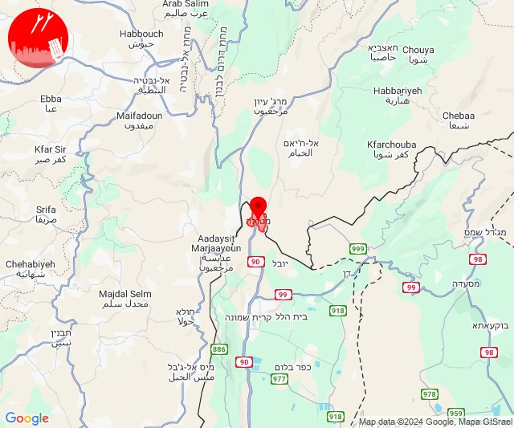
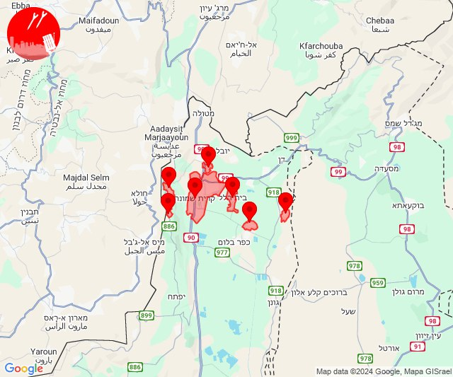
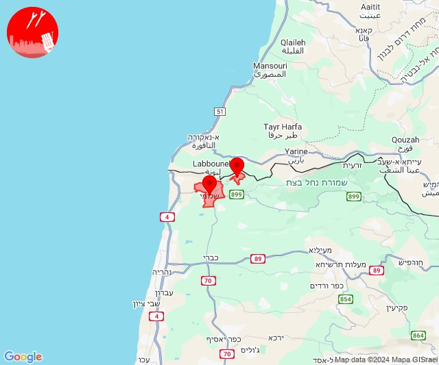
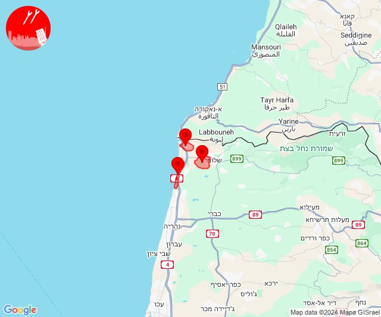
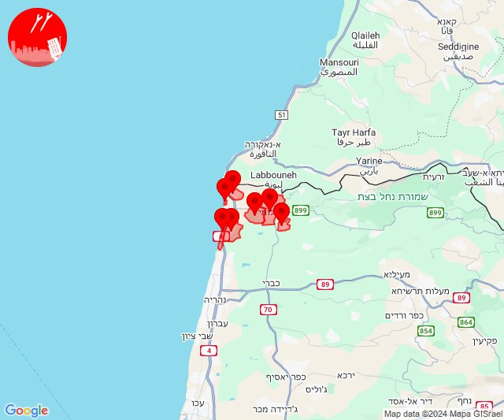
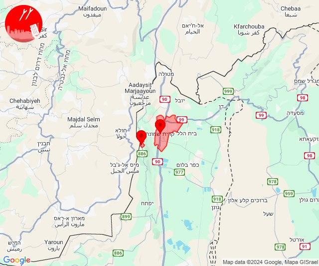

# Alerts for 2024-10-28

## 04:29

🔴 צבע אדום (28/10/2024):

06:29:
• קו העימות: מטולה (מיידי)

צופר - צבע אדום

## 04:29

## 04:41

🔴 צבע אדום (28/10/2024):

06:41:
• קו העימות: מטולה (מיידי)

צופר - צבע אדום

## 04:41

## 05:04

🔴 צבע אדום (28/10/2024):

07:04:
• קו העימות: מטולה (מיידי)

צופר - צבע אדום

## 05:04

## 05:13

🔴 צבע אדום (28/10/2024):

07:12:
• קו העימות: קריית שמונה (מיידי)

07:13:
• קו העימות: מרגליות, מנרה, בית הלל, תל חי, כפר סאלד, שדה נחמיה (מיידי, 15 שניות)

צופר - צבע אדום

## 05:13

## 05:26

✈️ חדירת כלי טיס עוין (28/10/2024):

07:26:
• קו העימות: חניתה, שלומי 

צופר - צבע אדום

## 05:26

## 05:28

## 05:30

✈️ חדירת כלי טיס עוין (28/10/2024):

07:28:
• קו העימות: ראש הנקרה, איזור תעשייה מילואות צפון, בצת, חוף בצת 

07:29:
• קו העימות: לימן, שלומי, איזור תעשייה מילואות צפון, בצת, חוף בצת, לימן, מצובה, ראש הנקרה, שלומי 

07:30:
• קו העימות: לימן, איזור תעשייה מילואות צפון 

צופר - צבע אדום

## 05:30

## 06:07

🔴 צבע אדום (28/10/2024):

08:07:
• קו העימות: מטולה (מיידי)

צופר - צבע אדום

## 06:07

## 08:12

🔴 צבע אדום (28/10/2024):

10:11:
• קו העימות: מטולה (מיידי)

10:12:
• קו העימות: מטולה (מיידי)

צופר - צבע אדום

## 08:12

## 10:55

🔴 צבע אדום (28/10/2024):

12:55:
• קו העימות: מנרה, קריית שמונה (מיידי)

צופר - צבע אדום

## 10:55

## 11:45

🔴 צבע אדום (28/10/2024):

13:45:
• קו העימות: משגב עם (מיידי)

צופר - צבע אדום

