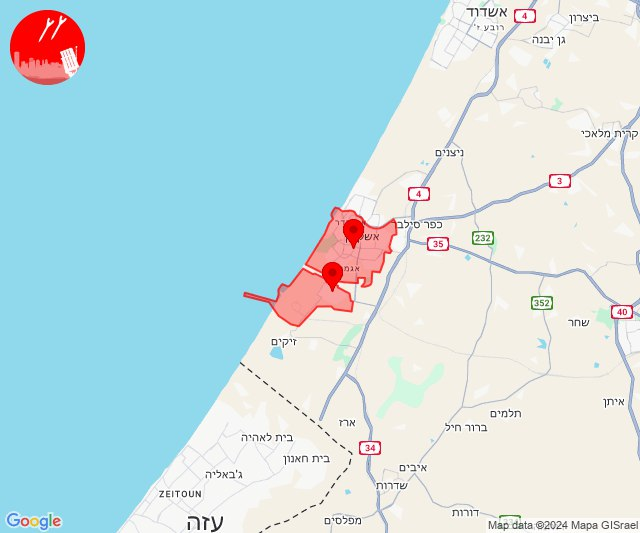
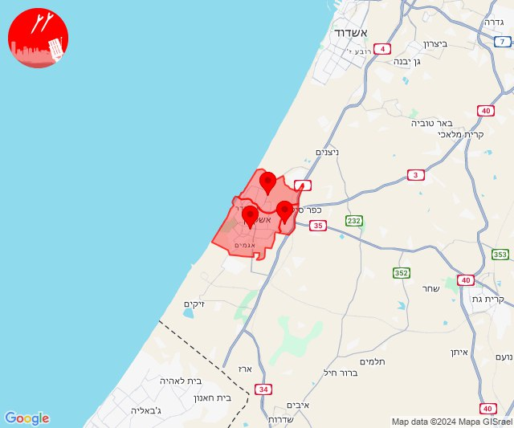
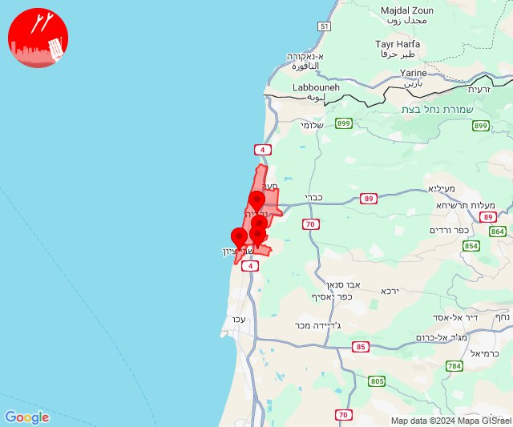
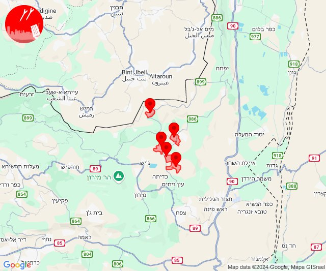

# Alerts for 2024-10-29

## 04:39

✈️ חדירת כלי טיס עוין (29/10/2024):

06:39:
• מערב לכיש: אזור תעשייה הדרומי אשקלון, אשקלון - דרום 

צופר - צבע אדום

## 04:39

## 04:42

✈️ חדירת כלי טיס עוין (29/10/2024):

06:41:
• מערב לכיש: אשקלון - צפון 

06:42:
• מערב לכיש: אשקלון - דרום, אשקלון - צפון, אזור תעשייה צפוני אשקלון 

צופר - צבע אדום

## 04:42

## 05:09

✈️ חדירת כלי טיס עוין (29/10/2024):

07:09:
• קו העימות: נהריה, עברון 
• גליל עליון: מזרעה, שבי ציון 

צופר - צבע אדום

## 05:09

## 05:52

✈️ חדירת כלי טיס עוין (29/10/2024):

07:50:
• קו העימות: קיבוץ דן 

07:51:
• קו העימות: דפנה, שאר ישוב, הגושרים 

07:52:
• קו העימות: כפר סאלד 

צופר - צבע אדום

## 05:52

## 05:52

🔴 צבע אדום (29/10/2024):

07:52:
• קו העימות: אזור תעשייה רמת דלתון, דלתון, כרם בן זמרה, יראון, ריחאנייה (מיידי)

צופר - צבע אדום

## 05:52

## 06:54

✈️ חדירת כלי טיס עוין (29/10/2024):

08:54:
• קו העימות: בית הלל, כפר גלעדי, כפר יובל, מטולה, מנרה, מעיין ברוך, מרגליות, משגב עם, קריית שמונה, תל חי 

צופר - צבע אדום

## 06:54

## 06:56

✈️ חדירת כלי טיס עוין (29/10/2024):

08:56:
• קו העימות: בית הלל 

צופר - צבע אדום

