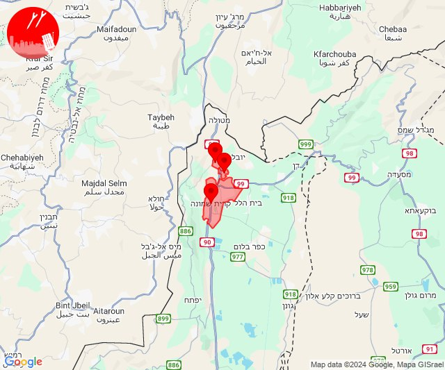
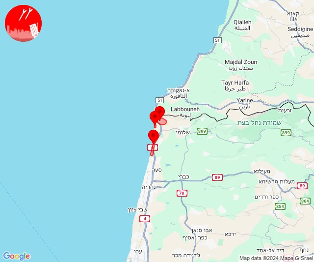
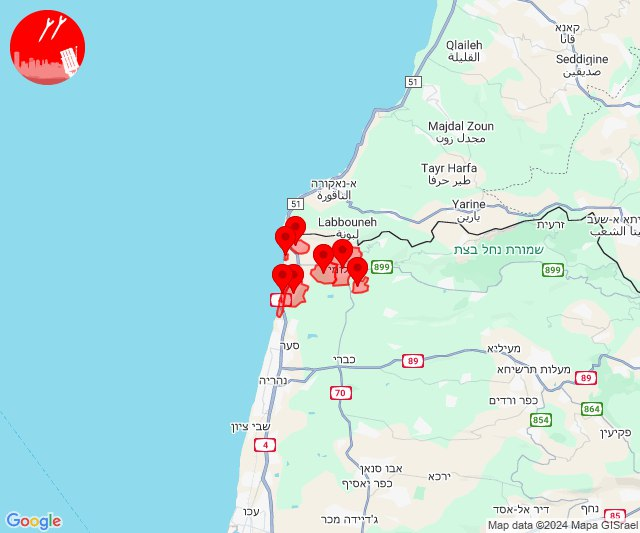
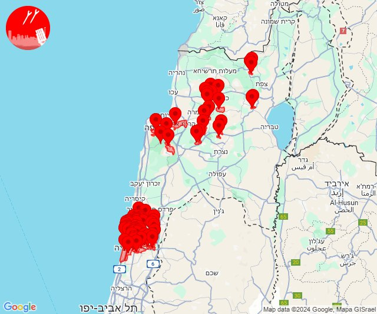
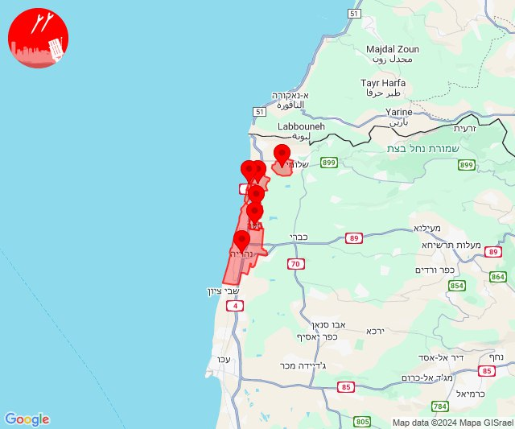
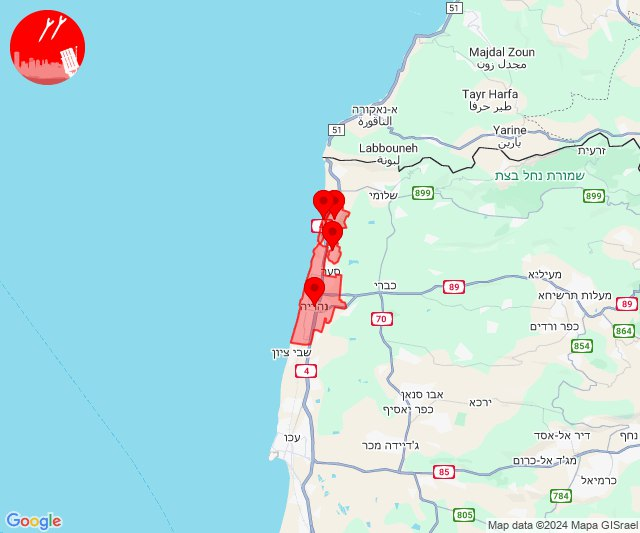

# Alerts for 2024-10-30

## 00:44

🔴 צבע אדום (30/10/2024):

02:44:
• קו העימות: כפר גלעדי, קריית שמונה, תל חי (מיידי)

צופר - צבע אדום

## 00:44

## 03:14

✈️ חדירת כלי טיס עוין (30/10/2024):

05:13:
• קו העימות: ראש הנקרה, חוף בצת 

05:14:
• קו העימות: איזור תעשייה מילואות צפון 

צופר - צבע אדום

## 03:14

## 03:40

✈️ חדירת כלי טיס עוין (30/10/2024):

05:39:
• קו העימות: איזור תעשייה מילואות צפון, בצת, חוף בצת, לימן, מצובה, ראש הנקרה, שלומי 

05:40:
• קו העימות: איזור תעשייה מילואות צפון, חוף בצת, ראש הנקרה, לימן, בצת 

צופר - צבע אדום

## 03:40

## 04:20

🔴 צבע אדום (30/10/2024):

06:17:
• מנשה: חדרה - מזרח, חדרה - מרכז, שדה יצחק (דקה וחצי)
• שרון: אזור תעשייה עמק חפר, אחיטוב, אליכין, אלישיב, אמץ, בארותיים, בורגתה, בית הלוי, בית חזון, בית יצחק - שער חפר, גאולי תימן, גבעת חיים איחוד, גבעת חיים מאוחד, גבעת שפירא, גן יאשיה, הדר עם, המעפיל, המרכז האקדמי רופין, העוגן, חגלה, חופית, חיבת ציון, חניאל, חרב לאת, כפר הרא''ה, כפר ויתקין, כפר חיים, כפר ידידיה, כפר יונה, כפר מונש, מעברות, משמר השרון, עולש, עין החורש, אביחיל, נתניה - מזרח, נתניה - מערב, שושנת העמקים, פרדסיה, אזור תעשייה כפר יונה, בית חרות, בית ינאי, ביתן אהרן, בת חן, גנות הדר, חבצלת השרון וצוקי ים, נורדיה, נעורים (דקה וחצי)
• גליל עליון: כרמיאל, מג'דל כרום, צורית גילון (30 שניות)

06:18:
• מרכז הגליל: יעד, שורשים, שעב, רומת אל הייב, ביר אלמכסור, דמיידה, בית סוהר צלמון, כלנית (דקה)
• העמקים: הושעיה (דקה)

06:19:
• העמקים: בית לחם הגלילית, חג'אג'רה (דקה)
• המפרץ: קריית אתא (דקה)
• מרכז הגליל: סכנין, כאוכב אבו אלהיג'א (דקה)

06:20:
• המפרץ: חיפה - נווה שאנן ורמות כרמל, נשר (דקה)
• הכרמל: עספיא, כלא דמון (דקה)
• גליל עליון: אור הגנוז, ספסופה - כפר חושן (30 שניות)
• קו העימות: ג'ש - גוש חלב (מיידי)

צופר - צבע אדום

## 04:20

## 06:04

✈️ חדירת כלי טיס עוין (30/10/2024):

08:02:
• קו העימות: איזור תעשייה מילואות צפון, בצת, לימן 

08:03:
• קו העימות: גשר הזיו, לימן, איזור תעשייה מילואות צפון, נהריה 

08:04:
• קו העימות: סער 

צופר - צבע אדום

## 06:04

## 06:10

✈️ חדירת כלי טיס עוין (30/10/2024):

08:10:
• קו העימות: ראש הנקרה, חוף בצת, איזור תעשייה מילואות צפון, בצת, לימן, מצובה, שלומי 

צופר - צבע אדום

## 06:10

## 06:12

✈️ חדירת כלי טיס עוין (30/10/2024):

08:12:
• קו העימות: איזור תעשייה מילואות צפון, לימן, גשר הזיו, נהריה 

צופר - צבע אדום

## 06:12

## 06:19

✈️ חדירת כלי טיס עוין (30/10/2024):

08:19:
• קו העימות: איזור תעשייה מילואות צפון, בצת, לימן, חוף בצת, ראש הנקרה 

צופר - צבע אדום

