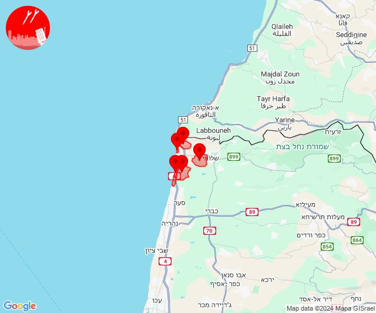
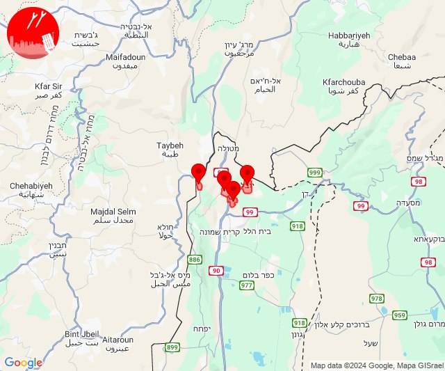
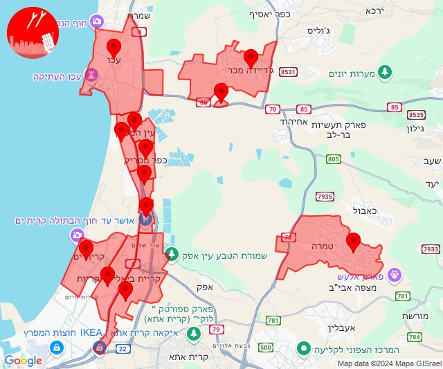
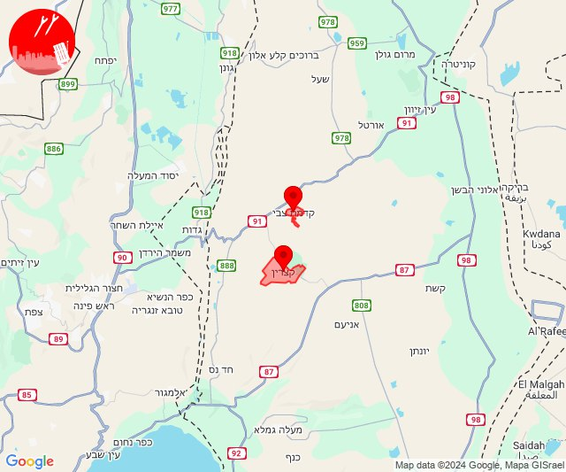
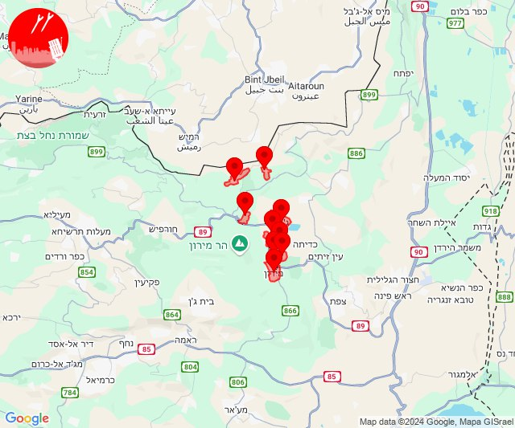
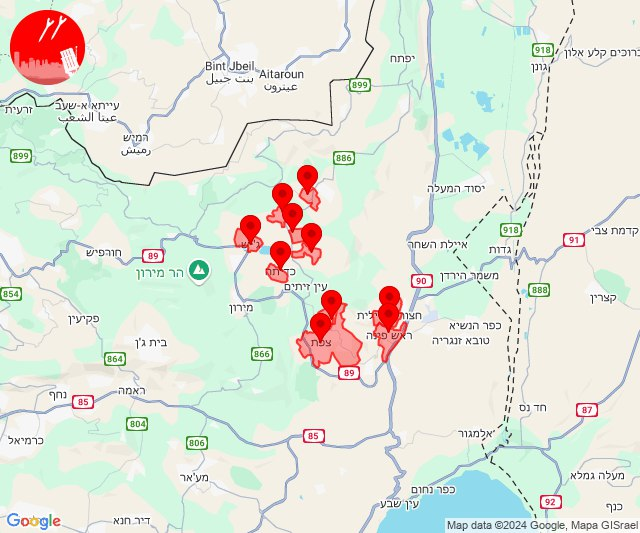
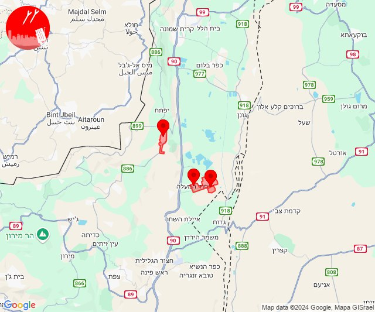
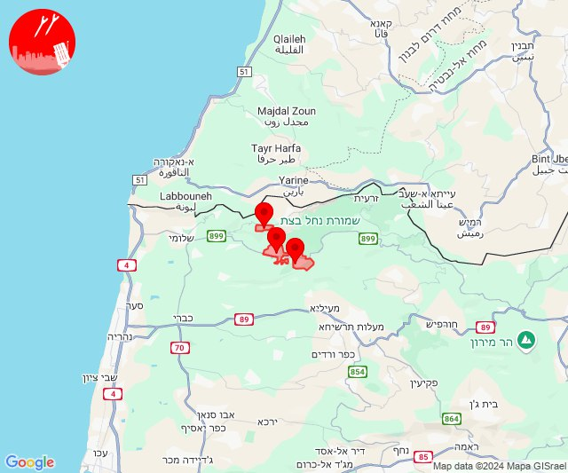
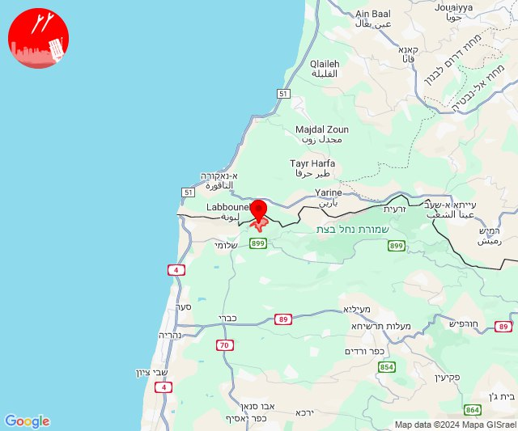

# Alerts for 2024-10-30

## 00:44

🔴 צבע אדום (30/10/2024):

02:44:
• קו העימות: כפר גלעדי, קריית שמונה, תל חי (מיידי)

צופר - צבע אדום

## 00:44

## 03:14

✈️ חדירת כלי טיס עוין (30/10/2024):

05:13:
• קו העימות: ראש הנקרה, חוף בצת 

05:14:
• קו העימות: איזור תעשייה מילואות צפון 

צופר - צבע אדום

## 03:14

## 03:40

✈️ חדירת כלי טיס עוין (30/10/2024):

05:39:
• קו העימות: איזור תעשייה מילואות צפון, בצת, חוף בצת, לימן, מצובה, ראש הנקרה, שלומי 

05:40:
• קו העימות: איזור תעשייה מילואות צפון, חוף בצת, ראש הנקרה, לימן, בצת 

צופר - צבע אדום

## 03:40

## 04:20

🔴 צבע אדום (30/10/2024):

06:17:
• מנשה: חדרה - מזרח, חדרה - מרכז, שדה יצחק (דקה וחצי)
• שרון: אזור תעשייה עמק חפר, אחיטוב, אליכין, אלישיב, אמץ, בארותיים, בורגתה, בית הלוי, בית חזון, בית יצחק - שער חפר, גאולי תימן, גבעת חיים איחוד, גבעת חיים מאוחד, גבעת שפירא, גן יאשיה, הדר עם, המעפיל, המרכז האקדמי רופין, העוגן, חגלה, חופית, חיבת ציון, חניאל, חרב לאת, כפר הרא''ה, כפר ויתקין, כפר חיים, כפר ידידיה, כפר יונה, כפר מונש, מעברות, משמר השרון, עולש, עין החורש, אביחיל, נתניה - מזרח, נתניה - מערב, שושנת העמקים, פרדסיה, אזור תעשייה כפר יונה, בית חרות, בית ינאי, ביתן אהרן, בת חן, גנות הדר, חבצלת השרון וצוקי ים, נורדיה, נעורים (דקה וחצי)
• גליל עליון: כרמיאל, מג'דל כרום, צורית גילון (30 שניות)

06:18:
• מרכז הגליל: יעד, שורשים, שעב, רומת אל הייב, ביר אלמכסור, דמיידה, בית סוהר צלמון, כלנית (דקה)
• העמקים: הושעיה (דקה)

06:19:
• העמקים: בית לחם הגלילית, חג'אג'רה (דקה)
• המפרץ: קריית אתא (דקה)
• מרכז הגליל: סכנין, כאוכב אבו אלהיג'א (דקה)

06:20:
• המפרץ: חיפה - נווה שאנן ורמות כרמל, נשר (דקה)
• הכרמל: עספיא, כלא דמון (דקה)
• גליל עליון: אור הגנוז, ספסופה - כפר חושן (30 שניות)
• קו העימות: ג'ש - גוש חלב (מיידי)

צופר - צבע אדום

## 04:20

## 06:04

✈️ חדירת כלי טיס עוין (30/10/2024):

08:02:
• קו העימות: איזור תעשייה מילואות צפון, בצת, לימן 

08:03:
• קו העימות: גשר הזיו, לימן, איזור תעשייה מילואות צפון, נהריה 

08:04:
• קו העימות: סער 

צופר - צבע אדום

## 06:04

## 06:10

✈️ חדירת כלי טיס עוין (30/10/2024):

08:10:
• קו העימות: ראש הנקרה, חוף בצת, איזור תעשייה מילואות צפון, בצת, לימן, מצובה, שלומי 

צופר - צבע אדום

## 06:10

## 06:12

✈️ חדירת כלי טיס עוין (30/10/2024):

08:12:
• קו העימות: איזור תעשייה מילואות צפון, לימן, גשר הזיו, נהריה 

צופר - צבע אדום

## 06:12

## 06:19

✈️ חדירת כלי טיס עוין (30/10/2024):

08:19:
• קו העימות: איזור תעשייה מילואות צפון, בצת, לימן, חוף בצת, ראש הנקרה 

צופר - צבע אדום

## 06:19

## 06:55

🔴 צבע אדום (30/10/2024):

08:55:
• קו העימות: משגב עם, כפר גלעדי, כפר יובל, תל חי (מיידי)

צופר - צבע אדום

## 06:55

## 07:46

🔴 צבע אדום (30/10/2024):

09:46:
• קו העימות: מטולה (מיידי)

צופר - צבע אדום

## 07:46

## 11:24

🔴 צבע אדום (30/10/2024):

13:22:
• גליל עליון: אזור תעשייה שער נעמן (דקה)
• המפרץ: אזור תעשייה קריית ביאליק (דקה)

13:23:
• המפרץ: קריית ביאליק, קריית ים, קריית מוצקין (דקה)
• מרכז הגליל: טמרה (דקה)
• גליל עליון: כפר מסריק, עכו - אזור תעשייה, ג'דידה מכר, עין המפרץ, עכו, בית העלמין החדש עכו (30 שניות)

13:24:
• גליל עליון: כפר מסריק, עכו - אזור תעשייה (30 שניות)

צופר - צבע אדום

## 11:24

## 12:52

🔴 צבע אדום (30/10/2024):

14:52:
• דרום הגולן: קצרין, קדמת צבי (30 שניות, 15 שניות)

צופר - צבע אדום

## 12:52

## 13:01

🔴 צבע אדום (30/10/2024):

15:00:
• קו העימות: דוב''ב, צבעון, ג'ש - גוש חלב, ברעם, דוב''ב (מיידי)
• גליל עליון: אור הגנוז, בר יוחאי, מירון, מרכז אזורי מרום גליל, ספסופה - כפר חושן (30 שניות)

15:01:
• גליל עליון: אור הגנוז, בר יוחאי, מירון, מרכז אזורי מרום גליל, ספסופה - כפר חושן (30 שניות)
• קו העימות: צבעון, ברעם, ג'ש - גוש חלב (מיידי)

צופר - צבע אדום

## 13:01

## 13:18

🔴 צבע אדום (30/10/2024):

15:18:
• גליל עליון: ביריה, צפת - עיר, חצור הגלילית, ראש פינה, קדיתא (30 שניות)
• קו העימות: אזור תעשייה רמת דלתון, ג'ש - גוש חלב, דלתון, כרם בן זמרה, ריחאנייה (מיידי)

צופר - צבע אדום

## 13:18

## 14:18

🔴 צבע אדום (30/10/2024):

16:17:
• גליל עליון: יסוד המעלה (30 שניות)

16:18:
• גליל עליון: חולתה (30 שניות)
• קו העימות: רמות נפתלי (מיידי)

צופר - צבע אדום

## 14:18

## 14:39

🔴 צבע אדום (30/10/2024):

16:39:
• קו העימות: מטולה (מיידי)

צופר - צבע אדום

## 14:39

## 15:24

🔴 צבע אדום (30/10/2024):

17:23:
• קו העימות: אילון, גורן (מיידי)

17:24:
• קו העימות: אדמית (מיידי)

צופר - צבע אדום

## 15:24

## 15:26

🔴 צבע אדום (30/10/2024):

17:26:
• קו העימות: חניתה (מיידי)

צופר - צבע אדום

## 15:26

## 15:29

🔴 צבע אדום (30/10/2024):

17:29:
• קו העימות: חניתה (מיידי)

צופר - צבע אדום

## 15:29

## 15:40

✈️ חדירת כלי טיס עוין (30/10/2024):

17:21:
• קו העימות: איזור תעשייה מילואות צפון, לימן 

17:22:
• קו העימות: גשר הזיו, נהריה, איזור תעשייה מילואות צפון, לימן, סער 

17:23:
• קו העימות: ערב אל עראמשה 

17:24:
• קו העימות: בן עמי, נהריה, ערב אל עראמשה, עברון, אדמית 

17:25:
• גליל עליון: מזרעה, רגבה 
• קו העימות: נהריה, יערה 

17:26:
• גליל עליון: מזרעה, נס עמים, לוחמי הגטאות, שומרת 

17:27:
• גליל עליון: בוסתן הגליל, לוחמי הגטאות, עכו 

17:28:
• גליל עליון: ג'דידה מכר 

17:29:
• גליל עליון: עכו, עין המפרץ, עכו - אזור תעשייה, ג'דידה מכר, יסעור, בית העלמין החדש עכו, אחיהוד, ג'וליס, טל - אל, ירכא, כפר יאסיף, אזור תעשייה בר-לב, אבו סנאן 
• קו העימות: מצובה, שלומי, יערה 

17:30:
• קו העימות: בצת, מצובה 

17:31:
• גליל עליון: אזור תעשייה שער נעמן, כפר מסריק 
• המפרץ: אזור תעשייה קריית ביאליק, קריית ביאליק, קריית מוצקין 
• קו העימות: שלומי, לימן 

17:32:
• המפרץ: קריית ים 
• קו העימות: גשר הזיו, איזור תעשייה מילואות צפון, נהריה, סער 

17:33:
• קו העימות: גשר הזיו, נהריה, סער 
• המפרץ: קריית ביאליק 

17:34:
• המפרץ: חיפה - קריית חיים ושמואל, כפר ביאליק, קריית מוצקין, חיפה - מפרץ, קריית אתא 
• קו העימות: בן עמי, נהריה 

17:35:
• קו העימות: עברון 

17:36:
• המפרץ: נשר 
• קו העימות: נהריה, עברון 
• גליל עליון: שבי ציון, מזרעה, רגבה 

17:37:
• המפרץ: חיפה - מפרץ 
• גליל עליון: לוחמי הגטאות, רגבה 

17:38:
• גליל עליון: בוסתן הגליל, שומרת, עכו 
• המפרץ: כפר חסידים, רכסים, יגור 

17:39:
• הכרמל: בית סוהר קישון 
• העמקים: שער העמקים 

17:40:
• העמקים: קריית טבעון - בית זייד, אורנים 

צופר - צבע אדום

