# Alerts for 2024-10-31

## 00:07

🔴 צבע אדום (31/10/2024):

02:07:
• קו העימות: סאסא (מיידי)

צופר - צבע אדום

## 00:07

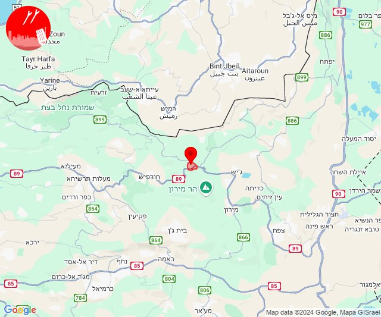

## 02:21

✈️ חדירת כלי טיס עוין (31/10/2024):

04:19:
• קו העימות: ראש הנקרה, חוף בצת 

04:20:
• קו העימות: איזור תעשייה מילואות צפון 

04:21:
• קו העימות: לימן, איזור תעשייה מילואות צפון, נהריה 

צופר - צבע אדום

## 02:21

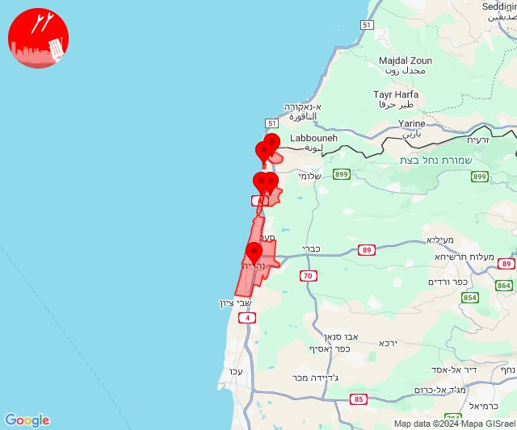

## 02:26

✈️ חדירת כלי טיס עוין (31/10/2024):

04:23:
• קו העימות: נהריה 

04:24:
• גליל עליון: שבי ציון 

04:25:
• גליל עליון: בוסתן הגליל 

04:26:
• גליל עליון: עכו 

צופר - צבע אדום

## 02:26

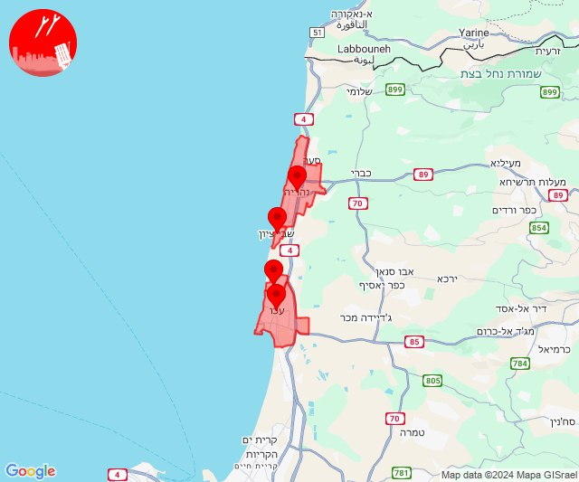

## 05:41

🔴 צבע אדום (31/10/2024):

07:41:
• קו העימות: אזור תעשייה רמת דלתון, כרם בן זמרה (מיידי)

צופר - צבע אדום

## 05:41

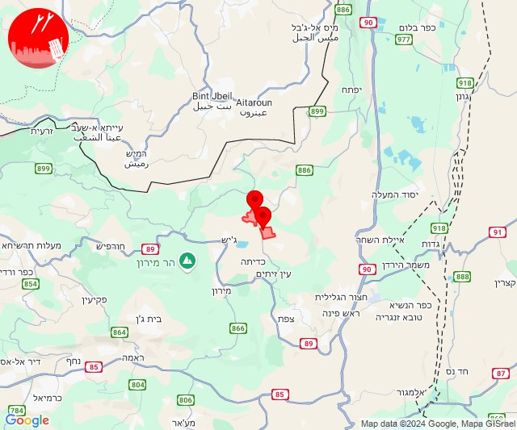

## 09:02

✈️ חדירת כלי טיס עוין (31/10/2024):

11:00:
• צפון הגולן: מג'דל שמס 

11:01:
• צפון הגולן: מסעדה, בוקעתא 

11:02:
• צפון הגולן: אל רום 

צופר - צבע אדום

## 09:02

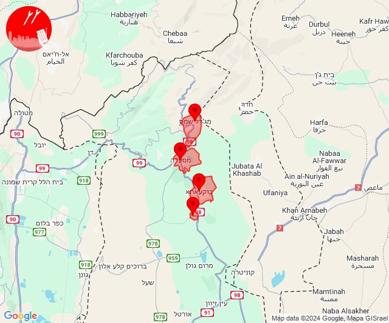

## 09:37

🔴 צבע אדום (31/10/2024):

11:37:
• קו העימות: מטולה (מיידי)

צופר - צבע אדום

## 09:37

## 10:23

🔴 צבע אדום (31/10/2024):

12:21:
• מרכז הגליל: אשחר, חוסנייה, ערב אל נעים, אשבל, סכנין, מעלה צביה, עראבה (דקה, 30 שניות)
• גליל עליון: מכמנים, אזור תעשייה כרמיאל, נחף, כסרא סמיע, כרמיאל (30 שניות)
• קו העימות: אבן מנחם, שתולה, חוסן, מעלות תרשיחא, חורפיש, פקיעין החדשה, פקיעין, צוריאל (מיידי, 15 שניות)

12:22:
• גליל עליון: כמון, הר חלוץ, בענה, דיר אל-אסד, לבון, חרשים, סאג'ור, מג'דל כרום, כישור, נחף, אזור תעשייה כרמיאל, כרמיאל (30 שניות)
• קו העימות: אלקוש (מיידי)

12:23:
• גליל עליון: הר חלוץ, לבון, כסרא סמיע, חרשים, נחף (30 שניות)
• קו העימות: פקיעין (15 שניות)

צופר - צבע אדום

## 10:23

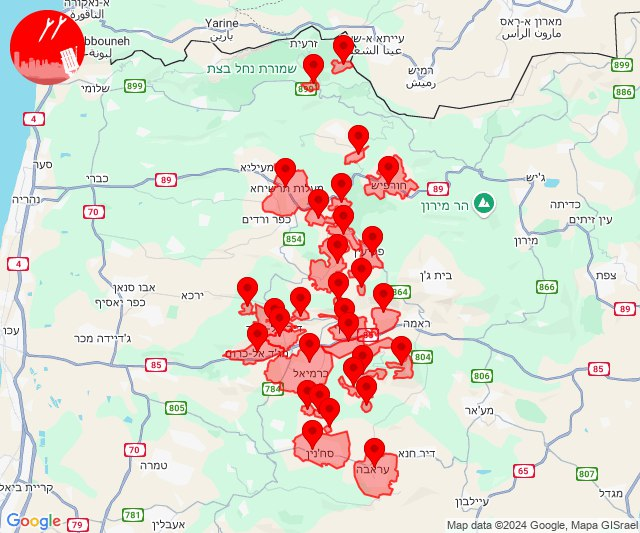

## 13:13

🔴 צבע אדום (31/10/2024):

15:12:
• קו העימות: ערב אל עראמשה (מיידי)
• המפרץ: קריית אתא, אושה, רמת יוחנן, כפר המכבי, קריית ביאליק, חיפה - קריית חיים ושמואל, קריית ים, קריית מוצקין, כפר ביאליק (דקה)
• גליל עליון: אפק (דקה)
• מרכז הגליל: שפרעם, אזור תעשייה טמרה, טמרה, אעבלין (דקה)

15:13:
• המפרץ: אזור תעשייה קריית ביאליק (דקה)

צופר - צבע אדום

## 13:13

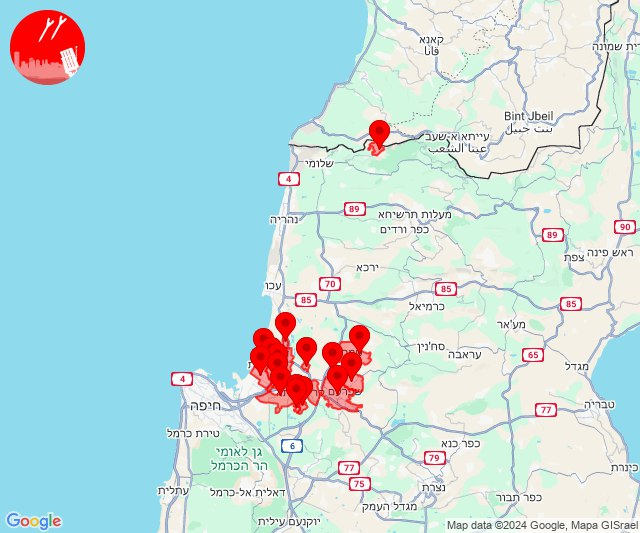

## 13:18

🔴 צבע אדום (31/10/2024):

15:18:
• קו העימות: אבן מנחם, זרעית, שומרה, שתולה (מיידי)

צופר - צבע אדום

## 13:18

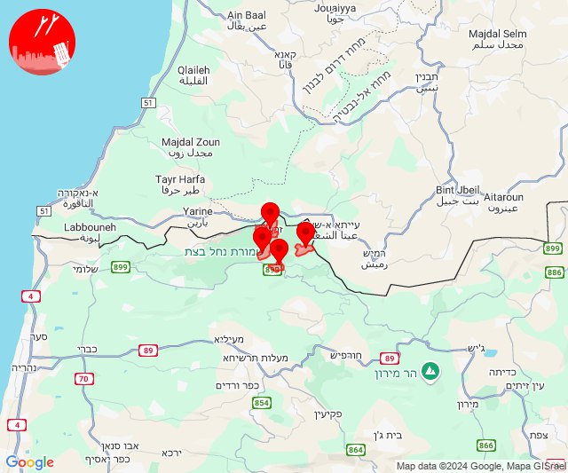

## 13:44

🔴 צבע אדום (31/10/2024):

15:44:
• קו העימות: אביבים (מיידי)

צופר - צבע אדום

## 13:44

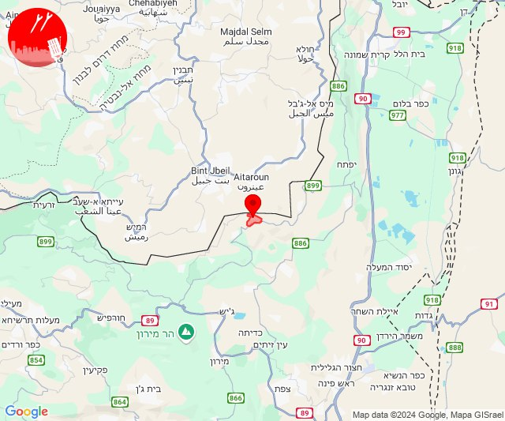

## 14:20

🔴 צבע אדום (31/10/2024):

16:19:
• גליל עליון: פלך, ירכא, כישור, תובל, ג'וליס, אבו סנאן (30 שניות)

16:20:
• גליל עליון: דיר אל-אסד, בענה, כרמיאל, מג'דל כרום, בית העמק, אשרת, עמקה, ינוח ג'ת, ירכא, פלך, גיתה, לפידות, מגדל תפן, כליל (30 שניות)
• קו העימות: כפר ורדים, געתון, יחיעם (15 שניות)

צופר - צבע אדום

## 14:20

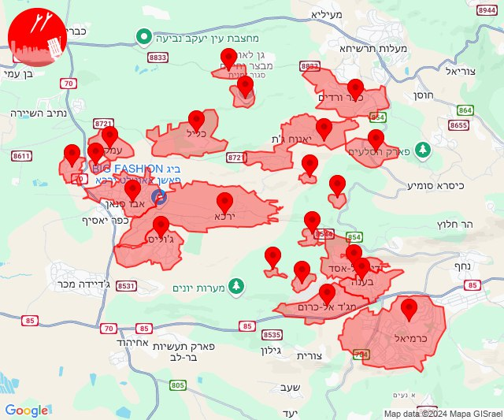

## 15:04

🔴 צבע אדום (31/10/2024):

17:04:
• קו העימות: מרגליות (מיידי)

צופר - צבע אדום

## 15:04

## 16:04

🔴 צבע אדום (31/10/2024):

18:04:
• קו העימות: יראון (מיידי)

צופר - צבע אדום

## 16:04

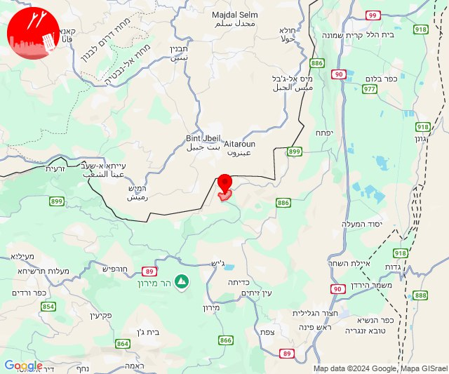

## 19:13

🔴 צבע אדום (31/10/2024):

21:13:
• קו העימות: אביבים, יראון (מיידי)

צופר - צבע אדום

## 19:13

## 19:15

🔴 צבע אדום (31/10/2024):

21:15:
• קו העימות: מטולה (מיידי)

צופר - צבע אדום

## 19:15

## 19:21

✈️ חדירת כלי טיס עוין (31/10/2024):

21:21:
• המפרץ: קריית ביאליק, כפר ביאליק, קריית אתא 
• גליל עליון: אפק 

צופר - צבע אדום

## 19:21

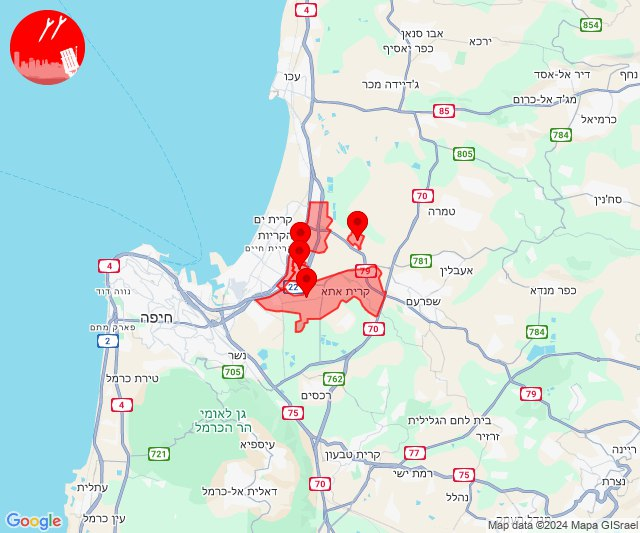

## 19:30

✈️ חדירת כלי טיס עוין (31/10/2024):

21:23:
• המפרץ: אושה, כפר המכבי, קריית אתא, רמת יוחנן 

21:25:
• המפרץ: איבטין, רכסים 

21:26:
• המפרץ: כפר חסידים 

21:27:
• העמקים: שער העמקים, קריית טבעון - בית זייד 

21:28:
• העמקים: אורנים, כפר תקווה 

21:30:
• העמקים: כפר יהושע, נהלל 

צופר - צבע אדום

## 19:30

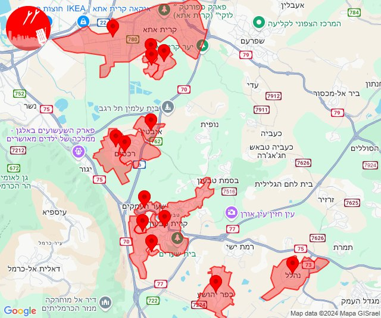

## 21:22

✈️ חדירת כלי טיס עוין (31/10/2024):

23:21:
• מרכז הגליל: כפר מנדא 

23:22:
• מרכז הגליל: חנתון, ביר אלמכסור 
• העמקים: אלון הגליל, הסוללים 

צופר - צבע אדום

## 21:22

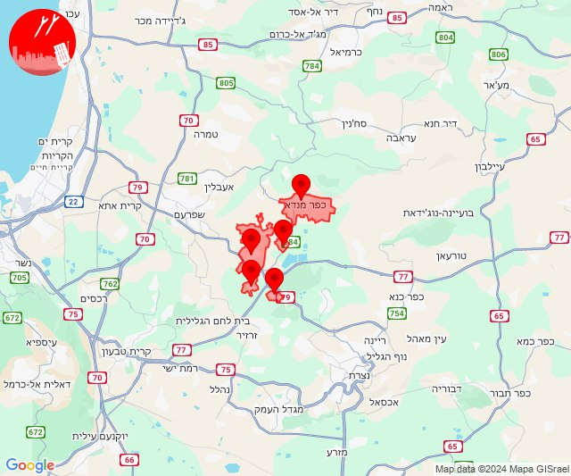

